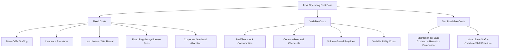
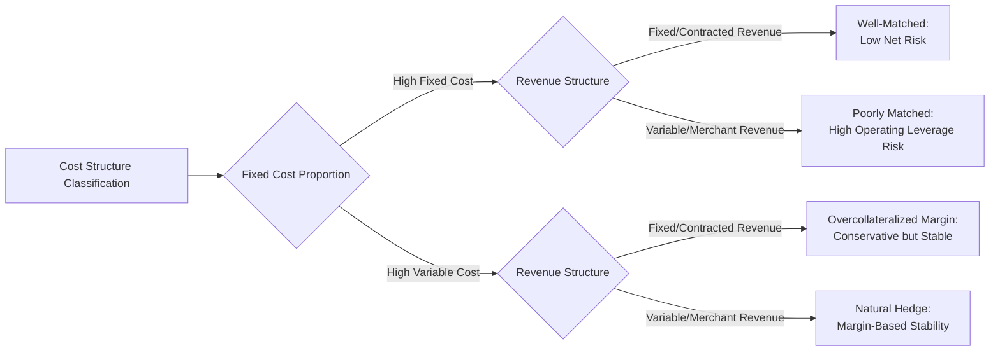

## Fixed and Variable Operating Cost Structures

### Definition

Fixed and variable operating cost structures describe how a project's ongoing operational expenditures (OpEx) behave in relation to output, usage, or activity levels. Correctly classifying and separately modeling fixed versus variable cost components is essential to accurately projecting margin sensitivity, stress-testing downside scenarios, and aligning cost escalation assumptions with the correct underlying cost drivers — a cost structure modeled as a single blended "OpEx growth rate" obscures how operating margin actually behaves when volume, price, or utilization assumptions change.

**Key Points**

- **Fixed costs** do not vary with output or usage volume within the relevant operating range (e.g., base O&M staffing, insurance premiums, land lease payments, fixed regulatory fees)
- **Variable costs** scale directly with output, throughput, or usage (e.g., fuel, consumables, volume-based royalties, variable maintenance tied to run-hours)
- Many real-world cost lines are **semi-variable** (a fixed base component plus a variable component), requiring decomposition rather than a single classification
- Correct cost classification directly affects break-even analysis, operating leverage assessment, and the accuracy of margin projections under volume/price stress scenarios

### Core Cost Classification Framework

$$Total\ OpEx_t = Fixed\ Costs_t + (Variable\ Cost\ per\ Unit_t \times Volume_t)$$

### Fixed Cost Components in Detail

**Key Points**

- **Base O&M staffing**: Core operations and maintenance personnel required regardless of output level (control room staff, security, base maintenance crew) — typically the largest fixed cost line in most infrastructure assets
- **Insurance premiums**: Property, business interruption, and liability insurance premiums are generally fixed annual costs, set at policy renewal based on asset value and risk profile rather than output
- **Land lease and site rental**: Payments to landowners or government entities for site use are typically fixed nominal or CPI-escalated amounts, independent of production levels
- **Regulatory and license fees**: Many jurisdictions impose fixed annual licensing, permitting, or regulatory compliance fees unrelated to output volume
- **Asset management and corporate overhead**: Sponsor or asset manager fees allocated to the SPV are frequently structured as fixed annual amounts or a fixed percentage of a static base (e.g., contracted capacity) rather than actual output

#### Modeling Fixed Costs

**Key Points**

- Model fixed costs escalated by an appropriate index (typically CPI or a wage index for labor-heavy fixed costs) as a distinct driver line, since fixed costs still grow in nominal terms over a long contract tenor even though they don't vary with volume
- Base-year fixed cost estimates are typically derived from the O&M contract (where a third-party operator is engaged under a fixed-fee or fixed-plus-escalation structure) or from an independent engineer's operating cost benchmark study for owner-operated assets
- Fixed costs should be tested for **step-changes** at defined thresholds — for example, additional staffing may be contractually or operationally required once a facility reaches a certain age or after a major overhaul, which should be modeled as a discrete step rather than smooth continuous escalation

### Variable Cost Components in Detail

**Key Points**

- **Fuel and feedstock**: The largest variable cost in thermal generation and process industries, directly proportional to output volume and typically modeled via a heat-rate or conversion-efficiency formula tied to the specific technology
- **Consumables and chemicals**: Water treatment chemicals, catalysts, lubricants, and similar inputs that scale with throughput or operating hours
- **Volume-based royalties and levies**: Common in mining and resource extraction, where royalties are calculated as a percentage of revenue or a fixed amount per unit extracted/sold
- **Variable utility costs**: Electricity, water, and other utility consumption that scales with production intensity, distinct from fixed utility connection or demand charges

#### Modeling Variable Costs

$$Variable\ Cost_t = Volume_t \times Unit\ Cost_t$$

**Key Points**

- Model variable unit costs with their own escalation/indexation logic distinct from fixed cost escalation, since variable inputs (fuel, commodities) often follow different price indices (commodity-linked) than fixed costs (typically CPI or wage-linked)
- For fuel/feedstock, where the cost is passed through to the offtaker via a formula (as in many two-part tariff PPAs), the variable cost line should mirror the pass-through formula exactly, since any mismatch between modeled cost and modeled pass-through revenue creates a spurious margin effect not present in reality
- Variable cost per unit is not necessarily constant across the full operating range — some processes exhibit economies of scale (declining unit cost at higher utilization) or diseconomies (rising marginal cost near capacity limits), which more sophisticated models capture via a non-linear or tiered unit-cost function rather than a flat per-unit rate

### Semi-Variable Costs and Decomposition

Many real-world operating cost lines combine fixed and variable elements and require decomposition before modeling, since treating them as purely fixed understates cost sensitivity to volume while treating them as purely variable overstates it.

$$Semi\text{-}Variable\ Cost_t = Fixed\ Component + (Variable\ Rate \times Volume_t)$$

**Example**

A power plant's O&M contract specifies a fixed annual fee of $4,000,000 plus a variable component of $2.50 per equivalent operating hour above a baseline of 6,000 hours/year, reflecting increased wear-related maintenance at higher utilization. At 7,500 operating hours in a given year:

$$O\&M\ Cost = \$4,000,000 + (\$2.50 \times (7,500 - 6,000)) = \$4,000,000 + \$3,750 = \$4,003,750$$

**Key Points**

- The **high-low method** or **regression analysis** against historical cost and volume data (where available, e.g., from comparable operating assets or early years of the project's own operating history) can be used to statistically decompose a semi-variable cost line into its fixed and variable components
- Maintenance costs are frequently the most significant semi-variable line in industrial and power assets — major overhaul costs often follow a **run-hour or cycle-based trigger** (e.g., a major turbine overhaul every 25,000 equivalent operating hours) rather than a smooth annual escalation, requiring a distinct lifecycle capital/major maintenance module (covered separately in this chapter) rather than being blended into routine annual OpEx

### Operating Leverage and Margin Sensitivity

The proportion of fixed versus variable costs in a project's cost structure determines its **operating leverage** — the degree to which operating margin (and by extension, DSCR) is sensitive to volume fluctuations.

$$Degree\ of\ Operating\ Leverage = \frac{\%\ Change\ in\ Operating\ Margin}{\%\ Change\ in\ Volume}$$

**Key Points**

- Projects with a high proportion of fixed costs relative to variable costs exhibit **high operating leverage**: margin is highly sensitive to volume declines, since fixed costs must still be paid regardless of output — this is the typical profile of contracted, capacity-payment-heavy structures where revenue is also largely fixed, so overall cash flow variability is actually low provided the capacity/availability payment covers fixed costs
- Projects with a high proportion of variable costs exhibit **lower operating leverage**: margin per unit is more stable since costs shrink proportionally with any revenue/volume decline, which is often the profile of merchant commodity-processing or tolling assets where the project earns a margin/spread on flow-through volumes
- Understanding operating leverage is essential for interpreting downside scenario results correctly — a project with high fixed costs and high fixed contracted revenue is well-matched and low-risk, while a project with high fixed costs and volume-dependent (uncontracted) revenue is poorly matched and carries substantial downside exposure

### Illustrative Cost Structure Comparison (svg_diagram)

<svg xmlns="http://www.w3.org/2000/svg" viewBox="0 0 760 340">
<text x="380" y="24" font-size="16" font-weight="bold" text-anchor="middle" fill="#111">Total Cost Behavior: Fixed vs. Variable vs. Semi-Variable (svg_diagram)</text>
<line x1="60" y1="270" x2="700" y2="270" stroke="#333" stroke-width="1.5" />
<line x1="60" y1="50" x2="60" y2="270" stroke="#333" stroke-width="1.5" />
<text x="20" y="170" font-size="11" fill="#333" transform="rotate(-90, 20, 170)">Total Cost ($)</text>
<text x="380" y="295" font-size="11" fill="#333" text-anchor="middle">Volume / Output Level</text>
<line x1="60" y1="180" x2="700" y2="180" stroke="#166534" stroke-width="2.5" />
<text x="640" y="170" font-size="10" fill="#166534">Fixed Cost (constant)</text>
<line x1="60" y1="260" x2="700" y2="80" stroke="#991b1b" stroke-width="2.5" />
<text x="640" y="95" font-size="10" fill="#991b1b">Variable Cost (linear)</text>
<line x1="60" y1="230" x2="700" y2="130" stroke="#854d0e" stroke-width="2.5" />
<text x="640" y="120" font-size="10" fill="#854d0e">Semi-Variable (blended)</text>
</svg>

### Modeling Best Practices for the Cost Base

**Key Points**

- Structure the OpEx model section with each cost category (staffing, insurance, fuel, consumables, maintenance, corporate overhead, royalties) as a separate line with its own volume-sensitivity flag (fixed/variable/semi-variable) and its own escalation index, rather than a single aggregated "total OpEx" growth assumption
- Cross-check modeled fixed and variable cost totals against the O&M contract (if third-party operated) to ensure the model doesn't diverge from the actual contractual cost structure the project is obligated to pay
- Build **downside cost scenarios** that stress variable cost inputs (e.g., higher fuel price, higher consumable costs) independently from fixed cost inputs (e.g., unexpected staffing increases, insurance premium spikes following a claims event), since these have different probability drivers and different correlation with the revenue-side stress scenarios discussed elsewhere in this syllabus
- For projects with third-party O&M contracts, distinguish the **contracted O&M fee structure** (which may itself blend fixed and variable elements, as in the earlier example) from the SPV's **own additional fixed costs** (insurance, land lease, corporate overhead, asset management fees) that sit outside the O&M contract scope — these are commonly and incorrectly conflated into a single "O&M cost" line

### Related Topics

- Lifecycle Capital Expenditure and Major Maintenance Reserve Modeling
- Operating Leverage and Break-Even Analysis in Project Finance
- O&M Contract Structuring: Fixed-Fee, Cost-Plus, and Gain-Share Models
- Price Escalation and Indexation of Revenue (Cost-Side Applications)
- Cash Flow Available for Debt Service (CFADS) Construction
- Debt Service Coverage Ratio (DSCR) Sensitivity to Cost Assumptions
- Insurance Structuring and Business Interruption Coverage in Project Finance
- Independent Engineer Operating Cost Benchmarking Methodology