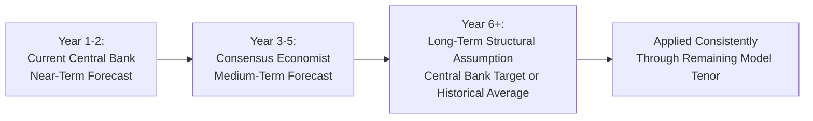
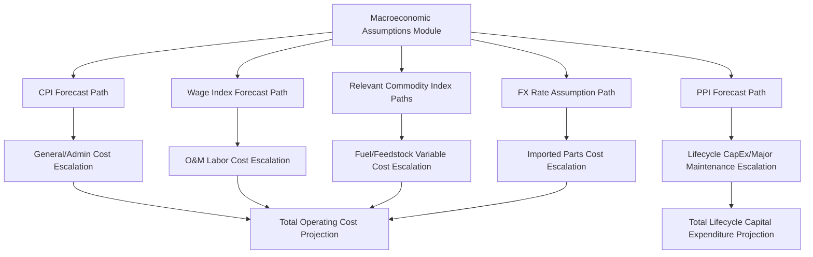

## Cost Escalation and Inflation Assumptions

### Definition

Cost escalation and inflation assumptions govern how a project's operating and capital expenditure lines are projected to grow in nominal terms over the life of the financing, typically 15-30 years. Because project finance models are long-dated and highly sensitive to compounding effects, the selection, sourcing, and application of escalation assumptions to each cost category is one of the most consequential — and most frequently under-scrutinized — assumption sets in the entire model. Unlike revenue indexation (covered separately in this syllabus), cost escalation assumptions must reflect the specific economic drivers of each cost category, which often differ materially from the indices used to escalate contracted revenue.

**Key Points**

- Cost escalation assumptions should be built bottom-up by cost category, not applied as a single blended inflation rate across all OpEx and CapEx lines
- The choice of base inflation forecast (near-term vs. long-term structural assumption) materially affects long-tenor model outputs and should be explicitly sourced and documented
- Mismatches between cost escalation and revenue escalation (discussed in the revenue indexation topic) are a primary driver of long-term margin compression risk
- Escalation assumptions apply not only to OpEx but also to lifecycle capital expenditure/major maintenance reserves, making this topic foundational to both operating and capital cost projections

### Selecting the Base Inflation Forecast

#### Term Structure of Inflation Assumptions

**Key Points**

- **Near-term period** (typically years 1-5): Sourced from central bank forecasts, government budget office projections, or consensus economist surveys for the relevant jurisdiction, since near-term inflation is reasonably observable and forecastable
- **Long-term structural period** (beyond the forecastable horizon): Typically set to the central bank's stated long-term inflation target (e.g., 2% for many developed-market central banks) or a long-run historical average, since forecasting precise inflation decades into the future is not meaningfully possible and models should not pretend otherwise
- The transition between near-term forecast and long-term structural assumption should be modeled as a smooth glide path or a clean step-change at a defined year, with the methodology documented rather than left implicit
- For emerging-market or higher-inflation jurisdictions, long-term structural assumptions should reflect the specific country's monetary policy framework and inflation-targeting history, not a developed-market default rate

#### Illustrative Term Structure

### Cost Category-Specific Escalation Indices

A core modeling principle is that different cost lines should be escalated using the index that best reflects their underlying economic driver, not a single generic CPI assumption applied uniformly.

| Cost Category | Recommended Escalation Basis | Rationale |
| --- | --- | --- |
| Base O&M labor | Wage index / average earnings index | Labor costs often escalate faster than general CPI due to productivity and sector-specific wage dynamics |
| General/administrative costs | Consumer Price Index (CPI) | Broadly tracks general cost-of-living inputs |
| Fuel/feedstock (variable) | Relevant commodity index (Henry Hub, Brent, coal indices) | Commodity prices follow distinct supply-demand dynamics, not general inflation |
| Insurance premiums | Insurance-specific cost index or historical premium trend, where available | Insurance costs can diverge from CPI due to claims experience, reinsurance market cycles, and climate risk repricing |
| Major maintenance/overhaul (lifecycle capex) | Producer Price Index (PPI) or equipment-specific cost index | Capital equipment and specialized parts often track industrial producer prices rather than consumer prices |
| Imported spare parts | Domestic CPI blended with FX-adjusted foreign PPI | Reflects both domestic currency effects and the origin-country cost base of imported components |
| Land lease/site rental | Contractually specified (often fixed, CPI-linked, or specific rent-review formula) | Governed by the underlying lease agreement, not a generic assumption |

**Key Points**

- Wage indices for O&M labor have historically tended to run above general CPI in many markets over multi-decade periods, though this relationship is market- and period-specific and should be verified against the relevant jurisdiction's historical data rather than assumed universally [Inference]
- Using a single blended CPI rate across all cost categories systematically understates long-term cost growth wherever wage or PPI-linked lines represent a material share of the cost base, since these have historically often outpaced general CPI in many economies

### Modeling Framework: Building the Escalation Module

#### Structural Approach

**Key Points**

- Create a dedicated **macroeconomic assumptions module** as a distinct model section containing each index's projected path (CPI, wage index, relevant commodity indices, FX rates) as clearly labeled, independently sourced input lines
- Every cost (and revenue) line in the model should reference the specific index cell relevant to its escalation basis, rather than having escalation rates hard-coded or duplicated across multiple cost lines — this ensures a single update to a macro assumption flows consistently through the entire model
- Document the source and vintage of each index assumption (e.g., "IMF World Economic Outlook, [forecast date]" or "[Central Bank] inflation target, [date]") directly in the model or an accompanying assumptions book, since lenders' technical and financial advisors will scrutinize the sourcing of every escalation assumption during due diligence

#### Illustrative Model Architecture

### Compounding Effects Over Long Tenors

Because project finance models span decades, seemingly small differences in annual escalation assumptions compound into materially different absolute cost projections by the later years of the model.

$$Cost_t = Cost_0 \times (1 + Escalation\ Rate)^t$$

**Example**

A base O&M labor cost of $5,000,000 escalated at 2.0% CPI versus 3.0% wage-index growth over a 25-year contract tenor:

$$Cost_{25,\ CPI} = \$5,000,000 \times (1.02)^{25} \approx \$8,203,000$$

$$Cost_{25,\ wage} = \$5,000,000 \times (1.03)^{25} \approx \$10,469,000$$

The 1 percentage point annual difference compounds to a **27.6% divergence** in absolute cost by Year 25 — a materially different DSCR outcome in later years depending on which index is used, illustrating why cost category-specific indexation matters far more in long-tenor models than in short-term budgeting.

### Illustrative Compounding Divergence Chart (svg_diagram)

<svg xmlns="http://www.w3.org/2000/svg" viewBox="0 0 760 340">
<text x="380" y="24" font-size="16" font-weight="bold" text-anchor="middle" fill="#111">Compounding Divergence: CPI vs. Wage Index Escalation (svg_diagram)</text>
<line x1="60" y1="270" x2="700" y2="270" stroke="#333" stroke-width="1.5" />
<line x1="60" y1="50" x2="60" y2="270" stroke="#333" stroke-width="1.5" />
<text x="20" y="170" font-size="11" fill="#333" transform="rotate(-90, 20, 170)">Cost ($)</text>
<text x="380" y="295" font-size="11" fill="#333" text-anchor="middle">Contract Year</text>
<polyline points="60,250 200,230 340,212 480,192 620,170 700,158" fill="none" stroke="#166534" stroke-width="2.5" />
<text x="705" y="153" font-size="10" fill="#166534">CPI (2.0%)</text>
<polyline points="60,250 200,222 340,196 480,168 620,138 700,120" fill="none" stroke="#991b1b" stroke-width="2.5" />
<text x="705" y="115" font-size="10" fill="#991b1b">Wage Index (3.0%)</text>
<line x1="700" y1="158" x2="700" y2="120" stroke="#333" stroke-width="1" stroke-dasharray="3,2" />
<text x="640" y="140" font-size="9" fill="#333">27.6% gap by Year 25</text>
</svg>

### Sensitivity and Scenario Testing on Escalation Assumptions

**Key Points**

- Run explicit **inflation stress scenarios** (e.g., sustained high-inflation environment, deflationary environment) as distinct cases, testing DSCR resilience under each, since escalation assumptions are inherently uncertain over multi-decade horizons and lenders will expect this uncertainty to be quantified
- Distinguish between a **general inflation shock** (affecting most cost and revenue lines proportionally) and a **relative escalation shock** (where cost escalation outpaces revenue escalation specifically, as discussed in the revenue indexation topic), since these produce very different DSCR impact profiles and should be tested separately
- For projects with revenue indexed to one benchmark (e.g., CPI) and material costs indexed to another (e.g., wage index or commodity price), the single most informative sensitivity is often the **relative escalation spread** test — holding absolute inflation levels constant but varying the gap between revenue and cost escalation rates — since this isolates the structural margin risk independent of the overall inflation environment
- Where debt itself carries inflation-linked terms (e.g., index-linked bonds, common in some UK and other inflation-linked infrastructure financings), ensure the debt service line's escalation is modeled consistently with the same underlying index assumption used elsewhere, avoiding an internal inconsistency where the model implicitly assumes different inflation paths for different parts of the capital structure

### Common Modeling Pitfalls

**Key Points**

- **Single blended rate error**: Applying one inflation assumption to all cost and revenue lines, which obscures category-specific escalation risk and materially understates cost growth for wage- or commodity-linked lines
- **Compounding base error**: Inconsistently applying escalation from the prior period's value in some lines versus re-basing to the original contract value in others (relevant where contracts use the re-based indexation formula discussed in the revenue indexation topic), producing internally inconsistent growth paths across the model
- **Static long-term assumption without stress testing**: Using a single point-estimate long-term inflation assumption without testing the sensitivity of DSCR and equity returns to reasonable alternative paths, particularly given the multi-decade forecast horizon involved
- **Ignoring FX-driven cost escalation in cross-border structures**: For imported inputs or foreign-currency-denominated cost components, failing to separately model FX-driven cost escalation alongside domestic inflation, conflating two distinct risk drivers into a single (and likely incorrect) escalation assumption

### Related Topics

- Price Escalation and Indexation of Revenue
- Fixed and Variable Operating Cost Structures
- Lifecycle Capital Expenditure and Major Maintenance Reserve Modeling
- Debt Service Coverage Ratio (DSCR) Sensitivity to Margin Erosion
- Currency Risk and Cross-Border Cost Structuring
- Inflation-Linked Debt Instruments in Infrastructure Financing
- Macroeconomic Assumptions Module Design in Financial Models
- Scenario and Sensitivity Analysis Design in Project Finance Models