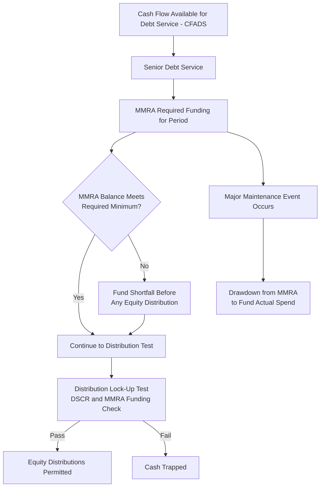

## Major Maintenance and Lifecycle Capex Reserves

### Definition

Major maintenance and lifecycle capital expenditure (lifecycle CapEx) refer to large, periodic, non-routine expenditures required to sustain an asset's performance and useful life over its operating period — distinct from the routine annual OpEx covered under fixed and variable operating cost structures. Because these expenditures are large, infrequent, and often occur at intervals that don't align with steady-state annual cash flow, project finance structures typically require dedicated **reserve accounts** to smooth their cash flow impact and protect lenders from the risk that a major maintenance event coincides with a period of otherwise-tight liquidity.

**Key Points**

- Lifecycle CapEx includes major overhauls, equipment replacement, and periodic renewal work required by OEM specifications, regulatory requirements, or the operating contract's performance standards
- Unlike routine OpEx, these costs are typically **lumpy** (large, infrequent) rather than smooth and continuous, requiring specialized modeling and reserving treatment
- A dedicated **Major Maintenance Reserve Account (MMRA)** — also called a Lifecycle Reserve Account or Renewals Reserve — is a standard lender requirement to pre-fund these future obligations
- Failure to adequately reserve for lifecycle CapEx is a common source of unexpected cash flow shortfalls and covenant breaches in operational projects, making this one of the more scrutinized areas of financial model due diligence

### Sources of Major Maintenance and Lifecycle CapEx Requirements

**Key Points**

- **OEM-specified maintenance intervals**: Major equipment (gas turbines, generators, specialized industrial machinery) typically carries manufacturer-specified overhaul schedules based on equivalent operating hours, starts/stops, or elapsed calendar time, whichever occurs first
- **Regulatory/permit-driven renewal requirements**: Certain assets require periodic recertification, inspection-driven refurbishment, or replacement to maintain operating licenses (e.g., pressure vessel recertification, dam safety inspections, aircraft/vessel classification society surveys)
- **Performance-driven replacement**: Components subject to gradual degradation (membranes in water treatment, catalysts in chemical processes, road surfacing in transportation infrastructure) require periodic replacement to sustain contracted performance standards
- **Technology and obsolescence-driven capex**: Less predictable than the above, but some contracts anticipate mid-life technology upgrades (e.g., control system replacements, efficiency retrofits) as part of the lifecycle plan

### The Lifecycle Maintenance Schedule

#### Building the Schedule

**Key Points**

- The lifecycle maintenance schedule is typically developed from the **independent engineer's technical report**, OEM maintenance manuals, and the O&M contractor's own lifecycle plan, cross-referenced against the specific equipment installed at the project
- Each major maintenance event should be modeled as a discrete line item with an estimated **timing** (year or equivalent-operating-hour trigger), **cost estimate** (in current/base-year terms, subject to escalation), and **scope description**, rather than smoothed into a generic annual maintenance reserve contribution
- Timing based on equivalent operating hours (rather than fixed calendar years) is more technically accurate for utilization-sensitive equipment, but requires the model to convert projected utilization/dispatch assumptions into projected timing of maintenance triggers — a linkage that is frequently modeled incorrectly as a fixed calendar schedule even when the underlying contract specifies an hours-based trigger

#### Illustrative Lifecycle Schedule (svg_diagram)

<svg xmlns="http://www.w3.org/2000/svg" viewBox="0 0 760 300">
<text x="380" y="24" font-size="16" font-weight="bold" text-anchor="middle" fill="#111">Illustrative Major Maintenance Timeline (svg_diagram)</text>
<line x1="60" y1="150" x2="720" y2="150" stroke="#333" stroke-width="2" />
<text x="60" y="175" font-size="10" text-anchor="middle" fill="#333">Y0</text>
<text x="200" y="175" font-size="10" text-anchor="middle" fill="#333">Y6</text>
<text x="340" y="175" font-size="10" text-anchor="middle" fill="#333">Y12</text>
<text x="480" y="175" font-size="10" text-anchor="middle" fill="#333">Y18</text>
<text x="620" y="175" font-size="10" text-anchor="middle" fill="#333">Y24</text>
<circle cx="200" cy="150" r="8" fill="#854d0e" />
<text x="200" y="110" font-size="10" text-anchor="middle" fill="#713f12">Minor Inspection</text>
<text x="200" y="125" font-size="9" text-anchor="middle" fill="#713f12">\$2M</text>
<circle cx="340" cy="150" r="12" fill="#991b1b" />
<text x="340" y="105" font-size="10" text-anchor="middle" fill="#7f1d1d">Major Overhaul</text>
<text x="340" y="120" font-size="9" text-anchor="middle" fill="#7f1d1d">\$18M</text>
<circle cx="480" cy="150" r="8" fill="#854d0e" />
<text x="480" y="110" font-size="10" text-anchor="middle" fill="#713f12">Minor Inspection</text>
<text x="480" y="125" font-size="9" text-anchor="middle" fill="#713f12">\$2.2M</text>
<circle cx="620" cy="150" r="14" fill="#7f1d1d" />
<text x="620" y="100" font-size="10" text-anchor="middle" fill="#7f1d1d">Full Overhaul /</text>
<text x="620" y="113" font-size="10" text-anchor="middle" fill="#7f1d1d">Component Replacement</text>
<text x="620" y="128" font-size="9" text-anchor="middle" fill="#7f1d1d">\$25M</text>
</svg>

### Reserve Account Funding Methodologies

#### 1. Straight-Line (Sinking Fund) Reserve Method

The most common approach: funds are set aside evenly over the period leading up to each known major maintenance event, so the full amount is accumulated by the time it is needed.

$$Annual\ Reserve\ Contribution_t = \frac{Next\ Major\ Event\ Cost - Current\ Reserve\ Balance}{Years\ Remaining\ to\ Event}$$

**Example**

A major overhaul estimated at $18,000,000 (in escalated terms) is scheduled for Year 12. Reserve funding begins in Year 7 (5 years prior) with no existing balance:

$$Annual\ Contribution = \frac{\$18,000,000}{5} = \$3,600,000\ per\ year$$

#### 2. Rolling/Continuous Reserve Method

Rather than funding toward a single discrete event, a rolling method maintains a reserve balance sized to always cover a forward-looking window (e.g., the next 2-3 years of anticipated lifecycle spend), continuously replenished as spend occurs and new future events roll into the window.

#### 3. Percentage-of-Revenue or Percentage-of-Capacity Method

A simpler (though less technically precise) approach reserves a fixed percentage of revenue or a fixed $/MW (or equivalent capacity unit) per year, often used in early-stage or less technically detailed models, or in sectors where major maintenance is more continuous and less event-driven.

**Key Points**

- Lenders generally prefer the **straight-line sinking fund method tied to a specific, technically substantiated schedule**, since it provides clear traceability between the reserve balance and the actual anticipated obligation, whereas percentage-based methods can under- or over-reserve depending on how well the assumed percentage happens to match actual future costs
- The reserve funding schedule should be built using **escalated** (not base-year) cost estimates for each future event, since a major overhaul occurring in Year 18 will cost substantially more in nominal terms than the same scope of work priced today

### Modeling the Major Maintenance Reserve Account (MMRA) in the Cash Flow Waterfall

**Key Points**

- The MMRA typically sits in the cash flow waterfall **after senior debt service but before equity distributions**, reflecting its status as a quasi-mandatory reserve rather than a discretionary use of cash
- Lenders commonly require the MMRA to be funded to a minimum specified balance (often expressed as the greater of a rolling forward-looking requirement or a fixed minimum) as a **condition precedent to any equity distribution**, similar in structural priority to the Debt Service Reserve Account (DSRA)
- Independent Engineers typically review and certify the reasonableness of the lifecycle maintenance schedule and reserve funding plan periodically (e.g., every 3-5 years) throughout the operating period, since actual equipment condition and cost estimates evolve and the reserve plan should be updated accordingly rather than fixed permanently at financial close

### Distinguishing Lifecycle CapEx from Routine OpEx and from Growth CapEx

| Category | Nature | Funding Source | Cash Flow Treatment |
| --- | --- | --- | --- |
| Routine OpEx | Smooth, continuous, small-scale maintenance | Operating revenue (annual) | Deducted before CFADS |
| Lifecycle CapEx / Major Maintenance | Lumpy, periodic, large-scale renewal | Dedicated reserve account (MMRA) pre-funded from CFADS | Reserve contribution deducted before CFADS reaches equity; actual spend drawn from reserve, not from period cash flow directly |
| Growth CapEx | Expansion, capacity addition, discretionary upgrade | Typically new equity/debt financing, not the operating reserve | Separate financing decision, generally outside the base project finance structure unless contractually anticipated |

**Key Points**

- A common modeling error is conflating routine OpEx maintenance (already captured in the annual O&M cost line) with lifecycle CapEx (which requires separate reserve treatment), leading to either double-counting or, more commonly, complete omission of lifecycle CapEx from the model
- Growth CapEx (capacity expansions, new revenue-generating investments) is conceptually and financially distinct from lifecycle CapEx and should not be reserved for or funded through the same MMRA mechanism, since it represents new investment rather than sustaining existing asset performance

### Sensitivity Testing on Lifecycle CapEx Assumptions

**Key Points**

- **Cost overrun sensitivity**: Test the impact of major maintenance events costing more than the base estimate (a common real-world occurrence, particularly for aging equipment or first-of-a-kind technology), since underestimating a single major overhaul can materially affect DSCR and MMRA adequacy in that period
- **Timing acceleration sensitivity**: Test the impact of a major maintenance event occurring earlier than scheduled (e.g., due to higher-than-forecast utilization driving faster accumulation of equivalent operating hours), since this compresses the funding window and may require higher annual contributions than originally planned
- **Deferred maintenance risk**: Some operators may be tempted to defer major maintenance to preserve short-term cash flow, particularly if not contractually or covenant-enforced — models and lender monitoring should account for the risk that deferral shifts cost to later periods with likely additional cost escalation or performance degradation, rather than treating deferral as a costless option
- [Inference] The empirical frequency and magnitude of major maintenance cost overruns varies substantially by technology maturity and operator experience, and industry benchmarking data (where obtainable from independent engineers or technical advisors) should inform stress case sizing rather than a generic universal overrun percentage.

### Illustrative Reserve Balance Trajectory (svg_diagram)

<svg xmlns="http://www.w3.org/2000/svg" viewBox="0 0 760 320">
<text x="380" y="24" font-size="16" font-weight="bold" text-anchor="middle" fill="#111">MMRA Balance Trajectory: Funding and Drawdown Cycle (svg_diagram)</text>
<line x1="60" y1="270" x2="700" y2="270" stroke="#333" stroke-width="1.5" />
<line x1="60" y1="50" x2="60" y2="270" stroke="#333" stroke-width="1.5" />
<text x="20" y="170" font-size="11" fill="#333" transform="rotate(-90, 20, 170)">Reserve Balance ($)</text>
<text x="380" y="295" font-size="11" fill="#333" text-anchor="middle">Contract Year</text>

<polyline points="60,270 150,220 240,160 320,90 320,90 400,220 490,175 570,120 650,90 650,90 700,240" fill="none" stroke="`#1e40af`" stroke-width="2.5" />

<line x1="320" y1="90" x2="320" y2="270" stroke="`#991b1b`" stroke-width="1" stroke-dasharray="3,2" />

<text x="320" y="285" font-size="9" fill="`#991b1b`" text-anchor="middle">Major Overhaul</text>

<line x1="650" y1="90" x2="650" y2="270" stroke="`#991b1b`" stroke-width="1" stroke-dasharray="3,2" />

<text x="650" y="285" font-size="9" fill="`#991b1b`" text-anchor="middle">Full Overhaul</text>

</svg>

### Related Topics

- Fixed and Variable Operating Cost Structures
- Cost Escalation and Inflation Assumptions
- Debt Service Reserve Account (DSRA) Structuring and Sizing
- Cash Flow Waterfall Mechanics and Distribution Lock-Up Tests
- Independent Engineer Role in Technical Due Diligence and Ongoing Monitoring
- Debt Service Coverage Ratio (DSCR) Sensitivity to Lifecycle CapEx Timing
- O&M Contract Structuring: Scope Boundaries Between Routine and Major Maintenance
- Equipment Performance Guarantees and OEM Maintenance Specifications