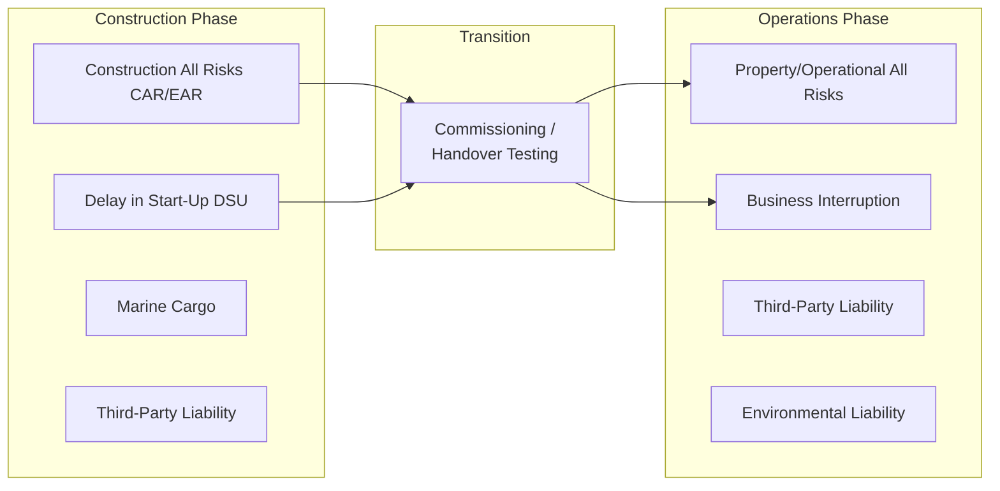
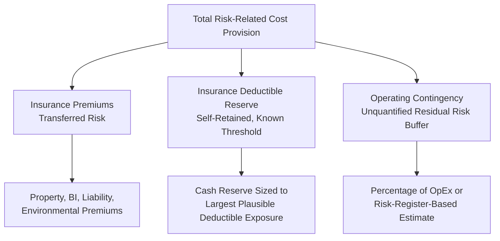

## Insurance and Operating Contingency Costs

### Definition

Insurance and operating contingency costs are the risk-transfer and risk-absorption cost components built into a project's operating cost base to protect against unplanned losses, damage, and liability events during the operating phase. Insurance costs represent the premium paid to transfer specific risks to third-party insurers, while operating contingency represents self-retained buffers for residual, uninsured, or partially-insured risks. Together, these lines translate the project's broader risk profile into quantifiable operating cost line items, and their adequacy is a standard focus of lender due diligence, since underinsurance or inadequate contingency can undermine the non-recourse credit assumptions underlying the entire financing.

**Key Points**

- Insurance costs are a **contractual/market-priced cost** (premiums), while operating contingency is a **modeling buffer** for residual risk not otherwise captured
- Both are typically classified as fixed costs in the OpEx structure (as discussed under fixed and variable operating cost structures), since premiums are largely independent of output volume
- Lenders require a comprehensive **insurance program** as a condition precedent to financial close and an ongoing covenant throughout the loan tenor, often reviewed by an independent insurance advisor
- Operating contingency sizing should be informed by a structured risk assessment rather than an arbitrary percentage markup

### Core Insurance Categories in Project Finance

| Insurance Type | Coverage | Phase |
| --- | --- | --- |
| Construction All Risks (CAR) / Erection All Risks (EAR) | Physical damage to works during construction | Construction |
| Delay in Start-Up (DSU) / Advance Loss of Profits (ALOP) | Lost revenue/increased costs from construction delay caused by an insured physical damage event | Construction |
| Property/Operational All Risks | Physical damage to completed asset | Operations |
| Business Interruption (BI) | Lost revenue following an insured physical damage event during operations | Operations |
| General/Third-Party Liability | Bodily injury or property damage claims from third parties | Both phases |
| Environmental Liability | Pollution, contamination, and environmental remediation costs | Both phases |
| Marine Cargo | Loss/damage to equipment and materials in transit | Construction (primarily) |
| Political Risk Insurance (PRI) | Expropriation, currency inconvertibility, political violence | Both phases (cross-border/emerging market projects) |
| Terrorism/Political Violence | Damage from terrorism or politically motivated violence, often excluded from standard property policies | Both phases (jurisdiction-dependent) |
| Directors & Officers (D&O) | Liability of SPV directors and officers | Both phases |

### Construction-Phase vs. Operations-Phase Insurance

**Key Points**

- Insurance policies typically transition at the point of substantial completion/commercial operation date, and the transition itself carries risk (coverage gaps) if not carefully coordinated between the construction insurance program and the operational program — lenders typically require evidence of continuous coverage across this transition
- **Delay in Start-Up (DSU)** insurance is particularly important to lenders because it protects debt service capacity during the highest-risk period of the project (construction), compensating for lost revenue and continuing fixed costs (including interest during the delay) if commercial operations are delayed by an insured physical damage event
- **Business Interruption (BI)** insurance during operations serves an analogous function, replacing lost revenue (and often covering continuing fixed costs including debt service) following a covered property damage event, making it one of the most credit-critical policies in the entire insurance program from a lender's perspective

### Business Interruption (BI) Coverage Period and Indemnity Considerations

**Key Points**

- The **indemnity period** (maximum duration BI coverage will pay out) must be sized to reflect realistic worst-case reconstruction/repair timelines for the specific asset, including long lead times for specialized replacement equipment (e.g., large transformers, custom-fabricated components) — an indemnity period that is too short leaves a coverage gap precisely when the project needs support most
- BI coverage is typically calculated to cover the **gross profit** or **net revenue** the project would have earned, plus continuing standing charges (including debt service in many project finance-specific policy structures), rather than simply reimbursing lost gross revenue without netting variable costs avoided during the interruption
- Lenders frequently require BI policies to be structured so that **loan repayments continue to be covered** during an insured interruption event, either through explicit inclusion of debt service in the indemnified sum or through a corresponding minimum coverage period aligned with the time realistically required to restore full debt service capacity

### Insurance Program Structuring and Lender Requirements

**Key Points**

- Lenders typically require to be named as **loss payee** or additional insured on property and business interruption policies, ensuring insurance proceeds are directed to cover outstanding debt obligations before (or alongside) other uses
- **Deductibles/self-insured retentions** represent the portion of any loss the project company bears before insurance coverage responds — deductible levels should be calibrated so that plausible loss events don't create liquidity strain the project's cash reserves cannot absorb
- **Policy limits and sub-limits** must be benchmarked against realistic maximum probable loss (MPL) or probable maximum loss (PML) estimates for the specific asset, rather than assumed adequate based on generic industry norms, since underinsurance relative to actual replacement/reconstruction cost is a recurring finding in insurance due diligence reviews
- An **Insurance Advisor** (independent from the sponsor's own broker) is typically engaged by lenders to review the adequacy, market-conformity, and structure of the insurance program both at financial close and periodically throughout the operating period

### Modeling Insurance Costs

$$Insurance\ Cost_t = \sum_{i} Premium_{i,0} \times (1 + Escalation\ Rate_i)^t$$

**Key Points**

- Model each major policy category as a separate line item with its own base premium and escalation assumption, since different lines of insurance can experience very different premium trends (e.g., property/casualty market hardening or softening cycles, climate-driven repricing of catastrophe-exposed property coverage) that a single blended insurance cost line would obscure
- Base premium estimates should be sourced from **actual insurance market quotations or the insurance broker's indicative pricing** obtained during financial due diligence, rather than a generic percentage-of-asset-value rule of thumb, since actual premiums are highly asset- and market-specific
- Insurance premium escalation is frequently **volatile and cyclical** rather than smoothly trending with general inflation — models should incorporate a specific insurance market escalation assumption (potentially informed by historical premium trend data for comparable assets) rather than defaulting to a general CPI assumption, and stress cases should test a "hard market" scenario of elevated premium growth
- For long-tenor models, periodic **premium re-quotation risk** should be acknowledged even if not explicitly modeled as a scenario, since insurance is typically renewed annually or on short multi-year terms, unlike many other long-term fixed contracts in the project structure

### Operating Contingency Costs

#### Purpose and Sizing Methodology

Operating contingency is a modeling reserve or cost buffer for unplanned operational costs not captured elsewhere in the OpEx build — distinct from insurance (which addresses specific insurable risks) and distinct from lifecycle CapEx reserves (which address known, scheduled major maintenance).

**Key Points**

- Operating contingency addresses residual uncertainty: uninsured losses, deductible absorption, minor unplanned repairs below insurance deductible thresholds, and general estimation uncertainty in the base OpEx forecast
- Common sizing approaches include a **percentage of base OpEx** (e.g., 3-5%, though this should be informed by asset-specific risk assessment rather than a blanket default), a **fixed annual dollar reserve**, or a **risk-based bottom-up estimate** derived from a formal risk register quantifying the probability and cost impact of identified operational risks
- Contingency should be explicitly distinguished in the model from the **insurance deductible reserve** (funds set aside specifically to cover the deductible portion of an insured loss event), since these serve related but distinct purposes and conflating them can understate total risk-buffer requirements

#### Illustrative Contingency and Insurance Cost Stack

### Illustrative Risk Transfer vs. Retention Diagram (svg_diagram)

<svg xmlns="http://www.w3.org/2000/svg" viewBox="0 0 760 300">
<text x="380" y="24" font-size="16" font-weight="bold" text-anchor="middle" fill="#111">Risk Transfer vs. Risk Retention Spectrum (svg_diagram)</text>
<line x1="80" y1="150" x2="680" y2="150" stroke="#333" stroke-width="2" />
<text x="80" y="180" font-size="11" text-anchor="middle" fill="#333">Small, Frequent Losses</text>
<text x="680" y="180" font-size="11" text-anchor="middle" fill="#333">Large, Rare Losses</text>
<rect x="80" y="100" width="180" height="35" fill="#fef9c3" stroke="#854d0e" stroke-width="1.5" />
<text x="170" y="122" font-size="10" text-anchor="middle" fill="#713f12">Operating Contingency</text>
<rect x="260" y="100" width="180" height="35" fill="#fee2e2" stroke="#991b1b" stroke-width="1.5" />
<text x="350" y="122" font-size="10" text-anchor="middle" fill="#7f1d1d">Insurance Deductible</text>
<rect x="440" y="100" width="240" height="35" fill="#dcfce7" stroke="#166534" stroke-width="1.5" />
<text x="560" y="122" font-size="10" text-anchor="middle" fill="#14532d">Insured Layer (Premium-Funded)</text>

<text x="380" y="70" font-size="11" text-anchor="middle" fill="#333" font-style="italic">Retained by Project</text>

<text x="560" y="230" font-size="11" text-anchor="middle" fill="#333" font-style="italic">Transferred to Insurer</text>

</svg>

### Political Risk Insurance in Cross-Border Structures

**Key Points**

- For projects in emerging markets or politically sensitive jurisdictions, **Political Risk Insurance (PRI)** — available from export credit agencies, multilateral institutions (e.g., MIGA), and private PRI markets — covers risks such as expropriation, currency inconvertibility/transfer restriction, and political violence that standard commercial insurance does not address
- PRI premiums should be modeled as a distinct cost line given their materially different pricing basis (sovereign/political risk assessment rather than physical asset risk assessment) and their critical role in enabling bankability in higher-risk jurisdictions
- [Inference] The availability and pricing of PRI capacity fluctuates with the political risk insurance market cycle and specific country risk perceptions at the time of placement, so long-term premium assumptions for PRI carry more inherent forecast uncertainty than standard property/casualty insurance lines.

### Sensitivity Testing on Insurance and Contingency Assumptions

**Key Points**

- Test a **hard insurance market scenario** (elevated premium escalation, e.g., following a major industry loss event or broader market capacity contraction) to assess DSCR resilience, since insurance markets have historically demonstrated cyclical hardening periods with premium increases well above general inflation
- Test the impact of a **large uninsured or underinsured loss event** exhausting contingency reserves, to understand the project's liquidity resilience beyond the standard insurance and reserve structure
- Cross-check that modeled BI/DSU coverage periods and indemnified amounts are actually sufficient to sustain debt service through a realistic worst-case interruption scenario, rather than assuming the insurance program is fully adequate without independent verification

### Related Topics

- Fixed and Variable Operating Cost Structures
- Cost Escalation and Inflation Assumptions
- Cash Flow Available for Debt Service (CFADS) Construction
- Debt Service Reserve Account (DSRA) Structuring and Sizing
- Political Risk Insurance and Multilateral Support Instruments (MIGA, ECAs)
- Force Majeure and Change-in-Law Risk Allocation in Project Contracts
- Independent Insurance Advisor Role in Financial Close Due Diligence
- Risk Register Development and Quantitative Risk Assessment Methodology