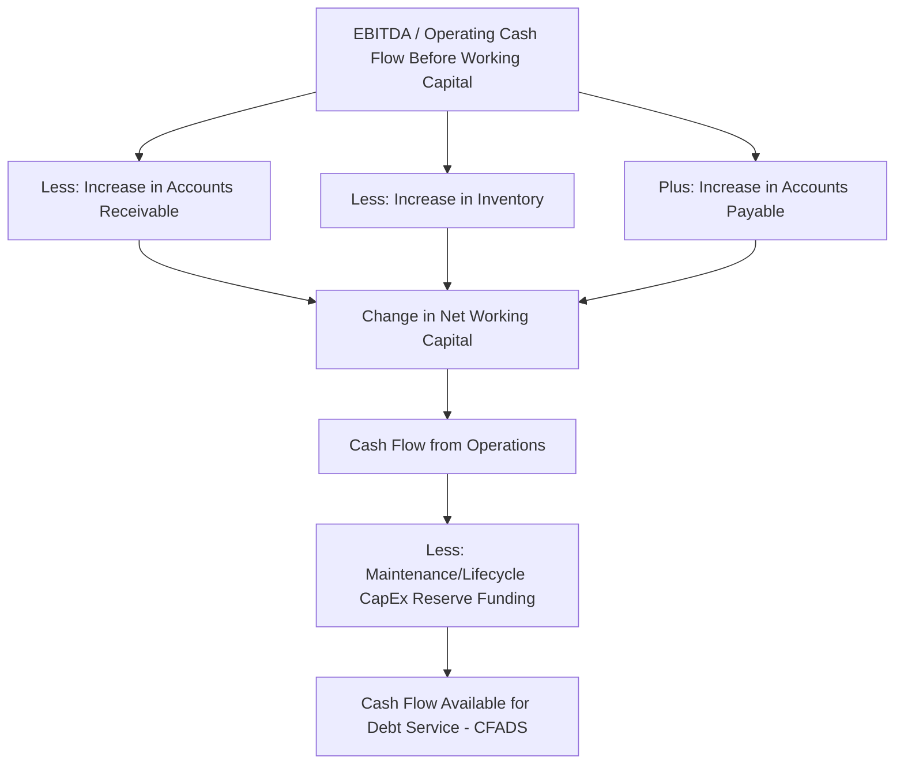

## Working Capital Modeling in Project Finance

### Definition

Working capital modeling in project finance addresses the short-term cash flow timing mismatches that arise from the difference between when revenue is earned and cash actually collected, versus when operating costs are incurred and cash is actually paid. Although individually small relative to the large capital and debt service items that dominate project finance models, working capital movements directly affect the timing and amount of cash available for debt service (CFADS) in any given period, making accurate working capital modeling essential to precise DSCR calculation, particularly in the early operating years and during periods of revenue or cost volatility.

**Key Points**

- Working capital represents the net investment tied up in short-term operating assets and liabilities: primarily receivables, payables, and inventory
- Unlike corporate finance modeling, where working capital is often modeled as a simple percentage of revenue, project finance models typically build working capital bottom-up from the specific payment terms in the project's actual contracts
- Working capital changes affect cash flow timing, not total lifetime cash flow — but this timing effect can materially affect period-specific DSCR, especially in ramp-up years or during operational stress
- A project with strongly contracted revenue and payment terms (e.g., monthly invoicing with short payment terms) generally has more predictable, lower working capital risk than a project reliant on variable/merchant sales with less standardized payment cycles

### Core Working Capital Components

$$Net\ Working\ Capital_t = Accounts\ Receivable_t + Inventory_t - Accounts\ Payable_t$$

$$Change\ in\ Working\ Capital_t = NWC_t - NWC_{t-1}$$

| Component | Definition | Cash Flow Effect When It Increases |
| --- | --- | --- |
| Accounts Receivable | Revenue earned but not yet collected from offtaker/customer | Cash outflow (revenue recognized but not yet received) |
| Inventory | Fuel, spare parts, consumables held in stock | Cash outflow (cash spent on goods not yet consumed/sold) |
| Accounts Payable | Costs incurred but not yet paid to suppliers/contractors | Cash inflow (obligation incurred but cash not yet paid out) |
| Prepaid Expenses | Payments made in advance of the period they relate to (e.g., annual insurance premiums paid upfront) | Cash outflow in the period of payment |
| Deferred Revenue | Cash received in advance of revenue recognition (e.g., upfront capacity reservation fees) | Cash inflow ahead of revenue recognition |

**Key Points**

- An **increase** in receivables or inventory represents a use of cash (cash is tied up in assets not yet converted to cash), while an **increase** in payables represents a source of cash (the project is effectively receiving short-term financing from its suppliers)
- The **cash conversion cycle** — the time between paying for inputs and collecting cash from customers — determines the project's underlying working capital intensity, and should be estimated from the specific payment terms in the project's actual contracts rather than industry-average benchmarks

### Modeling Accounts Receivable

#### Days Sales Outstanding (DSO) Approach

$$Accounts\ Receivable_t = Revenue_t \times \frac{DSO}{Days\ in\ Period}$$

**Key Points**

- DSO should be derived directly from the **payment terms specified in the offtake/PPA contract** (e.g., "payment due within 30 days of invoice"), not assumed generically, since offtake agreements typically specify precise invoicing and payment timelines
- Where the offtaker has a history of payment delays (relevant particularly for state-owned utility offtakers in some jurisdictions), the model should reflect a **realistic effective DSO** based on actual payment history or credit risk assessment, rather than the contractual DSO alone — this is a recognized risk factor in emerging-market power and infrastructure financings
- For availability-based PPP payments, receivable timing is typically driven by the specified invoicing and payment cycle in the project agreement (often monthly), and should align with the government/authority's typical payment processing timeline, which can differ from stated contractual terms in practice

### Modeling Accounts Payable

#### Days Payable Outstanding (DPO) Approach

$$Accounts\ Payable_t = Operating\ Costs_t \times \frac{DPO}{Days\ in\ Period}$$

**Key Points**

- DPO should reflect the actual payment terms negotiated with the O&M contractor, fuel suppliers, and other major cost counterparties, again sourced from the specific contracts rather than assumed
- Payables terms are typically less favorable (shorter) for project companies than for larger corporates, since suppliers to a newly formed, thinly capitalized SPV may require faster payment terms or upfront/advance payment provisions, particularly during the early years before an operating track record is established

### Modeling Inventory

**Key Points**

- **Fuel/feedstock inventory**: For assets requiring on-site fuel storage (coal stockpiles, LNG storage, diesel backup fuel), inventory should be modeled based on required operational buffer days (often specified by the O&M contract or technical/regulatory requirements for minimum on-site reserves) multiplied by daily consumption
- **Spare parts inventory**: Critical spare parts required to be held on-site per the O&M contract or OEM recommendations represent a working capital investment, though this is sometimes treated as a one-time capital cost at commissioning rather than an ongoing working capital line, depending on the specific model's treatment
- Inventory requirements are typically far less significant in service-based or availability-payment structures (PPP social infrastructure) than in commodity-processing or power generation assets with physical fuel supply chains

### Working Capital in the Cash Flow Statement and CFADS Build

**Key Points**

- Working capital changes should be modeled as a distinct line item feeding into the CFADS build, positioned between EBITDA and the CFADS calculation, so lenders and modelers can see the specific cash flow timing effect separate from underlying profitability
- In the **first year of commercial operations**, the initial build-up of receivables (revenue is earned before the first collection cycle completes) typically represents a one-time cash outflow that should be explicitly modeled, since this initial working capital investment is a real cash use not captured in simple revenue-minus-cost calculations
- At the **end of the project's operating life or at refinancing/exit**, the unwinding of the working capital balance (final collection of receivables, settlement of payables) represents a terminal cash flow adjustment that should be captured in terminal value or exit cash flow calculations, not omitted

### Working Capital Facility and Liquidity Considerations

**Key Points**

- Because working capital fluctuations create short-term liquidity needs distinct from the long-term senior debt facility, many project financings include a dedicated **working capital facility** (a revolving credit line) sized to bridge timing gaps between cash outflows and cash inflows, particularly relevant for assets with seasonal revenue patterns or lumpy input costs
- The working capital facility is typically **structurally senior or pari passu** with senior term debt but sits outside the main amortization schedule, drawn and repaid within each operating cycle rather than amortizing over the project life
- Sizing the working capital facility requires modeling the **peak cumulative working capital requirement** within a typical operating cycle (which may not coincide with the annual or even quarterly modeling periods typically used elsewhere in the financial model), sometimes requiring a more granular (monthly or even daily) short-term liquidity model layered on top of the primary long-term project finance model

### Seasonality and Working Capital

**Key Points**

- Projects with seasonal revenue or cost patterns (e.g., agricultural processing facilities, seasonal tourism-linked infrastructure, heating/cooling demand-driven utilities) experience working capital swings that a simple annual model may materially understate, since peak working capital investment can occur mid-period rather than being evenly distributed
- For seasonal assets, modelers should consider a **monthly or quarterly working capital sub-schedule** even if the primary model operates on an annual periodicity, to correctly size any working capital facility and to avoid understating minimum liquidity requirements at the seasonal trough
- **Example**: A biomass power plant sourcing agricultural residue as fuel may need to build substantial fuel inventory during the harvest season (a working capital cash outflow) to sustain operations through the non-harvest period, creating a working capital cycle that does not align neatly with calendar quarters or the plant's revenue recognition pattern

### Illustrative Working Capital Cycle (svg_diagram)

<svg xmlns="http://www.w3.org/2000/svg" viewBox="0 0 760 300">
<text x="380" y="24" font-size="16" font-weight="bold" text-anchor="middle" fill="#111">Working Capital Cash Conversion Cycle (svg_diagram)</text>
<line x1="60" y1="150" x2="700" y2="150" stroke="#333" stroke-width="2" />
<circle cx="120" cy="150" r="10" fill="#991b1b" />
<text x="120" y="115" font-size="10" text-anchor="middle" fill="#7f1d1d">Cash Paid for</text>
<text x="120" y="128" font-size="10" text-anchor="middle" fill="#7f1d1d">Fuel/Inputs</text>
<circle cx="320" cy="150" r="10" fill="#854d0e" />
<text x="320" y="115" font-size="10" text-anchor="middle" fill="#713f12">Service</text>
<text x="320" y="128" font-size="10" text-anchor="middle" fill="#713f12">Delivered/Invoiced</text>
<circle cx="560" cy="150" r="10" fill="#166534" />
<text x="560" y="115" font-size="10" text-anchor="middle" fill="#14532d">Cash Collected</text>
<text x="560" y="128" font-size="10" text-anchor="middle" fill="#14532d">from Offtaker</text>
<line x1="120" y1="170" x2="560" y2="170" stroke="#1e40af" stroke-width="1.5" marker-end="url(#arr)" />
<text x="340" y="195" font-size="11" fill="#1e40af" text-anchor="middle">Cash Conversion Cycle (DPO offset against DSO + inventory days)</text>

<text x="120" y="230" font-size="9" text-anchor="middle" fill="#333">Payable settled</text>

<text x="120" y="243" font-size="9" text-anchor="middle" fill="#333">(after DPO days)</text>

</svg>

### Modeling Best Practices

**Key Points**

- Build working capital as a distinct, auditable module referencing specific contractual DSO/DPO assumptions rather than a generic percentage-of-revenue shortcut, since project finance lenders and their advisors expect assumptions traceable to actual contract terms
- Explicitly model the **first-period working capital build** as a distinct cash outflow rather than assuming a steady-state working capital position from the first day of operations, since this initial investment is often overlooked but represents a genuine call on liquidity during the vulnerable early-operations period
- Where offtaker payment reliability is a known risk factor (particularly for sovereign or quasi-sovereign counterparties in some jurisdictions), incorporate a **receivables aging/collection risk sensitivity** distinct from the base contractual DSO assumption, since realized collection periods can differ materially from stated contractual terms
- Recognize that working capital is fundamentally a **timing** issue rather than a **profitability** issue — over the full life of the project, working capital movements net to approximately zero (aside from any permanent structural working capital investment), but mismodeling the timing can produce materially incorrect period-specific DSCR results that affect covenant compliance assessment

### Related Topics

- Cash Flow Available for Debt Service (CFADS) Construction
- Debt Service Coverage Ratio (DSCR) Calculation and Covenant Design
- Contracted Revenue Under Offtake Agreements and Power Purchase Agreements
- Counterparty Credit Risk Assessment and Payment Reliability
- Revolving Credit and Working Capital Facility Structuring
- Cash Flow Waterfall Mechanics and Reserve Account Priorities
- Seasonality Modeling in Project Finance Cash Flow Forecasts
- Model Architecture and Periodicity Selection (Annual vs. Monthly Modeling)