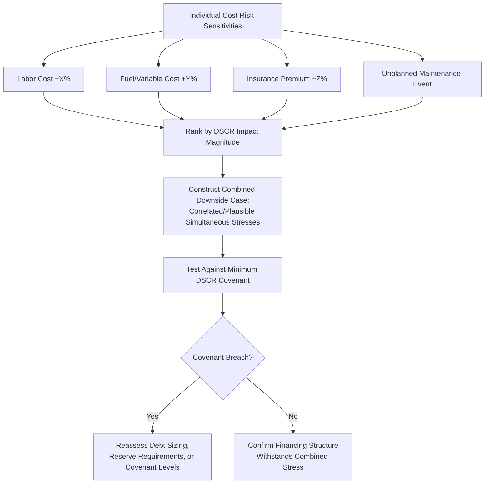

## Modeling Operating Cost Overruns and Downside Cases

### Definition

Modeling operating cost overruns and downside cases involves systematically stress-testing a project's operating cost assumptions to assess financial resilience under conditions where actual costs exceed the base-case forecast. Because project finance debt is repaid over 15-30 years from operating cash flow, and because base-case OpEx assumptions inherently rely on forecasts and third-party estimates rather than certain outcomes, lenders require explicit downside scenario analysis on the cost side to complement the revenue-side downside analysis (P90 demand, conservative price decks) covered elsewhere in this syllabus. This ensures that debt sizing and covenant structuring reflect realistic cost risk, not merely an optimistic base case.

**Key Points**

- Operating cost overrun risk is distinct from and complementary to revenue downside risk — a robust downside analysis addresses both, and increasingly focuses on combined scenarios rather than testing each side in isolation
- Downside cases should be built from identifiable, specific cost risk drivers (labor cost inflation, fuel price spikes, unplanned maintenance, insurance hardening) rather than an arbitrary blanket percentage increase applied to total OpEx
- Lenders typically require a **lender's case** or **base case for financing purposes** that incorporates specific conservative cost assumptions, distinct from the sponsor's own more optimistic operating case used for equity return analysis
- The independent engineer's and financial model auditor's due diligence typically focuses substantially on the reasonableness of both the base-case cost assumptions and the design of the associated downside scenarios

### Sources of Operating Cost Overrun Risk

| Risk Source | Description | Relevant Sector Examples |
| --- | --- | --- |
| Labor cost inflation | Wages escalate faster than assumed, or staffing levels prove insufficient | All sectors, particularly labor-intensive O&M |
| Fuel/commodity price volatility | Variable input costs exceed forecast, where not fully passed through | Thermal power, industrial processing |
| Unplanned maintenance/equipment failure | Equipment underperforms reliability assumptions, requiring more frequent repair | Power generation, mining, industrial |
| Insurance premium hardening | Market-wide insurance cost increases beyond general inflation | All sectors, particularly catastrophe-exposed assets |
| Regulatory/compliance cost increases | New environmental, safety, or operational regulations increase compliance costs | Mining, oil & gas, utilities |
| O&M contractor underperformance or distress | Contractor financial distress or poor performance requiring costly replacement | All sectors with third-party O&M |
| Estimation error in base case | Original cost estimates prove systematically too low due to incomplete scoping or optimism bias | All sectors, particularly novel/first-of-a-kind technology |
| Currency depreciation (for imported inputs) | Local currency costs for imported spare parts/consumables rise due to FX movement | Emerging market projects with imported inputs |

### Structuring the Downside Cost Case

#### Single-Factor Sensitivity Approach

$$OpEx_{stressed,t} = OpEx_{base,t} \times (1 + Stress\ Factor)$$

**Key Points**

- The simplest approach applies a uniform percentage increase (e.g., 10-15%) to total OpEx as a single sensitivity test, providing a quick, standardized reference point for DSCR impact, though this approach does not distinguish which specific cost driver is responsible and may not reflect realistic risk correlation between cost categories
- More rigorous practice tests each major cost category's overrun risk **individually** first (e.g., +20% fuel cost only, +15% labor cost only), to identify which cost lines drive the greatest DSCR sensitivity, before constructing combined scenarios

#### Combined/Compound Downside Scenarios

**Key Points**

- Combined downside scenarios should reflect **plausible correlation** between cost drivers rather than assuming all individual worst cases occur simultaneously and independently, since compounding every single-factor worst case into one scenario typically produces an unrealistically severe (and therefore less useful) stress test
- A common and defensible approach constructs a "moderately severe but plausible" combined case (e.g., a general cost inflation shock affecting most categories, plus one specific operational event such as an unplanned major repair), rather than an extreme case combining every conceivable adverse outcome at maximum severity

### Lender's Case vs. Sponsor's Case Cost Assumptions

**Key Points**

- The **lender's case** (also called the base case for financing purposes or bank case) typically incorporates more conservative cost assumptions than the sponsor's internal operating case — for example, using the higher end of a range of independent cost estimates, or incorporating an explicit contingency margin not present in the sponsor's own budget
- Debt sizing and minimum DSCR covenant compliance are typically assessed against the lender's case, not the sponsor's base case, ensuring the financing structure has adequate cushion even under a deliberately conservative cost outlook
- The **sponsor's case** is used for equity return (IRR) analysis and generally reflects the sponsor's genuine best estimate of expected costs, which may reasonably be less conservative than the lender's case without being unreasonable, since sponsors bear the residual risk/reward after debt service

### Modeling Unplanned Maintenance and Equipment Failure Events

**Key Points**

- Beyond scheduled lifecycle CapEx (covered separately in this syllabus), models should incorporate a **discrete downside scenario** representing an unplanned major equipment failure — distinct from the routine or scheduled major maintenance reserve — to test the project's resilience to an unanticipated event outside the planned lifecycle schedule
- This is typically modeled as a specific, quantified one-time cost event (informed by OEM data, historical failure rate benchmarks for comparable equipment, or the independent engineer's risk assessment) applied in a specific model year, rather than a smoothed annual probability-weighted cost addition, since lenders generally want to see the discrete cash flow and DSCR impact of an actual failure event, not just its expected value
- The interaction between an unplanned failure event and existing reserve accounts (MMRA, DSRA) should be explicitly modeled — testing whether existing reserves are sufficient to absorb the event without triggering a covenant breach or requiring additional sponsor support

### Illustrative DSCR Impact Waterfall Under Cost Stress (svg_diagram)

<svg xmlns="http://www.w3.org/2000/svg" viewBox="0 0 760 340">
<text x="380" y="24" font-size="16" font-weight="bold" text-anchor="middle" fill="#111">DSCR Sensitivity to Individual and Combined Cost Stresses (svg_diagram)</text>
<line x1="60" y1="270" x2="700" y2="270" stroke="#333" stroke-width="1.5" />
<line x1="60" y1="50" x2="60" y2="270" stroke="#333" stroke-width="1.5" />
<text x="20" y="170" font-size="11" fill="#333" transform="rotate(-90, 20, 170)">Minimum DSCR</text>
<line x1="60" y1="110" x2="700" y2="110" stroke="#991b1b" stroke-width="1" stroke-dasharray="4,3" />
<text x="705" y="114" font-size="9" fill="#991b1b">Covenant (1.20x)</text>
<rect x="90" y="90" width="90" height="180" fill="#dcfce7" stroke="#166534" stroke-width="1.5" />
<text x="135" y="270" font-size="9" text-anchor="middle" fill="#14532d" transform="rotate(0,135,285)">Base Case</text>
<text x="135" y="80" font-size="10" text-anchor="middle" fill="#14532d">1.42x</text>
<rect x="220" y="120" width="90" height="150" fill="#fef9c3" stroke="#854d0e" stroke-width="1.5" />
<text x="265" y="285" font-size="9" text-anchor="middle" fill="#713f12">+Labor Cost</text>
<text x="265" y="110" font-size="10" text-anchor="middle" fill="#713f12">1.33x</text>
<rect x="350" y="135" width="90" height="135" fill="#fef9c3" stroke="#854d0e" stroke-width="1.5" />
<text x="395" y="285" font-size="9" text-anchor="middle" fill="#713f12">+Fuel Cost</text>
<text x="395" y="125" font-size="10" text-anchor="middle" fill="#713f12">1.29x</text>
<rect x="480" y="150" width="90" height="120" fill="#fef9c3" stroke="#854d0e" stroke-width="1.5" />
<text x="525" y="285" font-size="9" text-anchor="middle" fill="#713f12">+Insurance</text>
<text x="525" y="140" font-size="10" text-anchor="middle" fill="#713f12">1.26x</text>
<rect x="610" y="195" width="90" height="75" fill="#fee2e2" stroke="#991b1b" stroke-width="1.5" />
<text x="655" y="285" font-size="9" text-anchor="middle" fill="#7f1d1d">Combined Case</text>
<text x="655" y="185" font-size="10" text-anchor="middle" fill="#7f1d1d">1.15x</text>
</svg>

### Cash Reserve and Structural Mitigants for Cost Overrun Risk

**Key Points**

- **Debt Service Reserve Account (DSRA)**: While primarily sized to cover a period of debt service (e.g., 6 months), the DSRA provides incidental liquidity buffer against short-term cost overrun stress, though it is not specifically sized for this purpose and should not be relied upon as the primary cost-overrun mitigant
- **Operating cost contingency reserve**: As discussed in the insurance and operating contingency topic, a dedicated contingency line within routine OpEx addresses smaller, more frequent cost overruns without requiring a full downside scenario re-run
- **Cash trap/distribution lock-up mechanisms**: By restricting equity distributions when DSCR falls below a specified threshold, these mechanisms automatically retain cash within the SPV during a period of cost stress, providing a structural (rather than purely reserve-based) buffer against sustained cost overruns
- **Sponsor support agreements**: In some structures, sponsors provide limited-recourse support obligations (e.g., a standby equity commitment or cost overrun guarantee) specifically calibrated to certain defined cost overrun scenarios, particularly during the construction-to-operations transition period

### Modeling Best Practices for Downside Cost Case Construction

**Key Points**

- Build the downside cost case as a **toggleable scenario layer** within the model architecture (distinct input flags for each stress driver) rather than a separate, disconnected model version, ensuring the base case and downside case remain structurally consistent and any base-case assumption update automatically flows through to the downside case
- Document the **basis for each stress magnitude** (e.g., "+15% fuel cost reflects the 90th percentile of historical 5-year rolling fuel price volatility for this commodity" or "+1 major unplanned maintenance event reflects the independent engineer's assessed failure probability over the debt tenor") rather than using round-number stress assumptions without stated justification, since lenders' technical and financial advisors will expect a defensible rationale
- Present downside case results not only as a **minimum DSCR** figure but also as the **duration and cumulative severity** of any covenant shortfall, since a single-period dip below covenant followed by recovery is a materially different risk profile than a sustained multi-year breach, even if the minimum DSCR figure looks similar
- [Inference] The specific combination and severity of stress factors that lenders will accept as an adequate downside case varies by transaction, market conditions, and lender risk appetite, and should not be treated as following a single universal methodology across all project finance transactions.

### Related Topics

- Fixed and Variable Operating Cost Structures
- Cost Escalation and Inflation Assumptions
- Insurance and Operating Contingency Costs
- Major Maintenance and Lifecycle Capex Reserves
- Debt Service Coverage Ratio (DSCR) Sensitivity and Covenant Design
- Sensitivity, Scenario, and Risk Analysis Methodology in Project Finance Models
- Cash Flow Waterfall Mechanics and Distribution Lock-Up Tests
- Sponsor Support Agreements and Contingent Equity Commitments