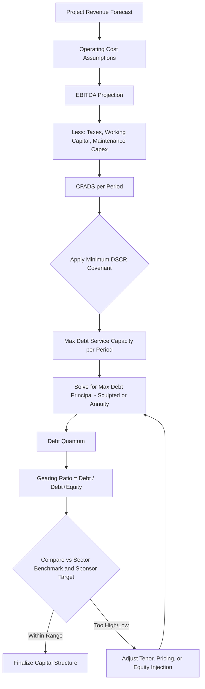

## Determining the Optimal Gearing Ratio

### Definition and Core Concept

The gearing ratio (also called the leverage ratio or debt-to-equity ratio in its most common form) measures the proportion of a project's or company's capital structure that is financed by debt versus equity. In project finance, "optimal gearing" refers to the debt-to-equity mix that maximizes returns to equity holders while keeping default risk, covenant compliance, and financing costs within acceptable bounds for lenders and sponsors alike.

$$\text{Gearing Ratio} = \frac{\text{Debt}}{\text{Debt} + \text{Equity}}$$

An alternative formulation expresses gearing as a debt-to-equity multiple rather than a debt-to-capital percentage:

$$\text{Debt-to-Equity Ratio} = \frac{\text{Debt}}{\text{Equity}}$$

Both forms are used interchangeably across jurisdictions and industries, so any gearing analysis should state explicitly which formulation is being used, since a "70/30 gearing" (debt-to-capital) is very different from a "70:30 debt-to-equity" (multiple) split.

### Why Gearing Matters in Project Finance

Project finance structures are typically highly leveraged (60-90% debt) compared to corporate finance, because:

- Projects are ring-fenced, single-purpose vehicles (SPVs) with predictable, contracted cash flows (e.g., power purchase agreements, availability payments, toll revenues)
- Lenders can rely on cash flow waterfalls, security packages, and step-in rights rather than the sponsor's balance sheet
- Higher debt levels amplify equity IRR through financial leverage, which is central to sponsor return targets

The "optimal" gearing ratio is the point that balances several competing forces rather than simply maximizing debt.

### Forces Driving the Optimal Gearing Decision

**Key Points**

- **Equity IRR maximization**: Higher gearing increases equity returns as long as the project's cost of debt is lower than its unlevered return on assets (positive financial leverage)
- **Debt Service Coverage Ratio (DSCR) constraints**: Lenders impose minimum DSCR covenants (commonly 1.2x-1.5x depending on sector risk), which cap how much debt the cash flows can support
- **Cost of capital trade-off**: As gearing rises, both cost of debt (due to higher default risk) and cost of equity (due to higher financial risk borne by equity holders) tend to rise, per Modigliani-Miller with taxes and financial distress costs
- **Covenant headroom**: Excessive gearing reduces buffer against downside scenarios (revenue shortfalls, cost overruns, interest rate movements), increasing refinancing and default risk
- **Tax shield benefits**: Interest is typically tax-deductible, so higher gearing increases the value of the tax shield, a core argument in the Modigliani-Miller framework with corporate taxes
- **Rating and market perception**: Lenders and rating agencies benchmark gearing against sector norms; deviation affects credit spreads and market appetite

### The DSCR-Driven Sizing Approach

In practice, project finance gearing is usually not selected top-down by choosing a target ratio; it is derived bottom-up from the maximum debt the project's cash flows can service while maintaining the lender's minimum DSCR.

**Sizing methodology:**

1. Forecast the project's free cash flow available for debt service (CFADS) for each period across the debt tenor
2. Divide each period's CFADS by the minimum required DSCR to get the maximum debt service capacity for that period
3. Solve (via annuity or sculpted repayment schedule) for the maximum debt principal that this debt service capacity can support, given the assumed interest rate and tenor
4. The resulting debt quantum, divided by total project cost, yields the maximum sustainable gearing ratio

$$\text{CFADS}_t = \text{EBITDA}_t - \text{Taxes}_t - \Delta\text{Working Capital}_t - \text{Maintenance Capex}_t$$

$$\text{DSCR}_t = \frac{\text{CFADS}_t}{\text{Debt Service}_t} \geq \text{DSCR}_{min}$$

This is typically solved iteratively in a financial model using a circular calculation (debt sizing depends on debt service, which depends on debt sizing) resolved via Excel's iterative calculation setting or a goal-seek/macro routine.

### Illustrative Debt Sizing and Gearing Determination Flow

### Sector Benchmarks

Gearing levels vary substantially by sector due to differences in cash flow predictability and revenue contract structure. [Unverified: exact figures vary by market, lender appetite, and prevailing interest rate environment, and should be corroborated with current market soundings]

| Sector | Typical Gearing (Debt:Total Capital) | Rationale |
| --- | --- | --- |
| Availability-based PPPs (roads, hospitals) | 85-90% | Highly predictable, government-backed payment streams |
| Power (contracted PPA, renewables) | 70-85% | Long-term offtake contracts reduce revenue risk |
| Merchant power / commodity-exposed | 50-65% | Revenue volatility requires larger equity cushion |
| Toll roads (demand risk) | 60-75% | Traffic/volume risk reduces achievable leverage |
| Mining and natural resources | 40-60% | Commodity price volatility and reserve risk |
| Greenfield technology/untested assets | 40-55% | Construction and technology risk demand more equity |

### Worked Example

**Example**

Assume a renewable energy project with the following simplified annual figures during the debt tenor:

- Average annual CFADS: $24 million
- Minimum DSCR covenant: 1.30x
- Debt tenor: 15 years
- All-in interest rate: 6.5%
- Total project cost: $220 million

Step 1 — Maximum annual debt service capacity:

$$\text{Max Debt Service} = \frac{\text{CFADS}}{\text{DSCR}_{min}} = \frac{\$24\text{M}}{1.30} = \$18.46\text{M}$$

Step 2 — Solve for maximum debt principal supportable by this annuity-style debt service over 15 years at 6.5%, using the present value of an annuity formula:

$$\text{Debt}_{max} = \text{Debt Service} \times \frac{1 - (1+r)^{-n}}{r}$$

$$\text{Debt}_{max} = \$18.46\text{M} \times \frac{1 - (1.065)^{-15}}{0.065} \approx \$18.46\text{M} \times 9.40 \approx \$173.5\text{M}$$

Step 3 — Resulting gearing ratio:

$$\text{Gearing} = \frac{\$173.5\text{M}}{\$220\text{M}} \approx 78.9\%$$

**Output**

The project can sustain approximately 79% gearing (debt-to-total-capital) given the DSCR constraint, requiring roughly $46.5 million of equity. If this exceeds sector norms or sponsor risk appetite, the sponsor would either accept a lower gearing (injecting more equity) or negotiate covenant/tenor terms with lenders to increase debt capacity.

### Sensitivity and Stress Testing

Optimal gearing is never selected on a base case alone. Lenders and sponsors run the DSCR sizing under downside scenarios to confirm the capital structure holds up:

- **Revenue downside**: e.g., -10% volume or price shock
- **Cost overrun**: construction cost increase reducing contingency and delaying COD
- **Interest rate stress**: upward shift in base rates (particularly relevant for floating-rate tranches)
- **Operating cost escalation**: above-forecast O&M or fuel cost inflation
- **Combined/downside case**: multiple adverse factors simultaneously

The gearing level chosen should maintain DSCR above the minimum (and ideally above a "lock-up" trigger level that restricts distributions) across these stress scenarios, not merely in the base case. [Inference: the specific stress magnitudes applied are transaction- and lender-specific, and are typically negotiated during due diligence rather than fixed by formula]

### Interaction with Other Capital Structure Levers

**Key Points**

- **Tenor**: Longer debt tenor increases sustainable gearing by spreading debt service over more periods, but increases refinancing and interest rate risk exposure
- **Repayment profile**: Sculpted (cash-flow-matched) repayment allows higher gearing than a straight-line amortization by concentrating repayment where CFADS is strongest
- **Interest rate hedging**: Fixing rates via swaps reduces DSCR volatility, which can support marginally higher gearing by removing interest rate risk from the stress case
- **Subordinated/mezzanine debt**: Layering junior debt between senior debt and equity can increase overall gearing beyond what senior lenders alone would support, at a higher blended cost of debt
- **Cash sweep mechanisms**: Mandatory cash sweeps that accelerate repayment from excess cash flow can justify higher initial gearing by de-risking the tail of the loan

### Optimal Gearing from an Equity Return Perspective

From the sponsor's side, gearing is also evaluated through its effect on equity IRR, since interest is a fixed claim on cash flows ahead of equity distributions:

$$\text{Equity IRR} \approx \text{Project Unlevered Return} + (\text{Project Return} - \text{Cost of Debt}) \times \frac{\text{Debt}}{\text{Equity}}$$

This relationship shows that increasing gearing amplifies equity IRR as long as the project's unlevered return exceeds the after-tax cost of debt (positive leverage). However, this amplification also increases the volatility of equity returns—downside scenarios are similarly magnified, which is the core risk-return trade-off sponsors weigh against lender-imposed DSCR ceilings.

**Key Points**

- Sponsors typically seek the highest gearing that lenders will support, subject to covenant headroom they are comfortable with
- Lenders push toward lower gearing (more equity) to increase their margin of safety and reduce default probability
- The negotiated equilibrium is where lender risk tolerance (expressed via DSCR covenants, gearing caps, and pricing) intersects with sponsor return targets

### Gearing Cap Documentation

Financing agreements typically embed the resulting gearing decision as an explicit covenant, commonly documented as:

- **Maximum gearing ratio** (e.g., "Debt shall not exceed 80% of Total Project Cost at Financial Close")
- **Minimum equity contribution** (inverse framing, e.g., "Sponsors shall contribute no less than 20% of Total Project Cost")
- **Equity funding conditions precedent**: requiring equity to be injected pro-rata with or ahead of debt drawdowns to prevent front-loading of debt risk onto lenders

### Common Pitfalls

- Treating gearing as a fixed target rather than a DSCR-derived output of the cash flow model
- Using average DSCR to size debt instead of the minimum DSCR across the tenor, which can overstate sustainable debt capacity
- Ignoring the effect of ramp-up risk (early operational years with lower/uncertain cash flows) on debt sizing, which often requires more conservative gearing in early years or a grace period
- Failing to reconcile gearing ratio definitions (debt/total capital vs. debt/equity) when benchmarking against comparable transactions

### Related Topics

- Debt Service Coverage Ratio (DSCR) and Loan Life Coverage Ratio (LLCR) mechanics
- Cash flow waterfall structures and distribution lock-up tests
- Debt sizing via sculpted vs. annuity repayment profiles
- Weighted Average Cost of Capital (WACC) in project finance
- Modigliani-Miller capital structure theory and its limitations in project finance
- Mezzanine and subordinated debt structuring
- Interest rate and currency hedging strategies for project debt
- Covenant package design (DSCR lock-up, cash sweep, leverage covenants)
- Sensitivity and scenario analysis in project finance models