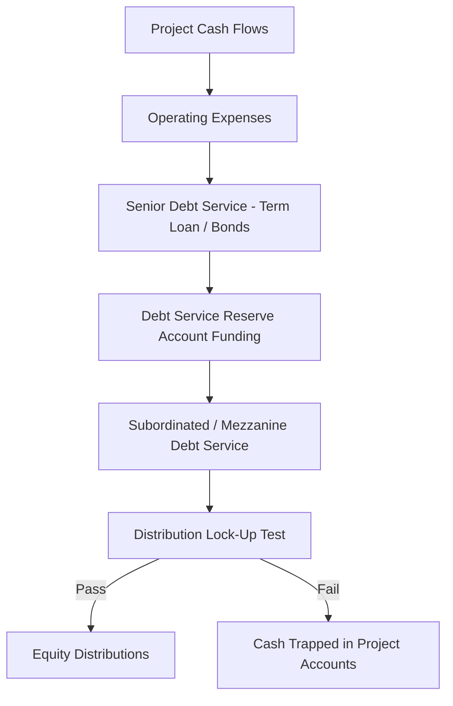
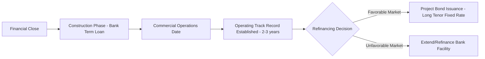

## Senior Debt: Term Loans and Project Bonds

### Definition and Role in Capital Structure

Senior debt occupies the top of the capital structure priority stack in project finance, ranking ahead of subordinated/mezzanine debt and equity in both cash flow distribution and liquidation proceeds. It typically benefits from a first-priority security interest over project assets, contracts, accounts, and shares, and its holders are the primary counterparties to the project's covenant package. The two dominant instruments for raising senior debt in project finance are **term loans** (typically bank-syndicated) and **project bonds** (capital markets-issued).

### Priority and Security Position

### Senior Term Loans

**Key Points**

- Provided by a syndicate of commercial banks, development finance institutions (DFIs), or export credit agencies (ECAs), coordinated by one or more mandated lead arrangers (MLAs)
- Drawn in tranches during construction (construction facility) and converted to an amortizing structure post-completion (term facility), often under a single facility agreement with distinct drawdown and repayment phases
- Priced as a floating-rate instrument, typically benchmarked to a reference rate (historically LIBOR, now largely SOFR, EURIBOR, or local equivalents) plus a credit margin
- Margin often steps up over the life of the loan ("margin ratchet") to compensate lenders for extended tenor risk and to incentivize refinancing
- Repayment structured via a sculpted or mini-perm amortization profile matched to projected cash flow availability (CFADS), rather than a flat bullet or straight-line schedule
- Governed by a detailed facility agreement with extensive representations, warranties, conditions precedent, covenants, and events of default tailored to the project's construction and operating risk profile

**Typical Term Loan Structure Components**

| Component | Description |
| --- | --- |
| Construction facility | Drawn during the build phase to fund capex, interest during construction (IDC), and fees |
| Term/amortizing facility | Converts from construction facility at Commercial Operations Date (COD); repaid from operating cash flows |
| Debt Service Reserve Facility (DSRF) | Standby facility or cash-funded account covering 6-12 months of debt service |
| Working Capital Facility | Revolving facility for short-term liquidity needs during operations |
| Standby/Contingency Facility | Covers cost overruns during construction |

### Project Bonds

**Key Points**

- Debt securities issued directly to capital markets investors (institutional investors, insurance companies, pension funds) rather than syndicated among banks
- Typically fixed-rate and longer-dated than bank term loans, appealing to investors seeking long-duration, stable-yield assets that match long-term liabilities (e.g., insurance and pension liabilities)
- Common structures include **144A/Reg S bonds** (US private placement exempt from full SEC registration, sold to Qualified Institutional Buyers and non-US investors), **private placements**, and **public project bonds**
- Often require a credit rating from agencies (Moody's, S&P, Fitch) to be marketable to a broad institutional investor base; project bonds are frequently structured to target investment-grade ratings (BBB-/Baa3 or higher) even when the underlying project risk would otherwise suggest sub-investment grade, achieved through credit enhancement
- Bullet or amortizing (often sculpted, similar to term loans) repayment profiles, with amortizing structures more common to match the asset's cash flow generation
- Bond structures generally require credit enhancement mechanisms because bond investors, unlike relationship banks, are typically unable or unwilling to actively monitor and waive covenants or restructure debt during construction/operational stress

### Credit Enhancement Mechanisms for Project Bonds

Because bondholders are dispersed and passive relative to bank lenders, project bonds frequently incorporate additional structural protections:

- **Monoline/financial guarantee insurance**: A third-party insurer guarantees timely payment of principal and interest, lifting the bond's effective rating to the guarantor's rating (used more extensively before the 2008 financial crisis reduced monoline capacity)
- **Debt Service Reserve Accounts (DSRA)**: Cash-funded reserves (often 6-12 months of debt service) sized larger than typical bank loan reserves to compensate for the absence of active lender oversight
- **Wrapped structures**: Multilateral development banks (e.g., IFC, ADB) or ECAs provide partial credit guarantees or political risk cover to enhance the bond's credit profile
- **Standby Letters of Credit (LCs)**: Bank-provided LCs backstop debt service in lieu of or alongside cash reserves

### Comparison: Term Loans vs. Project Bonds

| Dimension | Senior Term Loan | Project Bond |
| --- | --- | --- |
| Lender base | Commercial banks, DFIs, ECAs | Institutional investors (insurers, pension funds, asset managers) |
| Rate structure | Typically floating (reference rate + margin) | Typically fixed-rate |
| Flexibility during construction | High — banks can waive, amend, restructure | Low — requires investor consent solicitation, more rigid |
| Typical tenor | 10-18 years, often refinanced (mini-perm) | 15-30+ years, matched to asset life |
| Construction risk appetite | Higher — banks comfortable funding construction draws | Lower — bonds often issued post-completion or with enhanced structuring for construction risk |
| Documentation | Bilateral/syndicated facility agreement | Indenture/trust deed, offering memorandum |
| Rating requirement | Not typically required | Often required for marketability |
| Pricing basis | Credit margin over reference rate | Credit spread over government benchmark yield |

### Mini-Perm and Refinancing Structures

A common hybrid approach uses a bank term loan (mini-perm) during the higher-risk construction and early operations phase, followed by a refinancing into long-term bonds once the project has demonstrated stable operating performance:

**Key Points**

- Banks are typically better positioned to underwrite and monitor construction risk given their capacity for active covenant management and step-in rights
- Bond investors prefer to invest once construction risk has passed and the asset has an established cash flow track record, commanding a lower risk premium at that stage
- The mini-perm structure allows the sponsor to optimize financing cost by matching risk-appropriate capital to each project phase, though it introduces **refinancing risk** — the risk that bond market conditions are unfavorable (higher rates, reduced investor appetite) at the point of planned refinancing

### Illustrative Debt Service Waterfall for Senior Lenders

$$\text{DSCR} = \frac{\text{CFADS}}{\text{Senior Debt Service (Principal + Interest)}}$$

Senior lenders (whether term loan banks or bondholders) typically require:

- Minimum DSCR covenant (commonly 1.20x-1.50x depending on sector)
- Loan Life Coverage Ratio (LLCR) test at each measurement date, comparing the NPV of projected future CFADS to outstanding senior debt
- Distribution lock-up provisions preventing equity distributions if DSCR/LLCR falls below specified thresholds

### Example

**Example**

A toll road project raises $400 million of senior debt to fund an $500 million total project cost (80% gearing). The sponsor structures this as:

- $250 million 15-year bank term loan (floating rate, SOFR + 250bps, sculpted amortization) funding the construction period and early operations
- Plan to refinance $250 million (or the outstanding balance) into a 20-year project bond at COD + 2 years, once traffic ramp-up data de-risks the demand profile for bond investors

**Output**

This structure allows the sponsor to access bank flexibility (waivers, restructuring capacity) during the highest-risk construction and ramp-up phase, while targeting the deeper, longer-tenor, and potentially lower-cost capital markets pool once the asset's risk profile has improved — subject to refinancing risk if bond market conditions deteriorate by the planned refinancing date. [Inference: actual refinancing terms depend on prevailing market spreads and the project's demonstrated operating performance at the time, which cannot be predicted at financial close]

### Common Covenants and Protections for Senior Lenders

- **Negative pledge**: Restricts the project company from granting security to other creditors ahead of or pari passu with senior lenders
- **Restricted payments covenant**: Limits distributions to equity unless DSCR/LLCR tests and reserve funding requirements are satisfied
- **Cross-default provisions**: A default under one senior instrument (e.g., the term loan) may trigger default under others (e.g., the bond indenture) via intercreditor arrangements
- **Step-in rights**: Allow senior lenders to intervene and assume control of the project (often via a direct agreement with the offtaker/grantor) in the event of a project company default
- **Intercreditor agreement**: Governs priority and coordination between term loan lenders, bondholders, and any subordinated creditors, particularly around enforcement and voting thresholds

### Common Pitfalls

- Underestimating the documentation and consent-solicitation complexity of amending bond terms compared to the relative ease of amending a bank facility
- Assuming a bond refinancing will always be available at attractive terms, without stress-testing the mini-perm structure against adverse capital markets scenarios
- Overlooking negative basis or interest rate mismatch risk when transitioning from floating-rate bank debt to fixed-rate bonds without appropriate hedging during the transition period
- Failing to align covenant packages between term loan and bond tranches when both are used simultaneously, creating conflicting default triggers

### Related Topics

- Debt Service Coverage Ratio (DSCR) and Loan Life Coverage Ratio (LLCR)
- Mini-perm structures and refinancing risk management
- Intercreditor agreements and creditor priority mechanics
- Credit rating methodology for project finance bonds
- Export Credit Agency (ECA) and Development Finance Institution (DFI) co-financing structures
- Interest rate hedging (swaps, caps) for floating-rate term loans
- Subordinated and mezzanine debt structuring
- Debt Service Reserve Account (DSRA) sizing and mechanics