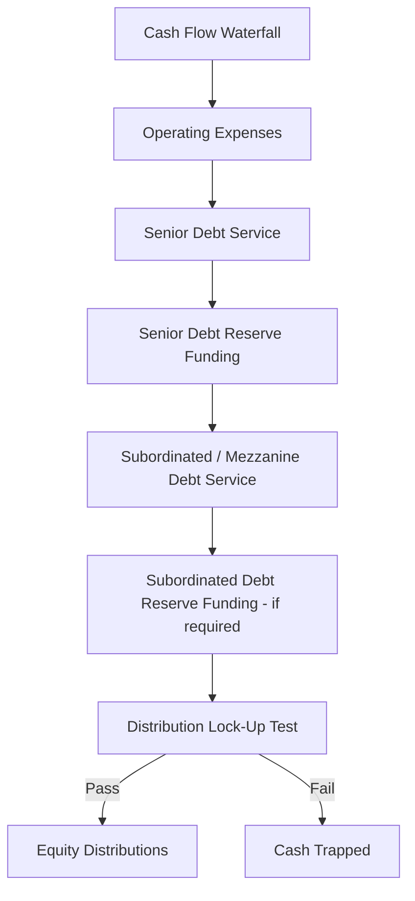
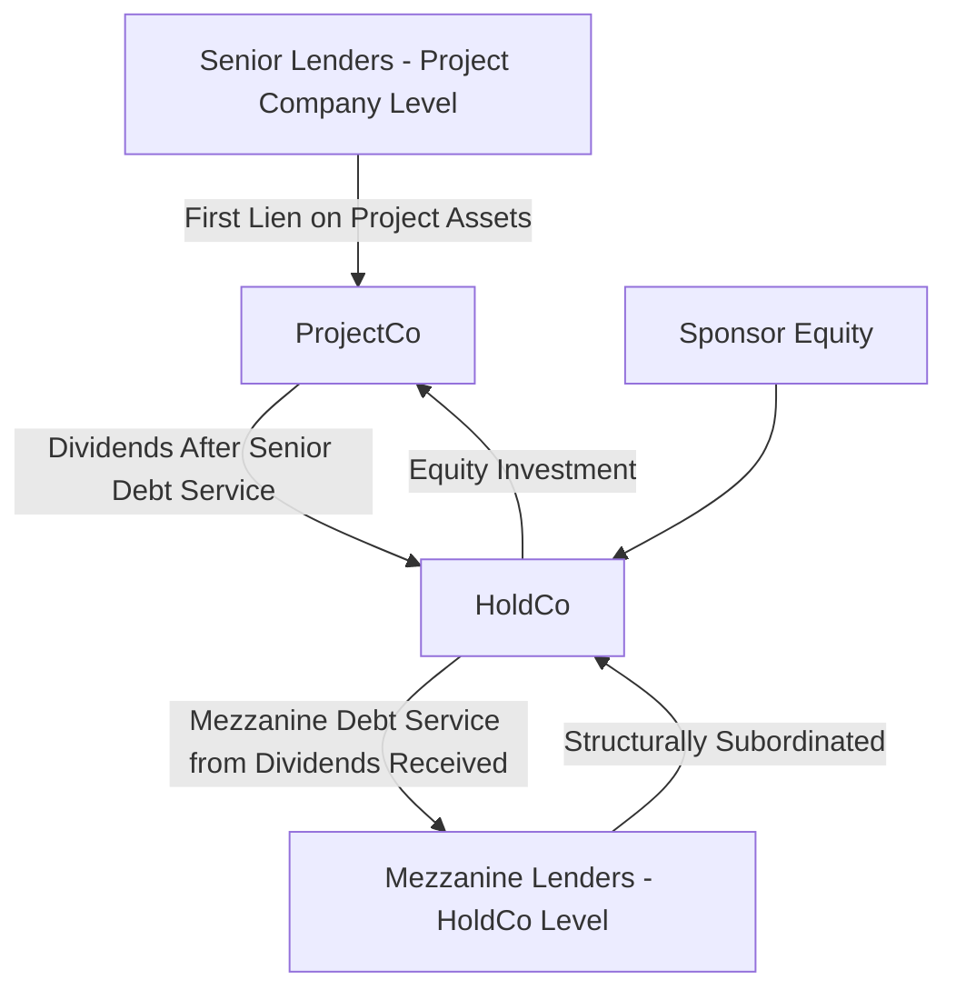

## Subordinated and Mezzanine Debt Structures

### Definition and Position in Capital Structure

Subordinated debt (also called junior debt) and mezzanine debt occupy the layer between senior debt and equity in the capital structure priority stack. They are contractually or structurally subordinated to senior lenders in both cash flow priority (debt service) and liquidation priority (proceeds on enforcement), while typically ranking ahead of equity. Mezzanine debt is a specific, hybrid-natured form of subordinated debt that often includes equity-like features (warrants, conversion rights, or profit participation) to compensate lenders for the elevated risk they bear.

### Rationale for Using Subordinated/Mezzanine Debt

**Key Points**

- **Gearing extension**: Allows sponsors to increase overall leverage beyond what senior lenders alone would support, since mezzanine sits below senior debt in the DSCR/coverage test and can be serviced from residual cash flow after senior obligations
- **Equity IRR enhancement**: Mezzanine is cheaper than equity (lower required return) but more expensive than senior debt, so replacing a portion of equity with mezzanine increases blended leverage and can improve sponsor equity IRR
- **Bridging valuation/risk gaps**: Used when senior lenders' risk appetite caps senior gearing below the level needed to make a project bankable or attractive to sponsors, without requiring the sponsor to inject additional pure equity
- **Flexible structuring**: Terms can be tailored (payment-in-kind features, bullet repayment, warrants) to match sponsor cash flow constraints and investor return requirements more flexibly than either senior debt or common equity

### Cost of Capital Positioning

Mezzanine/subordinated debt occupies a distinct risk-return band between senior debt and equity:

$$\text{Cost of Senior Debt} < \text{Cost of Mezzanine/Subordinated Debt} < \text{Cost of Equity}$$

Typical indicative return expectations (illustrative, market-dependent): [Unverified: actual pricing is highly transaction- and market-cycle-specific and should be validated against current market data]

| Capital Layer | Typical Indicative Return Range | Risk Position |
| --- | --- | --- |
| Senior secured debt | Reference rate + 150-350 bps | First priority claim |
| Subordinated/Mezzanine debt | 8%-15% (often blended cash + PIK) | Second priority, below senior |
| Sponsor equity | 12%-20%+ IRR | Residual claimant |

### Key Structural Features

**Key Points**

- **Payment-in-kind (PIK) interest**: A portion or all of interest accrues and compounds rather than being paid in cash, preserving cash flow for senior debt service during periods of tight coverage, with cash catch-up or bullet repayment at maturity or exit
- **Cash-pay/PIK toggle**: Structure permits switching between cash interest payments and PIK accrual based on cash flow availability or the borrower's election, subject to agreed triggers
- **Warrants and equity kickers**: Grant the mezzanine lender the right to acquire equity or project company interests at a nominal price, providing upside participation beyond the stated coupon
- **Bullet or back-ended repayment**: Principal is often repaid at maturity or upon refinancing/exit rather than amortized alongside senior debt, since senior lenders typically require full amortization priority
- **Longer or coterminous tenor**: May extend slightly beyond or match the senior debt tenor, depending on negotiated terms
- **Conversion rights**: Some mezzanine instruments include the option to convert debt into equity under specified conditions, blurring the line between debt and quasi-equity

### Subordination Mechanics

Subordination is typically established through one or both of:

- **Contractual subordination**: An intercreditor agreement explicitly subordinates the mezzanine lender's payment and enforcement rights to senior lenders, including standstill periods during which mezzanine lenders cannot accelerate or enforce security while senior debt remains outstanding
- **Structural subordination**: Mezzanine debt is issued at a holding company level above the project company (structurally subordinated to project-level senior debt) rather than at the same entity, meaning it has no direct claim on project assets and relies on dividends/distributions passed up from the operating project company

### Intercreditor Agreement Provisions Relevant to Mezzanine Lenders

- **Payment blockage/standstill**: Senior lenders can block mezzanine payments for a defined period following a senior default, even if the mezzanine facility itself is not in default
- **Turnover provisions**: Require mezzanine lenders to remit any payments received in breach of subordination terms back to senior lenders
- **Enforcement standstill**: Restricts mezzanine lenders from enforcing security or accelerating debt for an agreed standstill period after a default notice, giving senior lenders control of the enforcement process
- **Voting and consent rights**: Mezzanine lenders typically have limited or no consent rights over senior facility amendments, though material changes affecting mezzanine economics may require consultation

### Impact on Coverage Ratios

Lenders and sponsors typically compute both a senior-only and a total (senior + subordinated) coverage ratio to assess the layered capital structure:

$$\text{Senior DSCR} = \frac{\text{CFADS}}{\text{Senior Debt Service}}$$

$$\text{Total DSCR} = \frac{\text{CFADS}}{\text{Senior Debt Service} + \text{Subordinated Debt Service}}$$

Senior lenders' covenants are tested against Senior DSCR only; the presence of mezzanine debt does not need to satisfy the senior minimum DSCR test, since mezzanine sits below the senior test in priority. However, the mezzanine facility agreement will typically impose its own (lower) minimum Total DSCR covenant.

### Example

**Example**

A $300 million data center project has senior lenders willing to fund only 65% gearing ($195 million) at a maximum senior DSCR-implied capacity, but the sponsor wants to reach 80% overall leverage to boost equity IRR without contributing the full 35% equity gap.

The sponsor introduces a mezzanine tranche:

- Senior debt: $195 million (65% of total capital), Reference rate + 275bps, 15-year sculpted amortization, minimum senior DSCR 1.30x
- Mezzanine debt: $45 million (15% of total capital), 11% coupon (7% cash-pay + 4% PIK), bullet repayment at year 10, minimum total DSCR covenant 1.10x
- Sponsor equity: $60 million (20% of total capital)

**Output**

This structure allows the sponsor to achieve 80% total leverage while keeping the senior lender's exposure within its own risk-adjusted gearing limit. The mezzanine lender accepts higher risk (structural/contractual subordination, partial PIK, bullet repayment) in exchange for a blended return significantly above senior pricing, while the sponsor reduces its equity check from $105 million (35%) to $60 million (20%), which — assuming the project's unlevered return exceeds the blended cost of senior and mezzanine debt — increases projected equity IRR. [Inference: the actual increase in equity IRR depends on the specific project cash flow profile and cannot be generalized without modeling the specific transaction]

### Comparison: Mezzanine Debt vs. Preferred Equity

Mezzanine debt is often compared against preferred equity as an alternative "gap-filling" instrument between senior debt and common equity:

| Dimension | Mezzanine Debt | Preferred Equity |
| --- | --- | --- |
| Legal form | Debt instrument | Equity instrument |
| Tax treatment | Interest often tax-deductible | Dividends generally not tax-deductible |
| Priority | Ranks above equity, below senior debt | Ranks above common equity, typically below all debt |
| Covenant rights | Contractual covenants, event of default remedies | Governance/veto rights, no formal default remedies |
| Balance sheet treatment | Increases reported leverage | May be treated as equity or quasi-equity depending on terms |
| Typical return mechanism | Coupon (cash/PIK) + possible warrants | Preferred dividend + possible participation rights |

### Common Pitfalls

- Structuring mezzanine PIK accrual without stress-testing whether the compounded balance at bullet maturity is refinanceable, creating a refinancing cliff risk
- Underestimating the impact of standstill and payment blockage provisions on mezzanine lender cash flow expectations during senior distress periods
- Placing mezzanine at the project company level (rather than structurally at HoldCo) without fully negotiated intercreditor protections, which can create direct conflict with senior lender security interests
- Failing to align mezzanine maturity with anticipated refinancing or exit events, leaving a maturity mismatch against the project's cash flow generation capacity

### Related Topics

- Intercreditor agreements and creditor priority mechanics
- Debt Service Coverage Ratio (DSCR) and Loan Life Coverage Ratio (LLCR)
- Optimal gearing ratio determination
- Preferred equity and hybrid capital instruments
- Payment-in-kind (PIK) securities structuring
- Refinancing risk management in layered capital structures
- Sponsor equity IRR sensitivity analysis
- Warrant valuation and equity kicker mechanics