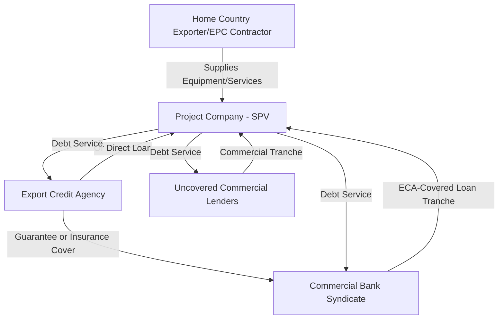

## Export Credit Agency-Backed Debt

### Definition and Role in Project Finance

Export Credit Agency (ECA)-backed debt refers to financing facilities that carry the direct lending, guarantee, or insurance support of a national export credit agency, established to promote that country's exports by facilitating financing for foreign buyers of goods and services from domestic suppliers. In project finance, ECA support is typically triggered when a project procures equipment, EPC contracting services, or technology from suppliers based in the ECA's home country, allowing the project to access debt on more favorable terms than would otherwise be available from commercial lenders alone.

### Core Rationale

**Key Points**

- **Export promotion mandate**: ECAs exist to support their home country's exporters by de-risking financing for the foreign buyer (the project), not primarily to generate profit, which allows for more competitive pricing and tenor than pure commercial lending
- **Risk mitigation for commercial lenders**: ECA guarantees or direct cover reduce the credit risk borne by commercial banks, often enabling longer tenors and larger facility sizes than commercial appetite alone would support
- **Access to competitive, long-tenor financing**: ECA-backed tranches frequently offer tenors of 10-18+ years, longer than typical uncovered commercial bank debt, and can be priced favorably due to the sovereign or quasi-sovereign backing
- **Political and country risk mitigation**: For projects in emerging markets, ECA involvement can also address political risk concerns for other lenders in the syndicate, given the ECA's government backing and diplomatic weight

### Major ECA Institutions (Illustrative)

| ECA | Home Country | Notes |
| --- | --- | --- |
| US EXIM Bank | United States | Direct loans, loan guarantees, and export credit insurance |
| UK Export Finance (UKEF) | United Kingdom | Guarantees and direct lending supporting UK exporters |
| Euler Hermes (now Allianz Trade, acting as Germany's ECA) | Germany | Export credit guarantees on behalf of the German government |
| Coface | France | Export credit insurance and guarantees |
| SACE | Italy | Export credit and investment insurance |
| JBIC / NEXI | Japan | Japan Bank for International Cooperation (direct lending) and Nippon Export and Investment Insurance (insurance) |
| Korea Eximbank / K-SURE | South Korea | Direct lending and export credit insurance |
| Export Development Canada (EDC) | Canada | Direct lending, guarantees, and insurance |
| Sinosure / China Eximbank | China | Export credit insurance and concessional/commercial lending |

[Unverified: institutional names, mandates, and product offerings evolve over time and should be confirmed against current ECA program documentation for any live transaction]

### ECA Support Structures

ECAs typically provide support through one of several structural mechanisms rather than a single standard product:

**Key Points**

- **Direct lending**: The ECA itself provides a loan directly to the project company, often alongside commercial lenders in a syndicated structure
- **Guarantee/cover of commercial loans**: The ECA guarantees a percentage (commonly 85-100%) of a commercial bank loan's principal and interest, with the commercial bank remaining the lender of record but carrying substantially reduced credit risk
- **Export credit insurance**: The ECA insures the commercial lender against non-payment risk, functioning similarly to a guarantee but often structured as an insurance policy rather than a direct guarantee instrument
- **Interest rate support/subsidization**: Some ECA programs provide interest rate support (e.g., under the OECD Arrangement on Officially Supported Export Credits) to bring financing costs closer to government borrowing rates

### The OECD Arrangement Framework

Most major ECAs operate within the framework of the **OECD Arrangement on Officially Supported Export Credits**, a multilateral agreement establishing common minimum terms to prevent a competitive "subsidy race" among export credit agencies of different countries. Key parameters typically governed include:

- Minimum premium rates (based on country risk classification and repayment tenor)
- Maximum repayment terms (historically up to 10 years for standard transactions, with extended terms available for specific categories such as renewable energy, water, and certain large project financings under sector understandings)
- Minimum interest rates (Commercial Interest Reference Rates, or CIRRs, for fixed-rate official financing support)
- Local cost and national interest account rules governing the proportion of non-home-country content that may be covered

[Unverified: specific tenor caps, premium schedules, and sector carve-outs are periodically revised by OECD member consensus and should be verified against the current Arrangement text for any transaction]

### National Content Requirements

ECA support is generally contingent on a minimum proportion of the financed goods/services originating from the ECA's home country:

- Typical national content thresholds require that a defined percentage (commonly around 70-85%, though this varies by ECA and program) of contract value derives from home-country goods and services
- Some ECAs permit financing of a limited proportion of foreign/local content and local costs alongside the home-country export content, subject to caps
- This requirement directly influences EPC contractor and equipment supplier selection during project structuring, since sourcing decisions determine ECA eligibility

### Pricing Components

ECA-backed debt pricing typically comprises:

$$\text{All-in Cost} = \text{Base Rate (CIRR or Reference Rate)} + \text{Credit Margin} + \text{ECA Premium}$$

- **ECA premium**: A one-time or amortized fee compensating the ECA for its risk cover, calculated based on the buyer country's OECD risk classification (Category 0, the lowest risk, through Category 7, the highest), the tenor, and the percentage of cover provided
- **Commercial margin**: Charged by the commercial bank(s) participating alongside or under the ECA guarantee, typically lower than an equivalent uncovered commercial facility due to reduced credit risk
- Country risk classification directly drives premium cost — higher-risk jurisdictions incur substantially higher ECA premiums

### Typical Documentation Structure

- **Supply/EPC contract**: Underlying commercial contract between the project company and the home-country exporter/contractor, which must satisfy national content and eligibility requirements
- **ECA cover/guarantee agreement**: Documents the terms of the ECA's guarantee, insurance policy, or direct loan commitment
- **Facility agreement**: Governs the commercial loan terms where the ECA provides guarantee/insurance cover rather than direct lending
- **Political risk and comprehensive risk cover terms**: Where applicable, defines the scope of covered events (expropriation, currency inconvertibility, war, and comprehensive commercial risk including buyer default)

### Example

**Example**

A $600 million LNG liquefaction project in an emerging market procures core liquefaction equipment from a German manufacturer and awards the EPC contract jointly to firms with significant German and Japanese content.

**Output**

The project structures a co-financing package combining:

- A direct loan tranche from Germany's ECA covering the German-sourced equipment portion of contract value, subject to minimum German national content thresholds
- A JBIC direct loan tranche alongside NEXI insurance cover for the Japanese-sourced EPC content
- A commercial bank tranche for the remaining uncovered project costs, priced at a materially wider margin than the ECA-covered tranches due to the absence of ECA risk mitigation

This multi-ECA structure allows the project to access longer tenors and more competitive pricing on the majority of the debt stack than would be achievable through a purely commercial bank syndicate, while requiring the project to coordinate parallel due diligence, documentation, and disbursement conditions across each ECA's distinct requirements. [Inference: the specific blended cost of debt and tenor achieved depends on the country risk classification and prevailing OECD Arrangement terms applicable at financial close, which vary by transaction]

### Interaction with Other Capital Structure Elements

**Key Points**

- ECA tranches typically rank pari passu with other senior secured debt in the intercreditor structure, sharing the same security package rather than being subordinated
- ECA cover can materially increase overall achievable gearing, since ECA-backed tranches often carry lower risk weighting for participating commercial banks and may access more favorable capital treatment
- Multi-sourced ECA and commercial debt structures require careful intercreditor coordination given differing disbursement conditions, cover ratios, and reporting requirements across ECAs
- ECA involvement can extend the overall financing timeline, as ECA approval processes (including national interest, environmental and social, and anti-corruption due diligence) run in parallel with commercial lender due diligence and may have differing internal approval cycles

### Environmental and Social Due Diligence

Most major ECAs apply environmental and social (E&S) due diligence standards, commonly referencing the **OECD Common Approaches** and/or IFC Performance Standards / Equator Principles, particularly for projects in higher E&S risk sectors (extractives, large infrastructure, power generation). This can add an additional layer of due diligence and disclosure requirements to the transaction timeline. [Unverified: specific E&S standards and their application vary by ECA and by project category, and should be confirmed against the specific ECA's current policy framework]

### Common Pitfalls

- Underestimating the impact of national content requirements on EPC contractor and equipment procurement decisions made early in project development, before ECA financing strategy is finalized
- Failing to build sufficient lead time for ECA internal approval processes, which can run longer than commercial bank credit committee timelines
- Overlooking intercreditor complexity when combining multiple ECAs with differing cover structures (direct loan vs. guarantee vs. insurance) in a single financing package
- Assuming ECA premium and tenor terms are static, when they are subject to periodic revision under the OECD Arrangement and country risk reclassification

### Related Topics

- OECD Arrangement on Officially Supported Export Credits
- Senior debt structuring: term loans and project bonds
- Intercreditor agreements in multi-source financing structures
- Political risk insurance and multilateral guarantee structures
- Country risk classification methodologies
- EPC contract structuring and procurement strategy
- Development Finance Institution (DFI) co-financing