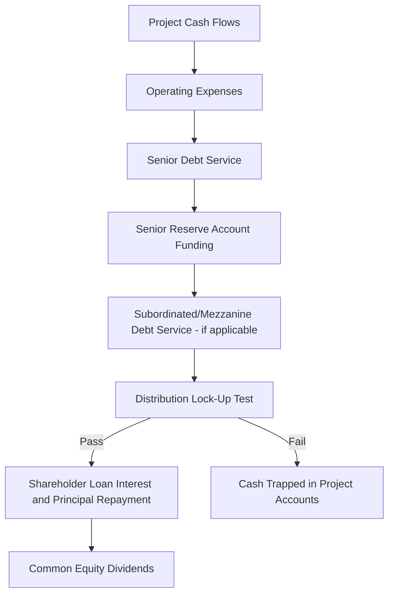
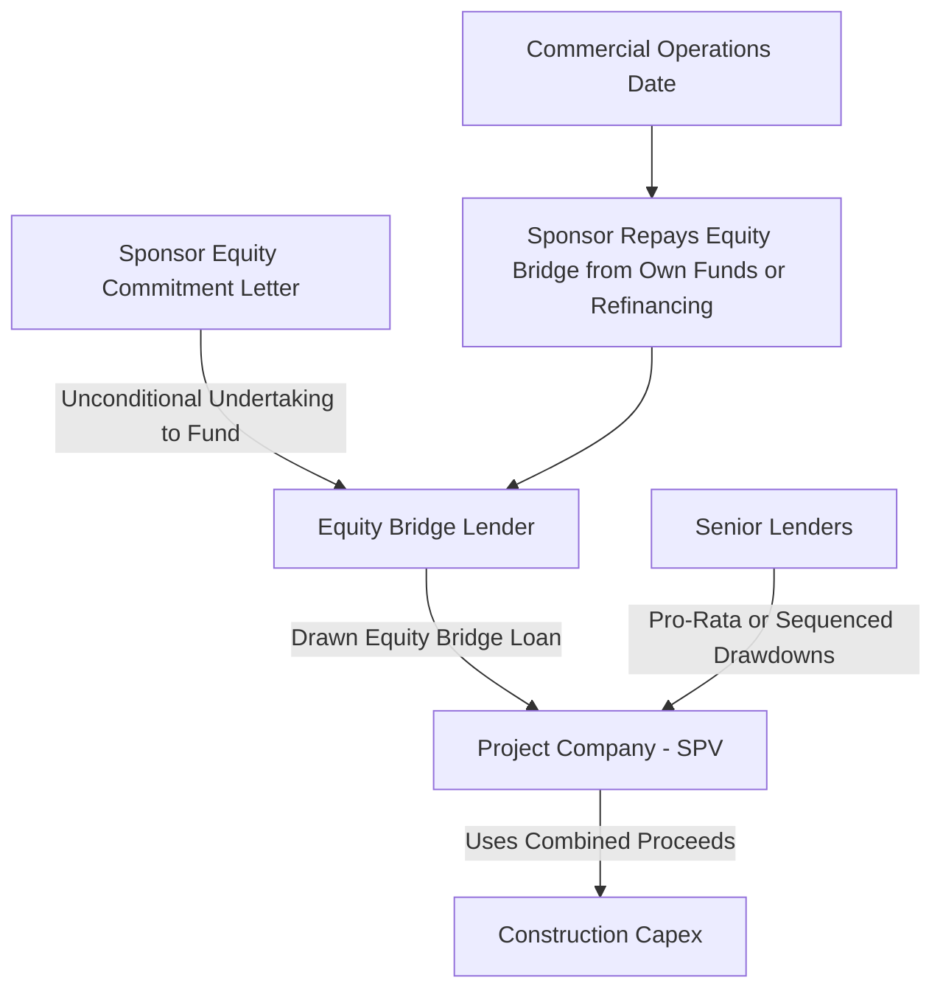

## Shareholder Loans and Equity Bridge Financing

### Definition and Role in Capital Structure

Shareholder loans and equity bridge financing are two related but distinct mechanisms sponsors use to fund their equity commitment to a project company. **Shareholder loans** are debt instruments provided by the sponsor(s) directly to the project company, structurally functioning as part of the sponsor's equity contribution while retaining debt-like tax and repayment characteristics. **Equity bridge financing** is a short-term facility, typically provided by commercial banks, that allows sponsors to defer actual cash equity contributions until later in the project timeline, "bridging" the gap between financial close and the point at which sponsors are contractually required to fund.

### Shareholder Loans

**Key Points**

- Structurally subordinated to senior (and typically mezzanine) project debt, ranking effectively as quasi-equity from the perspective of external lenders despite being legally structured as debt
- Provide sponsors with tax efficiency benefits in many jurisdictions, since interest payments on shareholder loans may be tax-deductible for the project company (subject to thin capitalization and transfer pricing rules), whereas dividend distributions on pure equity generally are not
- Often carry PIK (payment-in-kind) interest that accrues rather than being paid in cash during the early years, preserving project cash flow for senior debt service
- Provide sponsors with repayment flexibility and potential seniority over pure equity in a project company liquidation scenario, even though both are subordinated to external senior/mezzanine debt
- Typically governed by a shareholder loan agreement and are explicitly subordinated to senior/mezzanine debt via the intercreditor agreement, with repayment permitted only after senior (and where applicable mezzanine) debt service and coverage tests are satisfied

### Why Sponsors Use Shareholder Loans Instead of Pure Equity

$$\text{Total Sponsor Contribution} = \text{Common Equity} + \text{Shareholder Loan}$$

- **Tax shield**: Interest deductibility on shareholder loans (where permitted) reduces the project company's taxable income, unlike dividends paid on common equity
- **Repatriation flexibility**: Loan principal and interest repayments can sometimes be structured with more predictable timing than dividend distributions, which are typically subject to more restrictive lock-up and distribution test conditions
- **Withholding tax considerations**: Depending on the jurisdiction and applicable tax treaties, withholding tax treatment on interest versus dividend payments may differ, influencing the sponsor's choice of instrument mix [Inference: the specific tax treatment is jurisdiction-dependent and requires case-specific tax advice, as treaty networks and thin capitalization rules vary significantly by country]
- **Structuring flexibility for multi-sponsor consortiums**: Allows different sponsors to contribute varying proportions of loan versus equity based on their individual tax positions, while maintaining agreed overall economic ownership percentages

### Shareholder Loan Subordination in the Waterfall

### Equity Bridge Financing

**Key Points**

- Addresses the mismatch between when sponsors are contractually obligated to fund equity (often pro-rata with debt drawdowns throughout construction) and when sponsors may prefer to fund it (e.g., closer to or at project completion, to optimize their own treasury and cost-of-capital management)
- Structured as a short-to-medium-term facility (typically maturing at or shortly after Commercial Operations Date, COD) provided by commercial banks, sometimes the same banks participating in the senior debt syndicate
- Secured typically against the sponsor's unconditional and irrevocable undertaking to fund the equity contribution (an "equity commitment letter" or "equity support agreement"), rather than against project assets directly
- Allows sponsors to defer cash outlay while still satisfying lender requirements that equity be funded pari passu or ahead of debt drawdowns during construction, since the equity bridge lender funds the equity tranche in lieu of the sponsor's own immediate cash contribution
- Reduces sponsor cost of capital during construction by allowing the sponsor to deploy its own capital elsewhere until the bridge matures, effectively substituting a lower-cost bridge facility for early sponsor cash commitment [Inference: the actual economic benefit depends on the bridge facility's pricing relative to the sponsor's own cost of capital and alternative uses of funds, which varies by sponsor]

### Equity Bridge Structure and Mechanics

### Typical Equity Bridge Documentation Requirements

- **Equity commitment/support agreement**: The sponsor's binding, typically unconditional and irrevocable, commitment to fund equity by a specified date, assigned or pledged in favor of the bridge lender as security
- **Direct agreement or assignment**: Bridge lenders typically require the right to call directly on the sponsor's equity commitment in the event the project company or sponsor defaults on bridge repayment obligations
- **Sponsor credit support**: Depending on the sponsor's credit profile, the bridge facility may require parent company guarantees, letters of credit, or other credit enhancement to support the bridge lender's exposure to the sponsor's payment undertaking
- **Repayment triggers**: Typically tied to COD, a refinancing event, or a specified longstop date, whichever occurs first

### Comparison: Shareholder Loan vs. Equity Bridge Financing

| Dimension | Shareholder Loan | Equity Bridge Financing |
| --- | --- | --- |
| Purpose | Structures part of sponsor equity contribution as debt for tax/return efficiency | Defers timing of sponsor's cash equity contribution |
| Provided by | Sponsor(s) directly | Third-party commercial banks |
| Duration | Long-term, coterminous with or beyond project debt | Short-to-medium term, typically maturing at/near COD |
| Security/backing | Subordinated to senior/mezzanine debt via intercreditor agreement | Secured against sponsor's equity commitment undertaking |
| Primary benefit | Tax efficiency, repayment flexibility for sponsor | Sponsor treasury/capital deployment optimization |
| Risk borne by | Project company (subordination risk) | Sponsor (credit risk on its funding undertaking) and bridge lender |

### Example

**Example**

A renewable energy sponsor consortium commits $120 million of equity to a $500 million project (24% equity, 76% senior debt). Rather than funding the full $120 million in cash pro-rata with debt drawdowns over the 24-month construction period, the consortium structures:

- A $100 million equity bridge facility from a subset of the senior lending banks, drawn pro-rata with senior debt during construction, secured against each sponsor's binding equity commitment letter
- $20 million of shareholder loans funded directly at financial close, bearing 9% PIK interest, subordinated to senior debt via the intercreditor agreement

**Output**

At COD, the sponsors repay the $100 million equity bridge from their own balance sheet resources (or via a partial refinancing), having deferred the cash outlay for approximately 24 months while satisfying lenders' requirement that equity be committed and available pari passu with debt drawdowns. The $20 million shareholder loan remains outstanding, generating a tax-deductible interest expense for the project company (subject to applicable thin capitalization rules) and providing the sponsors a structured repayment path once senior debt coverage tests permit distributions. [Inference: the specific deferral benefit and tax treatment depend on the sponsors' individual cost of capital and the applicable tax jurisdiction, and cannot be generalized]

### Lender Considerations and Protections

**Key Points**

- Senior lenders typically require equity (whether funded in cash or via bridge) to be contributed **pari passu** or **ahead of** debt drawdowns, to prevent sponsors from "backloading" equity risk onto debt during construction
- Senior lenders often require direct visibility or step-in rights over the equity bridge facility and sponsor commitment letters, to ensure the equity funding obligation is not itself a point of failure
- Shareholder loan subordination terms (payment blockage, standstill, turnover provisions) are negotiated as part of the overall intercreditor agreement, similar in mechanism to mezzanine debt subordination
- Rating agencies and senior lenders may treat undrawn equity bridge commitments as a source of construction-phase completion risk if the sponsor's credit quality supporting the bridge is weak, since bridge lender recourse ultimately depends on sponsor payment capacity

### Common Pitfalls

- Treating equity bridge financing as risk-free from the project's perspective, when in fact its viability depends entirely on the sponsor's ongoing creditworthiness and willingness to honor its funding commitment
- Underestimating thin capitalization or transfer pricing rules that may limit the tax deductibility of shareholder loan interest in certain jurisdictions, eroding the anticipated tax efficiency benefit
- Failing to align equity bridge maturity with realistic COD timing assumptions, creating refinancing pressure if construction delays push completion beyond the bridge's tenor
- Overlooking the need for direct agreements giving senior lenders visibility or enforcement rights over the sponsor's equity commitment letter, which can create structural gaps in the completion support package

### Related Topics

- Optimal gearing ratio determination
- Subordinated and mezzanine debt structures
- Intercreditor agreements and creditor priority mechanics
- Completion support and sponsor guarantee structures
- Thin capitalization and cross-border tax structuring
- Cash flow waterfall and distribution lock-up mechanics
- Construction-phase risk allocation