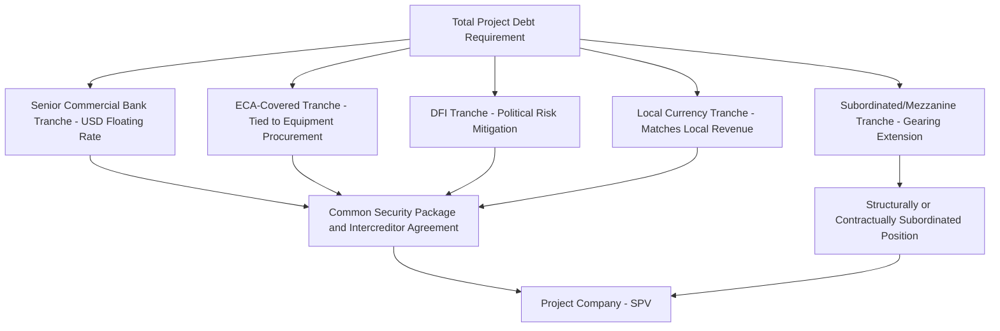

## Multi-Tranche and Multi-Currency Debt Structures

### Definition and Rationale

Multi-tranche and multi-currency debt structures refer to project financings in which senior (and sometimes subordinated) debt is split into two or more separate facilities distinguished by lender type, currency denomination, pricing basis, tenor, or security ranking, rather than being raised as a single homogeneous facility. These structures are used to optimize overall financing cost, match liabilities to project revenue currency, diversify the lender base, and access pools of capital that would not individually be able or willing to fund the full debt requirement.

### Core Drivers for Multi-Tranche Structuring

**Key Points**

- **Lender capacity limits**: No single bank, ECA, or DFI may be willing or permitted (due to single-obligor or country exposure limits) to fund the entire debt requirement, necessitating syndication across multiple tranches and institution types
- **Cost optimization**: Different lender types (commercial banks, ECAs, DFIs, bond investors) price risk differently; blending tranches allows sponsors to access the lowest-cost capital available from each source rather than defaulting to the most expensive uniform rate
- **Risk-appropriate matching**: Certain lenders (e.g., DFIs, ECAs) are better positioned to bear specific risks (political risk, construction risk, country risk) than others, allowing risk to be allocated to the parties best equipped to price and manage it
- **Revenue currency matching**: Multi-currency structuring allows debt service obligations to align with the currency in which the project generates revenue, reducing unhedged foreign exchange exposure
- **Market access diversification**: Combining bank debt with capital markets bonds broadens the investor base and can improve overall execution certainty by not relying on a single funding source

### Common Tranche Categories

| Tranche Type | Typical Provider | Distinguishing Feature |
| --- | --- | --- |
| Commercial bank tranche | Syndicate of commercial banks | Floating rate, standard covenant package |
| ECA-covered tranche | ECA direct loan or guarantee/insurance | Tied to procurement from ECA home country, often longer tenor and lower pricing |
| DFI tranche | Multilateral/bilateral development finance institutions (IFC, ADB, EBRD, etc.) | May include preferred creditor status, political risk mitigation value |
| Local currency tranche | Domestic banks or local capital markets | Matches local currency revenue streams, avoids FX conversion risk |
| Hard currency tranche | International banks/bond investors | USD/EUR-denominated, often required for imported equipment or hard-currency-linked contracts |
| Subordinated/mezzanine tranche | Specialist mezzanine funds, DFIs, sponsors | Junior ranking, higher blended cost, increases overall gearing capacity |
| Bond tranche | Institutional investors (144A/Reg S, private placement) | Fixed rate, longer tenor, often used in refinancing/mini-perm structures |

### Illustrative Multi-Tranche Structure

### Multi-Currency Structuring Considerations

**Key Points**

- **Revenue-currency matching**: Where the project generates revenue in local currency (e.g., a toll road with local-currency tariffs) but a portion of costs (equipment, EPC contractor fees) are denominated in hard currency, sponsors typically seek to match debt currency composition to the underlying revenue and cost currency profile to minimize net unhedged FX exposure
- **Local currency debt availability constraints**: In many emerging markets, local currency debt capacity is limited by shallow domestic capital markets, shorter tenors available locally, and higher local interest rates, often necessitating a blended structure of local and hard currency tranches
- **Currency mismatch risk**: Where debt is hard-currency-denominated but revenue is local-currency, the project bears FX translation risk on debt service unless mitigated via hedging, indexation of tariffs to a hard currency benchmark, or government-provided FX risk cover
- **Devaluation and convertibility risk**: In addition to translation risk, projects with hard currency debt and local currency revenue face convertibility risk (inability to convert local currency into hard currency) and transfer risk (restrictions on remitting hard currency out of the host country), which may require political risk insurance or DFI involvement to mitigate

### FX Risk Mitigation Approaches in Multi-Currency Structures

$$\text{Net FX Exposure} = \text{Hard Currency Debt Service} - \text{Hard Currency-Linked Revenue or Hedges}$$

- **Tariff indexation**: Offtake or concession agreements may index local currency tariffs to a hard currency exchange rate or inflation benchmark, passing FX risk through to the offtaker/grantor rather than the project company
- **Cross-currency swaps**: Used to convert a portion of local currency revenue into the hard currency needed for debt service, or vice versa, though availability and cost depend on the depth of the local swap market for the currency in question
- **Local currency debt tranches**: Directly reduces the quantum of hard currency debt requiring FX conversion, at the potential cost of higher local interest rates and shorter local tenors
- **Political risk insurance / DFI guarantees**: Multilateral institutions can provide currency inconvertibility and transfer risk cover as a distinct product from commercial FX hedging instruments [Inference: the specific product availability and pricing depend on the host country and the multilateral institution's current program offerings]

### Intercreditor Coordination Across Multiple Tranches

Multi-tranche structures require a comprehensive intercreditor agreement to coordinate:

- **Ranking and priority**: Establishing whether tranches rank pari passu (equal priority) or in a defined priority sequence, and how shared security is allocated among pari passu creditors
- **Voting thresholds**: Defining what percentage of total debt (often by tranche and/or in aggregate) is required to approve waivers, amendments, and enforcement decisions
- **Pro-rata sharing**: Ensuring proceeds from enforcement of shared security are distributed pro-rata among pari passu senior tranches, regardless of currency or lender type
- **Currency conversion mechanics for enforcement**: Establishing agreed conversion methodologies and reference dates for calculating pro-rata entitlements when tranches are denominated in different currencies
- **Differing disbursement/drawdown conditions**: Coordinating potentially different conditions precedent across ECA, DFI, and commercial tranches, which may have distinct approval timelines and documentation requirements

### Example

**Example**

A $700 million desalination project in a market with a developing but shallow local currency bond market structures its debt as follows:

- $300 million commercial bank tranche (USD, floating rate, senior secured, pari passu with other senior tranches)
- $150 million ECA-covered tranche (USD, tied to procurement of desalination membrane technology from the ECA's home country, longer tenor than the commercial tranche)
- $100 million DFI tranche (USD, senior secured, providing political risk mitigation value to the broader syndicate through the DFI's preferred creditor status)
- $100 million local currency tranche (local currency, funded by domestic banks, matched against local currency water tariff revenue)
- $50 million subordinated mezzanine tranche (USD, PIK-heavy, gearing extension)

**Output**

This structure allows the sponsor to (i) access ECA pricing and tenor advantages tied to equipment procurement, (ii) leverage DFI involvement to enhance perceived political risk mitigation for the broader syndicate, (iii) reduce unhedged FX exposure on the portion of revenue collected in local currency, and (iv) extend overall gearing via the mezzanine tranche — while requiring a correspondingly more complex intercreditor agreement to coordinate ranking, voting, and enforcement mechanics across five distinct creditor groups with differing currencies and risk appetites. [Inference: the specific blended cost of capital achieved through this structure depends on prevailing market pricing for each tranche type at the time of financial close, which varies significantly by market cycle and country risk profile]

### Common Pitfalls

- Underestimating the intercreditor documentation complexity and negotiation timeline required to coordinate multiple lender types with differing standard terms and internal approval processes
- Failing to adequately hedge or structurally mitigate currency mismatch between hard-currency debt service and local-currency revenue, exposing the project to devaluation risk
- Assuming local currency debt capacity will be available at financial close without early engagement with domestic lenders, given that local currency market depth and tenor availability can be a binding constraint
- Overlooking differing financial covenant definitions or measurement conventions across tranches (e.g., different DSCR calculation methodologies between an ECA facility agreement and a commercial facility agreement), which can create inconsistent compliance testing

### Related Topics

- Export Credit Agency-backed debt structuring
- Intercreditor agreements and creditor priority mechanics
- Development Finance Institution (DFI) co-financing and preferred creditor status
- Currency and interest rate hedging strategies in project finance
- Political risk insurance structures
- Optimal gearing ratio determination
- Senior debt: term loans and project bonds