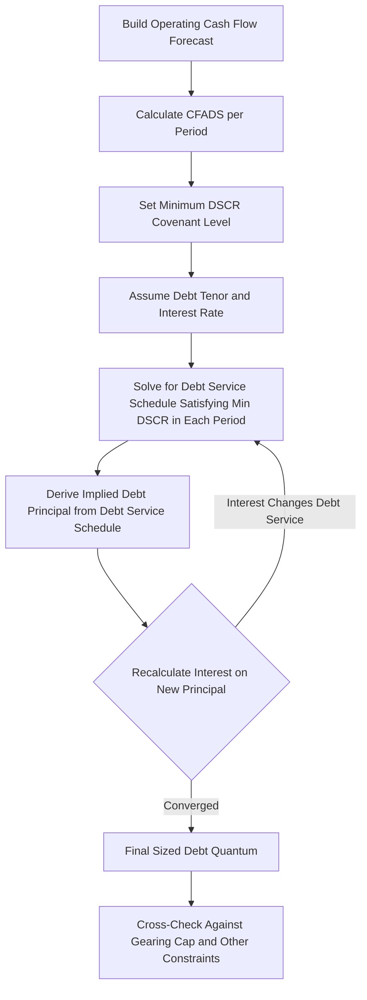

## Debt Sizing Based on Target Debt Service Coverage

### Definition and Core Concept

Debt sizing based on target Debt Service Coverage Ratio (DSCR) is the primary methodology used in project finance to determine the maximum quantum of senior debt a project's cash flows can support. Rather than starting with a target gearing ratio and working forward, this approach starts with the lender's minimum required DSCR covenant and solves backward to determine the largest debt principal whose resulting debt service the project's forecast cash flows can cover at that minimum ratio across the entire debt tenor.

$$\text{DSCR}_t = \frac{\text{CFADS}_t}{\text{Debt Service}_t} = \frac{\text{CFADS}_t}{\text{Principal}_t + \text{Interest}_t}$$

### Why DSCR-Based Sizing Is the Standard Approach

**Key Points**

- Lenders' primary concern is the probability of timely debt service payment, not the sponsor's desired leverage level, making DSCR the natural constraint to size against
- CFADS-based sizing directly ties debt capacity to the project's actual cash-generating ability, rather than to asset value or a target capital structure percentage, which is more appropriate for project finance's reliance on cash flow (rather than balance sheet strength) as the primary source of repayment
- The methodology is self-consistent: since debt service is what CFADS must cover, and debt service is itself a function of the debt quantum being sized, the calculation is inherently circular and typically solved iteratively within the financial model
- Produces a defensible, transparent basis for negotiation between sponsors (who want maximum debt capacity) and lenders (who want adequate coverage margin), since the outcome is derived mechanically from agreed cash flow assumptions and an agreed covenant level rather than negotiated as an arbitrary leverage target

### Defining CFADS (Cash Flow Available for Debt Service)

$$\text{CFADS}_t = \text{EBITDA}_t - \text{Cash Taxes}_t - \Delta\text{Working Capital}_t - \text{Maintenance Capex}_t + \text{Other Non-Operating Cash Adjustments}_t$$

**Key Points**

- CFADS represents cash generated by project operations that is available, before any debt service, to pay lenders — it excludes financing cash flows (interest, principal, distributions) by definition, since those are what CFADS is being measured against
- Maintenance capex (as opposed to growth/expansion capex) is typically deducted from CFADS because it is necessary to sustain the asset's revenue-generating capacity over the debt tenor, whereas growth capex is often excluded or treated separately depending on financing structure
- Working capital movements (changes in receivables, payables, inventory) are included because they represent real cash timing effects even though they do not appear in EBITDA
- Reserve account funding requirements (DSRA top-ups, major maintenance reserve funding) are sometimes treated as a deduction before arriving at the cash flow tested against DSCR, or tested via a separate reserve-adjusted coverage ratio, depending on the specific facility agreement's defined terms

### The Iterative Sizing Process

This circularity — debt service depends on principal, principal is solved from debt service, and interest (a component of debt service) depends on principal — is why debt sizing calculations in Excel-based financial models typically require iterative calculation to be enabled, or are resolved via a macro/goal-seek routine, or use a closed-form annuity solution where the repayment profile is a simple annuity rather than a fully sculpted schedule.

### Two Primary Sizing Methodologies

**Annuity-Style Sizing**

Where debt service is structured as a level (equal) payment annuity over the tenor, debt capacity can be solved with a closed-form formula using the minimum-CFADS period (or an average, depending on lender convention) divided by target DSCR:

$$\text{Debt}_{max} = \left(\frac{\text{CFADS}_{min\ period}}{\text{DSCR}_{min}}\right) \times \frac{1 - (1+r)^{-n}}{r}$$

Where $r$ is the periodic interest rate and $n$ is the number of remaining periods in the tenor.

**Sculpted (Cash Flow-Matched) Sizing**

Rather than a level annuity, debt service in each period is "sculpted" to exactly equal $\text{CFADS}_t / \text{DSCR}_{min}$ for every period, meaning debt service tracks the shape of the underlying cash flow. This is the predominant methodology in project finance because it maximizes debt capacity by fully utilizing available cash flow in every period rather than being constrained by the single weakest period under an annuity structure.

$$\text{Debt Service}_t = \frac{\text{CFADS}_t}{\text{DSCR}_{min}}$$

$$\text{Debt}_{max} = \sum_{t=1}^{n} \frac{\text{Debt Service}_t}{(1+r)^t}$$

The sculpted debt principal is effectively the present value of the sculpted debt service stream, discounted at the debt interest rate — since by construction, discounting the debt service schedule at the coupon rate returns exactly the principal that schedule was designed to amortize.

### Comparison: Annuity vs. Sculpted Sizing

| Dimension | Annuity-Style Sizing | Sculpted Sizing |
| --- | --- | --- |
| Debt service profile | Level (equal) payments each period | Varies period-to-period, tracking CFADS shape |
| Debt capacity | Constrained by the single weakest CFADS period | Maximizes debt capacity across the full cash flow profile |
| Complexity | Simple, closed-form calculation | Requires period-by-period modeling, often iterative |
| Typical use case | Simpler transactions, stable/flat cash flow profiles | Standard for most project finance transactions with variable cash flows (e.g., seasonal revenue, ramp-up periods, contracted step-ups) |
| DSCR profile over tenor | DSCR varies (higher in strong periods, at minimum in the weakest period) | DSCR held constant at the minimum covenant level throughout (by construction) |

### Selecting the Appropriate DSCR Level

**Key Points**

- The minimum DSCR covenant level is negotiated based on the perceived predictability and volatility of the project's cash flows, with more contracted, lower-risk revenue streams (e.g., availability-based PPPs) supporting lower minimum DSCR requirements than merchant or demand-risk exposed projects
- Rating agencies and lenders benchmark proposed DSCR levels against comparable transactions in the same sector and risk category
- A higher minimum DSCR reduces sustainable debt capacity (all else equal) but provides greater cushion against downside scenarios, reducing default probability
- Some transactions apply different DSCR covenants for different purposes: a lower "sizing" DSCR used at financial close to determine the debt quantum, a "lock-up" DSCR (typically equal to or slightly above the sizing level) that triggers distribution restrictions if breached during operations, and sometimes a "default" DSCR (typically below the sizing level) that triggers an event of default only if coverage falls further

### Illustrative Sector DSCR Benchmarks

[Unverified: exact figures vary by market, lender risk appetite, and prevailing conditions at any given time, and should be corroborated with current market data for any live transaction]

| Sector | Typical Minimum DSCR |
| --- | --- |
| Availability-based PPPs | 1.10x - 1.20x |
| Contracted power (PPA-backed) | 1.20x - 1.35x |
| Toll roads / demand risk | 1.30x - 1.50x |
| Merchant power | 1.40x - 1.75x |
| Mining/resources | 1.50x+ |

### Worked Example: Sculpted Debt Sizing

**Example**

A contracted solar power project has the following CFADS forecast (illustrative, in $ millions) over a 3-year sample window within a longer debt tenor, tested at a minimum DSCR of 1.25x, with a debt interest rate of 6.0%:

| Year | CFADS ($M) | Debt Service Capacity ($M) = CFADS / 1.25 |
| --- | --- | --- |
| 1 | 30.0 | 24.0 |
| 2 | 32.5 | 26.0 |
| 3 | 28.0 | 22.4 |

$$\text{Debt}_{max} = \frac{24.0}{1.06^1} + \frac{26.0}{1.06^2} + \frac{22.4}{1.06^3} \approx 22.64 + 23.14 + 18.81 \approx \$64.6\text{M}$$

**Output**

Over this 3-year sample window, the sculpted approach supports approximately $64.6 million of debt principal (a simplified partial-tenor illustration; a full sizing calculation would run this same logic across the entire debt tenor, typically 12-20+ years). Debt service in each year is set to exactly $24.0M, $26.0M, and $22.4M respectively, meaning DSCR is held at precisely 1.25x in every period by construction — no period has "excess" coverage beyond the covenant minimum, which is what allows sculpted sizing to maximize debt capacity relative to a level annuity constrained by the weakest year (Year 3). [Inference: this is a simplified illustrative window; actual transaction sizing requires modeling CFADS across the full tenor including construction period timing, ramp-up effects, and reserve funding requirements]

### Interaction with Other Sizing Constraints

DSCR-based sizing is typically cross-checked against other constraints, and the binding (lowest) constraint determines the final debt quantum:

- **Loan Life Coverage Ratio (LLCR)**: NPV of future CFADS over the remaining debt life, divided by outstanding debt — a forward-looking measure that can constrain sizing even where period-by-period DSCR is satisfied
- **Project Life Coverage Ratio (PLCR)**: Similar to LLCR but measured over the full remaining project/concession life rather than just the debt tenor, relevant where debt tenor is shorter than the underlying asset or concession life
- **Maximum gearing cap**: A stated ceiling (e.g., 80% of total project cost) that may bind before the DSCR-derived capacity is reached, particularly for lower-risk contracted projects where DSCR-based capacity might otherwise imply very high leverage
- **Absolute debt quantum limits**: Lender or syndicate capacity constraints unrelated to project cash flow

### Common Pitfalls

- Using average CFADS rather than the minimum or period-specific CFADS when sizing via the annuity method, which can overstate sustainable debt capacity in projects with uneven cash flow profiles
- Failing to account for ramp-up risk (lower or uncertain cash flows in early operating years) by applying the same DSCR test uniformly across the tenor without appropriate conservatism in early periods
- Overlooking the interaction between reserve account funding requirements and CFADS availability, which can effectively reduce the cash flow available for debt service beyond what a simplified CFADS definition captures
- Treating the sizing DSCR and the ongoing lock-up/default DSCR covenants as identical when they are often set at different levels with different consequences for breach

### Related Topics

- Loan Life Coverage Ratio (LLCR) and Project Life Coverage Ratio (PLCR)
- Sculpted vs. annuity repayment profile structuring
- Optimal gearing ratio determination
- Cash flow waterfall and distribution lock-up mechanics
- Sensitivity and scenario analysis in debt sizing
- Debt Service Reserve Account (DSRA) sizing and mechanics
- Circular reference resolution in financial models