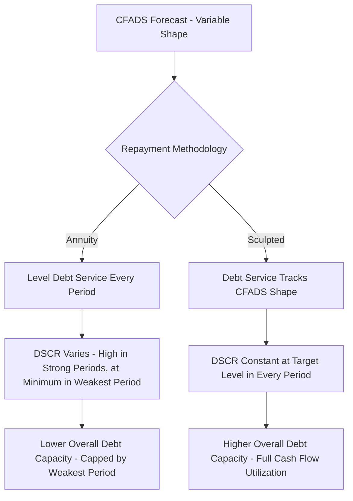

## Debt Sculpting Versus Annuity-Style Repayment

### Definition and Core Distinction

Debt sculpting and annuity-style repayment are two contrasting approaches to structuring the principal and interest repayment schedule of project finance senior debt. **Annuity-style repayment** sets a level (equal) total debt service payment in every period across the tenor, with the principal/interest split shifting over time. **Debt sculpting** instead varies the total debt service payment period-by-period so that it precisely tracks the shape of the project's projected cash flow available for debt service (CFADS), holding the debt service coverage ratio (DSCR) constant at a target level throughout the tenor.

### Annuity-Style Repayment Mechanics

**Key Points**

- Total debt service (principal + interest) is calculated as a fixed, level payment amount for every period of the tenor, computed via the standard annuity formula
- Within each level payment, the interest component declines over time (as outstanding principal amortizes) while the principal component correspondingly increases
- Debt capacity under this method is constrained by the single weakest CFADS period in the forecast, since the level payment must be affordable even in the lowest cash flow period while still meeting the minimum DSCR covenant
- Simpler to calculate (closed-form formula, no circularity beyond the debt sizing calculation itself) and easier for both sponsors and lenders to communicate and monitor

$$\text{Level Debt Service} = \text{Principal} \times \frac{r(1+r)^n}{(1+r)^n - 1}$$

Where $r$ is the periodic interest rate and $n$ is the number of repayment periods.

### Debt Sculpting Mechanics

**Key Points**

- Debt service in each period is set equal to CFADS for that period divided by the target/minimum DSCR, meaning debt service rises and falls in step with the underlying cash flow forecast
- By construction, DSCR is held constant at exactly the target level in every period — there is no "excess" coverage in strong periods and no shortfall in weak periods, since the repayment schedule is engineered around the cash flow shape itself
- Maximizes achievable debt capacity relative to an annuity structure, because it fully utilizes cash flow available in strong periods rather than being capped by the weakest period
- Requires period-by-period cash flow modeling and is typically solved iteratively (or via a closed-form sum-of-discounted-cash-flows approach), since sculpted debt service directly determines the principal repaid, which affects outstanding balance and future interest, which feeds back into the debt service calculation

$$\text{Debt Service}_t = \frac{\text{CFADS}_t}{\text{DSCR}_{target}}$$

$$\text{Principal}_{max} = \sum_{t=1}^{n} \frac{\text{Debt Service}_t}{(1+r)^t}$$

### Visual Comparison of Repayment Profiles

### DSCR Profile Illustration (svg_diagram)

<svg xmlns="http://www.w3.org/2000/svg" viewBox="0 0 720 380">
\<style\>
.axis{stroke:#333;stroke-width:2}
.gridline{stroke:#ddd;stroke-width:1}
.annuity{stroke:#c0392b;stroke-width:3;fill:none}
.sculpted{stroke:#2471a3;stroke-width:3;fill:none;stroke-dasharray:6,3}
.label{font-family:Arial,sans-serif;font-size:13px;fill:#222}
.title{font-family:Arial,sans-serif;font-size:16px;fill:#111;font-weight:bold}
\</style\>
<text x="360" y="24" text-anchor="middle" class="title">DSCR Profile: Annuity vs Sculpted (svg_diagram)</text>
<line x1="70" y1="320" x2="670" y2="320" class="axis" />
<line x1="70" y1="60" x2="70" y2="320" class="axis" />
<text x="30" y="325" class="label">1.0x</text>
<text x="30" y="205" class="label">1.4x</text>
<text x="30" y="90" class="label">1.8x</text>
<line x1="70" y1="205" x2="670" y2="205" class="gridline" />
<line x1="70" y1="90" x2="670" y2="90" class="gridline" />
<text x="360" y="355" text-anchor="middle" class="label">Year of Debt Tenor</text>
<polyline class="annuity" points="100,90 180,140 260,200 340,150 420,80 500,190 580,205 640,200" />
<polyline class="sculpted" points="100,205 180,205 260,205 340,205 420,205 500,205 580,205 640,205" />
<circle cx="620" cy="90" r="5" fill="#c0392b" />
<text x="500" y="70" class="label" fill="#c0392b">Annuity DSCR (variable, min = covenant floor)</text>
<circle cx="620" cy="230" r="5" fill="#2471a3" />
<text x="480" y="245" class="label" fill="#2471a3">Sculpted DSCR (flat at target, e.g. 1.30x)</text>
</svg>

### Quantitative Comparison Example

**Example**

Consider a 3-year CFADS forecast (illustrative, $ millions) with a target/minimum DSCR of 1.30x and an interest rate of 6.5%:

| Year | CFADS ($M) |
| --- | --- |
| 1 | 40 |
| 2 | 55 |
| 3 | 35 |

**Sculpted approach**: Debt service each year = CFADS / 1.30:

| Year | Debt Service ($M) | DSCR |
| --- | --- | --- |
| 1 | 30.77 | 1.30x |
| 2 | 42.31 | 1.30x |
| 3 | 26.92 | 1.30x |

$$\text{Sculpted Principal} = \frac{30.77}{1.065} + \frac{42.31}{1.065^2} + \frac{26.92}{1.065^3} \approx 28.89 + 37.31 + 22.31 \approx \$88.5\text{M}$$

**Annuity approach**: The weakest year (Year 3, CFADS $35M) constrains the level payment to a maximum of $35M / 1.30 ≈ $26.92M per year across all three years:

$$\text{Annuity Principal} = 26.92 \times \frac{1 - 1.065^{-3}}{0.065} \approx 26.92 \times 2.646 \approx \$71.2\text{M}$$

**Output**

In this illustrative window, sculpting supports approximately $88.5 million of debt versus approximately $71.2 million under a strict annuity structure — roughly 24% more debt capacity — because sculpting fully utilizes the stronger Year 2 cash flow rather than being capped by Year 3's weaker CFADS. Under the annuity structure, DSCR would actually be well above 1.30x in Years 1 and 2 (since the level payment is set by the weakest year) and exactly 1.30x only in Year 3, leaving unused debt capacity in the stronger years. [Inference: this is a simplified 3-year illustrative window; real transactions size debt across the full tenor, typically 12-20+ years, and results will vary based on the specific cash flow profile]

### Why Sculpting Is the Predominant Market Practice

**Key Points**

- Most project finance cash flows are not flat — construction ramp-up, contracted tariff step-downs, seasonal demand patterns, scheduled major maintenance outages, and PPA/offtake contract term structures all create period-to-period CFADS variability that sculpting can accommodate more efficiently than a level annuity
- Sponsors prefer sculpting because it maximizes debt capacity (and correspondingly minimizes required equity) for a given DSCR covenant and cash flow profile
- Lenders generally accept sculpting because the mechanism, by construction, holds coverage at exactly the agreed minimum in every period — the risk profile is deliberately and transparently designed around the covenant level, rather than the DSCR varying above and below an implied average
- Sculpting requires closer cash flow forecasting discipline, since the entire repayment schedule is directly derived from the CFADS projections; forecasting errors have a more direct impact on actual achieved coverage than under an annuity structure with built-in early-year cushion

### Hybrid and Variant Structures

- **Mini-perm with sculpted profile**: A sculpted repayment schedule sized against near-term cash flow visibility, with a bullet or balloon repayment at the mini-perm maturity date reflecting the expectation of refinancing rather than full amortization
- **Sculpted with a floor/cap**: Some structures apply a sculpted schedule but impose a minimum principal repayment floor (to ensure some deleveraging occurs even in weak periods) or a cap (to limit repayment acceleration in unusually strong periods, preserving cash for reserve funding or growth capex)
- **Target vs. minimum DSCR sculpting**: Some transactions sculpt to a "target" DSCR set modestly above the absolute minimum covenant level, building a deliberate cushion into the base case repayment schedule to absorb minor forecast variances without breaching the minimum covenant

### Interaction with Interest Rate Basis

- **Fixed-rate debt (bonds, swapped term loans)**: Sculpting is more straightforform to calculate since the discount/interest rate is known and stable, avoiding recalculation of the schedule as rates move
- **Floating-rate debt**: Sculpted schedules calculated at financial close using a base-case forward curve assumption may require periodic re-sculpting or cash sweep adjustments if actual floating rates diverge materially from the base case, since actual debt service will differ from the originally modeled sculpted amounts
- **Interest rate hedging**: Projects with sculpted floating-rate debt frequently hedge via swaps to fix the effective rate, preserving the integrity of the originally sculpted schedule's DSCR profile over the tenor

### Common Pitfalls

- Applying an annuity structure to a project with genuinely volatile or seasonal cash flows, unnecessarily constraining debt capacity relative to what sculpting could support
- Sculpting to the base case without adequate downside stress testing, since a sculpted schedule with zero built-in cushion (DSCR held exactly at the covenant minimum) has less headroom to absorb underperformance than an annuity structure's early-year excess coverage
- Failing to re-sculpt or adjust the schedule following a cash flow forecast revision (e.g., after a change in offtake contract terms), leaving a stale repayment profile misaligned with updated CFADS projections
- Overlooking the operational complexity sculpting introduces for floating-rate debt without corresponding interest rate hedges, creating actual DSCR outcomes that diverge from the modeled sculpted profile

### Related Topics

- Debt sizing based on target debt service coverage
- Loan Life Coverage Ratio (LLCR) and Project Life Coverage Ratio (PLCR)
- Cash flow waterfall and distribution lock-up mechanics
- Interest rate hedging strategies for floating-rate project debt
- Circular reference resolution in financial models
- Mini-perm and refinancing structures
- Sensitivity and scenario analysis in debt sizing