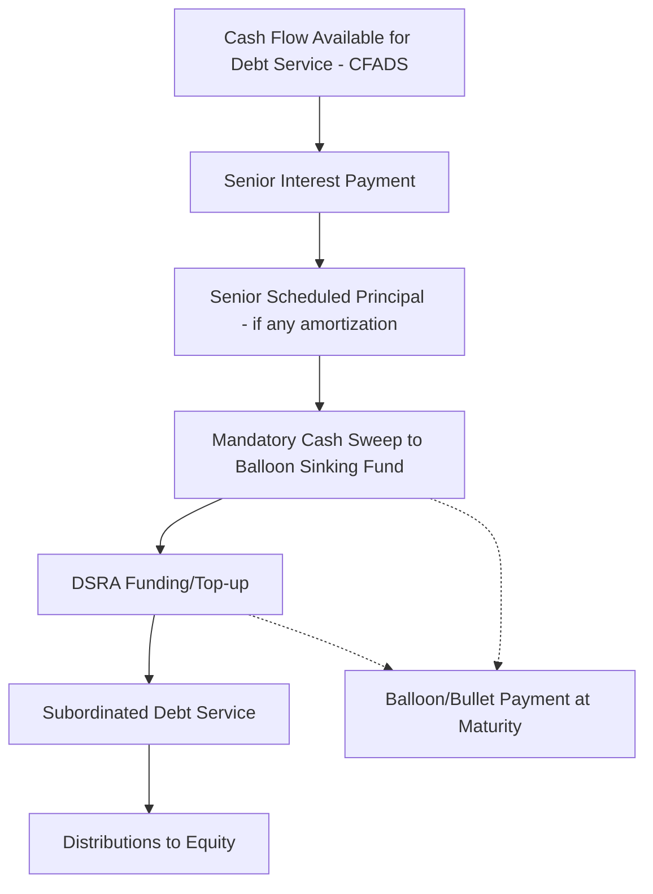

## Bullet and Balloon Repayment Structures

### Definition and Core Concept

A **bullet repayment** structure repays the entire principal balance in a single payment at maturity, with only interest serviced during the term. A **balloon repayment** structure amortizes principal partially over the term (via a schedule shorter in effect than the loan's stated maturity, or via reduced amortization), leaving a substantial residual principal balance ("the balloon") due as a lump sum at maturity or at a refinancing/rollover point.

The distinction is one of degree: a bullet is the extreme case of a balloon where scheduled amortization is zero. Both structures front-load debt service relief and back-load principal risk, contrasted with a fully amortizing structure that retires the entire principal in level or sculpted installments across the term.

### Why These Structures Are Used in Project Finance

**Key Points**

- Projects with long useful lives but shorter financeable debt tenors (regulatory, market, or lender-driven) use balloon structures to align annual debt service with near-term cash flow capacity while deferring full repayment.
- Bullet structures are common in bridge financing, construction-to-permanent loan interim phases, bond issuances, and situations where a clear refinancing or exit event (asset sale, IPO, permanent takeout financing) is anticipated at or before maturity.
- Sponsors use balloon/bullet structures to maximize distributable cash flow (and hence equity IRR) during the debt term, since annual debt service is lower than under full amortization.
- Lenders price in the residual/refinancing risk via higher margins, covenants, reserve requirements, or credit enhancement.

### Bullet Structure Mechanics

Under a pure bullet structure, periodic payments consist solely of interest:

$$P_t = C \times r$$

where $P_t$ is the payment in period $t$, $C$ is the constant outstanding principal (unchanged until maturity), and $r$ is the periodic interest rate. At maturity $T$, the borrower pays:

$$P_T = C \times r + C$$

Because principal never amortizes, the lender's exposure at any point equals the full original principal, and refinancing risk is concentrated entirely at the single maturity date.

### Balloon Structure Mechanics

A balloon structure typically sets payments as if the loan amortized over a longer notional period (the "amortization period," e.g., 25 years) while the loan legally matures earlier (the "loan term," e.g., 7 or 10 years). The periodic payment is calculated using the standard amortizing annuity formula based on the notional amortization period:

$$A = C_0 \times \frac{r(1+r)^n}{(1+r)^n - 1}$$

where $A$ is the level payment, $C_0$ is the initial principal, $r$ is the periodic rate, and $n$ is the number of periods in the notional amortization period. The loan term $m$ (with $m < n$) determines when the balloon falls due. The outstanding balance at the balloon date is the remaining present value of the unpaid amortization schedule:

$$B_m = A \times \frac{1 - (1+r)^{-(n-m)}}{r}$$

$B_m$ is the balloon payment due at period $m$, representing the present value (at rate $r$) of the remaining $(n-m)$ payments that would have been made under full amortization.

### Worked Example

**Example**

Assume a project loan with:

- Initial principal $C_0 = \$100{,}000{,}000$
- Annual interest rate $r = 6\%$
- Notional amortization period $n = 20$ years
- Actual loan term (balloon date) $m = 7$ years

Annual level payment:

$$A = 100{,}000{,}000 \times \frac{0.06(1.06)^{20}}{(1.06)^{20}-1} \approx \$8{,}718{,}186$$

Outstanding balance at year 7 (the balloon amount):

$$B_7 = 8{,}718{,}186 \times \frac{1-(1.06)^{-13}}{0.06} \approx \$79{,}430{,}000$$

The borrower pays approximately $8.72M annually for years 1–6, then approximately $88.15M in year 7 (the year-7 scheduled payment plus the balloon), compared to full amortization over 7 years, which would require roughly $17.9M annually with no residual balance.

### Comparison: Bullet vs. Balloon vs. Full Amortization

| Feature | Bullet | Balloon | Full Amortization |
| --- | --- | --- | --- |
| Principal repaid during term | None | Partial | 100% |
| Periodic payment size | Lowest (interest-only) | Moderate | Highest |
| Residual/refinancing risk | Maximum (100% of principal) | Moderate (residual %) | None |
| Typical use case | Bridge loans, bonds, construction interim | Real estate, infrastructure with exit assumption | Conservative project finance, utility-scale infra |
| Lender risk profile | Highest tail risk | Moderate tail risk | Lowest tail risk |

### Refinancing Risk and Mitigants

The balloon/bullet payment creates **refinancing risk** (also called rollover or maturity risk): the risk that the borrower cannot refinance, sell the asset, or otherwise generate the lump sum at maturity, due to adverse credit markets, asset value decline, or covenant breach at that time. Common mitigants modeled in project finance structures include:

- **Debt Service Reserve Accounts (DSRA)** sized to cover upcoming balloon-related shortfalls or interest periods.
- **Cash sweep mechanisms** that divert excess cash flow to a sinking fund or mandatory prepayment account ahead of the balloon date, partially de-risking the residual.
- **Refinancing covenants** requiring the borrower to demonstrate a viable refinancing plan or minimum debt service coverage ratio (DSCR) test before the balloon date.
- **Extension options** embedded in the loan agreement allowing the borrower to extend maturity under pre-agreed terms if refinancing conditions are unfavorable.
- **Balloon guarantees or letters of credit** from a sponsor or third party covering some or all of the residual amount.

### Debt Sizing Implications

In project finance debt sizing, a target leverage or minimum DSCR determines the sized debt quantum; the choice of bullet/balloon versus full amortization changes which constraint binds:

- Under full amortization, debt sizing is typically DSCR-constrained across the operating period; the annual payment is solved so that projected cash flow available for debt service (CFADS) divided by debt service equals the minimum required DSCR (often 1.20x–1.50x depending on sector).
- Under a bullet/balloon structure, the DSCR test during the interest-only or reduced-amortization period is easier to satisfy (lower denominator), but a separate **balloon coverage** or **refinancing DSCR** test is often applied, projecting whether post-maturity cash flows can service a hypothetical refinanced amortizing loan sized off the balloon amount.
- Loan-to-value (LTV) constraints at the balloon date become a binding sizing consideration: lenders often cap the balloon amount as a percentage of a projected exit or refinancing valuation (e.g., balloon ≤ 65% of projected asset value at maturity).

### Cash Flow Waterfall Treatment

In a typical project finance cash flow waterfall, bullet and balloon payments are modeled as follows:

### Modeling Considerations in a Project Finance Model

**Key Points**

- Model the balloon amount as a formula-driven output (remaining PV of notional amortization schedule) rather than a hardcoded input, so sensitivity and scenario analysis flow through correctly.
- Explicitly separate the "amortization period" assumption from the "loan term/tenor" assumption as distinct model inputs; conflating them is a common structuring error.
- Include a refinancing sub-model or "mini-DSCR" test at the balloon date, using assumed refinance terms (tenor, rate, target DSCR) to test whether the balloon is serviceable — this is essential for realistic risk assessment and is standard practice in real estate and infrastructure LBO/acquisition models.
- Sensitize the balloon amount and refinancing feasibility to interest rate, exit cap rate/valuation, and CFADS downside scenarios, since these directly drive both the balloon size and the borrower's ability to clear it. [Inference: sensitivity ranges and scenario weighting are deal- and lender-specific and vary by market convention.]
- For bond-financed structures (bullet at legal maturity), incorporate a sinking fund schedule if required by the indenture, distinct from the stated bullet redemption at final maturity.

### Sinking Fund Variant

Some bullet bond structures require periodic contributions to a sinking fund that accumulates toward the bullet redemption, reducing effective refinancing risk without formally amortizing the loan balance. The required periodic sinking fund contribution to reach the bullet amount $C$ by maturity, given a fund earning rate $i$, is:

$$SF = C \times \frac{i}{(1+i)^N - 1}$$

where $N$ is the number of contribution periods. This differs from balloon amortization because the principal balance recognized by the lender (for interest calculation purposes) does not decline — only a segregated reserve builds up.

### Risk Allocation and Covenant Structuring

- Lenders often require a **minimum DSCR test** and a separate **balloon/tail test** — projecting cash flows beyond the debt's legal maturity (the "tail period") under conservative assumptions to confirm sufficient residual asset life/cash generation exists to support refinancing.
- **Loan Life Coverage Ratio (LLCR)** and **Project Life Coverage Ratio (PLCR)** are typically used alongside period DSCR specifically because bullet/balloon structures make single-period DSCR an incomplete risk measure:

$$LLCR = \frac{NPV(\text{CFADS over remaining loan life})}{\text{Outstanding Debt Balance}}$$

- Rating agencies and lenders commonly require LLCR/PLCR above a threshold (e.g., 1.4x–1.8x) even when annual DSCR looks adequate, precisely to capture the concentrated repayment risk of a balloon/bullet profile.

**Next Steps**

- Debt Service Coverage Ratio (DSCR) Calculation and Covenant Design
- Loan Life Coverage Ratio (LLCR) and Project Life Coverage Ratio (PLCR)
- Cash Flow Waterfall Design and Priority of Payments
- Debt Service Reserve Account (DSRA) Sizing Methodologies
- Refinancing Risk Modeling and Mini-Perm Structures
- Sculpted vs. Level Amortization Profiles
- Cash Sweep Mechanisms and Excess Cash Flow Recapture
- Sensitivity and Scenario Analysis on Exit/Refinancing Assumptions
- Mezzanine and Subordinated Debt Tranching Around Balloon Risk