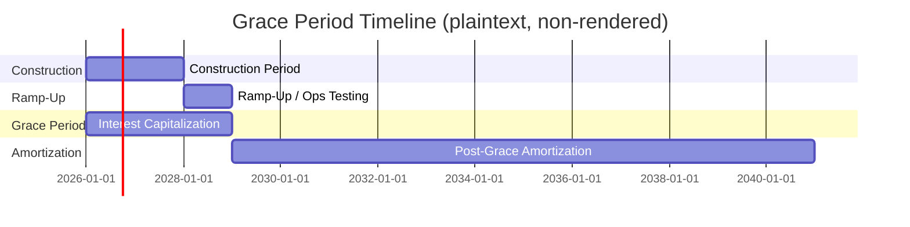

## Grace Periods and Repayment Holidays

### Definition and Core Concept

A **grace period** (also called a **moratorium period** or **repayment holiday**) is a defined interval at the start of a loan's life during which the borrower is relieved of some or all scheduled debt service obligations. In project finance, grace periods are structured around two distinct components:

- **Principal grace period**: the borrower pays interest only; no principal amortization occurs.
- **Full grace period (payment holiday)**: neither principal nor interest is paid in cash; unpaid interest is either capitalized (added to principal, becoming interest-bearing itself) or accrued separately for later payment.

Grace periods are distinct from balloon/bullet structures in intent: balloons defer principal to align with an exit or refinancing event, whereas grace periods defer debt service to align with the **construction and ramp-up phase** of the underlying asset, before it generates stabilized cash flow.

### Rationale in Project Finance

**Key Points**

- Greenfield infrastructure, power, and mining projects typically generate no or minimal cash flow during construction; a grace period aligns debt service obligations with the commercial operations date (COD).
- Grace periods reduce the risk of technical default during a phase when the project has no revenue-generating capacity, avoiding the need for sponsors to fund debt service entirely from equity or standby facilities.
- The grace period is normally set to span, at minimum, the construction period plus a ramp-up buffer (covering initial operational underperformance, testing, and stabilization of cash flows).
- Lenders price the grace period into the overall credit structure via higher all-in margins, commitment fees on undrawn amounts, and capitalized interest, since the effective loan life and lender exposure period are extended.

### Structural Variants

| Variant | Interest Treatment | Principal Treatment | Typical Use Case |
| --- | --- | --- | --- |
| Interest-only grace period | Paid in cash | Deferred | Standard construction-phase project finance |
| Capitalized interest (PIK) grace period | Accrued and added to principal | Deferred | Deep greenfield projects, mining, early-stage renewables |
| Full moratorium | Accrued, paid later in lump sum or amortized | Deferred | Severe near-term cash constraint, sponsor-guaranteed structures |
| Step-up grace period | Partial interest paid, remainder capitalized | Deferred | Transitional ramp-up phase financing |

### Mathematical Treatment: Capitalized Interest

When interest is capitalized during the grace period, the outstanding balance grows each period rather than remaining static. For a grace period of $g$ periods with periodic rate $r$, the ending balance after capitalization is:

$$C_g = C_0 \times (1+r)^g$$

where $C_0$ is the principal drawn at the start of the grace period and $C_g$ is the balance carried into the amortization phase. If drawdowns occur progressively during construction (as is typical, rather than a single upfront disbursement), the capitalized balance is calculated as the future value of a drawdown schedule:

$$C_g = \sum_{i=1}^{k} D_i \times (1+r)^{g - t_i}$$

where $D_i$ is the drawdown amount at time $t_i$, and $g - t_i$ is the number of periods that drawdown accrues interest before the grace period ends.

### Post-Grace Amortization Sizing

Once the grace period ends, the capitalized balance $C_g$ becomes the new principal base for the amortization schedule. The periodic payment over the remaining amortization period $n$ periods is:

$$A = C_g \times \frac{r(1+r)^n}{(1+r)^n - 1}$$

This produces materially higher post-grace payments than if the original principal $C_0$ had amortized from day one, since the borrower is now repaying a larger, interest-inflated balance over a shorter remaining term.

### Worked Example

**Example**

Assume a power project with:

- Total drawn principal at COD $C_0 = \$200{,}000{,}000$ (assume fully drawn at start of grace period for simplicity)
- Annual interest rate $r = 7\%$
- Grace period $g = 3$ years (construction + ramp-up)
- Post-grace amortization period $n = 12$ years

Capitalized balance at end of grace period:

$$C_3 = 200{,}000{,}000 \times (1.07)^3 \approx \$245{,}009{,}000$$

Annual amortizing payment over the following 12 years:

$$A = 245{,}009{,}000 \times \frac{0.07(1.07)^{12}}{(1.07)^{12}-1} \approx \$31{,}035{,}000$$

Compare this to a hypothetical interest-only (non-capitalizing) grace period on the same $200M: annual interest-only payments of $14M during the grace period, followed by amortization of the original $200M over 12 years at approximately $25.34M/year. Capitalization defers cash outflow entirely but increases total interest cost and post-grace debt service by roughly 22% in this example. [Inference: the exact percentage impact depends on the specific rate, tenor, and drawdown profile assumed.]

### Debt Sizing Implications

**Key Points**

- The grace period length is a primary lever in the debt sizing exercise: extending it increases total capitalized interest (raising the effective debt quantum to be repaid) but reduces near-term liquidity risk.
- DSCR covenants are typically **not tested** (or tested against a reduced threshold) during the grace period, since CFADS is minimal or zero; DSCR testing conventionally begins at COD or the first full operating period after ramp-up.
- Sponsors and lenders negotiate the grace period length against construction schedule risk: if construction delays push COD past the grace period end date, the project faces a debt service obligation before generating revenue — this is a key structuring risk mitigated by construction contingency buffers or grace period extension triggers tied to force majeure/delay events.
- Sculpted repayment profiles are frequently combined with grace periods: the post-grace amortization schedule is often sculpted (uneven principal repayments) to match a ramp-up production/revenue curve rather than using level payments.

### Cash Flow Timeline

### Modeling Considerations

**Key Points**

- Model the grace period as a distinct phase flag (e.g., a period-by-period switch) that toggles whether principal amortization and/or cash interest payment are active, rather than hardcoding a separate schedule block — this preserves flexibility for sensitivity testing on grace period length.
- Track capitalized interest as a separate line item from cash interest expense; capitalized interest affects the balance sheet (added to principal/asset cost in some accounting treatments) but does not appear in the cash flow statement as a cash outflow during the grace period.
- Ensure the DSRA (Debt Service Reserve Account) funding requirement is explicitly modeled to begin funding either during the grace period (from available construction financing) or immediately upon its expiry, since the first post-grace payment is typically the largest jump in required liquidity.
- Where interest during construction (IDC) is capitalized for tax or accounting purposes, confirm whether the model's grace period treatment aligns with the applicable accounting standard's capitalization rules (e.g., under IFRS, borrowing costs directly attributable to a qualifying asset are capitalized) — treatment can differ from the financing structure's contractual definition of "grace period." [Unverified: specific tax/accounting capitalization eligibility depends on jurisdiction and applicable standard, and should be confirmed against current guidance rather than assumed uniform across deals.]

### Risk Allocation Considerations

- Extending the grace period shifts refinancing/repayment risk later in the debt term without eliminating it — it is a deferral mechanism, not a risk removal mechanism.
- Lenders often require a **longstop date** (a hard outer limit on the grace period, independent of actual construction progress) beyond which default or restructuring is triggered, protecting against open-ended construction delay risk.
- Interest rate risk during a capitalizing grace period is amplified since capitalized interest compounds — floating-rate exposure during this phase is frequently hedged via forward-starting interest rate swaps or caps sized to the projected drawdown schedule.

**Next Steps**

- Interest During Construction (IDC) and Capitalization Accounting Treatment
- Sculpted Amortization Profiles for Ramp-Up Cash Flows
- Construction Risk Allocation and Longstop Date Structuring
- Debt Service Reserve Account (DSRA) Funding Mechanics
- Forward-Starting Interest Rate Swaps and Hedging During Construction
- Drawdown Schedules and Construction Facility Mechanics
- Bullet and Balloon Repayment Structures
- Debt Service Coverage Ratio (DSCR) Testing Commencement and Covenant Holidays