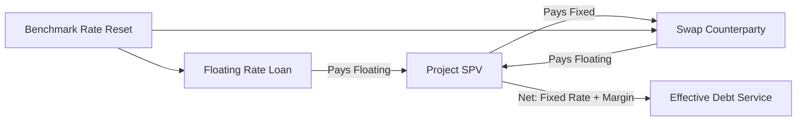

## Fixed, Floating, and Hedged Interest Rate Structures

### Overview of Interest Rate Structure Choice

Project finance debt is structured with one of three interest rate bases: **fixed rate**, **floating (variable) rate**, or a **hedged floating rate** (floating debt combined with a derivative overlay to synthetically fix or cap the rate). The choice determines how interest rate risk — a project's exposure to changes in benchmark rates over its debt tenor — is allocated between borrower, lender, and hedge counterparty, and it materially affects DSCR stability, debt sizing, and covenant design.

### Fixed Rate Structures

**Key Points**

- Interest is set at a constant rate for the life of the loan (or a defined period), fully eliminating rate variability from the cash flow model.
- Common in bond financings (fixed-coupon project bonds), private placements, and export credit agency (ECA)-supported loans, where investors demand rate certainty.
- Produces a fully predictable debt service schedule, simplifying DSCR forecasting and enabling tighter covenant headroom since one source of cash flow volatility is removed.
- Typically priced at a premium to the equivalent floating rate (reflecting the lender's/investor's own funding cost curve and term premium), meaning fixed-rate debt is usually more expensive in absolute terms during "normal" or upward-sloping yield curve environments.

The fixed periodic payment mechanics follow the standard amortizing loan formula:

$$A = C_0 \times \frac{r_f(1+r_f)^n}{(1+r_f)^n - 1}$$

where $r_f$ is the fixed periodic rate, constant for all $n$ periods.

### Floating Rate Structures

**Key Points**

- Interest is set as a spread over a reference benchmark rate, reset periodically (e.g., quarterly or semi-annually): $r_t = \text{Benchmark}_t + \text{Margin}$.
- Historically benchmarked to LIBOR; post-LIBOR transition, benchmarks are now overnight risk-free rates (RFRs) such as SOFR (US), SONIA (UK), €STR (Eurozone), or TONA (Japan), typically compounded in arrears over the interest period.
- Floating rate debt is common in bank-led syndicated project finance loans, where lenders match their own floating-rate funding cost, avoiding the basis risk banks would otherwise bear under fixed-rate lending.
- Exposes the project to interest rate risk directly: rising benchmark rates increase debt service without a corresponding increase in project revenue (unless revenue is contractually indexed to rates, which is rare), directly compressing DSCR.

Periodic interest expense under a floating structure is recalculated each reset period:

$$I_t = C_{t-1} \times (\text{Benchmark}_t + m)$$

where $C_{t-1}$ is the outstanding balance at the start of period $t$, $\text{Benchmark}_t$ is the observed/compounded reference rate for that period, and $m$ is the contractual margin.

### Hedged Floating Rate Structures

To combine floating-rate funding (often cheaper and more readily available from bank lenders) with fixed-rate cash flow certainty, project finance transactions frequently pair floating-rate debt with an interest rate derivative. The three principal hedge instruments are:

| Instrument | Mechanism | Effect on Cash Flow | Typical Use |
| --- | --- | --- | --- |
| Interest Rate Swap | Project pays fixed to swap counterparty, receives floating (offsetting the loan's floating payments) | Synthetically fixes the rate | Most common in project finance; usually mandated by lenders for a minimum % of debt |
| Interest Rate Cap | Project pays an upfront/periodic premium for a maximum rate ceiling | Caps upside rate risk, retains benefit if rates fall | Used when full fixing is undesired or uneconomic |
| Interest Rate Collar | Combination of a purchased cap and a written floor | Caps upside, sacrifices some downside benefit, reduces net premium cost | Used to reduce hedging cost versus a standalone cap |

### Interest Rate Swap Mechanics

Under a plain-vanilla pay-fixed/receive-floating swap, the project's net interest cost becomes:

$$I_{net,t} = C_{t-1} \times r_{swap} + C_{t-1} \times (\text{Benchmark}_t + m) - C_{t-1} \times \text{Benchmark}_t = C_{t-1} \times (r_{swap} + m)$$

The floating benchmark legs cancel (assuming the swap notional and reset dates match the loan exactly), leaving the project paying a synthetic fixed rate of $r_{swap} + m$. In practice, exact matching is rarely perfect — see "Basis Risk" below.

**Swap notional profile**: because project finance debt typically amortizes, swap notional is structured to **amortize in line with the projected loan balance** ("amortizing swap"), rather than using a bullet/constant notional swap. Mismatches between actual debt drawdown/amortization and swap notional create **over-hedging** (notional exceeds outstanding debt) or **under-hedging** (notional is less than outstanding debt) exposure.

### Interest Rate Cap Mechanics

A cap pays the project the difference between the floating benchmark and the strike rate whenever the benchmark exceeds the strike, for each reset period:

$$\text{Cap Payoff}_t = C_{t-1} \times \max(0, \text{Benchmark}_t - K)$$

where $K$ is the strike (cap) rate. The project pays an upfront premium (or periodic premium) for this protection, calculated using an interest rate option pricing model (commonly a Black-76 variant applied to a strip of caplets). [Inference: exact premium levels depend on prevailing volatility surfaces and market conditions at execution and cannot be generalized from formula alone.]

### Worked Example: Swap vs. Unhedged Floating

**Example**

Assume:

- Outstanding balance $C = \$150{,}000{,}000$ (single period for illustration)
- Floating benchmark (SOFR) $= 4.50\%$
- Margin $m = 2.00\%$
- Fixed swap rate $r_{swap} = 4.20\%$

Unhedged floating interest cost:

$$I = 150{,}000{,}000 \times (0.045 + 0.02) = \$9{,}750{,}000$$

Hedged (swapped) interest cost:

$$I_{net} = 150{,}000{,}000 \times (0.042 + 0.02) = \$9{,}300{,}000$$

In this scenario the swap produces lower cost because the fixed swap rate happened to sit below the current floating rate; if SOFR later falls below 4.20%, the swapped structure becomes more expensive than remaining unhedged would have been. The swap removes rate volatility, not rate cost — it does not guarantee the lower-cost outcome in all rate environments. [Inference: whether a swap is "cheaper" over the full tenor depends entirely on the realized path of the benchmark rate versus the fixed swap rate, which is unknowable at execution.]

### Debt Sizing Implications

**Key Points**

- Unhedged floating-rate debt introduces interest rate risk into the DSCR forecast; lenders typically size floating-rate debt using a **stressed interest rate** (e.g., forward curve plus a stress margin, or a regulatory-defined shock) rather than the spot rate, to ensure DSCR resilience under rate increases.
- Fully hedged (swapped) debt allows sizing off the swap-implied fixed rate directly, since the rate is contractually certain for the hedged portion and tenor.
- Lenders commonly mandate a **minimum hedging percentage** (e.g., 75–100% of floating-rate debt) and a **minimum hedging tenor** (matching some or all of the loan term) as a condition precedent to drawdown, explicitly to protect the DSCR sizing basis.
- Where hedging is partial, the model must size debt service using a blended rate: the hedged portion's fixed rate plus the unhedged portion's stressed floating rate.

### Basis Risk and Hedge Ineffectiveness

**Key Points**

- **Basis risk** arises when the swap's floating leg does not perfectly match the loan's floating leg — e.g., different reset dates, different reference rate compounding conventions (compounded-in-arrears vs. compounded-in-advance SOFR), or different day-count conventions.
- **Notional mismatch risk** arises when actual drawdowns differ from the forecast drawdown schedule the swap notional was built on (common during construction-phase financings with uncertain drawdown timing), leaving the project temporarily over- or under-hedged.
- **Break costs**: if the underlying loan is prepaid (e.g., following a refinancing, insurance proceeds, or early termination), the swap is typically unwound simultaneously, and a **swap breakage cost** (or gain) is realized based on the mark-to-market value of the swap at that time — this can be a materially large cash outflow that must be modeled as a contingent liability.
- Hedge accounting treatment (e.g., cash flow hedge designation under IFRS 9/ASC 815) may require the project to demonstrate hedge effectiveness; ineffective portions of the hedge relationship are recognized through profit and loss rather than other comprehensive income. [Unverified: applicable accounting standard and effectiveness testing methodology should be confirmed against current guidance for the specific jurisdiction/reporting framework, as thresholds and permitted methods have evolved over time.]

### Reference Rate Transition Considerations

Following the discontinuation of LIBOR, project finance loan and swap documentation now generally references overnight RFRs compounded over the interest period, with fallback language addressing benchmark discontinuation events. Where a project's loan and its hedging swap reference different RFR conventions or fallback triggers, this itself becomes a basis risk source that must be explicitly reconciled in loan and ISDA swap documentation. [Unverified: precise fallback mechanics and conventions vary by currency, jurisdiction, and documentation vintage (e.g., ISDA IBOR Fallbacks Protocol provisions); current deal documentation should be checked directly rather than assumed standardized.]

### Interest Rate Risk Diagram

### Modeling Considerations

**Key Points**

- Model the swap as a separate schedule linked to, but distinct from, the underlying loan amortization schedule, tracking swap notional, fixed leg, floating leg, and net settlement separately — this supports sensitivity testing of hedge ratio and basis risk scenarios.
- Include a mark-to-market (MTM) valuation module for the swap if the model needs to assess break costs under a refinancing or early termination scenario; MTM is typically calculated as the present value of the difference between remaining fixed and expected floating cash flows, discounted along the current forward curve.
- For cap/collar structures, model the premium as an upfront cash outflow (often funded from the debt facility itself, if lenders permit "financed premiums") and the periodic payoff as a contra-interest-expense line item.
- Build sensitivity toggles for the forward interest rate curve, hedge ratio, and margin, since these are the primary interest rate structure variables tested in lender due diligence and rating agency stress cases. [Inference: specific stress magnitudes are lender/rating-agency-specific conventions rather than universal standards.]

**Next Steps**

- Bullet and Balloon Repayment Structures
- Grace Periods and Repayment Holidays
- Debt Service Coverage Ratio (DSCR) Calculation and Covenant Design
- Interest Rate Swap Valuation and Mark-to-Market Mechanics
- ISDA Documentation and Credit Support Annexes in Project Finance
- Reference Rate Reform and RFR Transition Mechanics (SOFR, SONIA, €STR)
- Sculpted Amortization Profiles for Ramp-Up Cash Flows
- Currency Risk and Cross-Currency Swap Structures in Project Finance