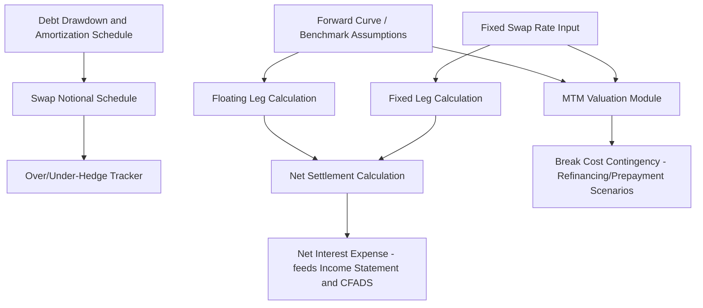

## Interest Rate Swap Modeling in Project Finance

### Purpose of Swap Modeling in the Financial Model

Interest rate swap modeling embeds the mechanics of a pay-fixed/receive-floating (or, less commonly, pay-floating/receive-fixed) interest rate swap directly into a project finance cash flow model, so that net interest expense, hedge notional tracking, mark-to-market (MTM) valuation, and break-cost contingencies are all calculated consistently with the underlying debt schedule rather than as a standalone side calculation.

A swap does not appear on the project's cash flow statement as a separate loan — it is a derivative overlay whose net settlement flows through the interest expense line, while its notional, valuation, and documentation sit in parallel schedules.

### Core Structural Components to Model

**Key Points**

- **Notional schedule**: the swap's notional balance for each period, which in project finance is normally amortizing to match the projected outstanding debt balance, not a flat/bullet notional.
- **Fixed leg**: the fixed rate the project pays to the swap counterparty, agreed at trade execution.
- **Floating leg**: the reference rate (e.g., SOFR, compounded in arrears) plus any spread, received from the counterparty, structured to offset the floating rate paid on the underlying loan.
- **Reset/compounding conventions**: reset frequency, day-count basis, and compounding method (in advance vs. in arrears) — these must match the underlying loan's conventions to avoid basis risk.
- **Effective date and maturity/termination date**: the swap may be forward-starting (common in construction-phase financings, hedging only the post-COD amortization period) and may terminate before, at, or after loan maturity.

### Net Settlement Calculation

For each settlement period $t$, the swap's net cash flow to the project is:

$$NS_t = N_t \times [(\text{Benchmark}_t + s_{float}) - r_{fixed}] \times \frac{d_t}{360}$$

where $N_t$ is the swap notional for period $t$, $\text{Benchmark}_t$ is the observed/compounded reference rate, $s_{float}$ is any floating-leg spread (often zero in a standard hedge swap), $r_{fixed}$ is the fixed swap rate, and $d_t/360$ is the day-count fraction for the period (Actual/360 is standard for USD swaps; other currencies commonly use Actual/365 — the model must reflect the specific ISDA confirmation's day-count convention). A positive $NS_t$ means the counterparty pays the project (floating exceeded fixed); a negative value means the project pays the counterparty net.

The project's total net interest expense combines the loan's floating interest cost with the swap settlement:

$$I_{net,t} = C_{t-1} \times (\text{Benchmark}_t + m) - NS_t = C_{t-1} \times (r_{fixed} + m)$$

when notional exactly matches outstanding debt balance ($N_t = C_{t-1}$) and reset dates/conventions align perfectly — collapsing to the synthetic fixed rate shown earlier. Modeling should not assume this collapse holds automatically; it should be built as the emergent result of the notional and reset schedules to correctly surface any mismatch.

### Notional Schedule Design

**Key Points**

- Build the swap notional schedule as its own row/block, driven by the *projected* debt drawdown and amortization schedule at financial close, since the swap is typically executed (or its amortization profile agreed) before actual drawdowns are known with certainty.
- Because actual construction drawdowns frequently deviate from the base-case forecast (timing delays, cost overruns, or underspends), the model should include an **over-hedge/under-hedge tracker**: the difference between actual outstanding debt and swap notional in each period.
- Some financings use a **notional step-down schedule with tolerance bands** (e.g., ±10%) negotiated with the swap counterparty, permitting the notional to remain fixed within a range rather than requiring a swap amendment for every drawdown variance — the model should flag periods where actual balances breach the tolerance band.
- For multi-tranche debt (e.g., separate construction and term facilities, or senior/subordinated tranches with a swap only on the senior tranche), the notional schedule must reference the correct tranche balance, not the aggregate project debt balance.

### Mark-to-Market (MTM) Valuation Module

The swap's MTM value at any valuation date is the present value of the difference between the remaining fixed leg and the market-implied remaining floating leg, discounted along the current forward curve:

$$MTM = \sum_{i=k+1}^{n} N_i \times (r_{fixed} - F_i) \times \frac{d_i}{360} \times DF_i$$

where $F_i$ is the forward rate implied by the current market curve for period $i$, $DF_i$ is the discount factor to period $i$, and the summation runs over all remaining periods from the current period $k+1$ to swap maturity $n$. A positive MTM (from the fixed-rate payer's perspective) arises when the fixed rate is below current forward rates (the swap is "in the money" to the project); a negative MTM arises when the fixed rate exceeds forward expectations.

**Modeling approach**: since building a full forward-curve bootstrapping and discounting engine is often outside the scope of a project finance operating model, MTM is commonly modeled using one of:

- A simplified approximation using a single flat assumed forward rate shift, scaled by swap duration, for illustrative sensitivity purposes.
- A linked output from a dedicated treasury/derivatives valuation tool or the swap counterparty's indicative valuation, imported into the model as an input rather than calculated natively.
- A full discounted cash flow buildout using a forward curve imported from a market data source, for models where swap break-cost accuracy is a critical output (e.g., refinancing feasibility studies).

[Inference: the appropriate level of MTM modeling sophistication depends on the model's purpose — a lender's base-case operating model typically does not need full curve-bootstrapping precision, whereas a treasury or refinancing analysis usually does.]

### Break Cost Contingency Modeling

**Key Points**

- Break costs (or gains) crystallize when the underlying loan is prepaid and the swap is terminated early, or when a partial prepayment triggers a partial swap unwind.
- Model break cost as a function of the MTM module: a negative MTM to the project at the termination date represents a cash cost payable to the counterparty; a positive MTM represents a receipt.
- Common prepayment triggers requiring break cost analysis: mandatory prepayment from insurance/condemnation proceeds, voluntary refinancing, project sale/change of control, and cash sweep-driven prepayment under an excess cash flow mechanism.
- Build break cost as a contingent line item in the sources and uses of any refinancing or disposal scenario, since it can materially reduce net proceeds available to equity or to repay other debt tranches.

### Worked Example: Notional and Net Settlement

**Example**

Assume, for a single settlement period:

- Swap notional $N_t = \$120{,}000{,}000$ (matches projected outstanding debt)
- Actual outstanding loan balance $C_{t-1} = \$125{,}000{,}000$ (drawdowns ran ahead of the swap's forecast schedule — an under-hedge of $5,000,000)
- Fixed swap rate $r_{fixed} = 4.10\%$
- Compounded SOFR for the period $= 4.60\%$
- Loan margin $m = 2.25\%$
- Day-count fraction $d_t/360 = 0.2528$ (91-day quarter)

Swap net settlement (counterparty pays project, since floating exceeds fixed):

$$NS_t = 120{,}000{,}000 \times (0.046 - 0.041) \times 0.2528 \approx \$151{,}680$$

Loan interest expense on actual balance:

$$I_{loan} = 125{,}000{,}000 \times (0.046 + 0.0225) \times 0.2528 \approx \$2{,}161{,}680$$

Net interest expense after swap:

$$I_{net} = 2{,}161{,}680 - 151{,}680 = \$2{,}010{,}000$$

Because the loan balance ($125M) exceeds the swap notional ($120M), the $5M excess remains fully exposed to floating rates — the hedge is incomplete. Had notional matched the actual balance exactly, the entire position would reduce to the synthetic fixed rate on the full $125M.

### Model Architecture and Layout

### Modeling Best Practices

**Key Points**

- Keep the swap schedule structurally parallel to the loan amortization schedule (same period grid, same day-count basis where applicable) so that notional matching and basis differences are visible line-by-line rather than embedded in a single formula.
- Separate "hedged interest expense" and "unhedged interest expense" as distinct model outputs, particularly where hedging is partial, so DSCR sensitivity to unhedged rate movements is transparent to lenders.
- Include explicit sensitivity toggles for: (1) the forward curve level (parallel shift stress), (2) hedge ratio (percentage of debt hedged), and (3) notional mismatch magnitude, since these are the standard stress dimensions requested in lender and rating agency due diligence.
- Where the model supports refinancing analysis, link the break cost contingency directly into the sources and uses of the refinancing scenario, rather than treating it as a memo item, so it correctly reduces net refinancing proceeds.
- Document ISDA-specific terms (Credit Support Annex thresholds, termination events, and any project-finance-specific ISDA amendments such as non-recourse carve-outs for the SPV borrower) as model assumptions/notes, since these affect whether and how break costs and collateral posting obligations arise. [Unverified: specific ISDA terms are negotiated per transaction and should be confirmed against the executed ISDA Master Agreement and Schedule rather than assumed standard.]

**Next Steps**

- Fixed, Floating, and Hedged Interest Rate Structures
- Mark-to-Market Valuation and Forward Curve Construction
- ISDA Master Agreements and Credit Support Annexes in Project Finance
- Basis Risk and Hedge Ineffectiveness Analysis
- Refinancing Feasibility Modeling and Break Cost Contingencies
- Bullet and Balloon Repayment Structures
- Cash Sweep Mechanisms and Excess Cash Flow Recapture
- Reference Rate Reform and RFR Transition Mechanics (SOFR, SONIA, €STR)