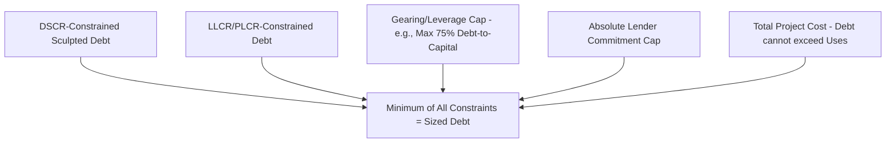

## Iterative Debt Sizing Techniques

### Definition and Core Concept

**Iterative debt sizing** refers to the class of techniques used to determine the maximum amount of debt a project can support, given that the debt quantum itself affects the very cash flows and ratios used to size it — creating a circular dependency. Debt service (principal and interest) depends on the debt amount; but the debt amount is meant to be *sized* off cash flow available for debt service (CFADS) and target coverage ratios, which in turn depend on debt service. Resolving this circularity requires either genuine mathematical iteration (goal-seek/solver methods) or closed-form algebraic solutions that avoid circularity by construction.

### Why Circularity Arises

**Key Points**

- Debt sizing is most commonly driven by a **target minimum DSCR** (Debt Service Coverage Ratio) or **target minimum LLCR** (Loan Life Coverage Ratio): the debt quantum is the largest amount such that DSCR (or LLCR) never falls below the lender's required minimum across the loan life.
- Since DSCR = CFADS / Debt Service, and Debt Service depends on the principal amount sized, changing the debt quantum changes debt service, which changes DSCR, which should in turn change the required debt quantum — a direct circular reference if solved naively in a spreadsheet.
- The same circularity appears in **gearing/leverage-based sizing** when debt sizing interacts with equity IRR targets, since the debt-to-equity mix affects both the CFADS available (via tax shield effects of interest deductibility) and the residual cash available to equity.
- Circularity also arises from **interest during construction (IDC)** being capitalized into the debt balance itself: a larger debt balance increases IDC, which increases the balance further, which is the same self-referencing structure as amortization-based sizing.

### The Two General Approaches

| Approach | Method | Circularity Handling |
| --- | --- | --- |
| Iterative (goal-seek/solver) | Repeatedly recalculate debt service against a trial debt amount until DSCR converges to the target | Circularity resolved numerically through repeated recalculation |
| Closed-form / algebraic (sculpting) | Solve directly for the debt service or debt amount using present-value formulas that don't require recalculation | Circularity avoided by construction — a single-pass formula |

### Iterative (Goal-Seek) Sizing Method

**Key Points**

- The modeler proposes a trial debt amount, calculates the resulting amortization schedule and debt service, computes DSCR in each period, and compares the minimum DSCR across the loan life to the lender's target.
- If minimum DSCR is above target, the trial debt amount is too low (headroom is being left on the table); if below target, the trial amount is too high (the project cannot support that much debt).
- This process repeats (manually, or via automated iteration) until the minimum DSCR converges to the target minimum DSCR within an acceptable tolerance (e.g., within 0.001x).
- In spreadsheet environments, this is typically implemented via a **circular reference toggle** combined with iterative calculation settings, or via an external goal-seek/solver function, or via a manual "flex cell" that the modeler adjusts and locks once converged (to avoid maintaining live circular references, which are fragile and can produce unstable or diverging results).

### Goal-Seek Mechanics

The goal-seek process solves for the debt principal $D$ such that:

$$\min_{t} \left( \frac{CFADS_t}{DS_t(D)} \right) = DSCR_{target}$$

where $DS_t(D)$ is the debt service in period $t$ as a function of the debt principal $D$ (since both principal amortization and interest scale with $D$), and the minimization is taken across all periods $t$ in the debt term. This is a root-finding problem: define

$$f(D) = \min_t \left( \frac{CFADS_t}{DS_t(D)} \right) - DSCR_{target}$$

and solve $f(D) = 0$. Because $DS_t(D)$ is monotonically increasing in $D$ (more debt means more debt service in every period, holding rate and tenor constant), $f(D)$ is monotonically decreasing in $D$, guaranteeing a unique solution — bisection or Newton-Raphson-style iteration converges reliably.

### Closed-Form Sizing: Level Annuity Case

When the DSCR target is uniform across all periods and CFADS is constant (or the binding period is known in advance), debt sizing can be solved directly without iteration. For a target DSCR applied to constant CFADS, the maximum supportable debt service is:

$$DS_{max} = \frac{CFADS}{DSCR_{target}}$$

The maximum debt principal is then the present value of that constant debt service annuity over $n$ periods at rate $r$:

$$D_{max} = DS_{max} \times \frac{1 - (1+r)^{-n}}{r}$$

This closed-form approach works cleanly only when CFADS is flat and a single DSCR target applies uniformly — real project finance cash flows are rarely this simple, which is why sculpted sizing (below) is the dominant closed-form technique in practice.

### Closed-Form Sizing: Sculpted Debt Service (PV of CFADS Method)

**Key Points**

- **Sculpting** sizes annual principal repayments so that DSCR equals the target in *every* period exactly (rather than only in the binding/worst period, as with level amortization), maximizing the debt quantum the project can support given a varying CFADS profile.
- This is the standard technique in project finance because CFADS profiles are rarely flat — they follow contracted revenue escalation, offtake volume ramp-ups, maintenance capex cycles, and PPA/concession-specific payment structures.
- The sculpted debt service in each period is set as: $DS_t = CFADS_t / DSCR_{target}$, directly deriving a *variable* debt service schedule (rather than a variable DSCR under fixed debt service).
- The total debt sized is the present value of this entire sculpted debt service stream, discounted at the loan's interest rate: this is inherently non-circular because debt service is derived directly from CFADS and the target ratio, not from a debt balance.

The sculpted debt principal is:

D_{max} = \sum_{t=1}^{n} \frac{DS_t}{(1+r)^t} = \sum_{t=1}^{n} \frac{CFADS_t / DSCR_{target}}{(1+r)^t}$}

Once $D_{max}$ is determined, the sculpted principal repayment in each period is derived as a plug: $Principal_t = DS_t - Interest_t$, where $Interest_t = C_{t-1} \times r$ and $C_{t-1}$ is the declining balance carried from the prior period — this final backward-substitution step to build the actual amortization schedule (converting a debt service stream into a principal/interest split) does introduce a light internal circularity (interest depends on the declining balance, which depends on prior principal repayments), but it is a simple sequential calculation, not a sizing circularity, and resolves in a single forward pass period-by-period.

### Worked Example: Sculpted Sizing

**Example**

Assume a 5-year projection with the following CFADS profile, a target DSCR of 1.30x, and an interest rate of 6%:

| Year | CFADS | Sculpted DS = CFADS/1.30 | PV Factor @6% | PV of DS |
| --- | --- | --- | --- | --- |
| 1 | $20,000,000 | $15,384,615 | 0.9434 | $14,514,542 |
| 2 | $25,000,000 | $19,230,769 | 0.8900 | $17,115,385 |
| 3 | $28,000,000 | $21,538,462 | 0.8396 | $18,088,522 |
| 4 | $30,000,000 | $23,076,923 | 0.7921 | $18,279,586 |
| 5 | $32,000,000 | $24,615,385 | 0.7473 | $18,393,876 |

Maximum sculpted debt quantum:

$$D_{max} = 14{,}514{,}542 + 17{,}115{,}385 + 18{,}088{,}522 + 18{,}279{,}586 + 18{,}393{,}876 \approx \$86{,}391{,}911$$

Compare this to a level-annuity sizing using the *minimum* CFADS year (Year 1, $20M) as the binding constraint under the same 1.30x target and 5-year tenor: $DS_{max} = 20{,}000{,}000/1.30 = \$15{,}384{,}615$ annually, giving $D_{max} = 15{,}384{,}615 \times \frac{1-(1.06)^{-5}}{0.06} \approx \$64{,}824{,}000$. Sculpting supports roughly $21.6M more debt in this example by matching debt service to the actual (rising) CFADS profile rather than constraining the entire tenor to the worst single year.

### Handling True Circularity in Spreadsheet Models

**Key Points**

- Where circularity cannot be avoided algebraically (e.g., IDC capitalization feeding back into the sized debt balance, or gearing sized jointly with an equity IRR target), models commonly use one of: (1) enabling iterative calculation with a capped iteration count and convergence threshold, (2) a manual "circularity breaker" switch that temporarily hardcodes a prior-period value to break the loop for auditing/error-checking, or (3) an explicit iterative macro/VBA solver that loops until convergence and writes a static value back into the model.
- Live circular references are fragile: they can produce `#REF!`/divergence errors, silently return stale values if iterative calculation is disabled by a user, and are difficult to audit — many project finance modeling standards (e.g., FAST, Macabacus-aligned conventions) recommend avoiding live circularity in favor of a solved/pasted value with a clearly labeled sensitivity toggle.
- A common convention is to compute the sized debt amount using an automated iterative solver (VBA, Python via a model add-in, or an external calculation) run as a discrete step, then paste the resulting value as a hardcoded input into the live model with a clear audit note, re-running the solver whenever upstream assumptions change materially.

### Debt Sizing Constraint Stack

In practice, the *sized* debt is the minimum of several parallel constraints, not solely the DSCR/LLCR-based sculpted amount:

### Modeling Considerations

**Key Points**

- Build the sculpting calculation as a direct formula (PV of CFADS/target DSCR stream) rather than as a goal-seek, wherever the DSCR target and CFADS profile permit a closed-form solution — this is more auditable, faster to recalculate under sensitivity analysis, and avoids fragile iterative settings.
- Where multiple sizing constraints apply (DSCR, LLCR, gearing cap, absolute cap), calculate each independently and take the minimum as the "binding" sized debt amount, clearly flagging which constraint binds — this is critical information for negotiating structure with lenders.
- Test sculpted sizing outputs against a full DSCR recalculation once the amortization schedule is built, to confirm the derived principal/interest split actually reproduces the target DSCR in every period (a self-consistency check that catches formula errors).
- When iterative calculation settings are used, document the iteration count and convergence tolerance explicitly in the model's assumptions/notes tab, since undocumented iterative settings are a common source of model integrity issues in third-party model reviews and lender due diligence.

**Next Steps**

- Debt Service Coverage Ratio (DSCR) Calculation and Covenant Design
- Loan Life Coverage Ratio (LLCR) and Project Life Coverage Ratio (PLCR)
- Sculpted Amortization Profiles for Ramp-Up Cash Flows
- Gearing and Leverage Constraints in Project Finance Structuring
- Circular Reference Management and Model Integrity Best Practices (FAST Standard)
- Bullet and Balloon Repayment Structures
- Interest Rate Swap Modeling in Project Finance
- Equity IRR Optimization and Debt-Equity Mix Sizing