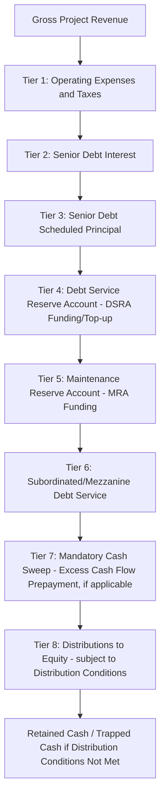
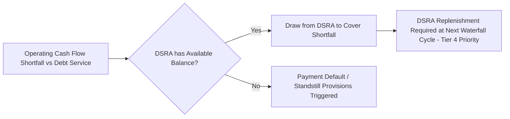

## Structuring the Cash Flow Waterfall

### Definition and Core Concept

The **cash flow waterfall** (also called the **payment waterfall** or **priority of payments**) is the contractually defined sequence in which a project's available cash is allocated each period, from gross revenue down through operating costs, taxes, debt service, reserve funding, and ultimately equity distributions. It is called a "waterfall" because cash flows downward through successive tiers, with each tier fully satisfied (or a defined partial allocation made) before any cash flows to the tier below. The waterfall is typically embedded directly in the financing documents (the Common Terms Agreement or intercreditor agreement) and is one of the most heavily negotiated structural elements of a project finance transaction, since it directly determines the priority and timing of every stakeholder's cash entitlement.

### Purpose and Function

**Key Points**

- The waterfall operationalizes the principle of **structural subordination**: senior lenders are paid before subordinated lenders, who are paid before equity, reflecting the risk hierarchy each stakeholder has accepted.
- It provides the mechanism by which lenders retain control over cash leakage — equity cannot receive distributions until all senior obligations (operating costs, debt service, and reserve funding) for the period are satisfied, and often until additional distribution conditions (DSCR tests, no default certification) are met.
- The waterfall structures **cash trapping**: if the project underperforms and cannot satisfy a lower-priority tier, cash is trapped/retained in project accounts rather than distributed, providing an automatic de-leveraging or liquidity buffer without requiring active lender intervention.
- Reserve account funding tiers within the waterfall pre-fund known or contingent future obligations (debt service, maintenance capex) so that a single bad period does not immediately cause default.

### Standard Waterfall Tier Structure

A typical project finance cash flow waterfall, from top (highest priority) to bottom (residual), follows this general sequence:

### Tier-by-Tier Detail

**Tier 1 — Operating Expenses and Taxes**: Includes O&M contractor fees, fuel/feedstock costs, insurance premiums, and government taxes/royalties. These are typically paid at the top of the waterfall (sometimes even ahead of being captured in "CFADS," since CFADS is itself defined as revenue less operating costs) because they are necessary to keep the asset operational — impairing operations would harm all downstream stakeholders including lenders.

**Tier 2 — Senior Debt Interest**: Scheduled interest on the senior facility, calculated per the loan agreement's interest provisions (fixed, floating, or hedged as covered in interest rate structuring).

**Tier 3 — Senior Debt Scheduled Principal**: Mandatory scheduled amortization per the agreed repayment profile (level, sculpted, or balloon/bullet structure).

**Tier 4 — DSRA Funding**: Contributions to bring the Debt Service Reserve Account up to its Required Balance (commonly the next one or two debt service payments), addressing near-term liquidity shortfalls.

**Tier 5 — Maintenance Reserve Account (MRA) Funding**: Contributions toward funding known lumpy future maintenance capital expenditure (e.g., major overhauls, turbine replacements), smoothing large periodic costs that would otherwise create sharp CFADS troughs.

**Tier 6 — Subordinated/Mezzanine Debt Service**: Interest and (if applicable) principal on subordinated tranches, paid only after all senior obligations and reserve requirements are satisfied — reflecting the subordinated lender's junior risk position and correspondingly higher required return.

**Tier 7 — Mandatory Cash Sweep**: Where the financing documents include an excess cash flow sweep covenant (common in structures with refinancing/balloon risk, or where sponsors accept accelerated deleveraging in exchange for other concessions), a defined percentage of remaining cash is applied to mandatory prepayment of senior or subordinated debt.

**Tier 8 — Equity Distributions**: The residual cash flow, released to shareholders only if all higher tiers are satisfied **and** all contractual **distribution conditions** (or "restricted payment conditions") are met.

### Distribution Conditions ("Lock-Up" Tests)

**Key Points**

- Even where cash is technically available at Tier 8, financing documents typically impose additional conditions before equity can actually receive it, commonly called a **distribution lock-up test** or **restricted payment condition**.
- Standard distribution conditions include: (1) historical DSCR (trailing 12 months) at or above a specified threshold, (2) projected/forward-looking DSCR at or above threshold, (3) no continuing event of default or potential default, (4) reserve accounts fully funded to their Required Balance, and (5) compliance certificates delivered and accurate.
- If any condition fails, cash that would otherwise flow to equity is **locked up** (trapped) in a distribution suspense or retention account rather than distributed, and typically remains trapped until conditions are subsequently satisfied (sometimes requiring the failure to be cured for a minimum number of consecutive test periods).
- This lock-up mechanism is functionally the primary lender protection against sponsors extracting cash during a period of project underperformance, and is heavily negotiated (particularly the specific DSCR threshold level, look-back/look-forward test periods, and cure mechanics).

### Waterfall Timing Conventions

**Key Points**

- Waterfalls are typically calculated and executed on each **Interest Payment Date (IPD)** or **Calculation Date**, commonly quarterly or semi-annually, aligned with the loan's interest reset/payment schedule.
- Distinguish between **cash available for the period** (accrued during the period, e.g., a quarter) and **cash actually applied at each IPD** — the waterfall calculation is performed at each IPD using the cash accumulated in project accounts since the prior IPD.
- Timing mismatches between revenue receipt and debt service due dates are a key structuring consideration — projects with revenue received significantly ahead of or lagging debt service dates require careful minimum cash balance / working capital facility provisions to avoid technical liquidity shortfalls despite adequate annual CFADS.

### Modeling the Waterfall

**Key Points**

- Model the waterfall as a strict sequential top-down calculation for each period, with each tier's allocation calculated as $\min(\text{Cash Available After Prior Tiers}, \text{Tier Requirement})$, so that any shortfall automatically cascades (nothing below binds if a higher tier is only partially satisfied).
- Build each reserve account (DSRA, MRA) as its own linked schedule with an opening balance, required balance (often a formula referencing forward debt service or a capex schedule), funding/draw activity for the period, and closing balance — the waterfall tier for that reserve references the *shortfall* (required balance less opening balance) as the funding requirement.
- Explicitly model the distribution lock-up test as a boolean/flag calculation (e.g., historical DSCR ≥ threshold AND no default AND reserves fully funded), gating the equity distribution line so that failing the test redirects cash to a retention account rather than a distribution account — this must be modeled as a real cash redirection, not merely a warning flag.
- Where a mandatory cash sweep applies, ensure the sweep percentage and its trigger conditions (e.g., only active if leverage exceeds a threshold, or only during a defined sweep period preceding a balloon maturity) are built as explicit toggles, since sweep mechanics are frequently amended or waived in later refinancings.
- Cross-check the waterfall's total allocated cash against total cash available each period to confirm no tier double-counts or under-allocates; a common modeling error is allowing a lower tier to draw on cash already committed to a higher tier's reserve funding.

### Reserve Account Sub-Waterfall Interaction

Reserve accounts often have their own draw priority when cash is insufficient in a later period to meet debt service directly — draws from DSRA typically occur *below* the main revenue waterfall's Tier 2/3 (interest/principal) when operating cash flow alone is insufficient, effectively creating a secondary, narrower waterfall specifically for debt service shortfall coverage:

### Common Structuring Variations

| Variation | Description | Typical Context |
| --- | --- | --- |
| Single project account | All tiers flow through one controlled bank account with sub-ledger tracking | Simpler, smaller transactions |
| Multiple segregated accounts | Separate legal bank accounts per tier (revenue, opex, debt service, DSRA, MRA, distribution) | Standard for larger, syndicated project finance deals |
| Cash flow "sculpting" account structure | Waterfall integrated directly with sculpted amortization, dynamically adjusting principal tier based on actual CFADS | Deals with variable/merchant revenue exposure |
| PPP/availability-based waterfall | Simplified waterfall reflecting stable availability payments, often with narrower reserve requirements | Government-backed availability payment PPPs |

**Next Steps**

- Debt Service Reserve Account (DSRA) Sizing Methodologies
- Maintenance Reserve Account (MRA) Structuring and Capex Forecasting
- Distribution Lock-Up Tests and DSCR Covenant Design
- Intercreditor Agreements and Subordination Mechanics
- Cash Sweep Mechanisms and Excess Cash Flow Recapture
- Iterative Debt Sizing Techniques
- Account Bank and Controlled Accounts Structuring
- Events of Default and Standstill/Enforcement Provisions