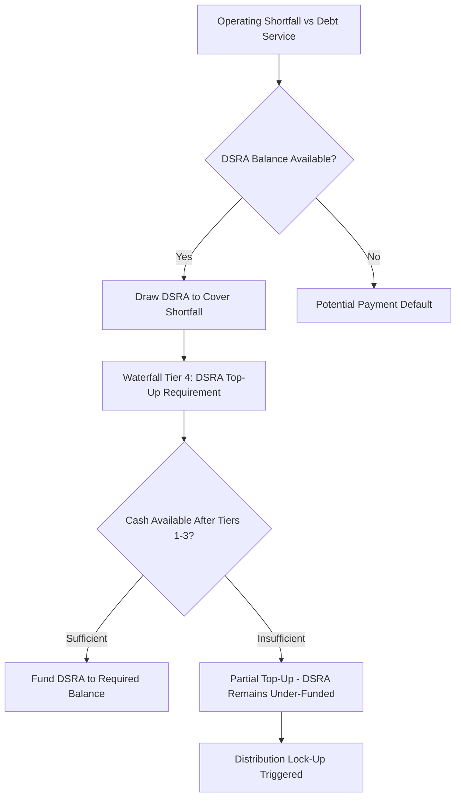

## Debt Service Reserve Account Mechanics

### Definition and Core Concept

A **Debt Service Reserve Account (DSRA)** is a segregated, lender-controlled cash account funded to cover a defined number of upcoming debt service payments (typically the next one to two periods of scheduled interest and principal), acting as a liquidity buffer against short-term cash flow shortfalls. The DSRA does not reduce total debt or credit risk over the life of the loan — it re-times liquidity, ensuring the project can make a scheduled payment even if a single period's operating cash flow is insufficient, without immediately triggering a payment default.

### Purpose and Function

**Key Points**

- Protects lenders against **timing risk**: temporary cash flow dips from seasonal revenue, delayed receivables, or short-term operational disruption that do not reflect a structural decline in project economics.
- Provides a defined cure mechanism before a missed payment escalates to a payment default under the loan agreement, giving the project and sponsors time to address underlying issues (e.g., an offtaker payment delay) without immediate acceleration.

   - Signals credit quality to rating agencies and other stakeholders: a fully funded, appropriately sized DSRA is a standard feature of investment-grade project finance and infrastructure debt structures.
- Sits within Tier 4 of the standard cash flow waterfall (funded after operating costs, senior interest, and senior principal, but before subordinated debt and equity distributions).

### Standard DSRA Sizing Conventions

**Key Points**

- The most common sizing convention is the **Required Balance** expressed as a multiple of upcoming debt service, most typically **the next 6 months (one semi-annual payment) or the next 12 months (two semi-annual payments, or four quarterly payments)** of scheduled debt service.
- Sizing is sometimes expressed as the **greater of** a fixed dollar/currency floor and a percentage-of-debt-service calculation, to avoid the reserve becoming trivially small late in the loan's life as the amortizing balance (and hence debt service) declines.
- Some structures use a **look-forward** basis (next period's *projected* debt service, which may vary under sculpted or floating-rate structures) rather than a **look-back** basis (the most recent historical period's debt service), with look-forward being more common since it directly protects the *next* payment obligation.
- For floating-rate or partially hedged debt, the Required Balance calculation must reference a defined methodology for estimating forward debt service (e.g., current forward curve, or last-reset-rate assumption), since the exact future interest amount is not fixed at the time of DSRA sizing.

### DSRA Funding Mechanics

The DSRA is typically funded through one or both of:

- **Upfront funding at financial close**: the DSRA Required Balance is funded from initial debt or equity proceeds as part of the sources and uses of funds, ensuring the reserve is in place from day one (common for construction-phase or early-operations risk).
- **Progressive/ratable funding**: the DSRA builds up gradually via the cash flow waterfall's Tier 4 allocation over an agreed **funding period** (often the first 12–24 months of operations), with each period's waterfall contributing a portion until the Required Balance is reached.

The periodic funding requirement (the "top-up" amount) at any waterfall calculation date is:

$$Top\text{-}Up_t = \max(0, \, RB_t - OB_t)$$

where $RB_t$ is the Required Balance for period $t$ (per the sizing convention above) and $OB_t$ is the DSRA's opening balance at the start of period $t$ (before that period's top-up contribution). This top-up amount is drawn from available cash flow at Tier 4 of the waterfall, after Tiers 1–3 are satisfied.

### DSRA Draw Mechanics

When operating cash flow in a given period is insufficient to cover scheduled debt service in full, the DSRA is drawn to cover the shortfall:

$$Draw_t = \max(0, \, DS_t - CFADS_t)$$

where $DS_t$ is the scheduled debt service due in period $t$ and $CFADS_t$ is the cash flow available for debt service actually generated in that period. The draw reduces the DSRA balance:

$$CB_t = OB_t - Draw_t$$

where $CB_t$ is the closing balance carried into the next period (before any subsequent replenishment). Critically, **the DSRA draw does not eliminate the underlying obligation to replenish it** — the amount drawn becomes a Tier 4 funding requirement in the subsequent waterfall cycle(s), meaning a DSRA draw effectively creates a "debt" the project owes to its own reserve, senior in priority (Tier 4) to subordinated debt and distributions.

### Worked Example

**Example**

Assume a project with:

- Quarterly senior debt service of approximately $8,000,000 per quarter
- DSRA Required Balance sized at 2 quarters of forward debt service = $16,000,000
- Current DSRA balance (fully funded from prior periods) = $16,000,000

In Q3, CFADS generated is only $6,200,000 against $8,000,000 of scheduled debt service — a shortfall of $1,800,000.

DSRA draw:

$$Draw_{Q3} = \max(0, \, 8{,}000{,}000 - 6{,}200{,}000) = \$1{,}800{,}000$$

DSRA closing balance after the draw:

$$CB_{Q3} = 16{,}000{,}000 - 1{,}800{,}000 = \$14{,}200{,}000$$

In Q4, assume CFADS recovers to $9,500,000, comfortably covering that quarter's $8,000,000 debt service with $1,500,000 of surplus cash flow before reaching Tier 4. The waterfall applies this surplus to replenish the DSRA:

$$Top\text{-}Up_{Q4} = \min(\$1{,}500{,}000 \text{ available}, \, RB - CB_{Q3}) = \min(1{,}500{,}000, \, 16{,}000{,}000-14{,}200{,}000) = \$1{,}500{,}000$$

leaving the DSRA at $15,700,000 — not yet fully replenished, meaning equity distributions remain restricted under the standard distribution lock-up condition (reserves must be fully funded) until the remaining $300,000 shortfall is topped up in a subsequent period.

### Funding Sources and Instruments

**Key Points**

- **Cash-funded DSRA**: cash deposited into a segregated, pledged bank account — the most straightforward and lender-preferred method, though it "trapped" cash represents an opportunity cost to sponsors (cash that could otherwise be distributed or reinvested).
- **Letter of Credit (L/C) backed DSRA**: instead of cash, a sponsor or third-party bank provides an irrevocable standby letter of credit for the Required Balance amount, which lenders can draw upon in lieu of a cash reserve — reduces sponsor cash trapped in the structure but introduces L/C issuer credit risk and typically carries an annual L/C fee.
- **DSRA surety bonds/guarantees**: less common alternative to an L/C, functionally similar in providing a third-party credit support instrument rather than trapped cash, subject to the surety provider's creditworthiness and claims process.
- Where an L/C or surety substitutes for cash, financing documents typically specify triggers requiring conversion to a cash-funded DSRA (e.g., if the L/C issuer's credit rating falls below a specified threshold), since the reserve's protective value depends on the credit quality of whatever backs it.

### Investment of DSRA Cash Balances

**Key Points**

- Where cash-funded, DSRA balances are not simply left idle — financing documents typically permit (or require) investment in a defined list of **Permitted Investments**: short-term, high-credit-quality, highly liquid instruments (e.g., government securities, money market funds, term deposits with rated banks) with maturities aligned to ensure liquidity when a draw may be needed.
- Interest/investment income earned on the DSRA balance is typically itself swept back into the waterfall (either credited to the DSRA itself, counted toward satisfying the Required Balance, or flowing to the general revenue account) per the specific financing documents' provisions.
- The permitted investment list and maturity constraints are negotiated to balance modest yield enhancement against the primary objective of capital preservation and immediate liquidity availability.

### Modeling the DSRA

**Key Points**

- Build the DSRA as its own linked schedule with four core line items each period: opening balance, draws (shortfall coverage), top-up contributions (from the Tier 4 waterfall allocation), and closing balance — structurally parallel to how a cash sweep or sinking fund schedule would be modeled.
- Calculate the Required Balance dynamically as a formula referencing the *forward* debt service schedule (not a hardcoded value), so that sensitivity analysis on interest rates, amortization structure, or refinancing assumptions automatically flows through to the DSRA sizing requirement.
- Explicitly link the DSRA draw mechanism to the CFADS shortfall calculation and ensure the draw is capped at the DSRA's available closing balance — if a shortfall exceeds the available DSRA balance, this should flag as a potential payment default condition rather than allow a negative reserve balance.
- Feed the DSRA's funding status (fully funded vs. under-funded) directly into the distribution lock-up test logic covered in cash flow waterfall structuring, since DSRA funding status is a standard component of the equity distribution gating conditions.
- For L/C-backed DSRAs, model the L/C as an off-balance-sheet contingent facility with an associated fee expense (flowing through opex/financing costs) rather than as a cash balance, while still tracking the "Required Balance" the L/C is covering for distribution-test purposes.

### DSRA Position in the Reserve Waterfall

**Next Steps**

- Structuring the Cash Flow Waterfall
- Maintenance Reserve Account (MRA) Structuring and Capex Forecasting
- Distribution Lock-Up Tests and DSCR Covenant Design
- Letters of Credit and Surety Instruments in Project Finance
- Iterative Debt Sizing Techniques
- Account Bank and Controlled Accounts Structuring
- Events of Default and Standstill/Enforcement Provisions
- Permitted Investments and Treasury Management in SPV Structures