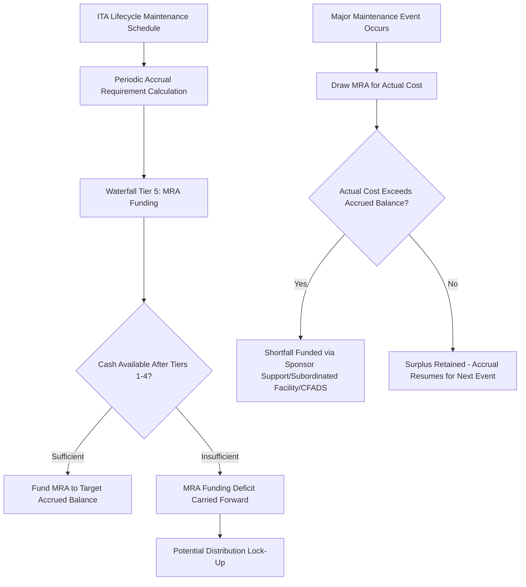

## Maintenance Reserve Account Mechanics

### Definition and Core Concept

A **Maintenance Reserve Account (MRA)** — also called a **Major Maintenance Reserve (MMR)** — is a segregated, lender-controlled account funded progressively to pre-pay for known, lumpy future capital expenditure on major maintenance events: equipment overhauls, turbine replacements, mid-life refurbishments, or scheduled asset component replacements. Unlike the DSRA, which protects debt service payments against short-term cash flow timing risk, the MRA protects the project against **operational risk from deferred or unfunded maintenance** — ensuring cash is set aside in advance of predictable but infrequent, high-cost maintenance events so they don't create a sudden CFADS shock that jeopardizes DSCR or debt service capacity in the year they occur.

### Purpose and Function

**Key Points**

- Smooths large, periodic maintenance costs (e.g., a wind turbine gearbox replacement every 8–10 years, a gas turbine major overhaul every 4–6 years, a desalination membrane replacement cycle) into a steady periodic funding requirement, avoiding sharp single-period CFADS dips.
- Prevents sponsors from deferring necessary maintenance to preserve near-term distributable cash flow — a moral hazard risk since sponsors capture distribution upside but lenders bear the downside of asset underperformance or premature failure from deferred maintenance.
- Sits within Tier 5 of the standard cash flow waterfall, funded after operating costs, senior interest, senior principal, and DSRA top-up, but before subordinated debt service and equity distributions.
- Provides lenders assurance that asset condition (and hence terminal/residual value, relevant to LLCR-style coverage tests and eventual refinancing or balloon repayment capacity) is being maintained per the technical advisor's recommended maintenance schedule.

### MRA Sizing Methodology

**Key Points**

- MRA funding requirements are derived from a **Lifecycle/Major Maintenance Schedule**, typically prepared or reviewed by an **Independent Technical Advisor (ITA/Lender's Engineer)** as part of technical due diligence, specifying the timing and estimated cost of each major maintenance event over the asset's operating life.
- The most common sizing approach is **straight-line accrual**: the total forecast cost of the next major maintenance event is divided evenly across the periods remaining until that event occurs, building the required balance smoothly rather than in a lump sum immediately before the expenditure.
- An alternative approach uses a **rolling reserve target** expressed as a percentage of the estimated cost of the *next* upcoming major maintenance event (e.g., MRA must hold at least 50% of the next scheduled overhaul cost with 24 months remaining, then 100% with 12 months remaining), providing a graduated funding profile rather than a single continuous accrual.
- For assets with multiple, staggered maintenance events across different components (e.g., separate turbine, generator, and balance-of-plant overhaul cycles), the MRA required balance is the sum of the accrued requirements for each individual component's schedule.

### Straight-Line Accrual Formula

For a single major maintenance event with estimated cost $E$ occurring at period $T$, with accrual beginning at period 0, the periodic accrual contribution is:

$$Accrual_t = \frac{E}{T}$$

and the required (target) balance at any period $t \le T$ is:

$$RB_t = \frac{E \times t}{T}$$

Where multiple maintenance events with different costs $E_i$ and timings $T_i$ exist, the total required balance at period $t$ is the sum of each event's individual accrual, netted for any events already paid out and their subsequent accrual cycle restarted:

$$RB_t = \sum_{i} \frac{E_i \times \min(t, T_i)}{T_i} \quad \text{(prior to each event's occurrence)}$$

### Worked Example

**Example**

Assume a combined-cycle power project with a major turbine overhaul estimated at $40,000,000, scheduled to occur in Year 6, with MRA accrual beginning at the start of Year 1 (24 quarterly periods until the event):

Quarterly accrual:

$$Accrual = \frac{40{,}000{,}000}{24} \approx \$1{,}666{,}667 \text{ per quarter}$$

At the end of Year 3 (12 quarters elapsed), the required and actual accrued balance (assuming full funding each period) would be:

$$RB_{12} = 1{,}666{,}667 \times 12 = \$20{,}000{,}000$$

representing exactly half of the total estimated cost, consistent with half of the accrual period having elapsed. If, in a particular quarter, CFADS is insufficient to fund the full $1,666,667 accrual after higher-priority tiers are satisfied, the shortfall becomes a carried-forward funding deficit — the MRA falls behind its straight-line target, which (depending on the specific financing documents) may itself trigger a distribution lock-up condition even though it does not constitute a payment default in the way a DSRA shortfall would.

### MRA Draw Mechanics

When the scheduled maintenance event occurs, the MRA is drawn to fund the actual expenditure:

$$Draw_T = \min(\text{Actual Maintenance Cost}, \, \text{MRA Balance at } T)$$

If the actual cost at the time of the event exceeds the accrued MRA balance (due to cost escalation, scope changes, or accrual shortfalls from prior underfunding), the shortfall must typically be funded from another source — often general project cash flow (reducing that period's CFADS and hence DSCR), a standby equity/sponsor support facility, or in some structures a subordinated maintenance facility specifically sized for this contingency. If the actual cost is lower than the accrued balance, the surplus typically remains in the MRA to accrue toward the next scheduled event, rather than flowing to equity, since the reserve exists for the maintenance program as a whole, not a single event.

### Interaction with the ITA and Technical Due Diligence

**Key Points**

- The Independent Technical Advisor's lifecycle maintenance schedule is the primary technical due diligence input driving MRA sizing — lenders rely on the ITA's assessment of realistic maintenance timing and cost, and typically require this schedule to be updated periodically (e.g., at each refinancing or major maintenance event) to reflect actual asset condition and evolving OEM (original equipment manufacturer) cost estimates.
- Where the project has a Long-Term Service Agreement (LTSA) with the OEM covering scheduled maintenance for a fixed periodic fee, the MRA's role is reduced (or eliminated) for the components covered by the LTSA, since the fixed fee itself smooths the cost — the MRA then focuses on maintenance items outside the LTSA's scope.
- Divergence between the ITA's independent cost estimate and the OEM's or O&M contractor's quoted cost is a common negotiation point, since it directly affects the sizing of a reserve that constrains distributable cash to equity.

### MRA vs. DSRA: Key Distinctions

| Feature | DSRA | MRA |
| --- | --- | --- |
| Protects against | Short-term debt service liquidity shortfalls | Lumpy, foreseeable major maintenance capex |
| Sizing basis | Multiple of forward debt service (e.g., 6–12 months) | Straight-line/rolling accrual toward ITA-forecast maintenance cost and timing |
| Waterfall tier | Typically Tier 4 (before MRA) | Typically Tier 5 (after DSRA) |
| Draw trigger | Operating cash flow insufficient for scheduled debt service | Scheduled or unscheduled major maintenance event occurring |
| Replenishment obligation | Immediate priority in next waterfall cycle | Resumes standard accrual cycle toward the next scheduled event |
| Typical funding instrument | Cash, letter of credit, or surety | Predominantly cash (L/C substitution less common given the funding profile) |

### MRA Position in the Waterfall and Reserve Interaction

### Modeling the MRA

**Key Points**

- Link the MRA accrual schedule directly to the ITA lifecycle maintenance schedule as an input table (event description, estimated cost, timing), with the model calculating the straight-line (or rolling target) accrual requirement per period as a formula, not a hardcoded series.
- Track MRA opening balance, periodic accrual/top-up, draws, and closing balance as a dedicated schedule, structurally consistent with the DSRA schedule, and feed the closing balance into the distribution lock-up test logic if the financing documents make MRA funding status a distribution condition.
- Model maintenance cost escalation explicitly (e.g., an inflation or OEM-cost-escalation assumption applied to the ITA's base-year cost estimate) rather than assuming the nominal cost stays flat until the event occurs, since maintenance events often sit many years into the projection.
- Where an LTSA covers some maintenance scope, ensure the model does not double-count: LTSA fees should already appear as an operating cost in Tier 1, and the MRA accrual should be scoped only to maintenance items outside the LTSA, to avoid overstating total reserve requirements.
- Include a shortfall/deficit tracker for the MRA (target balance vs. actual accrued balance) as an explicit output, since a growing deficit is an early warning indicator of maintenance underfunding risk that technical and financial due diligence reviewers will specifically look for. [Inference: whether an MRA deficit constitutes a default versus merely a distribution restriction is transaction-specific and depends on the negotiated financing documents.]

**Next Steps**

- Structuring the Cash Flow Waterfall
- Debt Service Reserve Account Mechanics
- Independent Technical Advisor Due Diligence and Lifecycle Cost Estimation
- Long-Term Service Agreements (LTSAs) and O&M Contract Structuring
- Distribution Lock-Up Tests and DSCR Covenant Design
- Loan Life Coverage Ratio (LLCR) and Project Life Coverage Ratio (PLCR)
- Iterative Debt Sizing Techniques
- Sponsor Support and Standby Equity Facilities