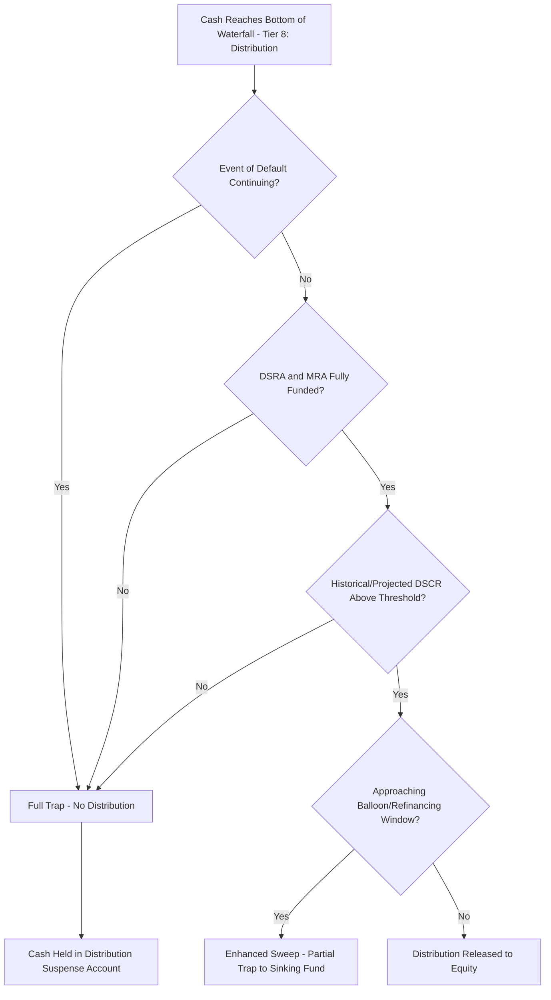

## Other Reserve Accounts and Trapped Cash Structures

### Overview

Beyond the two core reserve accounts already covered — the Debt Service Reserve Account (DSRA) and the Maintenance Reserve Account (MRA) — project finance structures frequently include additional, deal-specific reserve accounts and broader **trapped cash mechanisms** that restrict equity distributions under defined trigger conditions. These accounts and mechanisms address risks that are either unique to a project's sector (e.g., decommissioning obligations, working capital volatility) or serve as flexible credit-enhancement tools negotiated case-by-case between sponsors and lenders.

### Working Capital Facility and Reserve

**Key Points**

- Addresses **timing mismatches** between when operating costs are incurred/paid and when corresponding revenue is received — common in projects with seasonal revenue (agriculture-linked processing, some renewable generation profiles) or with offtakers/customers on extended payment terms.
- Structured either as a **revolving working capital facility** (a separate short-term credit line, redrawable up to a cap) or as a **cash-funded working capital reserve** sized to a defined number of months of operating expenses.
- Unlike the DSRA (which protects debt service) or MRA (which protects maintenance capex), the working capital reserve protects the *day-to-day operational solvency* of the SPV, preventing a short-term cash timing gap from being misclassified as a debt service or covenant breach.
- Sizing is typically expressed as a fixed number of months of budgeted operating expenditure (e.g., 1–3 months of opex), reset periodically against the approved annual operating budget.

### Decommissioning Reserve Account

**Key Points**

- Required in sectors with a legally or contractually mandated end-of-life decommissioning obligation: offshore wind, oil and gas platforms, nuclear facilities, and certain mining and waste-to-energy projects.
- Funded progressively over the operating life (often via a straight-line or unit-of-production accrual methodology, similar in structural logic to MRA accrual) so that the full estimated decommissioning cost is available at or near the end of the asset's operating life without requiring a large terminal cash call on sponsors or lenders.
- Sizing is driven by an independent decommissioning cost estimate (analogous to the ITA's role in MRA sizing), which is periodically revalidated since decommissioning cost estimates are subject to significant escalation risk over long asset lives (regulatory changes, disposal/site remediation cost inflation).
- Often required to be held in a highly liquid, low-risk instrument or an external decommissioning trust/escrow structure that may sit partially or fully outside the standard project waterfall, reflecting its long-dated, non-discretionary nature and, in regulated sectors, specific statutory funding requirements. [Unverified: exact legal/regulatory structuring of decommissioning trusts is sector- and jurisdiction-specific and should be confirmed against the applicable regulatory framework rather than assumed uniform.]

### Environmental/Insurance Proceeds Reserve

**Key Points**

- Some structures establish a reserve or defined waterfall treatment for insurance proceeds (business interruption, property damage) and environmental remediation obligations, ensuring that proceeds received are applied first to project reinstatement/repair before any residual is available for distribution or mandatory prepayment.
- Typically governed by a dedicated "insurance proceeds waterfall" or reinstatement test within the financing documents, distinguishing between proceeds below a materiality threshold (often released to the borrower for repair) and proceeds above the threshold (requiring lender consent on application, potentially triggering mandatory prepayment if the asset is not to be reinstated).

### Tax Reserve Account

**Key Points**

- In some jurisdictions or structures, particularly where corporate tax liabilities are volatile, lumpy, or subject to timing differences from cash tax payment dates, a dedicated tax reserve smooths the cash impact of large periodic tax payments, avoiding a single-period CFADS distortion analogous to the MRA's treatment of maintenance capex.
- Less universal than DSRA/MRA; used selectively where tax payment timing risk is identified as material during financial structuring and lender due diligence.

### Debt Service Coverage / Distribution Suspense Account

**Key Points**

- Distinct from a *named* reserve with its own accrual schedule, the **distribution suspense account** (or "restricted payment account") is the destination for cash that would otherwise reach equity at the bottom of the waterfall but is instead trapped because a distribution lock-up condition has failed.
- Functions as a holding account rather than a funded reserve with a target balance — its balance simply accumulates whatever cash fails the distribution test, and is released to equity once the lock-up conditions are subsequently satisfied (subject to any "cure period" or "testing period" requirements in the financing documents).
- This is the general mechanism referenced anywhere "trapped cash" is discussed as a consequence of a covenant or ratio test failure, distinguishing it from reserve accounts that exist to pre-fund a specific known future obligation.

### General Trapped Cash Trigger Conditions

**Key Points**

- **Financial ratio triggers**: historical or projected DSCR, LLCR, or leverage ratio falling below a specified threshold (distinct from — and often set at a less severe level than — the threshold that would constitute an event of default), creating a "cash trap" tier between normal operations and default.
- **Event of Default triggers**: any continuing default (payment, covenant, cross-default, or material adverse change) automatically traps all cash, halting distributions entirely regardless of ratio performance.
- **Reserve under-funding triggers**: as discussed for DSRA and MRA, any reserve account below its Required Balance typically traps distributions until fully replenished.
- **Major maintenance/capex event triggers**: some structures trap cash in the periods immediately preceding a known large maintenance or capex event, even if the MRA is otherwise on-track, as an additional conservatism layer.
- **Refinancing/balloon proximity triggers**: structures with a bullet or balloon repayment often impose a **cash sweep or enhanced trapping regime** in the final 12–24 months before the balloon date, redirecting a higher proportion of residual cash toward mandatory prepayment or a dedicated sinking fund rather than distributions, to reduce refinancing risk at maturity.

### Comparative Summary of Reserve and Trapping Mechanisms

| Mechanism | Protects Against | Funding Approach | Waterfall Treatment |
| --- | --- | --- | --- |
| DSRA | Short-term debt service liquidity shortfall | Multiple of forward debt service | Dedicated reserve tier (Tier 4) |
| MRA | Lumpy major maintenance capex | ITA-driven straight-line/rolling accrual | Dedicated reserve tier (Tier 5) |
| Working capital reserve/facility | Operating cash timing mismatches | Months of budgeted opex | Typically funded at/near Tier 1, or via separate revolving facility |
| Decommissioning reserve | End-of-life decommissioning obligation | Long-term accrual against independent cost estimate | Often segregated/escrowed, may sit partly outside standard waterfall |
| Insurance/environmental reserve | Post-event reinstatement funding shortfall | Event-driven, not periodic accrual | Governed by dedicated insurance proceeds waterfall |
| Tax reserve | Lumpy/volatile tax payment timing | Periodic accrual against forecast liability | Selective use, typically upper-tier (near opex/tax priority) |
| Distribution suspense account | Covenant/ratio test failures (general cash trapping) | Residual cash redirected, no independent target balance | Bottom-of-waterfall redirect, not a funded target reserve |

### Trapped Cash Decision Flow

### Modeling Considerations

**Key Points**

- Model each specialized reserve (working capital, decommissioning, tax, insurance) using the same structural pattern established for DSRA/MRA — opening balance, required/target balance formula, funding/top-up, draws, closing balance — rather than ad hoc one-off calculations, to keep the model auditable and consistent.
- Build the distribution suspense/trapped cash account as a single consolidated line that captures the *net effect* of all trigger conditions failing, with each trigger modeled as an explicit boolean test feeding into an overall "distribution permitted" flag — this makes it straightforward to identify which specific condition is driving a trapping event in any given period.
- For decommissioning reserves with very long accrual horizons, ensure the model's terminal value/exit assumptions and the decommissioning reserve's target balance are consistent — the model should not assume both a positive terminal asset value AND a fully separate decommissioning liability without reconciling how the two interact economically. [Inference: the appropriate treatment depends on how the specific PPA, concession, or asset ownership structure allocates the decommissioning obligation and any associated residual value.]
- Where refinancing-window sweep provisions apply, model the enhanced sweep percentage and its activation date/trigger explicitly as a toggle distinct from the "normal course" waterfall, since these provisions are commonly amended in practice as the balloon date approaches and refinancing plans firm up.

**Next Steps**

- Structuring the Cash Flow Waterfall
- Debt Service Reserve Account Mechanics
- Maintenance Reserve Account Mechanics
- Distribution Lock-Up Tests and DSCR Covenant Design
- Bullet and Balloon Repayment Structures
- Cash Sweep Mechanisms and Excess Cash Flow Recapture
- Decommissioning Cost Estimation and Long-Duration Liability Modeling
- Events of Default and Standstill/Enforcement Provisions