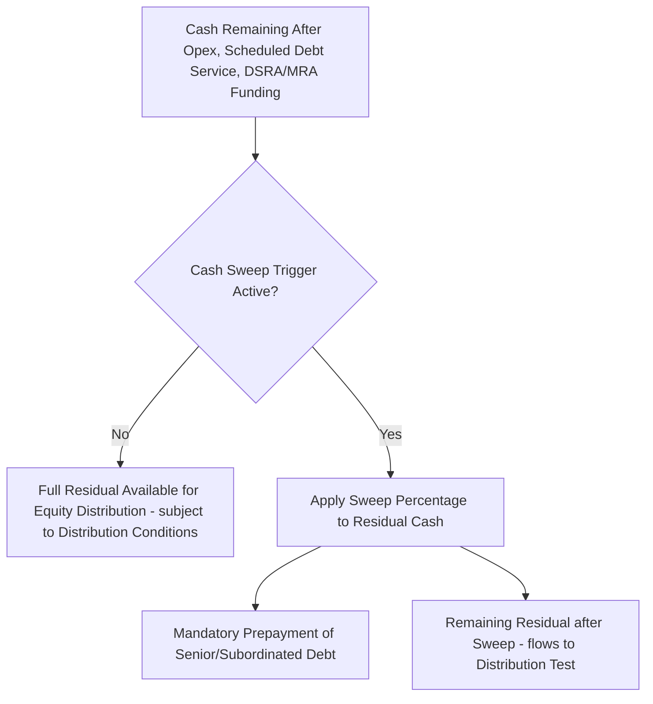

## Cash Sweep and Excess Cash Flow Mechanisms

### Definition and Core Concept

A **cash sweep** (or **excess cash flow mandatory prepayment** mechanism) directs some or all of a project's residual cash — the amount remaining after operating costs, scheduled debt service, and reserve funding — toward mandatory prepayment of outstanding debt, rather than allowing it to flow through to equity distributions. Unlike scheduled amortization, which follows a fixed schedule agreed at financial close, a cash sweep is **variable and performance-linked**: the amount prepaid depends on how much excess cash the project actually generates in a given period, accelerating deleveraging when the project outperforms.

### Purpose and Function

**Key Points**

- Reduces outstanding debt faster than the scheduled amortization profile when the project generates cash flow above the base case, directly reducing lenders' exposure and refinancing/balloon risk at maturity.
- Provides lenders a mechanism to capture upside from project outperformance (higher-than-forecast revenue, lower-than-forecast costs) without renegotiating the loan agreement, since the mechanism is defined contractually at close and operates automatically.
- Serves as the primary structural mitigant for **balloon and bullet repayment risk**: sweeps are frequently mandated specifically in the years leading up to a balloon maturity, systematically shrinking the residual balloon amount that must be refinanced.
- Functions as an automatic deleveraging response to weaker-than-expected asset life, cost overruns elsewhere in the structure, or changing market conditions, without requiring lenders to actively renegotiate or waive covenants.

### Position in the Cash Flow Waterfall

The cash sweep sits below scheduled debt service and reserve funding but above equity distributions — Tier 7 in the standard waterfall structure covered under cash flow waterfall design:

### Sweep Percentage Structures

**Key Points**

- **Fixed percentage sweep**: a constant percentage (e.g., 50%, 75%, or 100%) of residual cash is swept every period the mechanism is active, with the remainder available for distribution (subject to the standard lock-up conditions).
- **Leverage-triggered/step-down sweep**: the sweep percentage varies based on the project's current leverage ratio or DSCR level — e.g., 100% sweep while leverage exceeds a high threshold, stepping down to 50% and then 0% as leverage declines, incentivizing early deleveraging while eventually restoring full distribution flexibility once credit metrics improve.
- **Balloon-proximity sweep**: sweep activates only within a defined window before a balloon/bullet maturity (e.g., the final 3–5 years of a 10-year loan term with a 20-year notional amortization), specifically targeting reduction of the residual balloon amount.
- **Performance-triggered sweep**: sweep activates only if actual DSCR or CFADS falls below (or, in an upside-capture structure, rises above) a specified threshold relative to the base case, tying the mechanism to demonstrated project performance rather than applying unconditionally.

### Excess Cash Flow Calculation

The amount of cash subject to sweep in a given period is typically defined as:

$$ECF_t = CFADS_t - DS_t^{scheduled} - \Delta Reserve_t - Tax_t$$

where $CFADS_t$ is cash flow available for debt service, $DS_t^{scheduled}$ is scheduled (non-sweep) debt service for the period, $\Delta Reserve_t$ is the net funding requirement for DSRA/MRA and other reserves in that period, and $Tax_t$ captures any tax payments not already embedded in CFADS depending on the specific CFADS definition used in the financing documents. The swept prepayment amount is then:

$$Sweep_t = ECF_t \times SweepPct_t$$

where $SweepPct_t$ is the applicable sweep percentage for period $t$, which may be fixed or determined by the leverage/DSCR-based step-down schedule.

### Worked Example

**Example**

Assume a project in Year 8 of a 10-year loan term (balloon-proximity sweep active from Year 7 onward):

- CFADS for the period: $45,000,000
- Scheduled debt service: $28,000,000
- Reserve funding requirement (DSRA/MRA): $3,000,000
- Applicable sweep percentage (balloon-proximity window, leverage still above step-down threshold): 75%

Excess cash flow:

$$ECF = 45{,}000{,}000 - 28{,}000{,}000 - 3{,}000{,}000 = \$14{,}000{,}000$$

Mandatory sweep prepayment:

$$Sweep = 14{,}000{,}000 \times 0.75 = \$10{,}500{,}000$$

Residual cash available for the distribution test after sweep:

$$Residual = 14{,}000{,}000 - 10{,}500{,}000 = \$3{,}500{,}000$$

This $10.5M prepayment is applied to outstanding principal (typically in inverse order of maturity — reducing the final balloon payment first — or pro-rata across remaining scheduled principal, per the specific loan agreement's prepayment application provisions), directly shrinking the balloon amount due at maturity relative to what the base-case schedule projected.

### Prepayment Application Order (Waterfall Within the Sweep)

**Key Points**

- **Inverse order of maturity ("last-in, first-reduced")**: swept amounts reduce the latest scheduled payments first — most commonly used when the specific goal is balloon risk reduction, since it directly shrinks the residual amount due at maturity.
- **Pro-rata across remaining schedule**: swept amounts reduce each remaining scheduled payment proportionally, preserving the shape of the amortization profile rather than concentrating the benefit at maturity.
- **Sequential (chronological) order**: swept amounts are applied to reduce the *next* scheduled payment(s) first, accelerating near-term relief but doing less to address long-dated balloon risk.
- Multi-tranche structures (senior/subordinated) typically direct sweep proceeds to senior debt first (reflecting seniority), unless the subordinated facility has separately negotiated sweep participation rights.

### Interaction with Distribution Lock-Up Tests

**Key Points**

- The cash sweep and the distribution lock-up test (covered under cash flow waterfall structuring) are related but distinct mechanisms: the sweep operates on a defined percentage regardless of whether the distribution test passes, while the lock-up test governs whether the *remaining, unswept* residual can actually reach equity.
- A project can simultaneously be subject to a 100% sweep (no residual after sweep application) and technically "pass" its distribution test — the sweep, not the lock-up test, is what prevents distributions in that scenario.
- Some financing documents define the sweep and lock-up thresholds using the same underlying leverage/DSCR metric but with different trigger levels — e.g., sweep activates at a less severe threshold than full distribution lock-up, creating an intermediate zone where partial distributions and partial sweeping occur simultaneously.

### Voluntary vs. Mandatory Prepayment Distinction

**Key Points**

- Cash sweep amounts are **mandatory prepayments** — contractually required, not discretionary — distinguishing them from **voluntary prepayments**, which sponsors may elect to make (often to reduce future interest cost or manage leverage proactively) subject to any prepayment fee/breakage cost provisions.
- Mandatory prepayments from cash sweeps are typically **not** subject to prepayment penalties/premiums (since they are a built-in structural feature agreed at close), whereas voluntary prepayments — and particularly refinancing-driven full prepayments — may trigger make-whole provisions, minimum notice periods, or (as covered under interest rate swap modeling) swap break costs if hedged debt is being prepaid.

### Modeling the Cash Sweep

**Key Points**

- Build the ECF calculation as a formula directly referencing the CFADS, scheduled debt service, and reserve funding lines already present in the waterfall model — the sweep should be a downstream calculation off the existing waterfall structure, not a parallel, disconnected calculation.
- Model the sweep percentage as a lookup/toggle driven by whichever trigger the financing documents specify (leverage band, DSCR band, or a fixed balloon-proximity date range), so that sensitivity testing on the underlying performance metric automatically flows through to the correct sweep percentage.
- Apply the swept prepayment amount to the debt amortization schedule using the contractually specified application order (inverse maturity, pro-rata, or sequential), and ensure the model recalculates all subsequent periods' scheduled interest and principal off the *reduced* balance — a sweep in one period changes the entire forward amortization schedule.
- Where sweep percentage depends on a leverage or DSCR metric that itself depends on the debt balance (which the sweep is actively changing), check for circularity consistent with the iterative debt sizing techniques discussed for other circular structures; sweep-driven circularity is usually resolved with a simple sequential period-by-period calculation (this period's sweep depends on this period's pre-sweep metrics, not the post-sweep balance) rather than requiring true iteration.
- Present total cumulative sweep prepayments and the resulting balloon amount at maturity as explicit model outputs, since demonstrating the sweep's effectiveness in reducing refinancing risk is frequently a specific requirement of lender credit papers and rating agency presentations. [Inference: the degree of balloon risk reduction actually achieved depends on realized project performance over the sweep period, which cannot be known with certainty at financial close.]

**Next Steps**

- Structuring the Cash Flow Waterfall
- Bullet and Balloon Repayment Structures
- Debt Service Reserve Account Mechanics
- Distribution Lock-Up Tests and DSCR Covenant Design
- Iterative Debt Sizing Techniques
- Interest Rate Swap Modeling in Project Finance
- Refinancing Feasibility Modeling and Break Cost Contingencies
- Other Reserve Accounts and Trapped Cash Structures