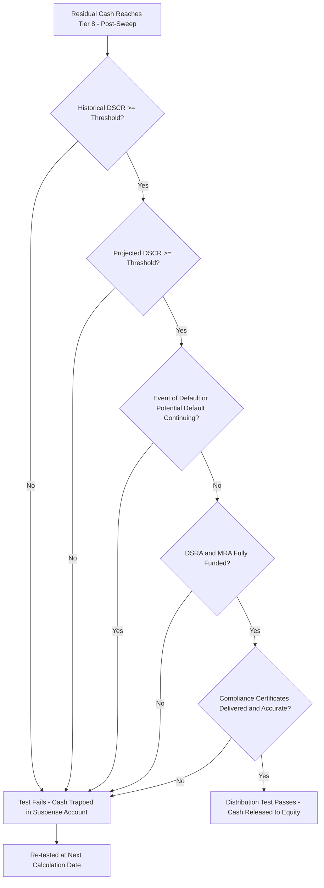

## Distribution Tests and Lock-Up Conditions

### Definition and Core Concept

**Distribution tests** (also called **restricted payment conditions**, **dividend tests**, or **lock-up tests**) are the set of contractual conditions in project finance financing documents that must be satisfied before cash otherwise available at the bottom of the cash flow waterfall can actually be paid to equity holders. Even when cash is technically present in the distribution account, financing documents typically require the SPV to demonstrate — through defined financial and compliance tests — that the project is performing adequately and that lenders' interests are not being impaired before releasing that cash. Failure of any test **locks up** (traps) the cash, redirecting it to a distribution suspense account rather than to shareholders.

### Purpose and Function

**Key Points**

- Provides lenders an ongoing, automatic monitoring and control mechanism over cash leakage, operating independently of (and typically at a less severe threshold than) formal events of default — creating an intermediate "amber zone" between healthy performance and outright default.
- Protects against the moral hazard of sponsors extracting cash during a period of weakening project performance, before the deterioration becomes severe enough to breach a maintenance covenant or trigger default.
- Aligns sponsor incentives with lenders' interests: since distributions are conditional on continued satisfactory performance, sponsors are incentivized to maintain the asset and manage the project prudently rather than prioritizing short-term cash extraction.
- Forms the final gate in the standard cash flow waterfall (Tier 8), applied after all higher-priority tiers (opex, debt service, reserve funding, cash sweep) have already been satisfied or allocated.

### Standard Components of the Distribution Test

**Key Points**

- **Historical (backward-looking) DSCR test**: typically measured over a trailing period (commonly the preceding 12 months, or the two most recent semi-annual periods), requiring actual DSCR to have been at or above a specified minimum threshold.
- **Projected (forward-looking) DSCR test**: requiring projected DSCR for a forward period (often the next 12 months, or next one to two debt service periods) to be at or above the same or a related threshold, based on the SPV's latest financial projections.
- **No default/potential default certification**: requiring that no Event of Default or Potential Default (a default that would occur with notice or lapse of time) is continuing at the test date.
- **Reserve account funding condition**: requiring the DSRA and MRA (and any other applicable reserves) to be funded to their Required Balance at the test date.
- **Compliance certificate delivery**: requiring the borrower to have delivered accurate, up-to-date compliance certificates and financial statements per the reporting covenants in the financing documents.
- **Insurance and representations bring-down**: some structures additionally require confirmation that required insurances remain in place and that representations/warranties remain true in all material respects.

### The Dual DSCR Test Structure

The combination of historical and projected DSCR tests is a deliberate structural choice, addressing two different failure modes:

$$\text{Distribution Permitted} = (DSCR_{historical} \geq DSCR_{min}) \; \text{AND} \; (DSCR_{projected} \geq DSCR_{min})$$

- The **historical test alone** would allow a distribution based on strong past performance even if the project is currently facing a known, imminent deterioration (e.g., an offtaker termination notice already received, or a major maintenance event known to be approaching) — the projected test closes this gap.
- The **projected test alone** would allow a distribution based on optimistic forecasts despite recent actual underperformance — the historical test closes this gap.
- Both thresholds are typically set at or near (sometimes slightly below) the minimum DSCR level used in original debt sizing, though some structures set the distribution threshold with a margin of safety above the debt sizing threshold (e.g., debt sized at 1.30x minimum DSCR, but distribution test set at 1.35x) to provide an additional buffer before cash actually reaches equity.

### Worked Example

**Example**

Assume a distribution test requiring both historical and projected DSCR ≥ 1.35x, no continuing default, and full reserve funding. At a semi-annual test date:

- Trailing 12-month DSCR: 1.42x (passes historical test)
- Next 12-month projected DSCR: 1.31x (fails projected test — a known upcoming increase in scheduled principal, or a contracted revenue step-down, is driving the lower forward-looking coverage)
- No continuing default
- DSRA and MRA fully funded

Despite strong historical performance and no default, the distribution test **fails** overall because the projected DSCR component does not meet the 1.35x threshold. All residual cash at Tier 8 is redirected to the distribution suspense account rather than paid to equity, even though the project has been performing well to date — illustrating how the forward-looking component specifically protects lenders against anticipated (not yet realized) deterioration.

### Cure Mechanics and Testing Frequency

**Key Points**

- Distribution tests are typically assessed at each **Calculation Date** or **Distribution Date**, commonly aligned with the interest payment date frequency (quarterly or semi-annually).
- A single failed test period does not necessarily mean permanent lock-up — most structures allow the test to be **re-assessed at the next testing date**, releasing previously trapped cash (subject to it still satisfying the test at that later date) once conditions improve.
- Some structures impose a **minimum cure period** or require the test to be satisfied for a defined number of **consecutive** testing periods before trapped cash is released, adding a stability requirement beyond a single passing test.
- Distinguish cure of a *distribution test failure* (generally a covenant-light consequence — cash trapping only) from cure of a *financial covenant breach* constituting a Potential Default or Event of Default (which may carry more severe consequences, including acceleration rights) — the two are related but contractually distinct mechanisms with different consequences and cure provisions.

### Interaction with Cash Sweep Mechanisms

**Key Points**

- The distribution test and the cash sweep (covered separately) are complementary but operationally distinct: the sweep determines *how much* residual cash is diverted to mandatory prepayment regardless of test outcome, while the distribution test determines whether the cash that survives the sweep can actually reach equity.
- It is possible for both mechanisms to be active simultaneously at different threshold levels — e.g., a leverage-triggered sweep percentage that steps down as leverage improves, layered with a separate DSCR-based distribution lock-up — requiring the model to evaluate both conditions independently in the correct sequence within the waterfall.
- In some structures, a failed distribution test itself triggers or increases the cash sweep percentage for that period, explicitly linking the two mechanisms (rather than leaving 100% of the post-sweep residual sitting idle in the suspense account).

### Distribution Test Decision Logic

### Negotiation Considerations

**Key Points**

- The specific DSCR threshold level is one of the most heavily negotiated single parameters in project finance documentation: sponsors seek lower thresholds (more distribution flexibility), while lenders seek higher thresholds (more cash retained as a buffer) — the negotiated level typically sits close to, but not necessarily identical to, the minimum DSCR used in original debt sizing.
- Sponsors sometimes negotiate a **step-down distribution threshold** over time (e.g., a higher threshold in early operating years when performance uncertainty is greatest, stepping down to a lower threshold once a track record of stable operations is established).
- The definition of "CFADS" and "DSCR" used for the distribution test must be explicitly and consistently defined in the financing documents (which cost/revenue items are included/excluded) — ambiguity or inconsistency between the debt sizing DSCR definition and the distribution test DSCR definition is a common source of dispute and modeling error.
- Multi-tranche structures may impose separate distribution tests applicable at the senior and subordinated/mezzanine levels, with subordinated distributions (interest payments to mezzanine holders, if structured similarly) sometimes subject to their own, typically stricter, test.

### Modeling Distribution Tests

**Key Points**

- Build each individual test component (historical DSCR, projected DSCR, default flag, reserve funding flag, compliance flag) as a separate boolean output, then combine them with an explicit AND logic gate into a single "Distribution Permitted" flag — this makes it possible to trace which specific condition is driving a lock-up in any given period, which is essential for both internal review and lender reporting.
- Ensure the projected DSCR calculation uses a consistent forward-looking window and the same CFADS/debt service definitions as the historical calculation and as the original debt sizing calculation, to avoid an internally inconsistent model where different DSCR figures appear to contradict each other without a clear, documented reason.
- Model the distribution suspense account as a running balance (not merely a zeroed-out or hidden cash flow), so that if/when the test subsequently passes, the model correctly shows the release of both the current period's residual cash and any previously accumulated trapped balance, subject to any cure-period/consecutive-testing requirements.
- Where a "no default" certification is a component of the test, this typically needs to be modeled as a manual input/toggle (since default is a legal/contractual determination not purely derivable from the financial model), while all quantitative tests (DSCR thresholds, reserve funding) can be built as live formulas. [Inference: the practical modeling approach for the "no default" flag depends on how the specific model is intended to be used and updated, and conventions vary across financial institutions.]

**Next Steps**

- Structuring the Cash Flow Waterfall
- Cash Sweep and Excess Cash Flow Mechanisms
- Debt Service Reserve Account Mechanics
- Maintenance Reserve Account Mechanics
- Debt Service Coverage Ratio (DSCR) Calculation and Covenant Design
- Loan Life Coverage Ratio (LLCR) and Project Life Coverage Ratio (PLCR)
- Events of Default and Standstill/Enforcement Provisions
- Intercreditor Agreements and Subordination Mechanics