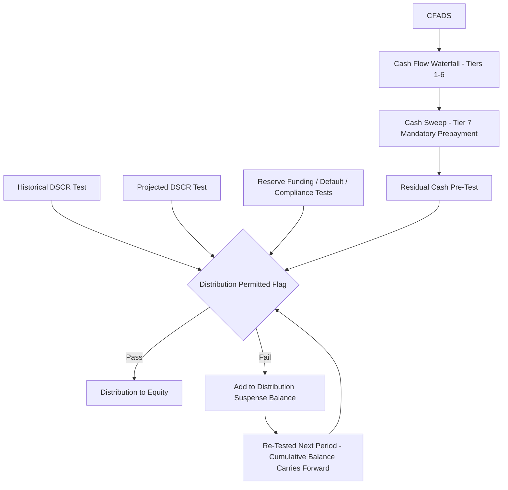

## Dividend Trap and Equity Distribution Modeling

### Definition and Core Concept

The **dividend trap** describes the modeled outcome where cash that is nominally "available" at the residual tier of the waterfall becomes structurally unable to reach equity because one or more distribution test conditions fail, causing it to accumulate indefinitely in a distribution suspense account rather than flow through to shareholders. **Equity distribution modeling** is the broader discipline of building the model logic — spanning the waterfall, reserve accounts, cash sweep, and distribution tests already covered — into a coherent, auditable calculation of what equity actually receives and when, which underpins the equity IRR and cash-on-cash return calculations that sponsors use to evaluate the investment.

### Why the Dividend Trap Matters for Equity Returns

**Key Points**

- Equity IRR is highly sensitive to the **timing** of distributions, not just their total amount over the project life — a dividend trap that defers cash by several years, even if fully released later, can materially reduce the calculated IRR due to the time value of money embedded in the IRR metric.
- A trap that is never fully released (e.g., persistent underperformance keeps DSCR below the distribution threshold for the remainder of the debt term) permanently impairs equity returns, since trapped cash generally does not earn a return credited to equity in the way it would if distributed and reinvested externally.
- Modeling the dividend trap explicitly (rather than assuming distributions always occur on schedule) is essential for realistic downside-case and sensitivity analysis — an equity model that ignores the possibility of trapping will systematically overstate IRR under any scenario where performance dips below the distribution test thresholds, even temporarily.
- From a lender's perspective, the dividend trap is a *feature*, not a modeling nuisance — it is the intended mechanism protecting their position; from a sponsor's perspective, correctly modeling trap risk is central to accurately pricing the equity investment's risk-adjusted return.

### Structural Components Feeding the Trap Calculation

The dividend trap calculation sits at the convergence point of several previously covered mechanisms, each of which must already be correctly modeled:

### Core Modeling Formula

The equity distribution in any period is a conditional function of the residual cash and the distribution test outcome:

$$Dist_t = \begin{cases} Residual_t + Susp_{t-1} & \text{if } TestPass_t = 1 \text{ (and any cure-period condition is also satisfied)} \\ 0 & \text{if } TestPass_t = 0 \end{cases}$$

and the distribution suspense account balance evolves as:

$$Susp_t = Susp_{t-1} + Residual_t - Dist_t$$

which, substituting the two cases, simplifies to $Susp_t = 0$ when the test passes (full release, assuming no consecutive-period cure requirement) and $Susp_t = Susp_{t-1} + Residual_t$ when the test fails (cash accumulates). This formulation makes explicit that the suspense account is a **stock** (accumulated balance) while the residual cash and distribution are **flows** — a distinction that is easy to model incorrectly if the suspense account is treated as a memo item rather than a proper running balance.

### Worked Example

**Example**

Assume a project with the following residual cash and test outcomes over four consecutive semi-annual periods:

| Period | Residual Cash (Pre-Test) | Test Outcome | Distribution | Suspense Balance (End of Period) |
| --- | --- | --- | --- | --- |
| 1 | $4,000,000 | Pass | $4,000,000 | $0 |
| 2 | $2,500,000 | Fail (projected DSCR below threshold) | $0 | $2,500,000 |
| 3 | $3,200,000 | Fail (historical DSCR still recovering) | $0 | $5,700,000 |
| 4 | $3,800,000 | Pass | $9,500,000 | $0 |

In Period 4, the full $9,500,000 released comprises that period's own $3,800,000 residual plus the entire $5,700,000 accumulated suspense balance from Periods 2–3. From an IRR perspective, this $9,500,000 lump sum arriving in Period 4 is valued differently than if the same total cash had been distributed as $2,500,000 / $3,200,000 / $3,800,000 across Periods 2–4 as originally generated — the delayed, lumped timing reduces the present value of that cash stream to equity, even though the nominal total is identical.

### Consecutive-Period Cure Requirements

**Key Points**

- Where financing documents require the distribution test to pass for a defined number of **consecutive** testing periods before release (rather than a single passing test immediately releasing the full suspense balance), this must be modeled as an explicit counter, not a simple boolean.
- The model should track a "consecutive passes" counter that increments each period the test passes and resets to zero on any failure, only triggering release once the counter reaches the required threshold (e.g., two consecutive semi-annual passes).
- This materially changes the timing of release compared to a simple "test passes this period, release everything" assumption, and is a common source of discrepancy between simplified sponsor models and the more conservative treatment lenders' models or rating agency models may apply.

### Sensitivity and Downside Case Design

**Key Points**

- Because the dividend trap is a threshold/boolean phenomenon (cash either flows or it doesn't), equity returns can exhibit sharp, non-linear sensitivity around the DSCR threshold level — a downside scenario that pushes projected DSCR just below the distribution threshold can trap far more cash, and for far longer, than the underlying operational shortfall alone would suggest.
- Downside sensitivity analysis should explicitly test scenarios that push DSCR to just below (not only far below) the distribution threshold, since this "near-miss" zone often produces counterintuitively severe equity IRR impacts relative to the operational severity of the underlying shortfall.
- Combine dividend trap modeling with cash sweep modeling in the same sensitivity run: a downside scenario often simultaneously increases the sweep percentage (via a leverage-triggered step-up) and fails the distribution test, compounding the equity cash flow impact — testing these mechanisms independently understates the combined effect.
- Present both a "trapped cash balance" time series and a "distributions actually received" time series as separate equity model outputs, rather than only the net distribution line, so that sponsors and equity investors can see how much value is sitting in suspense at any point versus permanently lost to trapping (e.g., due to a shortened debt term or refinancing event that resolves before full release).

### Interaction with IRR and Return Metrics

**Key Points**

- Equity IRR should be calculated using the **actual modeled timing** of distributions (including trap-delayed releases), not the theoretical timing of when residual cash was generated, since IRR is fundamentally a time-value-of-money metric sensitive to cash flow dates.
- Where a project's debt term ends (e.g., via refinancing or full repayment) while a suspense balance remains, financing documents typically specify what happens to that balance — commonly full release to equity upon final repayment/discharge of the security, since the reserve's protective purpose (protecting lenders) no longer applies — this release event should be explicitly modeled as occurring at debt maturity/discharge, not assumed to continue indefinitely.
- Equity-side sponsors modeling multiple projects in a portfolio context should consider that trapped cash in one project does not automatically substitute for distributions needed to service holding-company-level obligations (e.g., a portfolio holdco's own debt service or sponsor return targets) — this cross-project liquidity risk is a common oversight in simplified portfolio models. [Inference: the materiality of this cross-project effect depends on the sponsor's specific capital structure and portfolio composition, which varies by transaction.]

**Next Steps**

- Distribution Tests and Lock-Up Conditions
- Cash Sweep and Excess Cash Flow Mechanisms
- Debt Service Reserve Account Mechanics
- Equity IRR Optimization and Debt-Equity Mix Sizing
- Iterative Debt Sizing Techniques
- Structuring the Cash Flow Waterfall
- Bullet and Balloon Repayment Structures
- Sensitivity and Scenario Analysis on Exit/Refinancing Assumptions