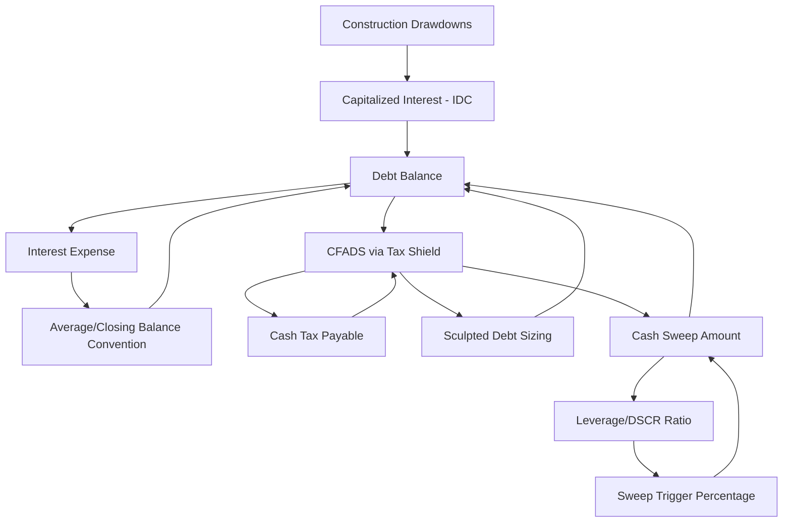

## Identifying Sources of Circular References

### Definition and Core Concept

A **circular reference** in a project finance model exists when a calculation in cell/formula A depends, directly or through a chain of intermediate calculations, on a value that itself depends on A. Project finance models are structurally prone to circularity because the core objects being modeled — debt balances, interest expense, cash available for debt service, and equity returns — are mutually interdependent by the economics of the transaction itself, not merely by modeling choices. Recognizing *where* circularity originates is the necessary first step before selecting an appropriate resolution technique (algebraic restructuring, iterative calculation, or a manual circularity breaker).

### Why Project Finance Models Are Inherently Circularity-Prone

**Key Points**

- Unlike a simple corporate model where debt is typically a fixed, pre-determined input, project finance models frequently **size** the debt itself as an output of the cash flows the debt is meant to be sized against — placing the debt amount on both sides of the calculation.
- Interest expense depends on the outstanding debt balance, which depends on the amortization schedule, which in some structures (sculpting, cash sweeps) depends on cash flow, which itself is net of interest expense — closing the loop.
- Cash-based interest calculations (as opposed to a fixed opening-balance convention) inherently reference the *average* or *closing* balance for the period, which is not known until that same period's principal repayment (partly a function of interest) is calculated.
- Tax calculations often reference interest expense (as a deduction) to determine cash tax payable, which affects CFADS, which affects debt service capacity or sweep amounts, which affects the debt balance driving interest expense in the first place.

### Primary Circularity Source #1: Interest on Average/Closing Balance

**Key Points**

- When interest is calculated on the **average** of opening and closing balance within a period (rather than solely on the opening balance), the calculation directly references the closing balance — but the closing balance is opening balance less principal repayment, and principal repayment (under a sculpted or debt-service-driven schedule) may itself be derived net of that period's interest.
- This is the most common and most easily avoidable circularity in project finance models: using an **opening-balance-only** interest convention (interest calculated solely on the balance at the *start* of the period, unaffected by that period's own repayment) breaks this loop entirely, since interest then depends only on a balance already fixed at the start of the calculation.
- Some financing documents and market conventions specifically require average-balance interest calculation (particularly for revolving facilities or where drawdowns/repayments occur mid-period) — in these cases, the circularity is a genuine feature of the required calculation methodology, not merely a modeling choice, and must be resolved through iteration or restructuring rather than avoided.

### Primary Circularity Source #2: Debt Sizing via Sculpting or Goal-Seek

**Key Points**

- As covered under iterative debt sizing techniques, sizing debt to a target DSCR against CFADS that is itself affected by the debt balance (through interest tax shields, or through cash sweep triggers that depend on leverage) creates a direct circular reference if solved via live formulas rather than a closed-form calculation.
- The sculpting method's closed-form PV-of-CFADS approach avoids this circularity by construction for the *initial* debt sizing calculation, but circularity can re-emerge in the **backward-substitution** step that splits the resulting debt service stream into principal and interest components period-by-period, since interest in each period depends on the declining balance built up from prior periods' principal splits — though this specific instance resolves cleanly via simple sequential (not true iterative) calculation.
- True re-circularity in sculpted models often arises when sculpting interacts with a **cash sweep** whose trigger threshold is itself a leverage ratio computed off the sculpted debt balance, since the sweep changes the balance, which changes the leverage ratio, which changes whether the sweep is active.

### Primary Circularity Source #3: Cash Sweep and Leverage-Based Triggers

**Key Points**

- Leverage-triggered or DSCR-triggered cash sweep percentages (covered under cash sweep mechanisms) reference the current debt balance or coverage ratio to determine the sweep percentage — but the sweep itself changes the debt balance for that same period, meaning a naively built formula referencing the *post-sweep* balance to determine *that period's* sweep percentage is directly circular.
- This is typically resolved not through iteration but through a **timing convention**: basing the sweep trigger on the *prior period's closing* leverage/DSCR (a lagged reference), which is already a fixed, known value by the time the current period's sweep is calculated — eliminating the circularity by construction rather than requiring iterative settings.
- Genuine circularity (rather than a timing-convention fix) arises only if the financing documents specifically require the trigger to be assessed on the *current* period's post-sweep position, which is less common but does occur in some structures.

### Primary Circularity Source #4: Capitalized Interest During Construction (IDC)

**Key Points**

- As covered under grace periods and repayment holidays, capitalizing interest during construction adds accrued interest to the principal balance, which increases the balance on which subsequent interest is calculated — a genuine, unavoidable circularity within the construction period if the total construction financing requirement (drawdowns plus capitalized interest) is being solved simultaneously with the interest calculation itself.
- This differs from the average-balance circularity in that it cannot be eliminated by switching to an opening-balance convention, since the entire point of IDC capitalization is that each period's interest becomes part of the principal for subsequent periods — the circularity is structural to the calculation's definition, not an artifact of formula design.
- Typically resolved via a **construction drawdown schedule sequencing**: since drawdowns and interest accrual within the construction period generally proceed in a known chronological sequence (each period's interest depends only on drawdowns and capitalized interest *already accrued from prior periods*), a period-by-period forward calculation resolves this without true iteration, provided the model is built with sufficient period granularity and doesn't attempt to solve the entire construction-period total interest in a single simultaneous equation.

### Primary Circularity Source #5: Tax Circularity via Interest Deductibility

**Key Points**

- Interest expense is deductible for tax purposes in most jurisdictions, so cash tax payable depends on interest expense; but in models where debt is sized or a cash sweep operates based on post-tax CFADS, the debt balance (and hence interest) indirectly depends on the tax calculation that itself depends on interest — a multi-step circular chain.
- This is compounded in jurisdictions with **thin capitalization rules**, **interest deduction limitation rules** (e.g., an EBITDA-based cap on deductible interest), or **withholding tax on interest payments to foreign lenders**, where the deductible/payable amount is itself a function of the debt and interest structure being determined. [Unverified: specific thin-capitalization and interest-limitation rules vary significantly by jurisdiction and are subject to legislative change, so applicable current rules should be confirmed for the specific project's jurisdiction rather than assumed.]
- Tax circularity is often the least visible source in a model's formula audit, since it may pass through several intermediate calculation tabs (interest schedule → income statement → tax schedule → cash flow statement → CFADS → debt sizing/sweep) before looping back, making it harder to detect through simple cell-tracing than the more direct circularities above.

### Circularity Source Map

### Diagnostic Approach to Locating Circularity

**Key Points**

- Use the spreadsheet application's built-in circular reference warning/trace tools as the first diagnostic step, but recognize that these tools typically flag only the *cells* involved, not the *economic logic* creating the loop — understanding *why* the circularity exists (which of the five sources above) is necessary to choose the correct fix.
- Systematically trace each candidate driver — interest balance convention, debt sizing method, sweep trigger timing, IDC treatment, and tax/interest interaction — individually by temporarily hardcoding one at a time and observing whether the circular reference warning clears, isolating which specific mechanism is the active source in a given model.
- In complex models with multiple circularity sources simultaneously present, resolve and verify them one at a time rather than attempting a single global fix, since fixing one source (e.g., switching to opening-balance interest) may fully resolve the model, or may simply unmask a second, previously hidden source (e.g., tax circularity) that was obscured by the first.
- Document each identified circularity source and its resolution method directly in the model's assumptions/notes tab, since undocumented circularity handling is a frequent finding in third-party model audits and a common source of confusion when models are handed over between modeling teams or updated by a different analyst later in the transaction.

**Next Steps**

- Iterative Debt Sizing Techniques
- Techniques for Resolving Circularity Without Iterative Calculation
- Circular Reference Management and Model Integrity Best Practices (FAST Standard)
- Interest Rate Swap Modeling in Project Finance
- Cash Sweep and Excess Cash Flow Mechanisms
- Grace Periods and Repayment Holidays
- Tax Modeling and Interest Deductibility Limitations in Project Finance
- Dividend Trap and Equity Distribution Modeling