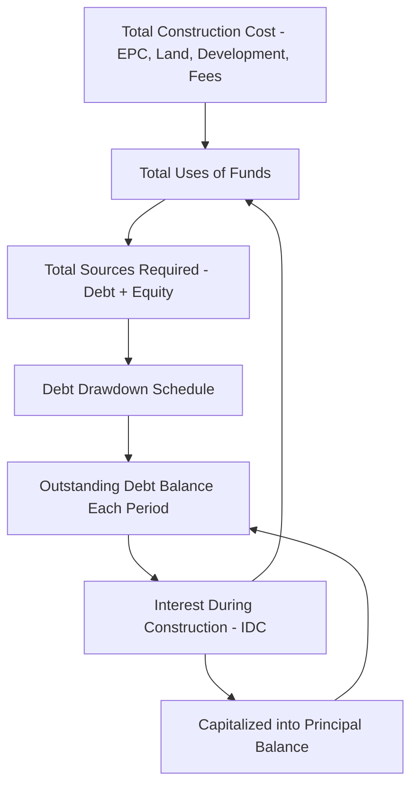

## Interest During Construction Circularity

### Definition and Core Concept

**Interest During Construction (IDC) circularity** is the specific circular reference that arises when interest accruing on drawn debt during the construction period is capitalized into the debt principal itself, and the total construction financing requirement (which determines total drawdowns, which determines the debt balance, which determines interest, which determines IDC, which adds back into the financing requirement) must all be solved as a mutually consistent set. Unlike the average-balance interest circularity (resolvable via a simple opening-balance convention), IDC circularity is structural: the capitalized interest amount is, by definition, both an output of the construction financing calculation and an input to it, since IDC itself must be funded — typically by additional debt drawdown — increasing the very principal balance generating the interest.

### Why IDC Circularity Is Structurally Unavoidable

**Key Points**

- The total **Sources and Uses of Funds** for a construction project includes IDC as a "Use" (a cost that must be financed, alongside EPC costs, land, development fees, and other capitalized construction costs) — but IDC's magnitude depends on the total debt drawn, which depends on total Uses, which includes IDC itself.
- This differs fundamentally from operational-period circularity (e.g., cash sweep or tax circularity), which can often be resolved through timing conventions (lagged references) without loss of accuracy — IDC circularity cannot be eliminated by a lagged reference alone, because the *entire construction period's* total funding requirement is what's being solved, not a single period's balance.
- The degree of circularity intensity depends on the **debt-to-total-capitalization ratio** during construction and the **construction period length**: longer construction periods and higher leverage produce larger IDC amounts relative to base construction cost, making the circularity's magnitude more material to get right.
- Equity and debt drawdown sequencing (e.g., whether equity is drawn first, pro-rata with debt, or last) also affects the calculation, since the debt balance generating IDC depends on how much of each period's funding requirement is met by debt versus equity — a further layer of interdependency.

### The Construction Funding Circularity Loop

### Mathematical Formulation

For a single-period simplification, if $U$ is the non-IDC construction cost (Uses excluding IDC), $E$ is equity funding, and $D$ is debt funding, with debt bearing rate $r$ over the construction period, the circular relationship is:

$$D = U + IDC - E$$

$$IDC = D \times r \times t$$

Substituting the second equation into the first:

$$D = U - E + (D \times r \times t)$$

Solving algebraically for $D$ (rearranging to isolate $D$ on one side):

$$D(1 - rt) = U - E$$

$$D = \frac{U - E}{1 - rt}$$

This single-period case demonstrates that IDC circularity, unlike many other circularity sources, **can** be resolved algebraically in simple cases — the closed-form solution avoids needing iterative calculation, provided the funding structure is simple enough (single debt tranche, fixed rate, equity funded upfront or in a fixed known proportion) to isolate $D$ this way.

### Worked Example: Single-Period Closed-Form Solution

**Example**

Assume:

- Non-IDC construction cost $U = \$300{,}000{,}000$
- Equity funding $E = \$90{,}000{,}000$ (assumed funded upfront, unaffected by IDC)
- Construction-period interest rate $r = 6\%$ annually
- Effective construction period for interest accrual purposes $t = 1.5$ years (weighted-average drawdown timing)

$$D = \frac{300{,}000{,}000 - 90{,}000{,}000}{1 - (0.06 \times 1.5)} = \frac{210{,}000{,}000}{0.91} \approx \$230{,}769{,}231$$

Implied IDC:

$$IDC = 230{,}769{,}231 \times 0.06 \times 1.5 \approx \$20{,}769{,}231$$

Verification: $D = U - E + IDC = 300{,}000{,}000 - 90{,}000{,}000 + 20{,}769{,}231 = \$230{,}769{,}231$ ✓, confirming the algebraic solution is internally consistent without requiring iterative recalculation.

### Why Multi-Period Models Usually Require True Iteration or Sequential Build-Up

**Key Points**

- The single-period closed-form solution above is a simplification; real construction financings have drawdowns spread across many periods (monthly or quarterly draws against an S-curve or EPC milestone schedule), each period's interest depending on the balance built up from all prior periods' drawdowns *and* prior periods' capitalized interest.
- Because each period's IDC calculation only depends on the balance from **prior** periods (already known/fixed by the time that period's calculation runs), a **period-by-period sequential (forward) calculation** — not true iterative/circular calculation — is generally sufficient to resolve multi-period IDC without enabling iterative calculation settings, provided the model calculates strictly in chronological order and does not attempt to solve the total construction cost and total debt simultaneously in a single non-sequential formula.
- True iterative/circular calculation becomes necessary only when the model attempts to solve for a **single total debt/equity split** that must self-consistently fund a **known total cost target** (including its own IDC) in one step, rather than building the schedule forward period-by-period — this is a modeling architecture choice, not an unavoidable feature of IDC itself.
- Many practitioners prefer the sequential/period-by-period build specifically to avoid live circular references, treating the "one-shot algebraic solve" as useful for a quick estimate or cross-check but not as the primary model architecture.

### Sequential Period-by-Period Resolution Method

**Key Points**

- Structure the construction period into discrete intervals (monthly or quarterly) with a drawdown schedule specifying non-IDC costs funded by debt in each interval.
- Calculate each period's opening balance (prior period's closing balance), that period's new non-IDC drawdown, that period's interest expense on the *opening* balance (an opening-balance convention, avoiding the average-balance circularity layered on top of the IDC circularity), and the resulting closing balance (opening + drawdown + capitalized interest).
- Because each period's interest calculation references only the already-fixed opening balance from the prior period, no cell in this sequential structure references a value calculated later in the same formula chain — the "circularity" is resolved by spreading it across time rather than solving it within a single period.
- This approach requires the *total* construction cost to be either fixed in advance (a fixed EPC contract price known before financial close) or a working assumption/base case that may need periodic re-basing if actual costs deviate materially from the schedule — it does not eliminate the need to re-run the schedule if input assumptions change, but it eliminates the need for spreadsheet-level iterative calculation settings.

### Interaction with Contingency and Cost Overrun Provisions

**Key Points**

- Construction cost overruns funded by additional debt drawdown compound the IDC circularity's real-world materiality: an overrun increases the debt balance, which increases IDC, which further increases total funding required, potentially requiring an additional draw — in practice, this is usually handled through a **standby/contingency facility** with a separately capped drawdown limit rather than by re-solving the entire base debt sizing circularity.
- Where sponsor equity or standby facilities are structured to fund cost overruns **before** additional senior debt is drawn (a common lender requirement, sometimes called an "equity-first" or "cost overrun" support undertaking), this changes the sequencing of the sources-and-uses build and should be reflected in which funding source's schedule feeds the IDC calculation for the overrun portion specifically.
- Contingency drawn for reasons unrelated to interest accrual (e.g., unforeseen ground conditions, change orders) still generates its own IDC once drawn, so the overrun's IDC should be tracked using the same sequential mechanism as the base construction IDC, not treated as a flat addition.

### Modeling Considerations

**Key Points**

- Default to the **sequential/forward period-by-period construction schedule** as the primary model architecture for IDC, reserving the single-period algebraic closed-form solution for quick sanity-checks, initial sizing estimates during early-stage feasibility work, or independent cross-verification of the sequential build's output.
- Use an **opening-balance interest convention** within each construction period specifically to avoid layering an average-balance circularity on top of the inherent IDC timing structure — since drawdowns during construction are already granular and frequent, the approximation error from opening-balance-only convention is generally immaterial relative to the benefit of avoiding compounded circularity sources. [Inference: materiality of the opening-vs-average-balance approximation depends on drawdown frequency and period length relative to total construction cost, and should be checked for very lumpy or infrequent drawdown schedules.]
- Explicitly separate "IDC on base construction cost" from "IDC on capitalized IDC itself" (i.e., interest-on-interest) as distinct sub-components in the schedule if the financing documents or accounting treatment require this granularity, since some structures cap the total capitalizable interest amount or treat compounding IDC differently for tax purposes. [Unverified: capitalization caps and tax treatment of compounding IDC vary by jurisdiction and specific transaction terms.]
- Cross-check the fully built sequential schedule's total ending debt balance against the single-period algebraic approximation as a reasonableness check — a large divergence between the two suggests either a modeling error in the sequential build or that the drawdown profile is sufficiently non-uniform that the simplified single-period formula is not a valid approximation for that specific transaction.

**Next Steps**

- Identifying Sources of Circular References
- Grace Periods and Repayment Holidays
- Techniques for Resolving Circularity Without Iterative Calculation
- Sources and Uses of Funds Structuring in Construction Financing
- Iterative Debt Sizing Techniques
- Standby and Contingency Facility Structuring
- Fixed, Floating, and Hedged Interest Rate Structures
- Circular Reference Management and Model Integrity Best Practices (FAST Standard)