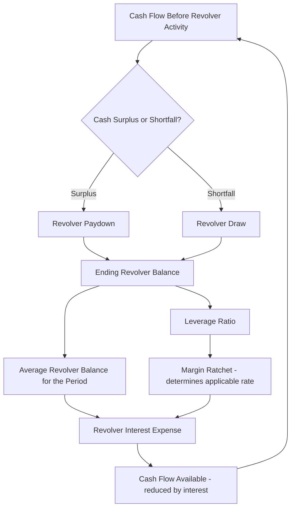

## Cash Sweep and Revolver Circularity

### Definition and Core Concept

**Cash sweep and revolver circularity** arises specifically when a mandatory cash sweep (covered under cash sweep mechanisms) or a revolving credit facility drawdown/repayment decision depends on a cash flow or balance figure that is itself affected by that same period's sweep or revolver activity. This is structurally distinct from the leverage-trigger circularity already noted under identifying sources of circular references: here, the loop is not about *whether* the sweep is active, but about the sweep or revolver **amount itself** being simultaneously an input to, and an output of, the same period's cash position.

### The Revolver Circularity Mechanism

**Key Points**

- A revolving credit facility (revolver) is typically structured with a **cash sweep/paydown feature**: any period-end cash balance above a minimum operating threshold is automatically applied to pay down outstanding revolver borrowings, while any cash shortfall triggers an automatic revolver draw to cover it.
- The circularity arises because the revolver draw or paydown amount depends on the period's **ending cash balance before revolver activity**, but that ending cash balance itself is affected by the period's interest expense, which depends on the **average revolver balance** during the period — which depends on the draw/paydown amount being solved for.
- This is functionally the classic "revolver circularity" problem well known in leveraged finance and corporate models, and it applies identically in project finance whenever a revolving liquidity facility (as opposed to a fixed-drawdown term facility) sits within the capital structure.
- The loop tightens further if the revolver's interest rate itself is tied to a leverage-based pricing grid (a "leverage-based margin ratchet"), since the margin used to calculate interest depends on a leverage ratio computed off the very revolver balance being solved.

### The Circularity Loop Diagram

### Mathematical Formulation

Let $CF_t$ be cash flow before revolver activity and interest, $R_{t-1}$ the opening revolver balance, and $r$ the revolver interest rate. If interest is calculated on the **average** balance during the period (common for revolvers given intra-period draws/paydowns), the circular system is:

$$R_t = R_{t-1} - \max(0, CF_t - I_t) + \max(0, -(CF_t - I_t))$$

$$I_t = \frac{R_{t-1} + R_t}{2} \times r$$

Here $R_t$ (this period's closing balance, needed to determine the paydown/draw) depends on $I_t$, but $I_t$ depends on $R_t$ (via the average balance) — a direct two-equation circular system that, unlike the single-period IDC example, generally does **not** simplify into as clean a closed-form algebraic solution once the $\max()$/conditional logic (determining whether the period nets to a draw or a paydown) is included, because the correct branch of the conditional cannot be determined without first knowing the answer.

### Resolution Approaches

| Approach | Mechanism | Trade-off |
| --- | --- | --- |
| Opening-balance interest convention | Calculate revolver interest solely on $R_{t-1}$, ignoring intra-period movement | Eliminates circularity entirely; introduces a timing approximation (slightly overstates interest in a paydown period, understates in a draw period) |
| Iterative calculation (circular toggle) | Enable spreadsheet iterative calculation, let the model converge numerically each recalculation | Preserves average-balance accuracy; introduces live-circularity fragility and audit difficulty |
| Copy-paste-special "circularity breaker" | Periodically calculate with iteration on, then paste values to freeze the result, breaking the live loop | Combines accuracy with a stable, auditable static output; requires re-running the breaker whenever upstream assumptions change |
| VBA/macro-driven solver | An automated macro toggles iterative calculation, forces recalculation to convergence, then hardcodes values | Removes manual re-running burden; adds model complexity and a dependency on macro-enabled functionality |

### Why Opening-Balance Convention Is the Dominant Practical Solution

**Key Points**

- Because project finance revolvers (liquidity facilities, working capital revolvers) are typically modeled at an **annual or semi-annual** granularity rather than the daily/monthly granularity of an actual revolving facility's real-world operation, the approximation error from an opening-balance-only convention is usually immaterial relative to the benefit of a fully non-circular, always-recalculating model.
- This mirrors the same logic applied to the IDC circularity resolution: sufficiently granular period structuring combined with an opening-balance convention resolves the large majority of practical project finance circularity cases without needing to enable iterative calculation at all.
- Where the revolver is large relative to total debt, subject to frequent within-period draws and repayments (e.g., a working capital revolver supporting a project with genuinely volatile short-term cash needs), or where precision on interest expense materially affects a covenant test near a threshold, the approximation may not be acceptable, and either true iteration or a documented circularity-breaker convention becomes necessary. [Inference: the materiality threshold for when the approximation becomes unacceptable is transaction- and covenant-specific rather than a fixed rule.]

### The Cash Sweep-Specific Variant

**Key Points**

- Beyond the interest-on-revolver-balance loop, a **mandatory cash sweep** applied to term debt (not a revolver) can create a related but distinct circularity when the sweep amount is calculated as a percentage of "cash remaining after all other uses" — but the sweep itself is one of those uses, and if any subsequent calculation (e.g., a minimum cash balance covenant test, or a subsequent-period opening cash figure) references the post-sweep cash position within the same formula chain that also feeds back into determining the sweep percentage, a loop is created.
- This is generally resolved the same way as the leverage-trigger circularity discussed earlier: by basing the sweep percentage determination on a **prior-period, already-fixed** leverage or DSCR figure (a lagged reference) rather than the current period's post-sweep position, which is a timing-convention fix rather than a true iterative solve.
- Genuine circularity (requiring iteration) reappears if the specific financing documents contractually require the sweep trigger to be assessed on a **current-period, post-sweep** basis — in this less common case, a true iterative or circularity-breaker approach is unavoidable, since no timing-convention relabeling can resolve a genuinely simultaneous contractual definition.

### Worked Example: Opening-Balance Approximation vs. True Average

**Example**

Assume opening revolver balance $R_{t-1} = \$10{,}000{,}000$, annual rate $r = 8\%$, and cash flow before interest and revolver activity of $CF_t = \$3{,}500{,}000$ (a paydown period).

**Opening-balance convention** (non-circular): Interest is calculated on $10,000,000: $I_t = 10{,}000{,}000 \times 0.08 = \$800{,}000$. Cash after interest: $3{,}500{,}000 - 800{,}000 = \$2{,}700{,}000$, fully applied as a paydown, giving closing balance $R_t = 10{,}000{,}000 - 2{,}700{,}000 = \$7{,}300{,}000$.

**True average-balance convention** (circular, solved iteratively): The paydown reduces the balance during the period, so average balance is lower than $10,000,000, meaning true interest is slightly less than $800,000, leaving slightly more cash for paydown, producing a marginally lower true closing balance than $7,300,000 — the exact figure requires solving the two simultaneous equations (via iteration) rather than a single-pass calculation. In this example the difference is modest (a few thousand dollars on interest), illustrating why the opening-balance approximation is generally considered acceptable at typical project finance model granularity, though the gap widens with higher rates, larger swings, and longer periods. [Inference: whether the residual gap is material enough to require the more precise iterative treatment depends on the specific transaction's covenant sensitivity and the modeler's/lender's precision requirements.]

### Modeling Best Practices

**Key Points**

- Default to an opening-balance interest convention for any revolver or working capital facility within a project finance model, reserving true iterative or circularity-breaker approaches for cases where the financing documents or a covenant's sensitivity specifically require average-balance precision.
- If a circularity breaker (copy-paste-special into hardcoded values) is used, clearly flag the affected cells in the model (color-coding, a dedicated "circularity" audit tab, or an explicit note) and document the process for re-running the breaker whenever upstream assumptions change, since a stale hardcoded circularity-breaker value silently frozen from an earlier version of the model is a common source of material model error.
- Build the revolver schedule with the draw/paydown logic, interest calculation, and balance roll-forward as clearly separated, sequential rows, so that if iterative calculation is ultimately required, the specific circular cells are easy to identify and isolate rather than buried within a single complex nested formula.
- Cross-check any margin ratchet (leverage-based pricing grid) against a lagged leverage reference wherever possible, applying the same timing-convention fix used for cash sweep triggers, since a margin ratchet based on current-period leverage compounds the revolver circularity with an additional layer of interdependency.

**Next Steps**

- Identifying Sources of Circular References
- Interest During Construction Circularity
- Techniques for Resolving Circularity Without Iterative Calculation
- Cash Sweep and Excess Cash Flow Mechanisms
- Iterative Debt Sizing Techniques
- Circular Reference Management and Model Integrity Best Practices (FAST Standard)
- Fixed, Floating, and Hedged Interest Rate Structures
- Working Capital Facilities and Revolver Structuring