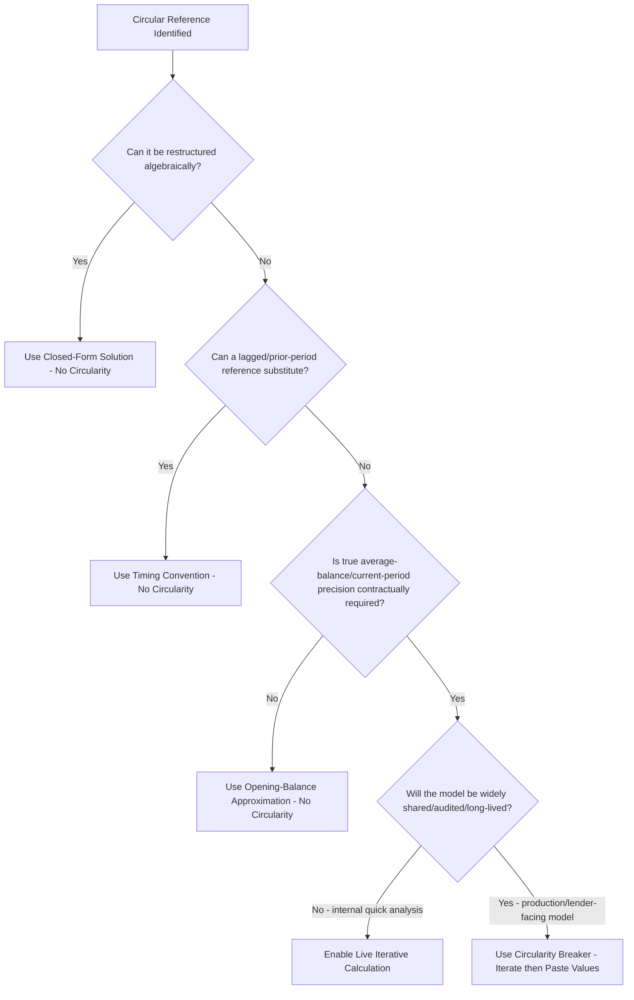

## Using Iterative Calculation Settings

### Definition and Core Concept

**Iterative calculation** is a spreadsheet application setting that permits a workbook containing circular references to recalculate rather than immediately throwing a circular reference error. When enabled, the application repeatedly recalculates all formulas involved in the circular loop, using each pass's output as the next pass's input, until either the values stop changing by more than a specified tolerance (**convergence**) or a maximum number of iterations is reached. This is the direct numerical-solution counterpart to the closed-form/algebraic and timing-convention avoidance techniques covered under the other circularity sources — used specifically when a genuine simultaneous circular relationship cannot be eliminated by restructuring the model.

### How Iterative Calculation Works Mechanically

**Key Points**

- Two parameters govern the process: **maximum iterations** (a cap on how many recalculation passes the application will perform per manual or automatic recalculation trigger) and **maximum change** (a convergence tolerance — the process stops early once the largest change in any circular cell between successive passes falls below this threshold).
- On each pass, every cell participating in the circular reference chain is recalculated using the values produced by the *previous* pass, progressively refining the values toward a stable (converged) solution, provided the underlying system is mathematically well-behaved (i.e., actually converges rather than oscillating or diverging).
- The default settings in most spreadsheet applications (e.g., 100 iterations, 0.001 maximum change) are frequently insufficient precision for project finance models with tight covenant thresholds or high-value debt balances, where even a small absolute residual error can matter — modelers should explicitly increase iteration count and/or tighten the convergence tolerance for financial models rather than relying on defaults.
- Iterative calculation is a **workbook-level** (or in some applications, application-level) setting, meaning it affects every circular reference in the file, not just the intended one — this is a significant risk, since an unintentional/erroneous circular reference elsewhere in the model will also silently "resolve" via iteration rather than throwing an alerting error, potentially masking a genuine formula mistake.

### Convergence Behavior

For a well-behaved circular system, successive iteration passes should show the circular cells' values changing by progressively smaller amounts, approaching a fixed point:

$$|x_{n+1} - x_n| < |x_n - x_{n-1}|$$

where $x_n$ is the value of a circular cell after the $n$-th iteration pass. If this inequality does not hold — if successive differences are not shrinking, or are growing — the system is not converging, and no amount of additional iterations or looser tolerance will produce a reliable answer; this typically indicates either a genuine error in the circular formula logic (e.g., a sign error causing positive feedback rather than negative feedback / dampening) or an economically unstable relationship that should not have been modeled as a simple circular loop in the first place.

### When Iterative Calculation Is the Appropriate Tool

**Key Points**

- Genuinely required when the financing documents or the desired calculation precision mandate a **true average-balance** or **current-period, post-adjustment** basis for a circular relationship (e.g., revolver interest on average balance, or a sweep trigger contractually defined on current-period post-sweep leverage) where no timing-convention relabeling (lagged reference) is available or contractually acceptable.
- Appropriate for quick diagnostic testing during model construction — temporarily enabling iterative calculation to observe whether a circular formula converges to a sensible value is a useful sanity check even in models that will ultimately use a non-circular architecture (opening-balance conventions, sequential builds, or a circularity-breaker) for the delivered version.
- Less appropriate as the **permanent, production architecture** for a model that will be extensively shared, audited, sensitivity-tested, or maintained by multiple parties over the life of a transaction — the fragility and audit difficulty of live circular references (detailed below) generally outweigh the precision benefit in most project finance contexts, which is why sequential builds and timing conventions are the more common professional-practice default wherever they can achieve acceptably close results.

### Risks and Drawbacks of Live Iterative Calculation

**Key Points**

- **Fragility on file transfer**: iterative calculation settings are workbook-specific preferences that may not carry over correctly (or may be silently disabled) when a file is opened by a different user, a different spreadsheet application version, or converted between file formats — a recipient opening the file with iterative calculation off will see `#REF!` or circular reference error warnings, or worse, silently stale/incorrect values if the application substitutes zero for the unresolved circular cells.
- **Silent staleness**: if a user disables iterative calculation (even briefly, or by accident) and then re-enables it, some spreadsheet applications do not automatically force a full recalculation, potentially leaving circular cells showing an outdated, no-longer-consistent value that appears normal but is not actually the converged solution for current inputs.
- **Difficulty auditing**: because circular formulas by definition cannot be traced in a single linear direction (tracing precedents eventually leads back to the cell itself), reviewers and lenders' independent model auditors typically flag live circularity as a control weakness, since standard formula-tracing techniques cannot fully verify correctness the way they can for non-circular formulas.
- **Performance and stability**: workbooks with multiple, especially nested or interacting, circular references can become slow to recalculate (each keystroke potentially triggering many iteration passes) and are more prone to `#DIV/0!`, `#NUM!`, or divergence errors if an intermediate input temporarily takes an invalid value (e.g., a zero or negative denominator) during the iteration process, even if the final converged state would be valid.
- **Masking genuine errors**: as noted above, enabling iterative calculation resolves *all* circular references in the workbook, not just the intended one — an accidental circular formula (a genuine error) will also stop throwing an error and may silently converge to a plausible-looking but economically meaningless value.

### The Circularity Breaker as a Mitigation Pattern

**Key Points**

- A common professional practice is to use iterative calculation only transiently: enable it, allow the model to converge, then use "copy" followed by "paste special (values only)" to freeze the converged circular cells as static hardcoded numbers, and disable iterative calculation immediately afterward — combining the precision of the iterative solve with the stability and auditability of a static, non-circular final model.
- This pattern requires an explicit process discipline: the modeler must remember to re-run the breaker (re-enable iteration, recalculate, re-paste values) any time an upstream assumption affecting the circular cells changes, since the pasted values will otherwise silently become stale and inconsistent with the rest of the model.
- Some practitioners implement this via a macro/VBA button that automates the enable-iterate-converge-paste-disable sequence, reducing the risk of a modeler forgetting a step, though this introduces a dependency on macro-enabled file formats and the recipient's willingness/ability to run macros (a security consideration in some institutional environments).
- Clearly labeling circularity-breaker cells (a distinct fill color, a named range, or a dedicated "Circularity" tab documenting which cells are affected and the process to refresh them) is considered good modeling practice, aligning with broader model-integrity standards that emphasize transparency over cleverness.

### Comparison of Circularity Handling Approaches

| Approach | Precision | Stability/Auditability | Typical Recommended Use |
| --- | --- | --- | --- |
| Algebraic/closed-form restructuring | Exact | High — fully traceable | Preferred wherever mathematically possible (e.g., single-period IDC, sculpted debt sizing) |
| Timing convention (lagged reference) | Approximate (small timing lag) | High — fully traceable | Preferred for sweep/leverage triggers where a one-period lag is acceptable |
| Opening-balance interest convention | Approximate (ignores intra-period movement) | High — fully traceable | Preferred default for most interest calculations at typical model granularity |
| Live iterative calculation | Exact (if converged) | Low — fragile, hard to audit | Genuine average-balance/current-period requirements with no viable alternative |
| Circularity breaker (iterate then paste values) | Exact (at time of last refresh) | Moderate — stable but requires disciplined refresh process | Common compromise when live iteration's fragility is unacceptable but true precision is required |

### Iterative Calculation Decision Process

### Modeling Best Practices

**Key Points**

- Treat live iterative calculation as a diagnostic and precision-verification tool first, and a production model architecture only as a last resort after confirming no algebraic, timing-convention, or opening-balance alternative achieves acceptable accuracy for the specific transaction's requirements.
- Always increase the iteration count and tighten the convergence tolerance beyond spreadsheet application defaults for any financial model where covenant thresholds or debt sizing precision matter, and verify actual convergence (successive-difference shrinking) rather than assuming the application's default settings guarantee a correct answer.
- Where a circularity breaker is used, build in a visible, dated "last refreshed" note or check cell that flags whether upstream assumptions have changed since the last paste-values refresh, reducing the risk of silently stale hardcoded circular outputs persisting through subsequent sensitivity analysis or scenario changes.
- Document, in the model's assumptions/notes tab, exactly which cells are circular, why (which of the identified circularity sources applies), and which resolution approach was chosen and why — this transparency is specifically what independent model reviewers and lender due diligence processes look for when assessing model integrity around circularity.

**Next Steps**

- Identifying Sources of Circular References
- Interest During Construction Circularity
- Cash Sweep and Revolver Circularity
- Techniques for Resolving Circularity Without Iterative Calculation
- Circular Reference Management and Model Integrity Best Practices (FAST Standard)
- Iterative Debt Sizing Techniques
- Model Audit and Independent Review Processes in Project Finance
- Version Control and Model Governance for Multi-Party Transactions