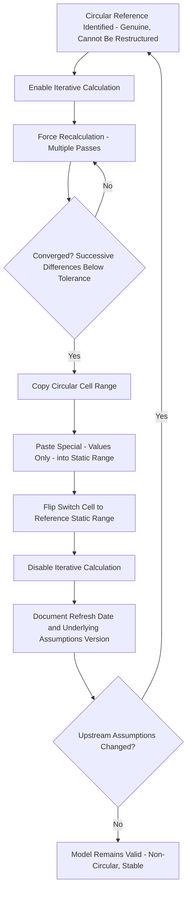

## Circuit Breaker and Copy-Paste Macro Techniques

### Definition and Core Concept

A **circuit breaker** (also called a **circularity breaker** or **circularity switch**) is a manual or automated toggle mechanism that deliberately interrupts a circular reference chain at a specific point, substituting a fixed value for what would otherwise be a live formula, in order to convert a genuinely circular calculation into a linear, non-circular one that a spreadsheet can recalculate normally. **Copy-paste macro techniques** automate the process of running the circular calculation to convergence and then freezing (pasting as static values) the results, combining the precision benefit of iterative calculation with the stability of a non-circular final model — this is the practical implementation pattern referenced under the iterative calculation settings discussion, expanded here in full detail.

### Why a Circuit Breaker Is Needed

**Key Points**

- Live iterative calculation, while mathematically capable of resolving circularity, is fragile when a model is shared across multiple parties, opened in different application versions, or converted between file formats — a circuit breaker converts the model into a form that recalculates identically for any user, regardless of their local iterative calculation settings.
- Many institutional model review and audit standards either strongly discourage or outright prohibit delivery of models with live circular references and iterative calculation enabled, specifically because such models cannot be fully traced/audited using standard formula-tracing techniques — a circuit breaker allows the underlying economic relationship to remain genuinely circular (as the transaction economics require) while the *delivered* model artifact is non-circular.
- A circuit breaker also protects against the risk that a recipient's spreadsheet application throws a hard circular reference error (rather than resolving via iteration) if their default settings differ from the model-builder's, which would otherwise render portions of the model non-functional upon opening.

### The Manual Circuit Breaker Pattern

**Key Points**

- **Step 1 — Insert a switch cell**: a single toggle cell (e.g., a value of 0 or 1, or "ON"/"OFF") that controls whether a specific formula in the circular chain references the live circular calculation or a separately stored, static prior value.
- **Step 2 — Enable iterative calculation** temporarily in the spreadsheet application's settings, allowing the circular chain to recalculate and converge.
- **Step 3 — Verify convergence**: confirm that recalculating the workbook additional times no longer materially changes the circular cells' values (the successive-difference criterion discussed under iterative calculation settings).
- **Step 4 — Copy and paste-special (values only)** the converged circular cells into a dedicated static/hardcoded range, breaking their live formula dependency.
- **Step 5 — Flip the switch cell** so that downstream formulas reference the static pasted values rather than the (now potentially disconnected or disabled) live circular formulas, and **disable iterative calculation** in the application settings.
- **Step 6 — Document** the date/version of assumptions the breaker was last run against, so future users know whether a re-run is needed after any subsequent input changes.

### Circuit Breaker Formula Pattern

A typical switch-controlled formula structure uses a conditional to route between the live (circular) calculation and the frozen static value:

$$Value_{used} = \begin{cases} Value_{static} & \text{if } Switch = 1 \text{ (breaker engaged)} \\ Value_{live,circular} & \text{if } Switch = 0 \text{ (breaker disengaged, iterative calc required)} \end{cases}$$

With the switch engaged ($Switch = 1$), the formula no longer depends on the circular chain at all — the spreadsheet sees only a reference to a static input cell, and the circularity is fully broken for calculation purposes, even though the *static* value was originally derived from that circular relationship.

### Copy-Paste Macro Automation

**Key Points**

- A VBA (or equivalent macro/scripting) routine can automate the manual breaker sequence: toggling the application's iterative calculation setting on, forcing a full workbook recalculation (potentially multiple times to ensure convergence), copying the relevant circular cell range, pasting values in place (or into a shadow/static range), and toggling iterative calculation back off — all via a single button click or keyboard shortcut.
- Automation reduces the risk of a modeler forgetting an intermediate step (a common source of stale-value errors in the manual process) and makes it practical to re-run the breaker frequently — e.g., every time the model is opened, or every time specific upstream input cells change — rather than only once at model completion.
- A typical macro structure: (1) set `Application.Iterative = True` with defined `MaxIterations` and `MaxChange`, (2) force `Application.CalculateFull` one or more times, (3) select the circular range and perform `Range.Copy` followed by `Range.PasteSpecial xlPasteValues`, (4) set `Application.Iterative = False`, (5) optionally write a timestamp to a documentation cell confirming when the breaker was last run.
- Macro-based automation introduces its own considerations: macro-enabled file formats may be blocked by institutional security policies, macros must be re-verified after any structural change to the circular range (e.g., inserted/deleted rows shifting cell references), and macro code itself should be documented and reviewed with the same rigor as the model's formulas, since an error in the macro's range references can silently paste incorrect values.

### Circuit Breaker Process Flow

### Alternative Breaker Pattern: Prior-Value Seed with Manual Override

**Key Points**

- A simpler, non-macro variant seeds the circular formula's first reference with a reasonable starting guess (e.g., zero, or a rough non-iterative estimate) and structures the formula so that once pasted-over with a converged value, it behaves as a static anchor rather than continuing to recalculate circularly — effectively a manual, one-time version of the automated pattern above, suitable for models where the circular relationship is set once (e.g., at financial close) and not expected to require frequent refreshing thereafter.
- This pattern is common for circularities that are genuinely "solve once" in nature — such as the initial IDC-inclusive debt sizing at financial close — as distinct from circularities that recur every period throughout the operating life of the model (such as revolver interest), which benefit more from the fully automated macro approach given their higher refresh frequency.

### Validation and Error-Checking After Breaking

**Key Points**

- After pasting static values, build an explicit **check cell** that re-derives what the circular value *should* be (using the same formula logic, but referencing the now-static pasted values as if they were live) and flags a discrepancy (e.g., a difference outside a small tolerance) if the model's other inputs have changed since the last breaker refresh — this converts an easy-to-miss silent staleness risk into a visible, checkable warning.
- Cross-verify the pasted/frozen values periodically against a quick temporary re-enablement of live iterative calculation (a "spot check"), particularly after any material change to the model's structure or assumptions, to confirm the static values remain a valid approximation of what the true converged circular solution would currently be.
- Maintain a clear audit trail (a changelog or version note) each time the breaker is re-run, including which assumptions triggered the re-run, so that reviewers examining the model at a later date can understand why the static values are what they are and confirm they reflect a specific, identifiable set of underlying assumptions rather than an untraceable ad hoc paste.

### Modeling Best Practices

**Key Points**

- Reserve circuit breaker techniques for circularities that survive after exhausting algebraic restructuring, timing-convention (lagged reference), and opening-balance-convention alternatives — a breaker should be the resolution of last resort, not a default habit, since even a well-documented breaker adds process overhead and staleness risk that a genuinely non-circular formula design avoids entirely.
- Clearly and visibly label all switch cells, static/frozen ranges, and check cells (consistent color-coding or a dedicated documentation tab), since a circuit breaker that is not obviously flagged as such is easily mistaken by a later user for a normal live input, defeating the purpose of the transparency the technique is meant to provide.
- For macro-automated breakers, store the macro code's logic and range references in accessible, documented VBA modules (not obscured or password-locked without the password being separately available to authorized reviewers), since an undocumented or inaccessible macro undermines the auditability the breaker technique is meant to preserve relative to raw live circularity.
- Prefer the fully automated copy-paste macro pattern for circularities requiring frequent refresh (revolver interest, ongoing cash sweep mechanics) and the simpler one-time manual pattern for "solve once at close" circularities (initial IDC-inclusive debt sizing), matching the resolution technique's operational overhead to how often the underlying circular relationship actually needs to be re-solved.

**Next Steps**

- Using Iterative Calculation Settings
- Identifying Sources of Circular References
- Interest During Construction Circularity
- Cash Sweep and Revolver Circularity
- Circular Reference Management and Model Integrity Best Practices (FAST Standard)
- Techniques for Resolving Circularity Without Iterative Calculation
- Model Audit and Independent Review Processes in Project Finance
- Version Control and Model Governance for Multi-Party Transactions