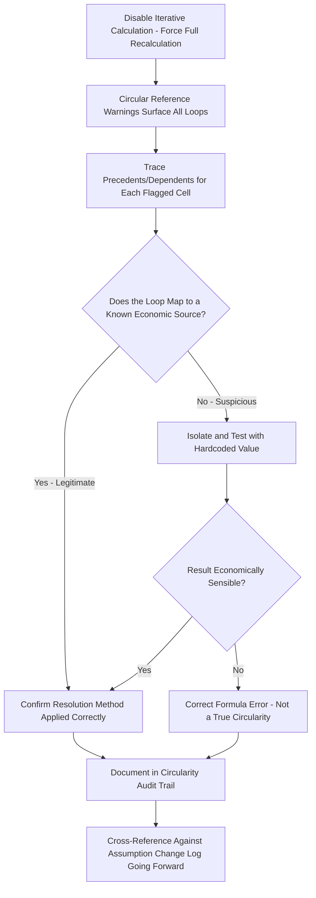

## Auditing and Preventing Circular Reference Errors

### Definition and Core Concept

**Auditing circular reference errors** refers to the systematic process of detecting, tracing, verifying, and documenting circular dependencies within a project finance model, distinct from the earlier *resolution* techniques (algebraic restructuring, timing conventions, iterative calculation, circuit breakers) in that auditing is concerned with **confirming correctness and preventing recurrence** rather than solving a specific circularity. This is the discipline applied both during model construction (self-audit) and by independent third-party reviewers (lenders' model auditors, rating agencies) evaluating a completed model before financial close or during ongoing monitoring.

### Why Dedicated Auditing Discipline Is Necessary

**Key Points**

- Circular references are uniquely difficult to audit using standard formula-tracing tools, since tracing precedents from a circular cell eventually loops back to the starting cell — a fundamentally different verification challenge than tracing a normal linear formula chain to its ultimate root inputs.
- Because circularity is often *intentional and correct* (reflecting genuine economic interdependency, as with IDC or revolver interest) rather than a modeling error, auditors cannot simply flag every circular reference as a defect — the audit task is to distinguish between (1) legitimate, correctly-resolved circularity, (2) legitimate circularity resolved incorrectly or imprecisely, and (3) accidental circularity arising from a genuine formula error unrelated to any real economic interdependency.
- Lenders and their independent model auditors (frequently a specialized third-party financial modeling review firm) typically require explicit documentation of every circular reference's source and resolution method as a condition of relying on the model for credit approval, since undocumented circularity is treated as a material model risk in due diligence.
- Circularity-related errors are disproportionately likely to be introduced or reintroduced during subsequent model updates (post-financial-close amendments, refinancing model updates, or when a different analyst inherits the model) if the original circularity handling is not clearly documented — making prevention as much a governance and process discipline as a one-time technical fix.

### Detection Techniques

**Key Points**

- **Built-in circular reference warnings**: spreadsheet applications flag circular references at the moment they are created (if iterative calculation is disabled) via a warning dialog and typically populate a "Circular References" list under the formula auditing tools, identifying the specific cell(s) involved — this is the first and most basic detection layer, but only catches circularity if iterative calculation is off at the time the formula is entered.
- **Full workbook recalculation with iteration disabled**: temporarily disabling iterative calculation and forcing a full recalculation across the entire workbook is a reliable way to surface *all* circular references present, including ones that may have gone unnoticed if iterative calculation was already enabled when they were introduced.
- **Formula auditing tools (trace precedents/dependents)**: manually tracing precedent and dependent chains for cells suspected of circularity helps confirm the exact loop path and identify every cell participating in it, which is necessary before selecting an appropriate resolution technique.
- **Independent formula-checking add-ins or scripts**: some model review practices use automated tools or custom scripts that scan a workbook's formula structure programmatically to build a full dependency graph and flag any cycles, providing a more systematic sweep than manual tracing, particularly useful for large, multi-tab models where manual tracing of every cell is impractical.

### Distinguishing Legitimate from Erroneous Circularity

**Key Points**

- A **legitimate** circular reference should map cleanly onto one of the recognized economic sources already covered — IDC capitalization, average-balance interest, sweep/revolver-trigger interdependency, or tax-interest interaction — and the modeler should be able to articulate, in plain economic terms, *why* the two quantities are genuinely mutually dependent.
- An **erroneous** circular reference typically arises from a formula-copying mistake (e.g., a formula dragged across a row/column inadvertently referencing its own row/column via a relative rather than absolute reference), a mislabeled or misplaced cell reference, or an unintended self-reference introduced during model editing — these do not correspond to any genuine economic interdependency and should be corrected, not resolved via iteration or a breaker.
- A useful diagnostic test: if the circularity can be **eliminated by a timing-convention fix (lagging one reference by a period) without materially changing the economic meaning of the calculation**, it is more likely an artifact of formula construction than a genuine simultaneous relationship — genuine circularity (like true average-balance interest) resists this kind of trivial resolution without altering what is actually being calculated.
- When in doubt, isolate the suspected circular formula, replace one side of the loop with a hardcoded test value, and manually verify whether the resulting calculation produces an economically sensible result consistent with the transaction's actual terms — an erroneous circularity often reveals itself through an implausible or clearly wrong output once isolated this way.

### The Circularity Audit Trail

**Key Points**

- Maintain a dedicated documentation tab or section listing every identified circular reference in the model, including: the specific cells/ranges involved, the economic source (which category from the identification framework applies), the resolution method chosen (algebraic, timing convention, opening-balance approximation, live iteration, or circuit breaker), and — where a breaker is used — the date and assumption-version it was last refreshed against.
- Cross-reference this documentation against the model's overall assumptions/change log, so that any change to an assumption feeding a circular calculation triggers an explicit reminder to check whether the corresponding circularity resolution (particularly a circuit breaker's frozen values) needs to be refreshed.
- For models subject to formal independent audit (common in larger, syndicated, or rated project finance transactions), proactively provide this circularity documentation to the reviewing party rather than waiting for it to be requested — this is generally viewed favorably as evidence of a rigorous, transparent modeling process and can materially shorten the review cycle.

### Prevention Practices During Model Construction

**Key Points**

- Build interest, sweep, and revolver schedules with **absolute, deliberate reference structuring** — explicitly choosing opening-balance versus average-balance conventions at the point of initial formula construction, rather than defaulting to whatever convention a formula happens to produce, reduces the incidence of *accidental* circularity introduced by not having made this choice consciously.
- Where a genuinely circular relationship is anticipated in the model design (e.g., IDC, or a required average-balance revolver calculation), plan the resolution technique **before** building the formulas, rather than building first and discovering/reacting to a circular reference error afterward — proactive design reduces the risk of an ad hoc, undocumented fix under time pressure.
- Use consistent, disciplined formula-copying practices (correct use of absolute versus relative references, careful review after any drag-fill or paste operation across a schedule) specifically because accidental self-referencing circularity is disproportionately introduced through copy/paste and fill operations across rows or columns of a periodic schedule.
- Periodically (e.g., at each major model version milestone) run a full circularity detection sweep across the entire workbook, even in sections not recently edited, since a change to one part of a model can sometimes introduce an unexpected circular dependency in a seemingly unrelated section through a shared intermediate calculation.

### Circularity Audit Process Flow

### Red Flags for Reviewers

**Key Points**

- A model with iterative calculation enabled but **no accompanying documentation** identifying which cells are circular and why is a significant red flag in due diligence, since it suggests the modeler may not have consciously identified or verified the circularity's source.
- Circularity resolved via a copy-paste circuit breaker with **no visible "last refreshed" date or version marker** raises concern about whether the frozen values remain consistent with the model's current assumptions, particularly in a model that has evidently been updated since the apparent freeze point.
- Inconsistent interest-calculation conventions across different debt tranches or schedules within the same model (e.g., opening-balance for the term loan but an undocumented average-balance formula for the revolver) without an explained rationale suggests the circularity handling was not designed deliberately, increasing the risk of an undetected error.
- A model that throws circular reference warnings when opened by the reviewer but not, apparently, by the original modeler, often indicates a workbook-level iterative calculation setting that did not transfer correctly between users/applications — a strong signal that whatever circularity resolution is in place will not be reliably reproducible for other users of the model.

### Modeling and Governance Best Practices

**Key Points**

- Treat circularity auditing as a required, scheduled step in the model build-and-review cycle — not an ad hoc response only triggered when a circular reference warning happens to appear — since some circularities can persist unnoticed if iterative calculation happens to already be enabled when they are introduced.
- Assign clear ownership for maintaining the circularity documentation tab and refreshing any circuit breakers, particularly in multi-analyst teams or over a transaction's multi-year life (financial close through refinancing), since circularity-handling knowledge can be lost when the original modeler moves off the deal.
- Where possible, favor model architectures that minimize the total number of genuine circularities in the first place (sequential period-by-period builds, opening-balance conventions, lagged timing triggers) specifically because each additional circularity multiplies the audit and governance burden, even when each one is individually manageable.
- Align the model's circularity documentation format and audit trail with whatever formal model standard the transaction's lenders or rating agencies expect (e.g., FAST Standard conventions), since consistency with an established external standard both eases third-party review and reduces the risk of overlooked circularity issues going into financial close. [Inference: the specific documentation format and audit expectations vary by lender group, rating agency, and jurisdiction, and should be confirmed against the specific transaction's requirements.]

**Next Steps**

- Identifying Sources of Circular References
- Using Iterative Calculation Settings
- Circuit Breaker and Copy-Paste Macro Techniques
- Interest During Construction Circularity
- Cash Sweep and Revolver Circularity
- Circular Reference Management and Model Integrity Best Practices (FAST Standard)
- Model Audit and Independent Review Processes in Project Finance
- Version Control and Model Governance for Multi-Party Transactions