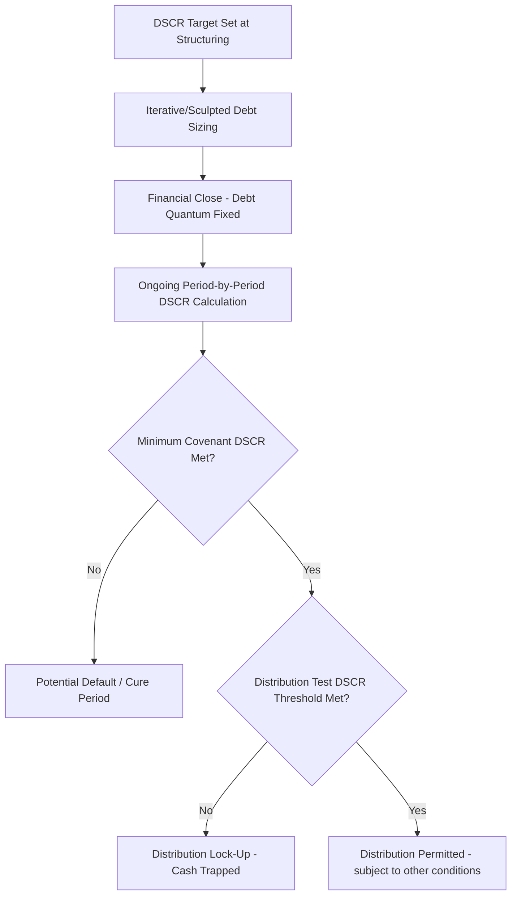

## Debt Service Coverage Ratio

### Definition and Core Concept

The **Debt Service Coverage Ratio (DSCR)** is the single most widely used credit metric in project finance, measuring the ratio of cash flow available for debt service (CFADS) to the total scheduled debt service (interest plus principal) due in a given period:

$$DSCR_t = \frac{CFADS_t}{DS_t}$$

A DSCR of 1.00x means the project generates exactly enough cash to cover that period's scheduled debt service with no margin; a DSCR above 1.00x indicates a cushion (cash flow exceeds the minimum required to service debt); a DSCR below 1.00x indicates a shortfall, which — absent a reserve draw or other cure mechanism — would result in an inability to make the scheduled payment.

### Defining CFADS

**Key Points**

- CFADS is typically defined starting from operating revenue, deducting operating expenses, maintenance capex not funded from a dedicated reserve, and cash taxes, but **before** deducting debt service itself (interest and principal), since DSCR is designed to measure debt service capacity, not post-debt-service residual cash.
- The precise CFADS definition is a heavily negotiated contractual term set out explicitly in the financing documents (commonly in the Common Terms Agreement or facility agreement's definitions section) — items such as one-off items, working capital movements, reserve account draws/top-ups, and non-cash items must each be explicitly included or excluded, and no universal standard definition applies across all transactions.
- A common structure is: $CFADS_t = EBITDA_t - Cash Taxes_t - Maintenance\ Capex_t \pm \Delta Working\ Capital_t + Other\ Adjustments_t$, though the exact adjustments vary significantly by sector, financing structure, and the specific negotiated definition.
- Because CFADS is defined *before* debt service, it is (in a non-circular model architecture) generally independent of the debt sizing/amortization decision itself, except where interest tax shields or debt-linked cash sweep triggers reintroduce a dependency, as discussed under circularity sources.

### Defining Debt Service

**Key Points**

- Debt service ($DS_t$) is the sum of all scheduled senior debt payments due in the period: scheduled interest plus scheduled principal amortization, per the specific repayment structure (level, sculpted, or including any balloon/bullet payment falling due in that period).
- Whether subordinated/mezzanine debt service is included in the primary DSCR calculation, or measured via a separate subordinated-level DSCR, depends on the transaction's structure — most commonly, "DSCR" without qualification refers to senior debt service coverage, with a distinct "Total DSCR" or "Junior DSCR" metric calculated separately if subordinated debt is present.
- Debt service used for DSCR purposes is typically the **scheduled** (contractual) amount, not including any voluntary prepayments, mandatory cash sweep amounts, or DSRA draws used to cover a shortfall — the ratio is meant to measure the project's own cash-generating capacity against its base obligations, with reserve mechanisms treated as separate, complementary protections rather than folded into the ratio itself.

### DSCR Testing Conventions

**Key Points**

- **Historical (backward-looking) DSCR**: calculated using actual realized CFADS and debt service over a completed period (commonly trailing 12 months, or the most recent one to two semi-annual periods), used for covenant compliance testing and, as covered under distribution tests, as one gate for equity distributions.
- **Projected (forward-looking) DSCR**: calculated using forecast CFADS over an upcoming period against scheduled debt service, used both for financial covenant testing and as the second gate in dual-DSCR distribution tests.
- **Annual DSCR**: the most common testing frequency, aligned with a full operating year, smoothing out seasonal or quarterly volatility that might otherwise trigger a misleading breach.
- **Period DSCR** (matching the actual debt service payment frequency, e.g., semi-annual or quarterly): provides more granular, timely visibility but is more sensitive to short-term timing mismatches between revenue receipt and payment dates, which is one reason DSRA mechanics exist to bridge exactly this kind of short-term volatility without it flowing through as an apparent covenant breach.

### Worked Example

**Example**

Assume a project with the following figures for a given year:

- Revenue: $85,000,000
- Operating expenses: $22,000,000
- Cash taxes: $6,000,000
- Maintenance capex (not reserve-funded): $3,000,000

$$CFADS = 85{,}000{,}000 - 22{,}000{,}000 - 6{,}000{,}000 - 3{,}000{,}000 = \$54{,}000{,}000$$

Scheduled debt service for the year: $38,000,000 (interest) + $5,000,000 (scheduled principal) = $43,000,000

$$DSCR = \frac{54{,}000{,}000}{43{,}000{,}000} \approx 1.256x$$

If the financing documents specify a minimum DSCR covenant of 1.20x and a distribution test threshold of 1.30x, this project would satisfy the minimum covenant (no default) but would **fail** the distribution test threshold, resulting in the residual cash being trapped per the distribution lock-up mechanics — illustrating how a single DSCR figure can simultaneously mean "no default" and "no distribution."

### DSCR Threshold Levels by Sector and Risk Profile

| Sector/Risk Profile | Typical Minimum DSCR Range | Rationale |
| --- | --- | --- |
| Availability-based PPP/PFI (government-backed payments) | 1.05x–1.20x | Low revenue volatility; payment largely independent of usage/performance risk |
| Contracted power (PPA-backed, investment-grade offtaker) | 1.20x–1.35x | Contracted revenue provides high predictability, though offtaker credit and operational risk remain |
| Merchant/market-exposed power or infrastructure | 1.40x–1.75x+ | Revenue volatility from market price/volume exposure requires a larger cushion |
| Toll roads/transportation with volume risk | 1.30x–1.50x | Traffic/volume forecasts carry material uncertainty over long concession periods |

[Inference: exact threshold levels are transaction-, lender-, and market-cycle-specific and are illustrative ranges reflecting typical risk-based structuring logic rather than fixed industry rules.]

### DSCR's Role Across the Financing Lifecycle

### Limitations of Single-Period DSCR

**Key Points**

- DSCR is a **single-period snapshot** metric and does not capture the shape or sustainability of coverage across the entire remaining debt life — a project could show adequate DSCR in every individual period while still carrying material risk from a lumpy future event (e.g., a large scheduled maintenance cost or approaching balloon payment) that period-by-period DSCR alone does not flag.
- This limitation is the specific reason multi-period metrics — Loan Life Coverage Ratio (LLCR) and Project Life Coverage Ratio (PLCR) — are used alongside DSCR in most project finance credit analysis, since they aggregate the entire remaining cash flow stream against outstanding debt rather than looking at one period in isolation.
- DSCR calculated under a bullet or balloon repayment structure can appear artificially strong during the interest-only/reduced-amortization phase specifically because scheduled principal is low or zero, masking the concentrated repayment risk that will only become visible when the balloon falls due — reinforcing why balloon structures require supplementary refinancing/tail-period analysis rather than relying on period DSCR alone.

### Modeling Considerations

**Key Points**

- Build the CFADS calculation as an explicit, clearly labeled formula chain matching the precise contractual definition from the financing documents, since even small definitional differences (e.g., whether a specific reserve movement is included) can shift the calculated DSCR enough to matter for covenant compliance or distribution testing.
- Present historical and projected DSCR as clearly separated, distinctly labeled outputs (not a single blended figure), since — as covered under distribution tests — financing documents frequently require both to independently satisfy a threshold.
- Include a dedicated minimum DSCR output across the full projection period (the "DSCR profile") as a standard summary output, since this single figure (the worst period across the debt life) is typically the headline credit metric referenced in lender credit papers, rating agency reports, and the sculpted debt sizing calculation itself.
- Cross-check the modeled DSCR at each period against the sculpted debt sizing's target ratio (where a sculpted structure is used) as an internal consistency check — a properly built sculpted amortization schedule should reproduce the target DSCR in every period by construction, and any deviation indicates a formula or circularity-handling error worth investigating.

**Next Steps**

- Loan Life Coverage Ratio and Project Life Coverage Ratio
- Iterative Debt Sizing Techniques
- Distribution Tests and Lock-Up Conditions
- Bullet and Balloon Repayment Structures
- Debt Service Reserve Account Mechanics
- Gearing and Leverage Constraints in Project Finance Structuring
- Cash Sweep and Excess Cash Flow Mechanisms
- Financial Covenant Design and Event of Default Triggers