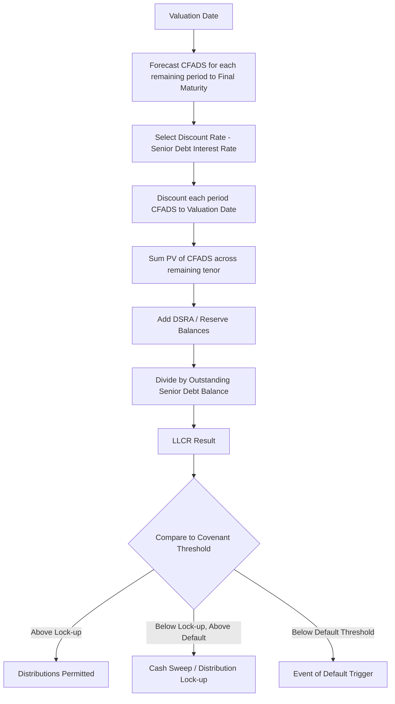

## Loan Life Coverage Ratio

### Definition and Purpose

The Loan Life Coverage Ratio (LLCR) is a credit metric used in project finance to measure the ability of a project's future cash flows to repay outstanding debt over the remaining life of the loan (not the life of the project). It expresses the relationship between the present value of cash flows available for debt service (CFADS) over the debt tenor and the outstanding debt balance at the calculation date.

LLCR answers the question: "If all future cash flow available for debt service between now and loan maturity were used to pay down debt, how many times could the outstanding balance be covered?"

It is distinct from the Debt Service Coverage Ratio (DSCR), which looks at a single period, and the Project Life Coverage Ratio (PLCR), which extends the cash flow horizon to the end of the project's economic or contractual life rather than stopping at loan maturity.

### Core Formula

$$LLCR = \frac{\displaystyle\sum_{t=1}^{n} \frac{CFADS_t}{(1+r)^t} + DSRA_t}{D_t}$$

Where:

- $CFADS_t$ = Cash Flow Available for Debt Service in period $t$
- $r$ = discount rate, typically the weighted average cost of debt or the senior debt interest rate
- $n$ = number of remaining periods until final loan maturity
- $DSRA_t$ = balance of the Debt Service Reserve Account (or other reserved cash) at the valuation date, if included
- $D_t$ = outstanding senior debt principal balance at the valuation date $t$

**Key Points**

- The discount rate used is usually the senior debt interest/coupon rate, not WACC, since the ratio is testing debt coverage specifically, not equity returns.
- The numerator sums only cash flows within the debt tenor — cash flows beyond final maturity are excluded, even if the project continues operating.
- DSRA inclusion is a matter of lender/model convention; some credit agreements explicitly define whether reserve balances count toward LLCR.

### Relationship to Other Coverage Ratios

| Ratio | Cash Flow Horizon | Typical Use |
| --- | --- | --- |
| DSCR | Single period (usually 6 or 12 months) | Tests short-term liquidity and covenant compliance period-by-period |
| LLCR | From valuation date to final loan maturity | Tests structural adequacy of cash flow to fully amortize debt |
| PLCR | From valuation date to end of project/concession life | Tests cushion beyond debt repayment, informs refinancing capacity |

**Key Points**

- LLCR $\geq$ 1.0x is a *minimum* threshold; in practice, lenders require a materially higher minimum (often 1.2x–1.5x depending on sector and risk) plus a backstop above the base-case average DSCR.
- A project can have a healthy average DSCR but a weak LLCR if cash flows are heavily backloaded and discounting compresses their present value.

### Step-by-Step Calculation Methodology

1. **Build the CFADS forecast** for every remaining period from the valuation date through final scheduled maturity of the senior debt.
2. **Select the discount rate** — typically the senior facility's effective interest rate (fixed rate, or the forecast floating rate curve plus margin under the base case).
3. **Discount each period's CFADS** back to the valuation date using the mid-period or end-of-period convention consistent with the rest of the model.
4. **Sum the discounted CFADS** across the remaining debt tenor.
5. **Add reserve balances** (DSRA, and sometimes maintenance reserve accounts, per the specific ratio definition in the financing documents).
6. **Divide by the outstanding senior debt principal** at the valuation date (drawn balance, net of any scheduled repayments already made).

### Worked Example

Assume a project financing with 5 years remaining to final maturity, outstanding senior debt of $400 million, a senior debt interest rate of 6%, and a DSRA balance of $20 million.

| Year | CFADS ($m) | Discount Factor @ 6% | PV of CFADS ($m) |
| --- | --- | --- | --- |
| 1 | 90 | 0.9434 | 84.9 |
| 2 | 95 | 0.8900 | 84.5 |
| 3 | 100 | 0.8396 | 84.0 |
| 4 | 105 | 0.7921 | 83.2 |
| 5 | 110 | 0.7473 | 82.2 |

Sum of PV(CFADS) = 84.9 + 84.5 + 84.0 + 83.2 + 82.2 = $418.8 million

$$LLCR = \frac{418.8 + 20}{400} = \frac{438.8}{400} = 1.10x$$

**Example**

An LLCR of 1.10x indicates that the present value of remaining debt-tenor cash flows plus reserves covers the outstanding senior debt by 1.10 times — a relatively thin cushion that would likely fall below typical lender minimums for a project of standard risk (commonly 1.2x–1.4x for conventional infrastructure, higher for merchant-exposed or higher-risk assets).

### Excel/Model Implementation

LLCR is typically built using a **circularity-aware NPV function** because CFADS and the discount rate can depend on the debt balance itself (interest is a function of the balance, which is what's being solved for).

```excel
=NPV(SeniorDebtRate, CFADS_Range_From_ValuationDate_To_Maturity) + DSRA_Balance
```

Then divide by the outstanding debt balance cell:

```excel
=LLCR_Numerator / Outstanding_Senior_Debt_Balance
```

**Key Points**

- Use `NPV()` (or a manual discounting sumproduct) applied only to the cash flow range within the remaining debt tenor — a common modeling error is discounting the full project life instead of stopping at final maturity.
- Because LLCR is usually calculated at every period (monthly, quarterly, or semi-annually) across the life of the loan, models typically use an **OFFSET/INDEX-based rolling NPV** referencing "today" through "final maturity" rather than a static range.
- Circularity switches (iterative calculation or copy-paste-values macros) are frequently required since CFADS may be net of interest, and interest depends on the average debt balance for the period.

### Sensitivities and Stress Testing

LLCR is a standard output in project finance sensitivity/scenario analysis, typically stressed against:

- Revenue downside (e.g., -10% offtake price or volume)
- Operating cost upside (e.g., +10% O&M)
- Construction delay / delayed cash flow start
- Interest rate increases (for floating-rate tranches)
- Combined "downside case" scenarios

Lenders often require a **minimum LLCR under the base case** and a **separate, lower minimum LLCR under a defined downside/stress case**, both tested as ongoing covenants.

### Covenant Application

**Key Points**

- LLCR is commonly used as both a **distribution test** (equity cannot receive dividends unless projected LLCR remains above a "lock-up" threshold) and an **event of default trigger** (breach below a lower threshold constitutes default or triggers cash sweep/mandatory prepayment).
- Unlike DSCR, which is tested against *historical* (backward-looking) actual results, LLCR is inherently *forward-looking*, since it requires a forecast of all remaining cash flows to maturity — this makes it more sensitive to forecast assumption changes than trailing DSCR.
- [Inference] Because LLCR depends on forecast assumptions and discount rate selection, its use as a hard default trigger (versus purely a distribution lock-up) varies significantly by transaction and lender risk appetite; treat exact covenant structuring as deal-specific rather than standardized market practice.

### Calculation Flow Diagram



### LLCR vs. Debt Balance Over Time (Conceptual)

<svg xmlns="http://www.w3.org/2000/svg" viewBox="0 0 700 420" font-family="Arial, sans-serif">
<text x="350" y="25" text-anchor="middle" font-size="16" font-weight="bold">LLCR Components Over Loan Life (svg_diagram)</text>
<line x1="60" y1="360" x2="650" y2="360" stroke="#333" stroke-width="2" />
<line x1="60" y1="360" x2="60" y2="50" stroke="#333" stroke-width="2" />
<text x="355" y="400" text-anchor="middle" font-size="13">Time (Years to Final Maturity)</text>
<text x="25" y="200" text-anchor="middle" font-size="13" transform="rotate(-90 25 200)">Value ($m)</text>
<polyline points="60,90 200,140 340,190 480,250 620,320" fill="none" stroke="#c0392b" stroke-width="3" />
<text x="630" y="325" font-size="12" fill="#c0392b">Outstanding Debt</text>
<polyline points="60,120 200,155 340,200 480,260 620,340" fill="none" stroke="#2980b9" stroke-width="3" stroke-dasharray="6,3" />
<text x="500" y="255" font-size="12" fill="#2980b9">PV of Remaining CFADS</text>
<circle cx="60" cy="90" r="4" fill="#c0392b" />
<circle cx="60" cy="120" r="4" fill="#2980b9" />
<text x="70" y="70" font-size="12">LLCR = PV(CFADS)/Debt at each point</text>
</svg>

### Common Pitfalls

**Key Points**

- Discounting cash flows beyond final maturity into the LLCR numerator (should stop at loan tenor end, not project end — that would be PLCR).
- Using WACC instead of the senior debt rate as the discount rate, which overstates the ratio and is inconsistent with the metric's purpose of testing debt coverage specifically.
- Ignoring circularity between CFADS (net of interest) and the debt balance, leading to broken or non-converging models without iterative calculation enabled.
- Mismatching the valuation date periodicity (e.g., mixing annual CFADS with a mid-year debt balance) without consistent time-value conventions.
- Excluding or inconsistently including reserve account balances relative to what the credit agreement specifies.

### Sector Benchmarks (Illustrative)

[Unverified] Typical minimum LLCR covenant levels vary by sector and risk profile and should always be confirmed against current market terms and specific transaction documents rather than assumed from general benchmarks. Broadly, sectors with more predictable, contracted revenue (e.g., availability-based PPP/PFI, take-or-pay PPAs) tend to have lower LLCR requirements than merchant-exposed or demand-risk assets (e.g., toll roads, merchant power).

**Related Topics**

- Debt Service Coverage Ratio (DSCR)
- Project Life Coverage Ratio (PLCR)
- Cash Flow Available for Debt Service (CFADS) construction
- Debt Service Reserve Account (DSRA) mechanics
- Circular reference handling in project finance models
- Cash sweep and distribution waterfall mechanics
- Sculpted vs. annuity debt repayment structures
- Sensitivity and scenario analysis in project finance models