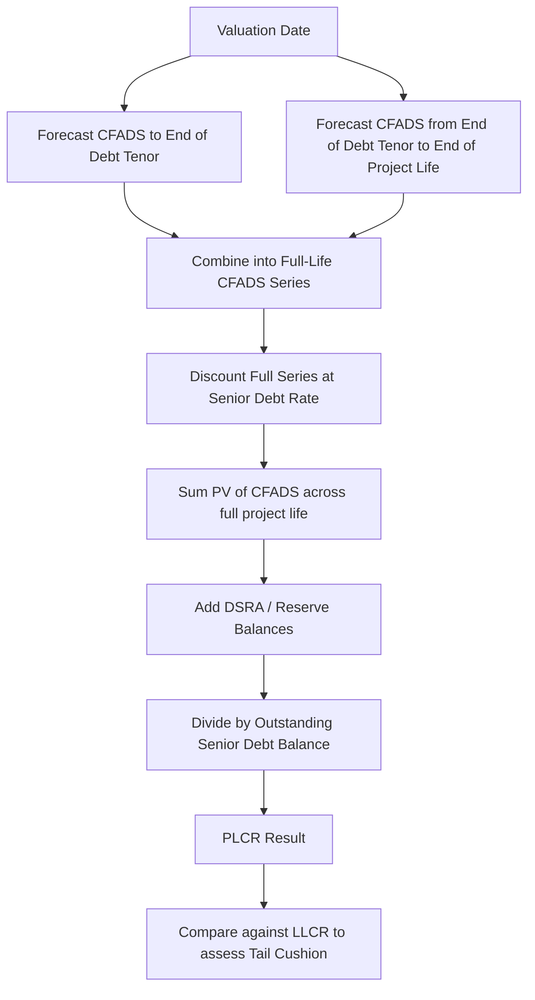

## Project Life Coverage Ratio

### Definition and Purpose

The Project Life Coverage Ratio (PLCR) measures the ability of a project's cash flows to service outstanding debt using the present value of cash flows over the *entire remaining life of the project* (or the concession/license/offtake period), rather than stopping at final loan maturity. It is the broadest of the standard project finance coverage ratios and is used primarily to assess the cushion available beyond scheduled debt repayment — indicating resilience, refinancing capacity, and the margin of safety embedded in the project's economics.

PLCR answers the question: "If all cash flow available for debt service across the full remaining project life were used to repay debt, how many times would the outstanding balance be covered?"

### Core Formula

$$PLCR = \frac{\displaystyle\sum_{t=1}^{N} \frac{CFADS_t}{(1+r)^t} + DSRA_t}{D_t}$$

Where:

- $CFADS_t$ = Cash Flow Available for Debt Service in period $t$
- $r$ = discount rate, typically the senior debt interest rate (consistent with LLCR convention)
- $N$ = number of remaining periods until the **end of the project's economic or contractual life** (e.g., end of concession, PPA term, mine life, or asset useful life) — critically, $N > n$ (the debt tenor used in LLCR)
- $DSRA_t$ = reserve account balances at the valuation date, if included per financing documents
- $D_t$ = outstanding senior debt principal balance at the valuation date

**Key Points**

- The only structural difference versus LLCR is the length of the cash flow horizon in the numerator — PLCR extends to project/contract end, LLCR stops at final debt maturity.
- PLCR will always be $\geq$ LLCR for the same project at the same date, since it captures a superset of the cash flows (assuming positive CFADS in the post-maturity tail).
- The gap between PLCR and LLCR is itself informative: a large gap signals substantial "tail" cash flow beyond debt repayment, which lenders may view as a cushion or as evidence the debt could have been sized more aggressively (sculpted more efficiently).

### Relationship to Other Coverage Ratios

| Ratio | Cash Flow Horizon | Primary Question Answered |
| --- | --- | --- |
| DSCR | Single period | Can the project service debt in *this* period? |
| LLCR | Valuation date to final debt maturity | Can the project fully repay debt *by* maturity? |
| PLCR | Valuation date to end of project/contract life | How much cushion exists *beyond* debt repayment? |

**Key Points**

- PLCR is less commonly used as a hard covenant trigger than DSCR or LLCR; it more often serves as a **structuring metric** at financial close (informing gearing/leverage capacity) and a **periodic reporting metric** for lenders monitoring long-term resilience.
- Rating agencies and lenders sometimes use PLCR to assess "tail risk" — the adequacy of cash flow cushion if the project underperforms after debt is repaid but before the asset's useful life or concession ends.

### Step-by-Step Calculation Methodology

1. **Determine the terminal date** — the end of project life, which may be the end of a concession agreement, PPA/offtake contract, mineral reserve life, license term, or a conservatively estimated asset useful life if no contractual endpoint exists.
2. **Build the full CFADS forecast** from the valuation date through this terminal date (this will extend beyond the debt repayment schedule).
3. **Select the discount rate** — typically the senior debt interest rate, for consistency with LLCR; some practitioners use a blended or project-specific rate for the post-debt tail, though this varies by convention.
4. **Discount each period's CFADS** to the valuation date.
5. **Sum the discounted CFADS** across the full project life horizon.
6. **Add reserve balances** as applicable.
7. **Divide by outstanding senior debt** at the valuation date.

### Worked Example

Using the same project as a comparative LLCR example: 5 years remaining to final debt maturity, but a 10-year remaining concession life. Outstanding senior debt = $400 million, senior debt rate = 6%, DSRA = $20 million.

| Year | CFADS ($m) | Discount Factor @ 6% | PV of CFADS ($m) |
| --- | --- | --- | --- |
| 1 | 90 | 0.9434 | 84.9 |
| 2 | 95 | 0.8900 | 84.5 |
| 3 | 100 | 0.8396 | 84.0 |
| 4 | 105 | 0.7921 | 83.2 |
| 5 | 110 | 0.7473 | 82.2 |
| 6 (post-debt) | 100 | 0.7050 | 70.5 |
| 7 (post-debt) | 100 | 0.6651 | 66.5 |
| 8 (post-debt) | 100 | 0.6274 | 62.7 |
| 9 (post-debt) | 100 | 0.5919 | 59.2 |
| 10 (post-debt) | 95 | 0.5584 | 53.0 |

Sum of PV(CFADS), Years 1–5 (as in LLCR) = $418.8 million

Sum of PV(CFADS), Years 6–10 (post-maturity tail) = 70.5 + 66.5 + 62.7 + 59.2 + 53.0 = $311.9 million

Total PV(CFADS), Years 1–10 = $730.7 million

$$PLCR = \frac{730.7 + 20}{400} = \frac{750.7}{400} = 1.88x$$

**Example**

Comparing the two metrics for this project: LLCR = 1.10x versus PLCR = 1.88x. The substantial gap indicates a meaningful cash flow tail beyond scheduled debt repayment — five additional years of concession cash flow provide a cushion that the LLCR alone does not capture. This is useful diagnostic information for both lenders (assessing structural resilience) and sponsors (assessing whether additional leverage could have been supported).

### Excel/Model Implementation

```excel
=NPV(SeniorDebtRate, CFADS_Range_From_ValuationDate_To_ProjectEnd) + DSRA_Balance
```

Then:

```excel
=PLCR_Numerator / Outstanding_Senior_Debt_Balance
```

**Key Points**

- The mechanical implementation mirrors LLCR exactly, with the only change being the end-point of the `CFADS` range — models typically reference a "Project End Date" or "Concession End Date" cell rather than "Final Maturity Date."
- Because the tail cash flow (post-debt) is often less certain than the contracted, debt-servicing period, models sometimes flag or shade the post-maturity CFADS assumptions distinctly, since they usually rely on more speculative long-term operating/merchant assumptions.
- As with LLCR, circularity may arise if CFADS is calculated net of interest and the debt balance/interest depends on the model's iterative calculation settings.

### Sensitivities and Stress Testing

PLCR is particularly sensitive to:

- **Terminal date assumptions** — extending or shortening assumed project/contract life materially changes the ratio.
- **Post-maturity revenue assumptions** — cash flows after debt repayment are often less contractually secured (e.g., merchant power prices after a PPA expires) and thus carry more forecast uncertainty.
- **Residual/terminal value assumptions**, if a terminal value or salvage value is included in the final period's CFADS.
- Interest rate assumptions (for consistency with the discount rate applied).

**Key Points**

- [Inference] Because the post-maturity tail cash flows are typically less certain than the debt-tenor cash flows, PLCR figures should generally be interpreted with more caution than LLCR, particularly for projects where the post-debt period relies on merchant exposure, contract renewal assumptions, or extended asset life assumptions not contractually guaranteed.

### Covenant Application

**Key Points**

- PLCR is used less frequently as a strict default trigger compared to DSCR or LLCR; it is more commonly referenced in **information covenants** (periodic reporting requirement) or as a **structuring/sizing metric** at financial close.
- Where used as a covenant, PLCR thresholds are typically set materially higher than LLCR thresholds, given the ratio's inherent tendency to be larger.
- [Unverified] Whether PLCR is included as a formal covenant at all depends heavily on sector, jurisdiction, and lender group; treat its use as advisory/structuring in nature unless the specific credit agreement designates it as a compliance test.

### Calculation Flow Diagram



### LLCR vs. PLCR Cash Flow Horizon (Visual Comparison)

<svg xmlns="http://www.w3.org/2000/svg" viewBox="0 0 700 380" font-family="Arial, sans-serif">
<text x="350" y="25" text-anchor="middle" font-size="16" font-weight="bold">LLCR vs PLCR Cash Flow Horizon (svg_diagram)</text>
<line x1="80" y1="330" x2="650" y2="330" stroke="#333" stroke-width="2" />
<text x="365" y="360" text-anchor="middle" font-size="13">Time</text>
<text x="80" y="90" font-size="13" font-weight="bold">LLCR Horizon</text>
<rect x="80" y="100" width="285" height="30" fill="#2980b9" opacity="0.7" />
<text x="222" y="120" text-anchor="middle" font-size="12" fill="white">Valuation Date to Final Maturity</text>
<text x="80" y="170" font-size="13" font-weight="bold">PLCR Horizon</text>
<rect x="80" y="180" width="285" height="30" fill="#27ae60" opacity="0.7" />
<rect x="365" y="180" width="285" height="30" fill="#e67e22" opacity="0.7" />
<text x="222" y="200" text-anchor="middle" font-size="12" fill="white">Debt Tenor Portion</text>
<text x="507" y="200" text-anchor="middle" font-size="12" fill="white">Post-Debt Tail</text>
<line x1="365" y1="80" x2="365" y2="330" stroke="#c0392b" stroke-width="2" stroke-dasharray="5,5" />
<text x="370" y="70" font-size="12" fill="#c0392b">Final Debt Maturity</text>
<line x1="650" y1="80" x2="650" y2="330" stroke="#8e44ad" stroke-width="2" stroke-dasharray="5,5" />
<text x="560" y="70" font-size="12" fill="#8e44ad">End of Project Life</text>
</svg>

### Common Pitfalls

**Key Points**

- Confusing PLCR with LLCR by using the wrong terminal date — using final maturity for PLCR collapses it into LLCR, defeating the purpose of the metric.
- Overstating post-maturity CFADS by carrying forward optimistic contracted-period assumptions (e.g., assuming PPA-level pricing continues after PPA expiry) rather than realistic merchant or renewal assumptions.
- Including speculative life extensions (e.g., assuming concession renewal or license extension) without clear contractual or regulatory basis.
- Applying an inconsistent discount rate between LLCR and PLCR calculations, which distorts direct comparison between the two ratios.

### PLCR as a Structuring Tool

**Key Points**

- At financial close, sponsors and lenders often use PLCR (alongside LLCR) to test whether the proposed debt sizing/gearing leaves adequate cushion — a very high PLCR relative to LLCR may indicate the project could sustain a longer debt tenor or higher leverage, informing negotiation of the debt package.
- PLCR is particularly relevant in sectors with a **contract-plus-tail** structure: e.g., a 15-year PPA with a 25-year asset life, or a 20-year concession with a 30-year design life, where meaningful cash flow exists after debt is scheduled to be fully repaid.

**Related Topics**

- Loan Life Coverage Ratio (LLCR)
- Debt Service Coverage Ratio (DSCR)
- Debt sizing and sculpting methodologies
- Terminal value and residual asset value estimation
- Merchant risk and post-contract revenue assumptions
- Concession/PPA tenor vs. debt tenor structuring
- Cash Flow Available for Debt Service (CFADS) construction
- Refinancing and cash flow cushion analysis