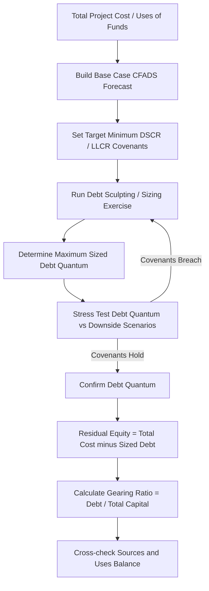

## Gearing and Leverage Ratios


### Definition and Purpose

Gearing (also called leverage) ratios measure the proportion of a project's capital structure funded by debt versus equity (and quasi-equity/subordinated instruments). In project finance, gearing is one of the most fundamental structuring parameters, determined at financial close and monitored throughout the project life, since it directly affects risk allocation, return on equity, debt capacity, and covenant headroom.

Unlike corporate finance, where leverage often reflects an ongoing capital structure decision revisited over time, project finance gearing is typically **fixed at financial close** based on the project's contracted cash flow profile, risk allocation, and the debt sizing exercise (informed by DSCR, LLCR, and PLCR outputs).

### Core Formulas

**Gearing Ratio (Debt-to-Capital)**

$$Gearing = \frac{D}{D + E}$$

**Debt-to-Equity Ratio**

$$D/E = \frac{D}{E}$$

**Total Leverage Ratio (used in trading/lending contexts, less common in project finance)**

Leverage = \frac{D}{E}$$ or $$\frac{D}{EBITDA}

Where:

- $D$ = total outstanding debt (senior debt plus, where applicable, subordinated/mezzanine debt)
- $E$ = total equity and equity-like instruments (common equity, shareholder loans if treated as equity for structuring purposes)

**Key Points**

- Gearing (debt-to-capital, expressed as a percentage, e.g., 70:30 or 80:20) is the dominant convention in project finance rather than debt-to-equity multiples, which are more common in corporate lending.
- A "70:30 gearing" project means 70% of total project cost is debt-funded and 30% is equity-funded.
- Shareholder loans (subordinated debt from sponsors) are often structurally debt but economically treated as quasi-equity; how they are classified affects both the gearing ratio and covenant calculations, and should always be confirmed against the specific financing documents' definitions.

### Typical Gearing Ranges by Sector

[Unverified] The following ranges are illustrative and vary significantly by jurisdiction, market conditions, sponsor credit quality, and revenue contract structure; always confirm against current market terms rather than treating as fixed benchmarks.

| Sector | Typical Gearing Range | Key Driver |
| --- | --- | --- |
| Availability-based PPP/PFI (e.g., roads, hospitals, schools) | 85–90% debt | Highly predictable, government-backed availability payments |
| Contracted renewable energy (solar/wind with PPA) | 70–85% debt | Long-term offtake contract reduces revenue risk |
| Merchant/demand-risk power | 50–65% debt | Higher revenue volatility requires more equity cushion |
| Toll roads / demand-risk transport | 60–75% debt | Traffic/volume risk not contractually mitigated |
| Mining and natural resources | 40–60% debt | Commodity price risk, reserve/resource uncertainty |
| Oil & gas midstream (contracted) | 65–80% debt | Take-or-pay contracts support higher leverage |

### Step-by-Step Gearing Determination Process

1. **Build the base-case financial model** with full project cost, revenue, and operating cost assumptions.
2. **Establish target coverage ratios** (minimum DSCR, LLCR, PLCR) based on sector risk and lender requirements.
3. **Size debt via a "sculpting" or "sizing" exercise** — iteratively solve for the maximum debt quantum such that projected DSCR/LLCR meet or exceed target minimums in every period, often under both base case and downside/stress scenarios.
4. **Determine residual equity requirement** as total project cost less the sized debt quantum.
5. **Calculate implied gearing ratio** from the sized debt and equity amounts.
6. **Stress test gearing** against downside scenarios to confirm covenant headroom is maintained at the proposed leverage level.

### Worked Example

A project has total capital expenditure (project cost) of $500 million.

Debt sizing analysis (based on minimum DSCR of 1.30x and minimum LLCR of 1.20x under the base case) supports a maximum debt quantum of $350 million.

$$Gearing = \frac{350}{500} = 70\%$$


$$Equity\ Required = 500 - 350 = \$150\ million$$


$$D/E\ Ratio = \frac{350}{150} = 2.33x$$

**Example**

This project would be described as "70:30 geared" or having a debt-to-equity ratio of approximately 2.33x. If lenders subsequently require a more conservative minimum DSCR of 1.40x, the sized debt quantum would fall (since less debt can be serviced at the same cash flow with a higher required coverage cushion), increasing the required equity contribution and reducing gearing.

### Gearing and Coverage Ratios — Interdependency

**Key Points**

- Gearing is not an independent input — in project finance it is typically the **output** of the debt sizing exercise, which itself is driven by minimum coverage ratio covenants (DSCR/LLCR) applied to the CFADS forecast.
- Higher gearing (more debt) increases equity returns (leverage effect on IRR) but reduces coverage ratio headroom and increases sensitivity to downside scenarios — a core risk/return trade-off in project structuring.
- Lower gearing increases the equity cushion and covenant headroom but dilutes equity returns, since a smaller proportion of the capital structure benefits from the (typically cheaper) cost of debt relative to required equity returns.

### Excel/Model Implementation

```excel
' Gearing Ratio
=Total_Debt / (Total_Debt + Total_Equity)

' Debt-to-Equity Ratio
=Total_Debt / Total_Equity

' Debt sizing via sculpting (conceptual - often uses Goal Seek or iterative circularity)
=MIN(CFADS_Range / Target_DSCR)  ' simplified sculpted debt service capacity per period
```

**Key Points**

- Debt sizing is frequently implemented using **Goal Seek**, **iterative circularity with a debt sizing macro**, or a dedicated **debt sculpting module** that solves for the maximum debt service schedule consistent with a target DSCR profile across all periods simultaneously — a "flat" or minimum DSCR sculpting approach is common.
- Because gearing depends on the *sized* debt quantum, and debt sizing depends on CFADS (which depends on tax, depreciation, and interest — all of which depend on the debt quantum itself), the full process is inherently circular and typically requires either iterative calculation settings enabled or a macro-driven "solve and paste" approach to avoid circular reference errors.
- Models often present the gearing output as a summary "Sources and Uses" table, cross-checking that Total Sources (Debt + Equity + any grants/subsidies) equals Total Uses (Construction Cost + Financing Costs + Reserves + Contingency).

### Gearing Determination Flow Diagram



### Sources and Uses Structure (Conceptual)

<svg xmlns="http://www.w3.org/2000/svg" viewBox="0 0 700 340" font-family="Arial, sans-serif">
<text x="350" y="25" text-anchor="middle" font-size="16" font-weight="bold">Sources and Uses Structure (svg_diagram)</text>
<text x="175" y="55" text-anchor="middle" font-size="14" font-weight="bold">Sources</text>
<rect x="80" y="65" width="190" height="175" fill="#2980b9" opacity="0.8" />
<text x="175" y="150" text-anchor="middle" font-size="13" fill="white">Senior Debt</text>
<text x="175" y="170" text-anchor="middle" font-size="12" fill="white">(70%)</text>
<rect x="80" y="240" width="190" height="75" fill="#27ae60" opacity="0.8" />
<text x="175" y="280" text-anchor="middle" font-size="13" fill="white">Equity (30%)</text>
<text x="475" y="55" text-anchor="middle" font-size="14" font-weight="bold">Uses</text>
<rect x="380" y="65" width="190" height="200" fill="#e67e22" opacity="0.8" />
<text x="475" y="160" text-anchor="middle" font-size="13" fill="white">Construction Costs</text>
<rect x="380" y="265" width="190" height="50" fill="#c0392b" opacity="0.8" />
<text x="475" y="292" text-anchor="middle" font-size="12" fill="white">Financing Costs + Reserves</text>
<line x1="270" y1="150" x2="380" y2="150" stroke="#333" stroke-width="1" stroke-dasharray="4,2" />
<line x1="270" y1="278" x2="380" y2="278" stroke="#333" stroke-width="1" stroke-dasharray="4,2" />
</svg>

### Covenant Application

**Key Points**

- Gearing itself is less frequently used as an ongoing operational covenant compared to DSCR/LLCR, since it is largely fixed at financial close; however, **maximum gearing/leverage covenants** are common in corporate-style project financings and in refinancing contexts.
- Gearing ratios are critical at the **additional/incremental debt** stage — many credit agreements restrict further debt incurrence (e.g., for expansions or refinancing) unless pro forma gearing remains within an agreed threshold.
- In refinancing scenarios, improved gearing (achieved via cash sweep/deleveraging over time) is often a precondition for equity distributions above certain levels or for accessing a "cash sweep release" mechanism.

### Common Pitfalls

**Key Points**

- Treating gearing as a fixed model input rather than recognizing it as typically an **output** of the coverage-ratio-driven debt sizing exercise — reversing this logic can misrepresent how sensitive the capital structure is to coverage ratio assumptions.
- Inconsistent treatment of subordinated shareholder loans — sometimes classified as debt (increasing apparent leverage) and sometimes as equity (understating leverage) depending on convention; this should always align with the definitions in the financing documents.
- Ignoring grants, subsidies, or government contributions in the "Sources" stack, which can distort the true commercial gearing ratio if excluded or misclassified.
- Failing to test gearing sensitivity to interest rate, construction cost overrun, or revenue downside scenarios before locking in the capital structure at financial close.

**Related Topics**

- Debt Service Coverage Ratio (DSCR)
- Loan Life Coverage Ratio (LLCR)
- Project Life Coverage Ratio (PLCR)
- Debt sculpting and sizing methodologies
- Sources and Uses schedule construction
- Subordinated debt and shareholder loan structuring
- Cash sweep and mandatory prepayment mechanisms
- Equity IRR and leverage effect analysis