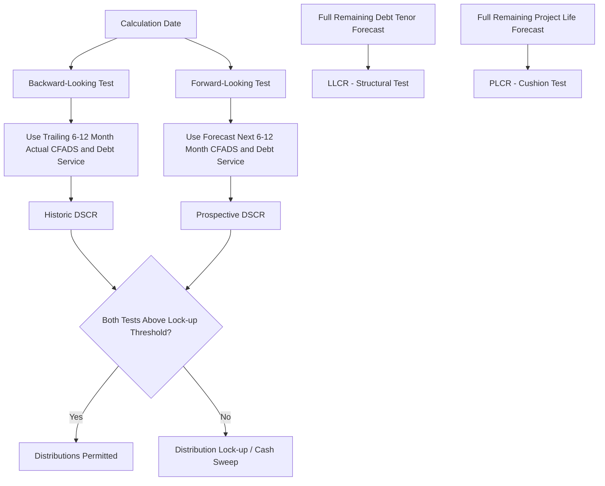

## Minimum, Average, and Backward or Forward-Looking Ratios


### Definition and Purpose

Coverage ratios (DSCR, LLCR, PLCR) are not single static numbers — they are calculated repeatedly across the life of a project financing, and lenders analyze them through several distinct statistical and temporal lenses. Understanding these lenses is essential because a single project can present very differently depending on which measure is emphasized: a project might have a strong average DSCR but a dangerously weak minimum DSCR in one specific period, or a healthy backward-looking (historical) DSCR while its forward-looking (projected) DSCR is deteriorating.

This topic covers four interrelated but distinct dimensions of ratio analysis:

1. **Minimum ratio** — the worst (lowest) value across a defined set of periods
2. **Average ratio** — the mean value across a defined set of periods
3. **Backward-looking (historical/trailing) ratio** — calculated using actual, already-realized cash flows
4. **Forward-looking (projected/prospective) ratio** — calculated using forecast, not-yet-realized cash flows

### Minimum Ratio

**Definition:** The lowest value of a coverage ratio (typically DSCR) across a specified set of periods — commonly the full debt tenor, but sometimes a rolling window (e.g., minimum over the next 12 months).

$$Minimum\ DSCR = \min(DSCR_1, DSCR_2, \ldots, DSCR_n)$$

**Key Points**

- Minimum DSCR is the most conservative and most commonly used metric for covenant-setting, since it identifies the single weakest point in the debt service profile — the period where the project is most exposed to default risk.
- Lenders typically require the minimum DSCR across the full debt tenor to exceed a set floor (e.g., 1.20x), regardless of how strong the average or other periods are.
- A project with lumpy cash flows (e.g., seasonal revenue, a major planned maintenance outage) can have a strong average DSCR while still failing a minimum DSCR test in the specific weak period, making minimum DSCR a critical structuring constraint.

### Average Ratio

**Definition:** The arithmetic mean of a coverage ratio across a specified set of periods.

$$Average\ DSCR = \frac{1}{n}\sum_{t=1}^{n} DSCR_t$$

**Key Points**

- Average DSCR is useful for assessing the overall debt service capacity of the project across its life, but it can mask periods of acute weakness if used in isolation — a common modeling and credit analysis error is relying on average DSCR without also checking minimum DSCR.
- Lenders and rating agencies typically require both an average *and* a minimum DSCR threshold to be satisfied simultaneously, precisely to prevent a strong average from disguising a weak trough period.
- The gap between average and minimum DSCR is itself a useful risk indicator: a small gap suggests a stable, flat debt service profile; a large gap suggests volatility or lumpiness in cash flows relative to debt service.

### Comparative Example

| Period | DSCR |
| --- | --- |
| 1 | 1.45x |
| 2 | 1.50x |
| 3 | 1.10x |
| 4 | 1.55x |
| 5 | 1.48x |

$$Average\ DSCR = \frac{1.45+1.50+1.10+1.55+1.48}{5} = \frac{7.08}{5} = 1.42x$$


$$Minimum\ DSCR = 1.10x$$

**Example**

Although the average DSCR of 1.42x looks comfortable, the minimum DSCR of 1.10x in Period 3 (perhaps reflecting a planned maintenance outage or seasonal revenue dip) may breach a typical lender covenant floor of 1.20x. A credit analysis relying solely on the average would materially misstate the project's risk profile; both figures must be reported and tested.

### Backward-Looking (Historical) Ratio

**Definition:** A coverage ratio calculated using **actual, realized** financial results from a completed period (e.g., the preceding six or twelve months), based on audited or management accounts rather than forecasts.

**Key Points**

- Backward-looking DSCR is the standard basis for **ongoing compliance testing** under most credit agreements, since it reflects what actually happened rather than a forecast that may not materialize — it is objective and auditable.
- Typically tested at each Calculation Date (commonly semi-annually, aligned with debt service payment dates), using the trailing 6 or 12 months of actual CFADS divided by actual debt service paid in that period.
- Backward-looking ratios are the primary trigger for **distribution tests** (can dividends be paid based on the ratio just achieved) and are also commonly used for backward-looking default/trigger events.

### Forward-Looking (Projected/Prospective) Ratio

**Definition:** A coverage ratio calculated using **forecast, not-yet-realized** cash flows for an upcoming period (e.g., the next six or twelve months, or the full remaining debt tenor as in LLCR).

**Key Points**

- Forward-looking DSCR is used to test whether the project is expected to continue servicing debt adequately going forward, and is particularly important because a project could have satisfied all historical tests while facing a clear, foreseeable deterioration (e.g., a known offtake contract expiry, known cost step-up, or scheduled major maintenance).
- LLCR and PLCR are inherently forward-looking by construction, since they require a forecast of all remaining cash flows to debt maturity or project end.
- Many credit agreements require **both** a backward-looking and forward-looking DSCR test to be satisfied at each calculation date — commonly termed a "**historical and prospective DSCR test**" — so that neither a weak recent past nor a weak known future alone escapes covenant scrutiny.

### Backward vs. Forward-Looking — Combined Testing Convention

| Test Type | Data Source | Typical Use |
| --- | --- | --- |
| Backward-looking (Historic) DSCR | Actual results, trailing 6–12 months | Distribution tests, historical default triggers |
| Forward-looking (Prospective) DSCR | Forecast, next 6–12 months | Anticipates near-term deterioration before it occurs |
| LLCR | Forecast, valuation date to final maturity | Structural adequacy over remaining debt life |
| PLCR | Forecast, valuation date to project end | Long-term cushion beyond debt repayment |

**Key Points**

- A common credit agreement structure requires distributions only when **both** historic DSCR **and** prospective DSCR exceed the lock-up threshold (e.g., both $\geq$ 1.20x) — protecting lenders from distributions being paid based on a good past that is about to deteriorate, or a good forecast that hasn't yet been proven.
- [Inference] The specific combination of tests required (historic only, prospective only, or both) varies by transaction and lender group; project finance practitioners should treat exact test structuring as governed by the specific financing documents rather than universally standardized.

### Calculation Flow Diagram



### Minimum vs. Average Across Debt Tenor (Visual)

<svg xmlns="http://www.w3.org/2000/svg" viewBox="0 0 700 380" font-family="Arial, sans-serif">
<text x="350" y="25" text-anchor="middle" font-size="16" font-weight="bold">Minimum vs Average DSCR Across Debt Tenor (svg_diagram)</text>
<line x1="70" y1="320" x2="650" y2="320" stroke="#333" stroke-width="2" />
<line x1="70" y1="320" x2="70" y2="60" stroke="#333" stroke-width="2" />
<text x="360" y="355" text-anchor="middle" font-size="13">Period</text>
<text x="30" y="190" text-anchor="middle" font-size="13" transform="rotate(-90 30 190)">DSCR (x)</text>
<polyline points="100,150 200,130 300,260 400,120 500,140 600,145" fill="none" stroke="#2980b9" stroke-width="3" />
<circle cx="100" cy="150" r="4" fill="#2980b9" />
<circle cx="200" cy="130" r="4" fill="#2980b9" />
<circle cx="300" cy="260" r="5" fill="#c0392b" />
<circle cx="400" cy="120" r="4" fill="#2980b9" />
<circle cx="500" cy="140" r="4" fill="#2980b9" />
<circle cx="600" cy="145" r="4" fill="#2980b9" />
<text x="300" y="290" text-anchor="middle" font-size="12" fill="#c0392b">Minimum DSCR</text>
<line x1="70" y1="147" x2="650" y2="147" stroke="#27ae60" stroke-width="2" stroke-dasharray="6,3" />
<text x="600" y="140" font-size="12" fill="#27ae60">Average DSCR</text>
<line x1="70" y1="200" x2="650" y2="200" stroke="#e67e22" stroke-width="2" stroke-dasharray="3,3" />
<text x="560" y="215" font-size="12" fill="#e67e22">Covenant Floor (e.g. 1.20x)</text>
</svg>

### Excel/Model Implementation

```excel
' Minimum DSCR across the debt tenor
=MIN(DSCR_Range)

' Average DSCR across the debt tenor
=AVERAGE(DSCR_Range)

' Backward-looking (historic) DSCR at a given calculation date
=SUM(Actual_CFADS_Trailing12M) / SUM(Actual_DebtService_Trailing12M)

' Forward-looking (prospective) DSCR at a given calculation date
=SUM(Forecast_CFADS_Next12M) / SUM(Forecast_DebtService_Next12M)
```

**Key Points**

- Models typically maintain a dedicated "Ratios" or "Covenants" tab presenting minimum, average, historic, and prospective figures side by side at each calculation date, often with conditional formatting flags (e.g., red/amber/green) against covenant thresholds.
- The `MIN()` and `AVERAGE()` functions should be applied only across the relevant defined period (e.g., full debt tenor for a "life of loan" minimum, or a rolling 12-month window for periodic testing) — using the wrong range is a common source of covenant compliance calculation errors.
- Care should be taken that trailing/rolling calculations correctly reference actual (historized) figures for backward-looking tests and forecast figures for forward-looking tests, since a common model error is inadvertently mixing actual and forecast data within the same ratio calculation.

### Covenant Application Summary

**Key Points**

- **Distribution/lock-up tests**: typically require both historic and prospective DSCR above a lock-up threshold at each distribution date.
- **Default/trigger tests**: often reference minimum DSCR over a defined period (e.g., "DSCR falls below 1.00x for two consecutive periods") as an event of default trigger.
- **Structuring tests**: minimum LLCR/PLCR under base and downside cases inform initial debt sizing at financial close, as covered under Gearing and Leverage Ratios.
- [Unverified] The precise thresholds and combinations of minimum/average/backward/forward tests differ materially by transaction, lender group, and jurisdiction; the frameworks described here represent common market conventions rather than fixed universal rules.

### Common Pitfalls

**Key Points**

- Reporting only average DSCR without minimum DSCR, obscuring trough-period risk.
- Using forecast data in a backward-looking test (or vice versa) due to model referencing errors, especially around the transition point between actual and forecast periods in a live/updated model.
- Failing to align the "rolling window" definition (e.g., trailing 12 months vs. trailing 6 months) with what is explicitly specified in the credit agreement's defined terms.
- Confusing "minimum DSCR over the debt tenor" (a single life-of-loan statistic) with "minimum DSCR test at a calculation date" (a periodic compliance check) — these serve different analytical purposes and are not interchangeable.

**Related Topics**

- Debt Service Coverage Ratio (DSCR)
- Loan Life Coverage Ratio (LLCR)
- Project Life Coverage Ratio (PLCR)
- Distribution/dividend lock-up mechanisms
- Cash Flow Available for Debt Service (CFADS) construction
- Debt sculpting and sizing methodologies
- Financial covenant compliance certificates and reporting