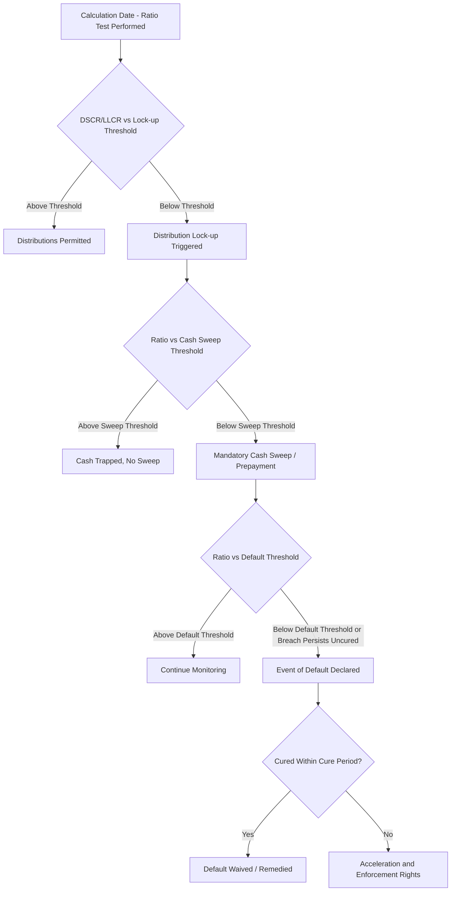

## Covenant Structuring and Default Triggers


### Definition and Purpose

Covenant structuring refers to the design of financial and operational tests embedded in project finance credit agreements that govern the ongoing relationship between the project company (borrower) and its lenders. Covenants translate the financial metrics covered elsewhere in this chapter (DSCR, LLCR, PLCR, gearing) into contractual triggers with defined consequences — ranging from restrictions on cash distributions to acceleration of the entire debt facility. This topic covers the categories of covenants used in project finance, how they are tiered, and how breaches cascade into remedies and default.

### Categories of Covenants

**Key Points**

- **Financial covenants**: quantitative tests based on model outputs (minimum DSCR, LLCR, PLCR, gearing/leverage limits).
- **Affirmative covenants**: ongoing obligations the borrower must actively perform (e.g., maintain insurance, deliver financial statements, maintain permits/licenses, comply with law).
- **Negative covenants**: restrictions on actions the borrower cannot take without lender consent (e.g., incurring additional debt, disposing of assets, amending material project contracts, changing the business).
- **Information/reporting covenants**: obligations to deliver periodic reports, compliance certificates, and calculation date ratio computations to the lenders' agent.
- **Conditions precedent/subsequent**: conditions that must be satisfied before initial drawdown (CPs) or within a defined period after (CSs), distinct from ongoing covenants but part of the same overall credit protection framework.

### Tiered Covenant Structure

Project finance covenants are typically structured in **tiers** of increasing severity, each with different consequences, rather than a single binary pass/fail test.

| Tier | Typical Trigger | Consequence |
| --- | --- | --- |
| Distribution Lock-up (Tier 1) | DSCR/LLCR falls below lock-up threshold (e.g., 1.20x) | Equity distributions suspended; cash trapped in a lock-up/reserve account |
| Cash Sweep Trigger (Tier 2) | Ratio falls further, or lock-up persists for defined period | Excess cash swept to mandatory prepayment of debt |
| Technical/Financial Default (Tier 3) | Ratio falls below a lower "default" threshold, or covenant breach persists uncured | Formal Event of Default declared; may or may not trigger acceleration immediately |
| Acceleration/Enforcement (Tier 4) | Continuing/uncured Event of Default | Lenders may accelerate debt, enforce security, appoint receiver, or exercise step-in rights |

**Key Points**

- This tiering allows lenders to intervene progressively — restricting cash first, then sweeping cash to delever, and only pursuing full default/enforcement as a last resort — reflecting the reality that project finance lenders generally prefer a cured, ongoing project to a distressed enforcement scenario.
- The gap between the distribution lock-up threshold and the default threshold represents the covenant "headroom" — a wider gap gives the project more room to underperform before triggering severe consequences, while a narrower gap gives lenders earlier warning and control.
- [Inference] The specific number of tiers, their thresholds, and cure periods vary considerably by transaction, sector, and lender group; the four-tier structure above represents a common market convention rather than a fixed universal standard.

### Covenant Cascade Flow Diagram



### Financial Covenant Design Elements

**Key Points**

- **Threshold levels**: set based on the debt sizing exercise (see Gearing and Leverage Ratios) — typically the base-case minimum ratio plus a buffer, and separately validated against a defined downside/stress case.
- **Testing frequency**: commonly semi-annual (aligned with debt service payment dates), though quarterly or monthly testing is used in some structures, particularly during construction or ramp-up periods.
- **Testing basis**: as covered in Minimum, Average, and Backward/Forward-Looking Ratios, covenants often require both historic and prospective ratios to be satisfied simultaneously.
- **Cure rights**: many credit agreements provide sponsors a right to "cure" a covenant breach via an equity injection (an "equity cure") within a defined period, recalculating the ratio as if the cure had been applied from the start of the relevant period — subject to limits on frequency and amount of cure rights available over the debt life.
- **Grace/cure periods**: distinguish a momentary technical breach from a persistent, structural problem; many covenants only escalate to default status if the breach persists beyond a defined number of consecutive testing periods.

### Negative Covenant Examples (Illustrative)

| Restricted Action | Typical Threshold/Condition |
| --- | --- |
| Incurring additional debt | Prohibited unless pro forma gearing/leverage remains within agreed limits |
| Amending key project contracts (PPA, concession, EPC, O&M) | Requires lender consent, particularly for changes affecting revenue or cost assumptions |
| Disposing of material assets | Prohibited or requires consent, to preserve security package integrity |
| Changing the nature of the business | Prohibited, to preserve the single-purpose vehicle (SPV) structure lenders rely on |
| Granting additional security/liens | Prohibited (negative pledge), to preserve the priority of existing lenders' security |

### Affirmative and Reporting Covenant Examples

**Key Points**

- Maintenance of required insurance coverage, permits, licenses, and regulatory approvals throughout the project life.
- Delivery of periodic compliance certificates at each calculation date, typically including the calculated DSCR/LLCR figures, confirmation of covenant compliance, and details of any known or anticipated breach.
- Delivery of audited annual financial statements and unaudited periodic management accounts within specified timeframes.
- Maintenance of the Debt Service Reserve Account (DSRA) and any other required reserve accounts at their mandated minimum balances.

### Worked Example — Covenant Cascade in Practice

A project financing has the following structure: Lock-up DSCR = 1.20x, Cash Sweep DSCR = 1.10x, Default DSCR = 1.00x (tested semi-annually, historic and prospective basis, with a two-consecutive-period cure allowance before default status).

**Example**

In Period 1, actual DSCR comes in at 1.15x (below lock-up, above sweep threshold) — distributions are suspended and cash is trapped in a reserve account, but no default is triggered. In Period 2, DSCR recovers to 1.25x — the lock-up is released and normal distributions resume, since the breach did not persist for two consecutive periods and remained above the default threshold throughout. Had DSCR instead fallen to 0.95x in Period 2 (below the 1.00x default threshold) while also being below 1.20x in Period 1, this would likely constitute a continuing/uncured event of default, subject to any applicable equity cure rights being exercised within the cure period.

### Excel/Model Implementation

```excel
' Covenant test flag at each calculation date
=IF(DSCR_HistoricAndProspectiveMin < LockupThreshold, "Lock-up Triggered", "Compliant")

' Cash sweep test
=IF(DSCR_HistoricAndProspectiveMin < SweepThreshold, "Cash Sweep Required", "No Sweep")

' Default test (with consecutive period check)
=IF(AND(DSCR_Period < DefaultThreshold, DSCR_PriorPeriod < DefaultThreshold), "Event of Default", "Monitor")
```

**Key Points**

- Models typically build a dedicated **Covenant Compliance** or **Ratios & Covenants** tab that calculates each tier's test result at every calculation date and flags status using conditional formatting (commonly red/amber/green) for quick lender and sponsor review.
- Consecutive-period breach logic (for distinguishing a technical dip from a structural default) requires referencing prior-period results, which should be built with clear, auditable formula logic rather than hard-coded period counts, to remain robust if the model timeline changes.
- Equity cure mechanics, if modeled, typically require a separate calculation showing the "as-cured" ratio (adding the cure equity amount to the numerator or reducing debt service) alongside the "as-reported" (uncured) ratio, for transparency to both sponsors and lenders.

### Covenant Tier Visual

<svg xmlns="http://www.w3.org/2000/svg" viewBox="0 0 700 400" font-family="Arial, sans-serif">
<text x="350" y="25" text-anchor="middle" font-size="16" font-weight="bold">Covenant Tier Structure (svg_diagram)</text>
<line x1="80" y1="350" x2="620" y2="350" stroke="#333" stroke-width="2" />
<line x1="80" y1="350" x2="80" y2="60" stroke="#333" stroke-width="2" />
<text x="30" y="200" text-anchor="middle" font-size="13" transform="rotate(-90 30 200)">DSCR Level</text>
<rect x="80" y="70" width="540" height="60" fill="#27ae60" opacity="0.6" />
<text x="620" y="105" text-anchor="end" font-size="12" fill="#1e6b3a">Fully Compliant Zone (Distributions OK)</text>
<line x1="80" y1="130" x2="620" y2="130" stroke="#333" stroke-width="1" />
<text x="90" y="145" font-size="12">1.20x Lock-up Threshold</text>
<rect x="80" y="130" width="540" height="70" fill="#f1c40f" opacity="0.6" />
<text x="620" y="170" text-anchor="end" font-size="12" fill="#7d6608">Lock-up Zone (Cash Trapped)</text>
<line x1="80" y1="200" x2="620" y2="200" stroke="#333" stroke-width="1" />
<text x="90" y="215" font-size="12">1.10x Cash Sweep Threshold</text>
<rect x="80" y="200" width="540" height="70" fill="#e67e22" opacity="0.6" />
<text x="620" y="240" text-anchor="end" font-size="12" fill="#8a4a0d">Cash Sweep Zone (Mandatory Prepayment)</text>
<line x1="80" y1="270" x2="620" y2="270" stroke="#333" stroke-width="1" />
<text x="90" y="285" font-size="12">1.00x Default Threshold</text>
<rect x="80" y="270" width="540" height="60" fill="#c0392b" opacity="0.6" />
<text x="620" y="305" text-anchor="end" font-size="12" fill="white">Event of Default Zone</text>
</svg>

### Consequences of Default and Enforcement

**Key Points**

- **Cross-default provisions**: a default under one financing document (e.g., a hedging agreement or a shareholder loan) may trigger cross-default under the senior facility agreement, and vice versa — a common structuring feature to ensure creditor coordination.
- **Step-in rights**: lenders (often via an intercreditor agreement or direct agreement with key project counterparties) may have the right to "step into" the project company's position under key contracts (EPC, O&M, offtake) to cure a default and preserve the project rather than immediately enforcing security.
- **Acceleration**: the ultimate remedy — declaring all outstanding debt immediately due and payable — is typically reserved for persistent, uncured, or material defaults rather than triggered automatically at the first breach, reflecting the practical reality that enforcement/insolvency processes are costly and value-destructive for all parties, including lenders.
- [Unverified] The exact interplay between cross-default, step-in rights, and acceleration is heavily dependent on the specific intercreditor agreement and jurisdiction; this should be assessed against the actual transaction documents rather than assumed from general principles.

### Common Pitfalls

**Key Points**

- Treating covenant breach as a single binary event rather than recognizing the tiered cascade (lock-up → sweep → default → acceleration), which can lead to overstating or understating the true severity of a given ratio outcome.
- Failing to model equity cure mechanics correctly, particularly around cure frequency/amount limits and the "look-back" period over which a cure can be applied.
- Overlooking cross-default linkages between the senior facility, hedging agreements, and subordinated debt when assessing the full consequence of a covenant breach.
- Inconsistent covenant definitions between the financial model and the actual credit agreement — the model's ratio calculation methodology (e.g., inclusion of DSRA, discount rate used for LLCR) must be reconciled precisely against the legal definitions in the financing documents, since discrepancies here are a frequent source of dispute at compliance testing dates.

**Related Topics**

- Debt Service Coverage Ratio (DSCR)
- Loan Life Coverage Ratio (LLCR)
- Project Life Coverage Ratio (PLCR)
- Gearing and Leverage Ratios
- Minimum, Average, and Backward/Forward-Looking Ratios
- Intercreditor agreements and step-in rights
- Debt Service Reserve Account (DSRA) mechanics
- Equity cure mechanisms
- Cash sweep and distribution waterfall structuring