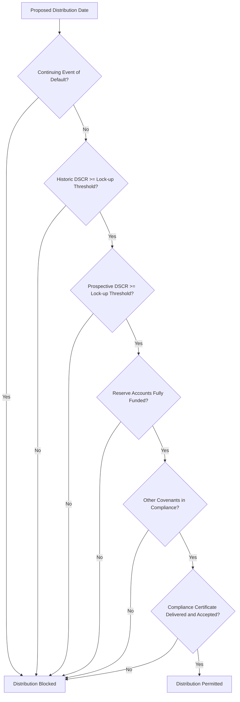

## Distribution Lock-Up and Cash Trap Covenants

### Definition and Purpose

Distribution lock-up and cash trap covenants are mechanisms in project finance credit agreements that restrict a project company's ability to release cash to shareholders (via dividends, subordinated debt repayment, management fees, or other equity distributions) unless specified financial and operational conditions are satisfied. These covenants sit at the first tier of the covenant cascade (see Covenant Structuring and Default Triggers) and represent the primary, most frequently activated protection lenders have against value leaking out of the project company while credit quality is deteriorating or uncertain.

The core principle: cash generated by the project belongs first to debt service and reserve requirements; only demonstrated surplus, tested against defined conditions, may flow to equity.

### Distinction: Lock-Up vs. Cash Trap vs. Cash Sweep

**Key Points**

- **Distribution lock-up**: distributions are simply *prohibited* — cash accumulates on the project company's balance sheet (often in a designated account) but is not applied to prepay debt; it is released to equity once conditions are subsequently satisfied.
- **Cash trap**: closely related to lock-up — cash is trapped in a specific reserve or blocked account rather than being freely available, often used interchangeably with "lock-up" though some credit agreements distinguish a cash trap (temporary holding) from a full distribution stop (which may have additional consequences).
- **Cash sweep**: a distinct, more severe mechanism (the next tier up) where trapped cash is not merely held but *mandatorily applied* to prepay debt — permanently deleveraging the project rather than simply deferring the distribution decision.
- [Inference] Exact terminology (lock-up vs. cash trap vs. cash sweep) varies across financing documents and jurisdictions; some agreements use these terms interchangeably while others assign each a precise, distinct contractual meaning — the specific defined terms in the relevant credit agreement always govern.

### Distribution Conditions (Standard Checklist)

A typical distribution test requires **all** of the following conditions to be satisfied simultaneously before a distribution is permitted:

1. **No continuing Event of Default** — no unremedied default exists at the proposed distribution date.
2. **Historic DSCR test** — the trailing (e.g., 12-month) DSCR meets or exceeds the lock-up threshold.
3. **Prospective DSCR test** — the forecast (e.g., next 12-month) DSCR meets or exceeds the lock-up threshold.
4. **LLCR test** (in some structures) — the projected LLCR meets or exceeds a minimum level.
5. **Reserve account funding** — the DSRA and any other required reserve accounts (e.g., maintenance reserve) are funded to their required minimum balance.
6. **No breach of other covenants** — negative and affirmative covenants are being complied with.
7. **Compliance certificate delivered** — the borrower has delivered the required certificate evidencing satisfaction of the above, often with lender/agent sign-off or a defined objection period.

**Key Points**

- All conditions are typically tested **conjunctively** ("AND" logic) — failing any single condition blocks the entire distribution, even if all others are comfortably satisfied.
- The requirement for both historic *and* prospective DSCR tests (see Minimum, Average, and Backward/Forward-Looking Ratios) is a deliberate design choice preventing distributions based on a strong past that is about to deteriorate, or a strong forecast not yet evidenced by actual performance.

### Distribution Test Flow Diagram



### The Distribution Waterfall

Cash trap and lock-up mechanics operate within the context of a broader **cash flow waterfall** — the contractually defined order in which project cash is applied each period.

**Key Points**

- Typical waterfall order (highest priority first): (1) operating costs and taxes, (2) senior debt interest, (3) senior debt scheduled principal, (4) reserve account funding (DSRA, maintenance reserve), (5) subordinated/mezzanine debt service (if any), (6) mandatory cash sweep prepayment (if triggered), (7) equity distributions (only if the distribution test above is satisfied).
- Cash that would otherwise flow to step 7 is the amount subject to lock-up — if the distribution test fails, this residual amount is retained in a blocked account (the "trapped" or "restricted" cash) rather than being released to shareholders.
- [Unverified] The precise waterfall order and which items are senior/subordinated to reserve funding varies by transaction; the sequence above reflects common market convention rather than a fixed universal structure.

### Cash Flow Waterfall Diagram

<svg xmlns="http://www.w3.org/2000/svg" viewBox="0 0 700 460" font-family="Arial, sans-serif">
<text x="350" y="25" text-anchor="middle" font-size="16" font-weight="bold">Cash Flow Waterfall (svg_diagram)</text>
<rect x="220" y="45" width="260" height="40" fill="#34495e" />
<text x="350" y="70" text-anchor="middle" font-size="12" fill="white">Gross Project Revenue</text>
<polygon points="340,85 360,85 350,100" fill="#333" />
<rect x="220" y="105" width="260" height="35" fill="#7f8c8d" />
<text x="350" y="127" text-anchor="middle" font-size="11" fill="white">1. Operating Costs and Taxes</text>
<polygon points="340,140 360,140 350,155" fill="#333" />
<rect x="220" y="160" width="260" height="35" fill="#2980b9" />
<text x="350" y="182" text-anchor="middle" font-size="11" fill="white">2. Senior Debt Interest</text>
<polygon points="340,195 360,195 350,210" fill="#333" />
<rect x="220" y="215" width="260" height="35" fill="#2980b9" />
<text x="350" y="237" text-anchor="middle" font-size="11" fill="white">3. Senior Debt Principal</text>
<polygon points="340,250 360,250 350,265" fill="#333" />
<rect x="220" y="270" width="260" height="35" fill="#8e44ad" />
<text x="350" y="292" text-anchor="middle" font-size="11" fill="white">4. Reserve Account Funding</text>
<polygon points="340,305 360,305 350,320" fill="#333" />
<rect x="220" y="325" width="260" height="35" fill="#f39c12" />
<text x="350" y="347" text-anchor="middle" font-size="11" fill="white">5. Subordinated Debt Service</text>
<polygon points="340,360 360,360 350,375" fill="#333" />
<rect x="140" y="380" width="170" height="45" fill="#c0392b" />
<text x="225" y="400" text-anchor="middle" font-size="10" fill="white">6. Cash Sweep</text>
<text x="225" y="415" text-anchor="middle" font-size="10" fill="white">(if triggered)</text>
<rect x="390" y="380" width="170" height="45" fill="#27ae60" />
<text x="475" y="400" text-anchor="middle" font-size="10" fill="white">7. Equity Distribution</text>
<text x="475" y="415" text-anchor="middle" font-size="10" fill="white">(if test passed)</text>
</svg>

### Worked Example

A project generates $50 million of CFADS in a semi-annual period. Senior debt service (interest + scheduled principal) for the period is $35 million. Required DSRA top-up is $2 million. There is no subordinated debt.

$$Residual\ Cash = 50 - 35 - 2 = \$13\ million$$

**Example**

If the historic DSCR (50/35 = 1.43x) and prospective DSCR for the next period both exceed the lock-up threshold of 1.20x, and no default exists, the full $13 million residual can be distributed to equity. If, however, the prospective DSCR forecast falls to 1.15x due to a known upcoming cost increase, the entire $13 million would instead be trapped in a blocked account, even though the historic ratio and current period's residual cash both appear healthy — illustrating why the prospective test exists independently of the historic test.

### Excel/Model Implementation

```excel
' Distribution test - all conditions must be TRUE
=IF(AND(
    NOT(EventOfDefaultFlag),
    Historic_DSCR >= LockupThreshold,
    Prospective_DSCR >= LockupThreshold,
    DSRA_Balance >= DSRA_RequiredBalance,
    OtherCovenantsCompliant
  ), "Distribution Permitted", "Distribution Locked Up")

' Trapped cash roll-forward
=Prior_TrappedCashBalance + IF(DistributionTest="Distribution Locked Up", Residual_Cash, 0)
                          - IF(DistributionTest="Distribution Permitted", Released_Amount, 0)
```

**Key Points**

- Models typically maintain a **restricted/trapped cash account roll-forward** schedule separate from the main cash flow statement, tracking accumulated trapped cash balances period over period until conditions are satisfied and a release is permitted.
- The distribution test formula should reference the **same DSCR calculation basis** (historic vs. prospective, and the exact CFADS/debt service definitions) as specified in the credit agreement — any divergence between the model's convention and the legal definition is a common source of reconciliation disputes at compliance dates.
- Some models incorporate a **"catch-up" mechanic** — once a lock-up is released, whether the previously trapped cash becomes distributable immediately in full, in a controlled/phased manner, or only after an additional waiting period, depends entirely on the specific drafting of the credit agreement.

### Release Mechanics

**Key Points**

- Trapped cash does not automatically become distributable simply because the ratio recovers in a subsequent period — many credit agreements require the improved ratio to be demonstrated as **sustained** (e.g., met at two consecutive testing dates) before release is permitted, to avoid whipsawing between locked and released states.
- Some structures apply released cash first to any outstanding subordinated debt or deferred fees before allowing distribution to common equity, reflecting the payment priority hierarchy within the capital structure.
- Reserve account over-funding (balances built up during a lock-up period beyond the strict minimum requirement) is sometimes addressed by a separate "excess cash" release mechanism, distinct from the ordinary period-by-period distribution test.

### Common Pitfalls

**Key Points**

- Applying only a historic DSCR test in a model while the credit agreement requires both historic and prospective tests, understating the frequency and severity of lock-up events.
- Failing to model the trapped cash roll-forward correctly, leading to a mismatch between the model's projected cash balances and the actual restricted cash the project company will hold under a lock-up scenario.
- Overlooking reserve account funding as a condition — a project can pass the DSCR test but still be blocked from distributing if the DSRA is under-funded relative to its required balance.
- Treating "lock-up" and "cash sweep" as synonymous when the credit agreement in fact distinguishes them, leading to incorrect assumptions about whether trapped cash will eventually be released to equity (lock-up) or is permanently applied to debt reduction (sweep).

**Related Topics**

- Debt Service Coverage Ratio (DSCR)
- Minimum, Average, and Backward/Forward-Looking Ratios
- Covenant Structuring and Default Triggers
- Cash sweep and mandatory prepayment mechanisms
- Debt Service Reserve Account (DSRA) mechanics
- Intercreditor agreements and payment waterfalls
- Equity cure mechanisms