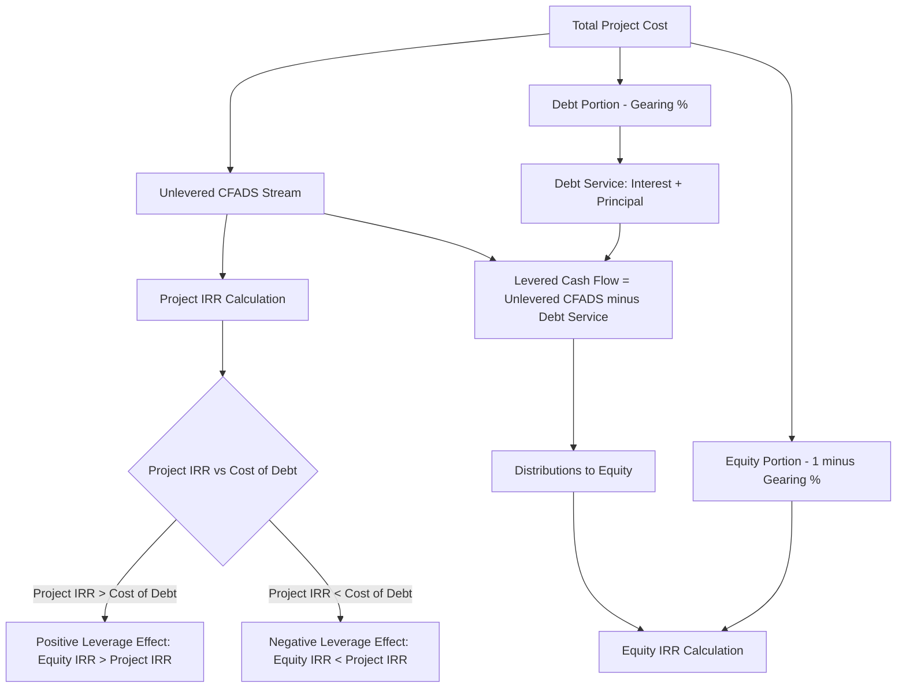

## Project Internal Rate of Return Versus Equity Internal Rate of Return

### Definition and Purpose

Project IRR and Equity IRR are the two primary internal rate of return metrics used to evaluate the financial performance of a project financing, but they measure fundamentally different things: Project IRR measures the return generated by the underlying asset/operation independent of how it is financed, while Equity IRR measures the return delivered specifically to equity investors after accounting for the effects of debt financing (leverage). Understanding the distinction — and the mechanics that drive the difference between them — is central to project finance valuation, capital structure decisions, and investor return analysis.

### Core Formulas

**Project IRR** — the discount rate at which the net present value of unlevered project cash flows equals zero:

$$\sum_{t=0}^{n} \frac{CFADS_t^{unlevered}}{(1+IRR_{project})^t} = 0$$

Where unlevered cash flow typically = Revenue − Operating Costs − Taxes − Capex (calculated **before** any debt drawdowns, interest payments, or principal repayments).

**Equity IRR** — the discount rate at which the net present value of cash flows to equity holders equals zero:

$$\sum_{t=0}^{n} \frac{CF_t^{equity}}{(1+IRR_{equity})^t} = 0$$

Where equity cash flow = Equity Contributions (negative, at investment) + Distributions/Dividends (positive, upon receipt) − any further equity injections required (e.g., under an equity cure).

**Key Points**

- Project IRR uses the full project cost as the initial outflow (all capex, funded by both debt and equity combined) and unlevered operating cash flows thereafter — it is capital-structure-agnostic.
- Equity IRR uses only the equity contribution as the initial outflow and only cash flows actually received by (or paid by) equity holders thereafter — it is capital-structure-dependent.
- Project IRR is comparable across financing structures and is often used to assess the underlying commercial/technical viability of the asset itself, independent of how aggressively it is financed.
- Equity IRR is the metric sponsors and equity investors actually care about for investment decision-making, since it reflects their real cash-on-cash return.

### The Leverage Effect

**Key Points**

- When the cost of debt is lower than the Project IRR, using debt to fund part of the project amplifies the return to the remaining equity — this is the core mechanic of the "leverage effect" (or "financial leverage") in project finance.
- Equity IRR will typically exceed Project IRR whenever: (a) the project generates a return above the cost of debt, and (b) gearing is meaningfully above zero — the more debt used (higher gearing), the greater the amplification, up to the point where coverage ratio constraints or absolute risk limits are reached.
- Conversely, if the project's return falls below the cost of debt (e.g., in a severe downside scenario), leverage works in reverse — Equity IRR falls by *more* than the corresponding decline in Project IRR, since fixed debt service must still be paid regardless of operating performance.
- [Inference] The magnitude of the leverage effect depends on the specific spread between Project IRR and the cost of debt, and on the gearing ratio; higher gearing structurally increases both the upside amplification and the downside risk to equity, which is a key reason coverage ratio covenants (see DSCR/LLCR) exist to constrain how much leverage a project can safely support.

### Comparative Table

| Metric | Initial Outflow | Cash Flow Basis | Capital Structure Sensitivity | Primary Audience |
| --- | --- | --- | --- | --- |
| Project IRR | Total project cost (100% of capex) | Unlevered CFADS (before debt service) | Insensitive to gearing | Sponsors assessing asset viability, lenders assessing underlying project quality |
| Equity IRR | Equity contribution only | Levered cash flow (distributions net of debt service) | Highly sensitive to gearing | Equity investors, sponsors assessing investment return |

### Worked Example

A project has total capex of $500 million, financed with 70% debt ($350 million) at a 6% cost of debt, and 30% equity ($150 million). Assume a simplified single-period example for illustration (in practice this would be a full multi-year cash flow schedule).

**Unlevered basis (Project IRR):**

Total investment = $500 million. Assume the project generates cash flows that produce a Project IRR of 9%.

**Levered basis (Equity IRR):**

Equity investment = $150 million. Debt of $350 million costs 6%. Since the project return (9%) exceeds the cost of debt (6%), the "excess spread" (3%) on the debt-funded portion accrues entirely to equity, amplifying the equity return above 9%.

**Example**

Using a simplified perpetuity approximation: if the project generates a 9% return on $500 million ($45 million/year) and debt service on $350 million at 6% is $21 million/year, the residual to equity is $24 million/year on a $150 million investment — an approximate 16% return, well above the 9% Project IRR. This illustrates the leverage effect: a 70% geared structure with a 300 basis point positive spread between project return and cost of debt roughly doubles the equity return relative to the unlevered project return in this simplified example. [Inference] Actual IRR uplift in a real multi-period model depends on the timing of cash flows, debt amortization profile, and tax effects, and will not follow this simplified perpetuity approximation precisely.

### IRR Relationship Diagram



### Project IRR vs Equity IRR Sensitivity to Gearing (Visual)

<svg xmlns="http://www.w3.org/2000/svg" viewBox="0 0 700 400" font-family="Arial, sans-serif">
<text x="350" y="25" text-anchor="middle" font-size="16" font-weight="bold">Equity IRR Sensitivity to Gearing (svg_diagram)</text>
<line x1="80" y1="340" x2="640" y2="340" stroke="#333" stroke-width="2" />
<line x1="80" y1="340" x2="80" y2="50" stroke="#333" stroke-width="2" />
<text x="360" y="375" text-anchor="middle" font-size="13">Gearing Level (%)</text>
<text x="30" y="195" text-anchor="middle" font-size="13" transform="rotate(-90 30 195)">IRR (%)</text>
<line x1="80" y1="240" x2="640" y2="240" stroke="#2980b9" stroke-width="3" />
<text x="600" y="230" font-size="12" fill="#2980b9">Project IRR (constant ~9%)</text>
<polyline points="80,280 200,255 320,220 440,170 560,100" fill="none" stroke="#27ae60" stroke-width="3" />
<text x="450" y="150" font-size="12" fill="#27ae60">Equity IRR (rises with gearing)</text>
<text x="90" y="360" font-size="11">0%</text>
<text x="200" y="360" font-size="11">30%</text>
<text x="320" y="360" font-size="11">50%</text>
<text x="440" y="360" font-size="11">70%</text>
<text x="560" y="360" font-size="11">85%</text>
</svg>

### Excel/Model Implementation

```excel
' Project IRR (unlevered)
=IRR(Unlevered_CashFlow_Range)
' Where Unlevered_CashFlow_Range = -Total_Capex, then Revenue - OpEx - Tax for each subsequent period

' Equity IRR (levered)
=IRR(Equity_CashFlow_Range)
' Where Equity_CashFlow_Range = -Equity_Contribution, then Distributions_to_Equity for each subsequent period

' XIRR for irregular period timing
=XIRR(CashFlow_Range, Date_Range)
```

**Key Points**

- `XIRR()` is generally preferred over `IRR()` in project finance models because construction drawdowns and distributions rarely fall on exact annual anniversaries — `XIRR()` correctly accounts for actual date-based cash flow timing, while `IRR()` assumes equally spaced periods.
- Project IRR cash flows should be built on a **pre-financing, pre-tax-shield-from-interest** basis in most conventions (i.e., taxes calculated as if the project were unlevered) to isolate the asset's underlying return from financing effects — though some practitioners use a "levered-but-normalized" convention; the specific approach should be stated explicitly in any analysis.
- Equity IRR cash flows must capture **all** cash flows to/from equity, including initial equity injection, any subsequent equity injections (e.g., cost overrun funding or equity cures), and all distributions (ordinary dividends, subordinated debt repayments if treated as equity-like, and any terminal/exit proceeds).
- A common modeling error is mixing conventions — e.g., using post-tax unlevered cash flows for Project IRR but a tax calculation that already reflects the interest tax shield, which double-counts or omits the tax effect of leverage.

### IRR and Coverage Ratio Interlinkage

**Key Points**

- The gearing level that maximizes Equity IRR is not chosen freely — it is constrained by the debt sizing/sculpting exercise, which requires minimum DSCR/LLCR thresholds to be met (see Gearing and Leverage Ratios). Sponsors seeking to maximize Equity IRR are therefore incentivized to push gearing as high as coverage covenants and lender risk appetite will allow.
- This creates the central tension in project finance structuring: higher gearing increases Equity IRR (assuming positive leverage effect) but reduces coverage ratio headroom, increasing sensitivity to downside scenarios — a trade-off sponsors and lenders negotiate explicitly during structuring.

### Common Pitfalls

**Key Points**

- Comparing Project IRR and Equity IRR directly as if they were substitutes — they answer different questions and are not interchangeable measures of project attractiveness.
- Using `IRR()` instead of `XIRR()` when cash flow timing is irregular, producing a materially misstated return given typical construction drawdown schedules.
- Inconsistent tax treatment between the unlevered (Project IRR) and levered (Equity IRR) cash flow builds, distorting the apparent leverage effect.
- Ignoring the impact of an equity cure or additional equity injection mid-project on Equity IRR — these are negative cash flows to equity that must be included, not just the day-one investment and subsequent positive distributions.
- Overlooking that a very high Equity IRR built on aggressive gearing may come with materially higher downside risk (thinner coverage ratio headroom) — high Equity IRR alone does not indicate low risk.

**Related Topics**

- Gearing and Leverage Ratios
- Debt Service Coverage Ratio (DSCR)
- Cash Flow Available for Debt Service (CFADS) construction
- Net Present Value and discount rate selection in project finance
- Equity cure mechanisms
- Sensitivity and scenario analysis in project finance models
- Weighted Average Cost of Capital (WACC) in project valuation