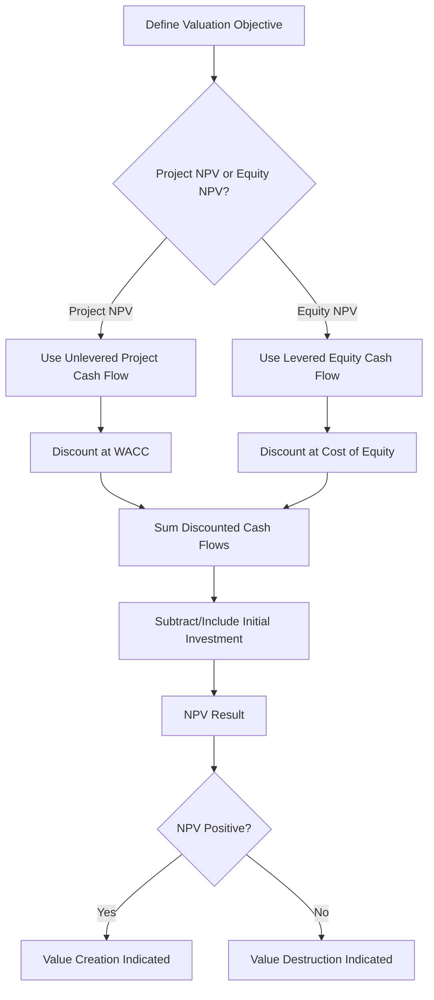

## Net Present Value in Project Finance


### Definition and Purpose

Net Present Value (NPV) measures the value created by a project by discounting all expected future cash flows to a present value using an appropriate discount rate and subtracting the initial investment. In project finance, NPV is used at multiple levels — project-level (assessing overall asset value), equity-level (assessing investor value creation), and within specific covenant calculations (LLCR, PLCR) — making a clear understanding of discount rate selection and cash flow basis essential, since the "correct" NPV depends entirely on whose perspective and which cash flow stream is being valued.

### Core Formula

$$NPV = \sum_{t=0}^{n} \frac{CF_t}{(1+r)^t}$$

Where:

- $CF_t$ = net cash flow in period $t$ (typically negative at $t=0$, representing initial investment)
- $r$ = discount rate, selected according to which cash flow stream is being valued
- $n$ = number of periods in the valuation horizon

**Key Points**

- A positive NPV indicates the project is expected to generate value in excess of the return required by the discount rate; a negative NPV indicates the opposite.
- Unlike IRR, NPV produces a currency-denominated value rather than a percentage return, making it directly comparable in magnitude across projects of different scale — though this also means NPV alone does not indicate capital efficiency (a large NPV on a very large investment may represent a lower percentage return than a smaller NPV on a smaller investment).
- NPV and IRR are closely related (IRR is the discount rate at which NPV equals zero) but can rank competing projects differently in certain cash flow patterns (e.g., non-conventional cash flows with multiple sign changes, or mutually exclusive projects of different scale/timing) — a well-known corporate finance distinction that also applies in project finance context.

### Discount Rate Selection by Perspective

| Valuation Perspective | Appropriate Discount Rate | Typical Use |
| --- | --- | --- |
| Project NPV (unlevered) | Weighted Average Cost of Capital (WACC) | Assessing overall project/asset value creation, independent of financing |
| Equity NPV (levered) | Cost of equity (required equity return) | Assessing value created for equity investors specifically |
| LLCR numerator | Senior debt interest rate | Testing debt coverage adequacy (not a value-creation metric, but structurally an NPV calculation) |
| PLCR numerator | Senior debt interest rate (by convention, consistent with LLCR) | Testing long-term cushion adequacy |

**Key Points**

- Using the wrong discount rate for the wrong cash flow stream is one of the most common and consequential errors in project finance valuation — discounting unlevered project cash flows at the cost of equity (or vice versa) systematically misstates value.
- WACC blends the cost of debt and cost of equity, weighted by their respective proportions in the capital structure (gearing), and is the theoretically correct rate for discounting unlevered cash flows precisely because it reflects the blended required return of all capital providers.
- The cost of equity is derived separately (e.g., via CAPM or a project-specific required return benchmark) and is used only for discounting cash flows that accrue specifically to equity holders (i.e., levered/distribution cash flows).

### WACC Formula

$$WACC = \left(\frac{E}{D+E}\right) \times k_e + \left(\frac{D}{D+E}\right) \times k_d \times (1-T)$$

Where:

- $E$ = market value of equity, $D$ = market value of debt
- $k_e$ = cost of equity (required equity return)
- $k_d$ = pre-tax cost of debt
- $T$ = corporate tax rate (debt interest is typically tax-deductible, hence the $(1-T)$ adjustment — the "tax shield")

**Key Points**

- The $(D+E)$ weights should reflect the target or actual gearing ratio of the project (see Gearing and Leverage Ratios), and are conventionally based on market values rather than book values, though in project finance the initially agreed capital structure often serves as a reasonable proxy.
- [Inference] In practice, many project finance valuations use a simplified or sector-standard WACC assumption rather than deriving it from first principles via CAPM for every transaction, particularly for preliminary screening; a fully derived WACC is more common in formal valuation reports, fairness opinions, or bid evaluations.

### Step-by-Step NPV Calculation Methodology

1. **Define the cash flow stream** to be valued — unlevered project cash flow (for Project NPV) or levered equity cash flow (for Equity NPV).
2. **Determine the valuation horizon** — full project/concession life for Project NPV; often the same horizon or the investment holding period for Equity NPV.
3. **Select the appropriate discount rate** — WACC for unlevered project cash flow, cost of equity for levered equity cash flow.
4. **Discount each period's cash flow** to the valuation date using the selected rate.
5. **Sum the discounted cash flows**, including the initial investment outflow at $t=0$ (or the relevant discounting convention if investment occurs across multiple periods during construction).
6. **Interpret the result**: positive NPV indicates value creation relative to the required return; compare across scenarios or alternative structures as needed.

### Worked Example

A project has a total capex of $500 million (financed 70% debt / 30% equity), cost of debt of 6% (pre-tax), cost of equity of 12%, and a corporate tax rate of 25%.

$$WACC = (0.30 \times 12\%) + (0.70 \times 6\% \times (1-0.25)) = 3.6\% + 3.15\% = 6.75\%$$

Assume the unlevered project generates $45 million per year in perpetuity (simplified for illustration).

$$Project\ NPV = \frac{45}{0.0675} - 500 = 666.7 - 500 = \$166.7\ million$$

**Example**

A Project NPV of approximately $167 million (using the simplified perpetuity approach) indicates the project is expected to generate value well in excess of its blended cost of capital, supporting a "proceed" investment decision from an overall asset perspective — independent of how the specific 70:30 capital structure allocates that value between debt and equity holders. [Inference] A real-world multi-year model would replace this perpetuity simplification with an explicit period-by-period cash flow forecast and discounting schedule, and would typically show materially different results depending on the actual project life, ramp-up profile, and terminal value assumptions.

### NPV Calculation Flow Diagram



### NPV Profile Visual

<svg xmlns="http://www.w3.org/2000/svg" viewBox="0 0 700 400" font-family="Arial, sans-serif">
<text x="350" y="25" text-anchor="middle" font-size="16" font-weight="bold">NPV Profile vs Discount Rate (svg_diagram)</text>
<line x1="80" y1="220" x2="640" y2="220" stroke="#333" stroke-width="2" />
<line x1="80" y1="60" x2="80" y2="350" stroke="#333" stroke-width="2" />
<text x="360" y="380" text-anchor="middle" font-size="13">Discount Rate (%)</text>
<text x="30" y="200" text-anchor="middle" font-size="13" transform="rotate(-90 30 200)">NPV ($m)</text>
<path d="M 100,90 Q 300,120 420,220 Q 500,280 600,340" fill="none" stroke="#2980b9" stroke-width="3" />
<circle cx="420" cy="220" r="5" fill="#c0392b" />
<text x="430" y="215" font-size="12" fill="#c0392b">IRR (NPV = 0)</text>
<line x1="150" y1="220" x2="150" y2="105" stroke="#27ae60" stroke-width="2" stroke-dasharray="4,3" />
<text x="155" y="100" font-size="12" fill="#27ae60">WACC Point: NPV Positive</text>
</svg>

### Excel/Model Implementation

```excel
' Project NPV using WACC
=NPV(WACC_Rate, Unlevered_CashFlow_Range_t1_to_n) - Initial_Investment_t0
' or, if t0 flow is included in the range with correct sign:
=NPV(WACC_Rate, Full_CashFlow_Range_including_t0_as_first_period)

' Equity NPV using Cost of Equity
=NPV(CostOfEquity_Rate, Equity_CashFlow_Range_t1_to_n) - Initial_Equity_Investment_t0

' XNPV for irregular period timing
=XNPV(Rate, CashFlow_Range, Date_Range)
```

**Key Points**

- Excel's `NPV()` function discounts the **first cash flow in the range as if it occurs one period from today** — a frequent modeling error is placing the $t=0$ investment inside the `NPV()` range without adjustment, which incorrectly discounts it by one period; the standard correction is to exclude $t=0$ from the `NPV()` range and add/subtract it separately, undiscounted.
- `XNPV()` should be used when cash flows do not fall on regular, equally spaced periods (common during construction drawdown schedules), analogous to the `XIRR()` versus `IRR()` distinction.
- WACC-based Project NPV and cost-of-equity-based Equity NPV should never be mixed within the same discounting exercise — each cash flow stream must be paired with its theoretically consistent discount rate.

### NPV and Coverage Ratios — Structural Relationship

**Key Points**

- LLCR and PLCR (covered earlier in this chapter) are, structurally, present value calculations — but they discount CFADS at the senior debt interest rate (not WACC or cost of equity) specifically because they test debt coverage adequacy, not overall value creation; conflating these purposes is a common conceptual error.
- Project NPV (using WACC) answers "does this project create value for all capital providers combined?" while LLCR (using the debt rate) answers "can the project's cash flow adequately service the debt over its remaining life?" — both are present-value-based but serve entirely different analytical purposes and should not be used interchangeably.

### Common Pitfalls

**Key Points**

- Discounting unlevered project cash flows at the cost of equity (overstating the required return and understating apparent Project NPV) or discounting levered equity cash flows at WACC (understating the required return and overstating apparent Equity NPV).
- Excel `NPV()` off-by-one-period error when the initial investment is included within the discounted range rather than treated as an undiscounted $t=0$ outflow.
- Using a static, single WACC figure across the entire project life when the actual gearing ratio changes materially over time (e.g., as debt amortizes and the debt-to-equity mix shifts) — a more rigorous approach may require a time-varying discount rate, though [Inference] many practical models use a single blended WACC for simplicity, treating this as an acceptable approximation given other forecast uncertainties.
- Applying a terminal value or perpetuity growth assumption inconsistently with the project's actual contractual or asset life (e.g., using a perpetuity for a concession asset with a defined, finite concession term).

**Related Topics**

- Project Internal Rate of Return Versus Equity Internal Rate of Return
- Loan Life Coverage Ratio (LLCR)
- Project Life Coverage Ratio (PLCR)
- Weighted Average Cost of Capital (WACC) derivation and CAPM
- Gearing and Leverage Ratios
- Terminal value and residual asset value estimation
- Sensitivity and scenario analysis in project finance models