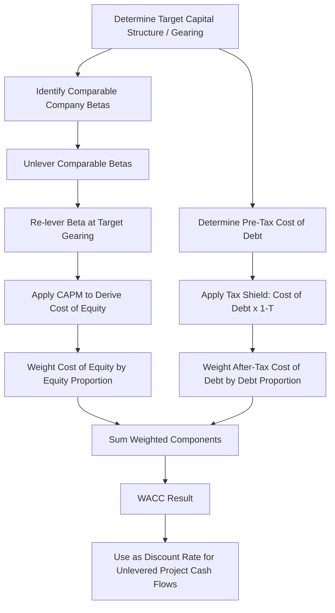

## Weighted Average Cost of Capital Construction

### Definition and Purpose

Weighted Average Cost of Capital (WACC) represents the blended required rate of return demanded by all providers of capital to a project — debt holders and equity holders — weighted by their respective proportions in the capital structure. In project finance, WACC serves as the discount rate for unlevered project cash flows (Project NPV, see Net Present Value in Project Finance) and is a foundational input for valuation, bid pricing, and investment decision-making. Constructing WACC correctly requires deriving each component (cost of debt, cost of equity, capital weights, and tax effects) individually before combining them.

### Core Formula

$$WACC = \left(\frac{E}{D+E}\right) \times k_e + \left(\frac{D}{D+E}\right) \times k_d \times (1-T)$$

Where:

- $E$ = value of equity, $D$ = value of debt
- $k_e$ = cost of equity
- $k_d$ = pre-tax cost of debt
- $T$ = corporate/marginal tax rate

**Key Points**

- The $(1-T)$ adjustment reflects the tax deductibility of debt interest in most jurisdictions (the "interest tax shield"), which reduces the effective after-tax cost of debt relative to its stated/contractual rate.
- Equity has no equivalent tax adjustment, since dividend/distribution payments are typically not tax-deductible to the paying entity.
- The weights $(E/(D+E))$ and $(D/(D+E))$ should reflect the target capital structure (gearing ratio, see Gearing and Leverage Ratios) at the point in time being valued — a materially important distinction, since a project's actual D/E mix changes over its life as debt amortizes.

### Component 1: Cost of Debt ($k_d$)

**Key Points**

- The pre-tax cost of debt is typically the **contractual interest rate** (or effective all-in rate including margin, base rate, and amortized upfront fees) on the project's senior debt facility.
- For floating-rate debt, the cost of debt used in WACC construction is often based on either the current forward curve for the relevant benchmark rate plus margin, or a fixed all-in rate if the debt is hedged via interest rate swaps — the specific approach should be consistent with how the underlying cash flow model treats interest expense.
- If multiple debt tranches exist (senior, subordinated/mezzanine), a blended cost of debt weighted by each tranche's proportion of total debt is typically used rather than the senior rate alone.

### Component 2: Cost of Equity ($k_e$)

The cost of equity is most commonly derived using the **Capital Asset Pricing Model (CAPM)**:

$$k_e = R_f + \beta \times (R_m - R_f)$$

Where:

- $R_f$ = risk-free rate (typically a long-dated government bond yield matching the project's investment horizon)
- $\beta$ = equity beta, reflecting the systematic risk of the project relative to the broader market
- $(R_m - R_f)$ = equity market risk premium

**Key Points**

- Project finance equity betas are often derived from comparable listed companies or infrastructure funds with similar risk profiles (sector, geography, contract structure), then **re-levered** to match the specific project's target gearing ratio, since beta is sensitive to leverage.
- The beta re-levering process typically uses the Hamada equation or similar formula to strip out (unlever) the comparable company's existing leverage effect, then re-apply (re-lever) it at the target project's gearing level.
- [Inference] In practice, many project finance sponsors and lenders use a **required equity IRR benchmark** derived from market pricing of comparable transactions (e.g., "infrastructure equity investors currently require 10-12% for contracted renewable assets in this market") rather than a formally derived CAPM beta, particularly for less liquid or unlisted comparable universes; both approaches are used depending on the context (formal valuation/fairness opinion versus practical deal pricing).

### Beta Unlevering/Relevering Formula (Hamada Equation)

$$\beta_{unlevered} = \frac{\beta_{levered}}{1 + (1-T) \times (D/E)}$$


$$\beta_{relevered} = \beta_{unlevered} \times \left[1 + (1-T) \times (D/E)_{target}\right]$$

**Key Points**

- Unlevering removes the financial risk (leverage effect) embedded in a comparable company's observed beta, isolating the underlying business/asset risk.
- Re-levering at the target project's specific gearing ratio then produces a beta — and consequently a cost of equity — appropriate to the actual capital structure being valued, rather than the comparable company's own (potentially very different) leverage.

### Step-by-Step WACC Construction Methodology

1. **Determine the target capital structure** (gearing ratio) — from the debt sizing exercise or the actual/proposed financing structure.
2. **Determine the pre-tax cost of debt** — from the actual facility terms or a market-based estimate for the relevant credit quality and tenor.
3. **Determine the cost of equity** — via CAPM (with appropriately re-levered beta) or a market-based required return benchmark for comparable transactions.
4. **Determine the applicable tax rate** — the project company's marginal corporate tax rate.
5. **Apply the WACC formula**, weighting each cost component by its respective proportion in the target capital structure.
6. **Sanity-check the result** against market benchmarks for similar projects/sectors and against the discount rate implicit in comparable transaction pricing.

### Worked Example

A renewable energy project has:

- Target gearing: 75% debt / 25% equity
- Pre-tax cost of debt: 5.5%
- Risk-free rate: 4.0%
- Comparable unlevered beta: 0.45
- Equity market risk premium: 5.5%
- Corporate tax rate: 25%

**Step 1 — Re-lever beta at target gearing (D/E = 75/25 = 3.0):**

$$\beta_{relevered} = 0.45 \times [1 + (1-0.25) \times 3.0] = 0.45 \times [1 + 2.25] = 0.45 \times 3.25 = 1.46$$

**Step 2 — Calculate cost of equity via CAPM:**

$$k_e = 4.0\% + 1.46 \times 5.5\% = 4.0\% + 8.03\% = 12.03\%$$

**Step 3 — Calculate WACC:**

$$WACC = (0.25 \times 12.03\%) + (0.75 \times 5.5\% \times (1-0.25))$$


$$WACC = 3.01\% + 3.09\% = 6.10\%$$

**Example**

A WACC of approximately 6.10% would be used to discount this project's unlevered cash flows for Project NPV purposes. Note how the re-levering process at 75% gearing produced a beta of 1.46 (well above the unlevered 0.45), reflecting how heavily the assumed high gearing amplifies equity risk — and correspondingly, how the resulting cost of equity (12.03%) is substantially higher than the cost of debt (5.5%), consistent with equity's subordinated, residual claim on project cash flows.

### WACC Construction Flow Diagram



### WACC Component Visual

<svg xmlns="http://www.w3.org/2000/svg" viewBox="0 0 700 400" font-family="Arial, sans-serif">
<text x="350" y="25" text-anchor="middle" font-size="16" font-weight="bold">WACC Component Build-up (svg_diagram)</text>
<text x="175" y="60" text-anchor="middle" font-size="13" font-weight="bold">Cost of Debt Component</text>
<rect x="90" y="70" width="170" height="50" fill="#2980b9" opacity="0.8" />
<text x="175" y="100" text-anchor="middle" font-size="12" fill="white">5.5% Pre-Tax Rate</text>
<polygon points="175,120 165,140 185,140" fill="#333" />
<rect x="90" y="145" width="170" height="50" fill="#2980b9" opacity="0.6" />
<text x="175" y="175" text-anchor="middle" font-size="12" fill="white">x (1 - 25% Tax) = 4.13%</text>
<text x="175" y="215" text-anchor="middle" font-size="12">x 75% Weight = 3.09%</text>
<text x="475" y="60" text-anchor="middle" font-size="13" font-weight="bold">Cost of Equity Component</text>
<rect x="390" y="70" width="170" height="50" fill="#27ae60" opacity="0.8" />
<text x="475" y="100" text-anchor="middle" font-size="12" fill="white">4.0% Risk-Free Rate</text>
<polygon points="475,120 465,140 485,140" fill="#333" />
<rect x="390" y="145" width="170" height="50" fill="#27ae60" opacity="0.6" />
<text x="475" y="170" text-anchor="middle" font-size="11" fill="white">+ Beta 1.46 x 5.5% MRP</text>
<text x="475" y="185" text-anchor="middle" font-size="12" fill="white">= 12.03%</text>
<text x="475" y="215" text-anchor="middle" font-size="12">x 25% Weight = 3.01%</text>
<rect x="230" y="260" width="240" height="60" fill="#e67e22" />
<text x="350" y="285" text-anchor="middle" font-size="14" fill="white" font-weight="bold">WACC = 3.09% + 3.01%</text>
<text x="350" y="305" text-anchor="middle" font-size="16" fill="white" font-weight="bold">= 6.10%</text>
<line x1="175" y1="215" x2="300" y2="260" stroke="#333" stroke-width="1" />
<line x1="475" y1="215" x2="400" y2="260" stroke="#333" stroke-width="1" />
</svg>

### Excel/Model Implementation

```excel
' Cost of debt after tax
=PreTax_CostOfDebt * (1 - Tax_Rate)

' Unlevered beta from comparable
=Levered_Beta_Comparable / (1 + (1-Tax_Rate) * (D_E_Ratio_Comparable))

' Relevered beta at target structure
=Unlevered_Beta * (1 + (1-Tax_Rate) * D_E_Ratio_Target)

' Cost of equity via CAPM
=RiskFree_Rate + Relevered_Beta * Market_Risk_Premium

' WACC
=(Equity_Weight * Cost_of_Equity) + (Debt_Weight * CostOfDebt_AfterTax)
```

**Key Points**

- Models typically build a dedicated **WACC/Discount Rate** input tab isolating each component (risk-free rate, beta, market risk premium, cost of debt, tax rate, target gearing) as clearly labeled, auditable assumptions, since WACC is highly sensitive to small changes in any single input, particularly beta and the market risk premium.
- Sensitivity tables (data tables) varying gearing, beta, and the risk-free rate are commonly built alongside the WACC calculation to show how the discount rate — and consequently Project NPV — responds to changes in these assumptions.
- Some models incorporate a **project-specific risk premium** or **small stock/illiquidity premium** on top of the base CAPM output, particularly for early-stage, greenfield, or emerging market projects where standard CAPM inputs may understate genuine risk; the use and magnitude of such adjustments is a matter of practitioner judgment rather than a standardized formula.

### WACC vs. Project-Specific Discount Rate Debates

**Key Points**

- [Inference] There is ongoing practitioner debate about whether a single project-wide WACC adequately captures risk across all phases of a project (e.g., construction risk versus operational risk may warrant different discount rates), with some valuations applying a higher discount rate during construction and a lower rate once the asset is operational and de-risked; this is a matter of valuation methodology choice rather than a settled market standard.
- WACC as constructed above is a **long-run, structural** discount rate; it should be distinguished from the senior debt interest rate used specifically in LLCR/PLCR calculations, which serves an entirely different purpose (testing debt coverage, not measuring overall value creation) — conflating the two rates is a recurring conceptual error.

### Common Pitfalls

**Key Points**

- Using book value weights instead of market value (or target structure) weights for $D$ and $E$, which can materially distort WACC if book and market values diverge significantly.
- Applying a static WACC without considering that a project's actual gearing changes over time as debt amortizes — using a single life-of-project WACC is a common and generally accepted simplification, but should be recognized as an approximation.
- Failing to unlever and re-lever beta when using comparable companies with different capital structures than the project being valued, resulting in a cost of equity mismatched to the actual target gearing.
- Mixing pre-tax and post-tax cash flows/discount rates inconsistently — WACC as constructed above (with the debt tax shield embedded in the discount rate) should be paired with cash flows calculated without a separate interest tax shield deduction, to avoid double-counting the tax benefit of debt.

**Related Topics**

- Net Present Value in Project Finance
- Project Internal Rate of Return Versus Equity Internal Rate of Return
- Gearing and Leverage Ratios
- Capital Asset Pricing Model (CAPM) and beta estimation
- Loan Life Coverage Ratio (LLCR)
- Sensitivity and scenario analysis in project finance models