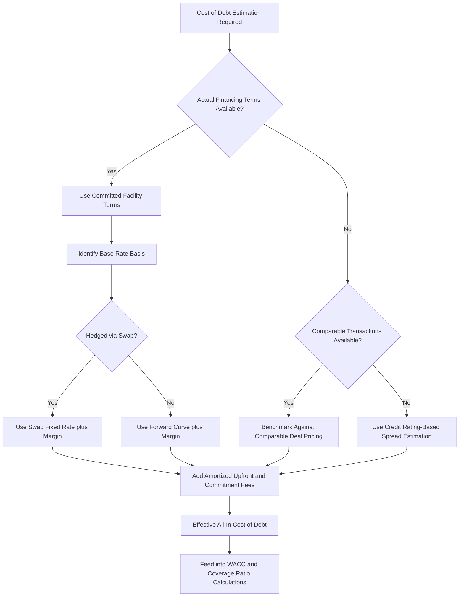

## Cost of Debt Estimation

### Definition and Purpose

Cost of debt estimation is the process of determining the appropriate interest rate (or effective yield) that reflects the cost a project company pays for borrowed capital. It serves as a direct input into WACC construction (see Weighted Average Cost of Capital Construction), debt sizing and coverage ratio calculations (DSCR, LLCR, PLCR), and Equity IRR modeling. Because project finance debt often has features distinct from vanilla corporate borrowing — floating rates, drawn/undrawn fee structures, hedging arrangements, multiple tranches, and upfront fees — an accurate cost of debt estimate requires more than simply reading a single quoted margin.

### Components of the All-In Cost of Debt

**Key Points**

- **Base rate (reference rate)**: for floating-rate debt, typically a benchmark such as SOFR, EURIBOR, or a local equivalent, which resets periodically over the life of the loan.
- **Credit margin (spread)**: the additional rate charged over the base rate, reflecting the project's credit risk, sector, tenor, and prevailing market conditions — often stepped up over time in project finance (a "margin ratchet") to reflect increasing risk as the debt tenor lengthens or reduced risk post-completion.
- **Upfront/arrangement fees**: one-time fees paid to lenders at financial close, which increase the effective all-in cost of debt when amortized over the life of the facility (captured via the effective interest rate/yield-to-maturity approach rather than the stated coupon alone).
- **Commitment fees**: fees paid on the undrawn portion of a committed facility during the construction/drawdown period, relevant to the effective cost of debt during ramp-up.
- **Hedging costs**: if floating-rate exposure is hedged via interest rate swaps (common in project finance to provide cash flow certainty for coverage ratio testing), the effective fixed rate achieved via the swap (plus any swap credit spread) becomes the relevant cost of debt for modeling purposes.

### Fixed vs. Floating Rate Considerations

| Debt Type | Cost of Debt Basis | Modeling Implication |
| --- | --- | --- |
| Fixed-rate debt (e.g., bonds, fixed-rate loans) | Stated coupon/yield | Straightforward, known cost of debt over the full tenor |
| Floating-rate debt (unhedged) | Base rate (forward curve) + margin | Interest cost varies with rate movements; requires forward curve assumptions |
| Floating-rate debt (swapped/hedged) | Swap fixed rate + margin (+ any basis/credit spread) | Effectively fixes the cost of debt, though swap breakage costs are a consideration if refinanced early |

**Key Points**

- Project finance lenders frequently require some minimum proportion of debt to be hedged (fixed via swaps) precisely because unhedged floating-rate exposure introduces volatility into DSCR/LLCR calculations that could otherwise breach covenants purely due to interest rate movements unrelated to operating performance.
- [Inference] The specific hedging requirement (percentage hedged, tenor of hedge, permitted hedge providers) is a matter of individual credit agreement negotiation and varies by transaction; some financings hedge 100% of the tenor, others a lower percentage or only through a defined period.

### Estimation Approaches

**Approach 1 — Actual/Committed Facility Terms** (most direct, used once financing is arranged):

Use the actual contractual terms — margin, base rate assumption (forward curve or swap rate), upfront fees, and commitment fees — as documented in the term sheet or credit agreement.

**Approach 2 — Market-Based/Comparable Transaction Benchmarking** (used pre-financing, for early-stage feasibility or bid pricing):

Estimate the likely cost of debt based on observed pricing for comparable recent project financings, adjusted for sector, geography, tenor, credit quality, and prevailing market conditions.

**Approach 3 — Credit Rating-Based Estimation** (used when a shadow or actual credit rating is available):

Estimate cost of debt as the risk-free rate plus a credit spread appropriate to the project's implied or actual credit rating, drawing on published corporate/project bond spread tables for that rating category.

**Key Points**

- Approach 1 is preferred whenever actual financing terms are known, since it reflects the true contractual cost rather than an estimate.
- Approaches 2 and 3 are commonly used earlier in a project's development lifecycle (e.g., at feasibility study or bid stage) before a specific lender group and term sheet exist, and necessarily carry more estimation uncertainty.
- [Unverified] Market credit spreads for project finance debt fluctuate with broader credit market conditions, sector-specific risk perception, and central bank policy rates; any specific spread assumption should be validated against current market data at the time of the analysis rather than relied upon from historical benchmarks.

### Effective (All-In) Cost of Debt Calculation

$$Effective\ Cost\ of\ Debt = \left[\left(1 + \frac{Base\ Rate + Margin}{m}\right)^m - 1\right] + \frac{Amortized\ Upfront\ Fees}{Average\ Outstanding\ Balance}$$

Where $m$ = compounding frequency per year.

More practically, in a full financial model, the effective cost of debt is often derived as the **internal rate of return (IRR)** of the full debt cash flow stream from the lender's perspective — net drawdowns, all fees, and all interest/principal repayments.

**Key Points**

- Calculating cost of debt via an IRR of the full lender cash flow stream (drawdowns as inflows to the borrower/outflows to the lender, fees as additional outflows to the borrower, and interest/principal repayments as inflows to the lender) captures the true effective cost including the impact of upfront fees spread over the debt tenor — this is a more rigorous approach than simply quoting the margin over base rate.
- For WACC purposes, most practitioners use a simplified all-in margin-plus-base-rate figure rather than the fully fee-adjusted IRR, on the basis that fee effects are typically small relative to the base rate and margin; [Inference] whether this simplification is appropriate depends on the materiality of upfront fees relative to the total facility size and tenor.

### Worked Example

A project finance facility has: SOFR forward curve averaging 4.5% over the debt tenor, a credit margin of 2.25%, upfront arrangement fees of 1.5% of facility size, and a 15-year tenor. The facility is 100% hedged via an interest rate swap fixing the base rate.

**Simplified all-in rate (for WACC purposes):**

$$Cost\ of\ Debt_{simplified} = 4.5\% + 2.25\% = 6.75\%$$

**Effective rate including amortized upfront fees (approximate):**

Assuming the 1.5% upfront fee is roughly equivalent to an additional 0.10%–0.15% per annum when amortized over a 15-year tenor (the precise figure depends on the amortization profile and discounting convention):

$$Cost\ of\ Debt_{effective} \approx 6.75\% + 0.10\%\ to\ 0.15\% \approx 6.85\%\ to\ 6.90\%$$

**Example**

For most WACC and NPV purposes, the simplified 6.75% all-in rate (base rate plus margin) would typically be used, since the fee-adjusted effective rate differs by only a small margin. However, for precise debt IRR/lender return analysis, or where upfront fees are unusually large relative to facility size, the more rigorous fee-adjusted effective rate calculation would be preferred. [Inference] The magnitude of the fee adjustment shown here is illustrative; actual amortization effects depend on the specific fee structure, tenor, and repayment profile and should be calculated explicitly rather than assumed.

### Cost of Debt Estimation Flow Diagram



### Cost of Debt Build-up Visual

<svg xmlns="http://www.w3.org/2000/svg" viewBox="0 0 700 340" font-family="Arial, sans-serif">
<text x="350" y="25" text-anchor="middle" font-size="16" font-weight="bold">All-In Cost of Debt Build-up (svg_diagram)</text>
<rect x="150" y="60" width="150" height="180" fill="#2980b9" />
<text x="225" y="150" text-anchor="middle" font-size="13" fill="white">Base Rate</text>
<text x="225" y="170" text-anchor="middle" font-size="13" fill="white">(SOFR ~4.5%)</text>
<rect x="150" y="240" width="150" height="80" fill="#27ae60" />
<text x="225" y="275" text-anchor="middle" font-size="13" fill="white">Credit Margin</text>
<text x="225" y="295" text-anchor="middle" font-size="13" fill="white">(2.25%)</text>
<rect x="330" y="225" width="150" height="20" fill="#e67e22" />
<text x="405" y="240" text-anchor="middle" font-size="11" fill="white">Amortized Fees (~0.10-0.15%)</text>
<line x1="300" y1="150" x2="330" y2="150" stroke="#333" stroke-width="1" stroke-dasharray="3,3" />
<text x="490" y="155" font-size="13" font-weight="bold">All-In Cost</text>
<text x="490" y="175" font-size="15" font-weight="bold">~6.85-6.90%</text>
</svg>

### Excel/Model Implementation

```excel
' Simplified all-in cost of debt
=Base_Rate_Assumption + Credit_Margin

' Effective cost of debt via IRR of full debt cash flow stream
=IRR(Debt_CashFlow_Range)
' Where Debt_CashFlow_Range = +Drawdowns (net of upfront fees), then -Interest and -Principal repayments each period

' Weighted average cost of debt across multiple tranches
=SUMPRODUCT(Tranche_Balances, Tranche_Rates) / SUM(Tranche_Balances)
```

**Key Points**

- Where a facility includes both drawn and undrawn commitment periods (e.g., during construction), the model should incorporate commitment fees on the undrawn balance separately from interest on the drawn balance, since these have different rates and bases.
- For multi-tranche debt structures, a **weighted average cost of debt** (weighted by each tranche's outstanding balance) should be used for WACC purposes rather than the senior tranche rate alone, unless the analysis specifically isolates senior debt costs (e.g., for LLCR, which conventionally uses the senior debt rate specifically).
- Swap-related modeling should separately capture the swap's fixed rate, notional amortization profile (which should typically track the underlying debt amortization to avoid over/under-hedging), and any credit spread on the swap itself.

### Common Pitfalls

**Key Points**

- Using only the quoted margin without adding the base rate (or swap fixed rate), understating the true cost of debt.
- Ignoring upfront and commitment fees entirely, which can meaningfully understate the effective cost of debt, particularly for shorter-tenor facilities where fees represent a larger proportion of the effective annual cost.
- Applying an unhedged floating-rate assumption when the facility is in fact swapped, introducing spurious interest rate risk into the coverage ratio and cash flow model that does not reflect the actual (hedged) contractual position.
- Using a single blended cost of debt figure when separate senior/subordinated tranches exist with materially different rates, particularly where LLCR (which conventionally references the senior rate specifically) is being calculated alongside a blended WACC (which should use the blended, all-tranche cost of debt).
- Relying on stale market spread benchmarks in early-stage estimation without validating against current market conditions, given that credit spreads can move meaningfully with broader market and monetary policy conditions.

**Related Topics**

- Weighted Average Cost of Capital Construction
- Loan Life Coverage Ratio (LLCR)
- Gearing and Leverage Ratios
- Interest rate hedging and swap structuring in project finance
- Debt sculpting and sizing methodologies
- Net Present Value in Project Finance