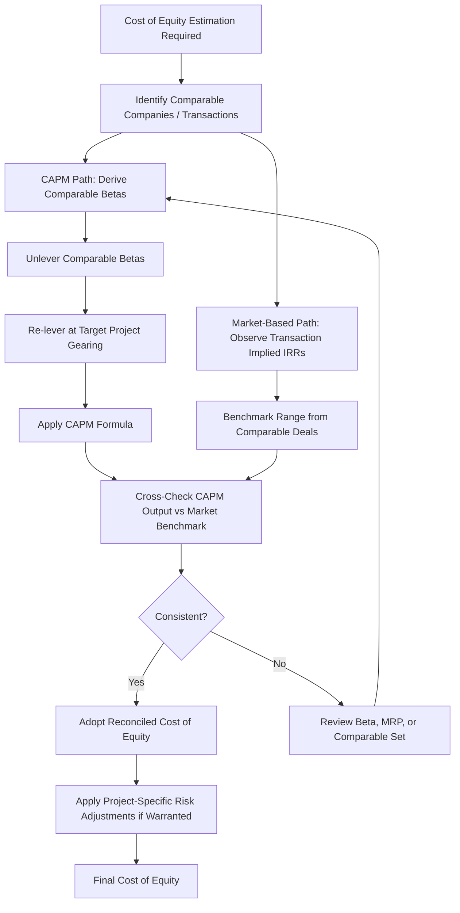

## Cost of Equity and Required Return Benchmarks

### Definition and Purpose

Cost of equity represents the return that equity investors require to compensate them for the risk of investing in a project, given its specific risk profile, capital structure, and market conditions. It is used as the discount rate for levered equity cash flows (Equity NPV, see Net Present Value in Project Finance), as an input to WACC (see Weighted Average Cost of Capital Construction), and as the benchmark against which projected Equity IRR (see Project Internal Rate of Return Versus Equity Internal Rate of Return) is judged to determine whether a project meets investors' minimum return requirements.

Unlike the cost of debt, which is largely observable from contractual terms, the cost of equity is inherently an **estimate** of investor expectations, and project finance practitioners typically triangulate between theoretical models (CAPM) and empirical, market-based benchmarks (comparable transaction pricing).

### Approach 1: Capital Asset Pricing Model (CAPM)

$$k_e = R_f + \beta \times (R_m - R_f) + \alpha$$

Where:

- $R_f$ = risk-free rate (typically a long-dated government bond yield)
- $\beta$ = re-levered equity beta reflecting the project's systematic risk and target gearing
- $(R_m - R_f)$ = equity market risk premium
- $\alpha$ = optional additional risk premium (e.g., small-cap, illiquidity, country/political risk, or project-specific premium)

**Key Points**

- CAPM provides a theoretically grounded, replicable methodology, which is why it remains the standard starting point in formal valuations, fairness opinions, and regulatory contexts (e.g., regulated utility allowed-return determinations).
- The beta used must be **re-levered to the project's specific target gearing** (see the Hamada equation methodology covered under Weighted Average Cost of Capital Construction), since observed betas from comparable listed companies reflect those companies' own capital structures, not the project's.
- [Inference] CAPM's reliance on listed equity market data (beta, market risk premium) can be a limitation for unlisted, single-asset project financings where no directly comparable listed beta exists; practitioners often use sector-level or infrastructure-fund-level betas as a proxy, which introduces estimation uncertainty.

### Approach 2: Market-Based Required Return Benchmarking

**Key Points**

- Rather than (or in addition to) deriving cost of equity from CAPM, practitioners frequently reference **observed required equity returns from comparable recent transactions** — i.e., the Equity IRR that infrastructure funds, pension funds, or strategic sponsors have accepted (implicitly, via the price they paid) for assets of similar risk profile, sector, geography, and contract structure.
- This approach is particularly common in project finance because the asset class (single-purpose project vehicles) often lacks the rich secondary market pricing data available for listed equities, making transaction-based benchmarking a practical necessity alongside or instead of pure CAPM.
- [Unverified] Required equity return benchmarks vary significantly by sector, contract structure (contracted vs. merchant), geography, and prevailing market liquidity/interest rate conditions; any specific benchmark figure should be validated against current market transaction data at the time of analysis rather than assumed static over time.

### Illustrative Required Return Ranges by Risk Profile

[Unverified] The following ranges are illustrative only, intended to demonstrate the relative ordering of risk categories, and should not be treated as current market pricing — actual required returns fluctuate with interest rate cycles, sector sentiment, and specific asset characteristics.

| Risk Profile | Illustrative Required Equity Return Range | Key Driver |
| --- | --- | --- |
| Availability-based PPP/PFI (operational, contracted) | Lower end of range | Government counterparty, minimal demand/market risk |
| Contracted renewable energy (operational, long-term PPA) | Low-to-moderate | Revenue contracted, but technology/resource risk remains |
| Contracted infrastructure under construction | Moderate | Construction risk premium added to operational risk |
| Merchant/demand-risk infrastructure (operational) | Moderate-to-higher | Revenue volatility, market/volume risk |
| Greenfield merchant or emerging market projects | Higher end of range | Combined construction, market, and country risk |

**Key Points**

- Required equity returns typically increase with each additional layer of risk: construction risk commands a premium over operational risk; merchant/demand risk commands a premium over contracted revenue; emerging market/political risk commands a further premium over developed market risk.
- Sponsors and investors often apply **different required returns to different phases** of a single project's life — a higher return during the construction/ramp-up period, stepping down once the asset reaches stable, contracted operations — reflecting the risk profile change over the project lifecycle.

### Step-by-Step Cost of Equity Estimation Methodology

1. **Identify comparable listed companies or transactions** with similar sector, geography, contract structure, and risk profile.
2. **Derive or observe betas** from comparable listed companies (for CAPM) or **observe transaction pricing/implied Equity IRRs** from comparable recent deals (for market-based benchmarking).
3. **Unlever comparable betas** to strip out their specific capital structures (if using CAPM).
4. **Re-lever at the target project's gearing** to reflect the actual capital structure being valued.
5. **Apply CAPM** using the re-levered beta, current risk-free rate, and market risk premium.
6. **Cross-check against market-based benchmarks** — compare the CAPM-derived cost of equity against observed required returns for genuinely comparable recent transactions.
7. **Apply project-specific adjustments** as warranted (construction risk premium, country risk premium, illiquidity premium) with clear documentation of the basis for any such adjustment.
8. **Reconcile and select a final rate**, recognizing that cost of equity estimation inherently involves practitioner judgment alongside quantitative modeling.

### Worked Example

A contracted solar project (operational, 20-year PPA remaining) requires a cost of equity estimate.

**CAPM approach:**

- Risk-free rate: 4.0%
- Re-levered beta (per Weighted Average Cost of Capital Construction example): 1.46
- Equity market risk premium: 5.5%

$$k_e^{CAPM} = 4.0\% + (1.46 \times 5.5\%) = 4.0\% + 8.03\% = 12.03\%$$

**Market-based cross-check:**

Assume recent comparable contracted solar transactions in the same market have priced at implied Equity IRRs in a range around 11%–13%.

**Example**

The CAPM-derived cost of equity of 12.03% falls comfortably within the observed market range of 11%–13% for comparable contracted solar transactions, supporting its use as the discount rate for Equity NPV and as the benchmark against which the project's forecast Equity IRR should be judged. Had the CAPM output diverged materially from the market-based range (e.g., producing 8% or 18%), this would prompt a review of the beta, market risk premium, or comparable set selection before finalizing the rate, since [Inference] a large divergence between a theoretical CAPM output and observed market pricing often signals an issue with input selection (e.g., a stale beta, an inappropriate comparable set) rather than genuine mispricing in the market.

### Cost of Equity Estimation Flow Diagram



### Required Return by Risk Layer (Visual)

<svg xmlns="http://www.w3.org/2000/svg" viewBox="0 0 700 380" font-family="Arial, sans-serif">
<text x="350" y="25" text-anchor="middle" font-size="16" font-weight="bold">Required Equity Return Build-up by Risk Layer (svg_diagram)</text>
<line x1="100" y1="330" x2="100" y2="60" stroke="#333" stroke-width="2" />
<line x1="100" y1="330" x2="620" y2="330" stroke="#333" stroke-width="2" />
<rect x="150" y="290" width="100" height="40" fill="#27ae60" />
<text x="200" y="315" text-anchor="middle" font-size="11" fill="white">Risk-Free Rate</text>
<rect x="150" y="250" width="100" height="40" fill="#2980b9" />
<text x="200" y="275" text-anchor="middle" font-size="10" fill="white">Contracted/Availability Premium</text>
<rect x="300" y="220" width="100" height="70" fill="#f39c12" />
<text x="350" y="245" text-anchor="middle" font-size="10" fill="white">+ Construction Risk</text>
<text x="350" y="260" text-anchor="middle" font-size="10" fill="white">Premium</text>
<rect x="450" y="150" width="100" height="140" fill="#e67e22" />
<text x="500" y="200" text-anchor="middle" font-size="10" fill="white">+ Merchant / Demand</text>
<text x="500" y="215" text-anchor="middle" font-size="10" fill="white">Risk Premium</text>
<text x="200" y="350" text-anchor="middle" font-size="11">Contracted, Operational</text>
<text x="350" y="350" text-anchor="middle" font-size="11">Under Construction</text>
<text x="500" y="350" text-anchor="middle" font-size="11">Merchant Exposure</text>
<text x="30" y="200" text-anchor="middle" font-size="12" transform="rotate(-90 30 200)">Required Return</text>
</svg>

### Excel/Model Implementation

```excel
' CAPM cost of equity
=RiskFree_Rate + Relevered_Beta * Market_Risk_Premium + Project_Specific_Premium

' Comparison against Equity IRR output for sanity-check
=IF(Model_Equity_IRR >= CostOfEquity_Benchmark, "Meets Required Return", "Below Required Return")

' Phased cost of equity (construction vs operations)
=IF(Period_is_Construction, ConstructionPhase_CostOfEquity, OperationalPhase_CostOfEquity)
```

**Key Points**

- Models used for investment decision-making commonly present the **projected Equity IRR alongside the estimated cost of equity/required return benchmark**, allowing a direct pass/fail assessment of whether the investment clears the investor's minimum threshold — this comparison is often the single most important output of a project finance investment model for equity investors.
- Where a phased (construction vs. operational) required return is used, models should clearly flag which discount rate applies to which period, and ensure Equity NPV calculations apply the correct rate consistently rather than a single blended rate throughout.
- Sensitivity tables varying beta, market risk premium, and risk-free rate assumptions are standard practice, given the material impact small changes in these inputs can have on the resulting cost of equity and, consequently, on Equity NPV and investment decisions.

### Common Pitfalls

**Key Points**

- Using an unlevered or inappropriately levered beta without adjusting to the project's specific target gearing, producing a cost of equity inconsistent with the actual capital structure being valued.
- Relying solely on CAPM without cross-checking against market-based transaction benchmarks, particularly given the estimation challenges inherent in applying listed-equity-derived betas to unlisted, single-asset project vehicles.
- Applying a single required return uniformly across construction and operational phases when the risk profile — and therefore the appropriate required return — genuinely differs materially between these phases.
- Stacking multiple risk premiums (country risk, illiquidity, construction risk, small-cap) without clear justification or without checking for double-counting, since some listed comparable betas may already partially reflect certain risk factors.
- Treating a single-point cost of equity estimate as precise rather than as a reasoned estimate subject to meaningful uncertainty — presenting a range or performing sensitivity analysis is generally more informative than a single implied-precision figure.

**Related Topics**

- Weighted Average Cost of Capital Construction
- Net Present Value in Project Finance
- Project Internal Rate of Return Versus Equity Internal Rate of Return
- Cost of Debt Estimation
- Capital Asset Pricing Model (CAPM) and beta unlevering/relevering
- Gearing and Leverage Ratios
- Country and political risk premium estimation