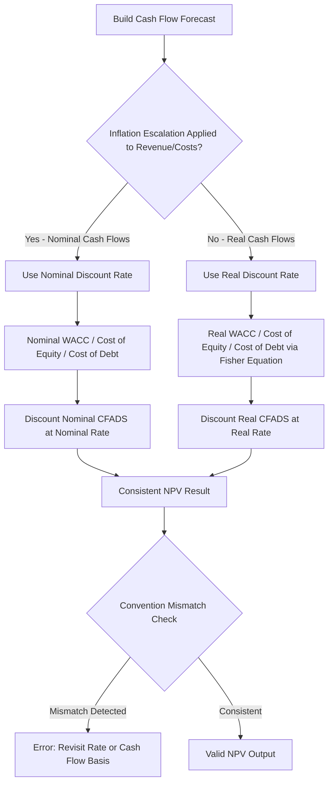

## Nominal Versus Real Discount Rates

### Definition and Purpose

Nominal and real discount rates represent two internally consistent ways of discounting project cash flows, distinguished by whether inflation is embedded in the rate and cash flows or stripped out of both. Getting this distinction right — and, critically, applying it **consistently** between the discount rate and the cash flows being discounted — is essential in project finance, where inflation assumptions materially affect revenue (often inflation-linked or indexed), operating costs, and long-dated debt/equity valuations over project lives that frequently span 20–30+ years.

### Core Definitions

**Key Points**

- A **nominal cash flow** includes the effect of expected inflation (i.e., it is expressed in "future money of the day," reflecting prices as they are expected to actually be paid/received in each future period).
- A **real cash flow** excludes the effect of inflation (i.e., it is expressed in constant, "today's money" terms, holding purchasing power constant across periods).
- A **nominal discount rate** includes an inflation component and should only be applied to nominal cash flows.
- A **real discount rate** excludes inflation and should only be applied to real cash flows.

### The Fisher Equation

The relationship between nominal and real rates is governed by the Fisher equation:

$$(1 + r_{nominal}) = (1 + r_{real}) \times (1 + i)$$

Where $i$ = expected inflation rate.

Rearranged to solve for the real rate:

$$r_{real} = \frac{1 + r_{nominal}}{1 + i} - 1$$

A commonly used **approximation** (reasonably accurate for low inflation rates):

$$r_{real} \approx r_{nominal} - i$$

**Key Points**

- The approximation ($r_{real} \approx r_{nominal} - i$) becomes progressively less accurate as inflation rises — at higher inflation rates, the exact Fisher equation should be used rather than the simple subtraction, since the approximation error grows with the magnitude of both rates.
- This same Fisher relationship applies whether converting WACC, cost of equity, cost of debt, or any other discount rate between nominal and real terms — the mechanics are identical regardless of which specific rate is being converted.

### The Critical Consistency Rule

**Key Points**

- **The single most important principle**: nominal discount rates must be applied to nominal cash flows, and real discount rates must be applied to real cash flows. Mixing conventions (e.g., discounting nominal cash flows at a real rate, or vice versa) produces a materially incorrect valuation.
- Mixing conventions does **not** simply introduce a small error — it can produce a systematically biased result in a consistent direction across the entire cash flow forecast, since the mismatch compounds over every discounted period, and the compounding effect grows with the length of the valuation horizon (which in project finance is often very long).
- NPV, IRR, and coverage ratio calculations should each be internally checked for this consistency: if CFADS includes inflation-escalated revenue and costs (nominal), the discount rate applied (WACC, senior debt rate) should also be nominal.

### Which Convention is Typically Used in Project Finance?

**Key Points**

- Most project finance financial models are built on a **nominal basis** — revenue is projected with explicit inflation escalation (often linked to a specific index, such as CPI, where contracts provide for inflation indexation), operating costs are escalated similarly, and the discount rates used (cost of debt, cost of equity, WACC) are nominal market rates as directly observed or quoted.
- This nominal convention is generally preferred in practice because: (a) actual debt interest rates and market-quoted required equity returns are inherently nominal (they already embed the market's inflation expectations), and (b) many project contracts (PPAs, concession agreements, availability payments) have contractually defined nominal indexation mechanisms that are more naturally modeled in nominal terms.
- A real-terms approach is sometimes used for high-level economic feasibility studies, long-term public sector value-for-money comparisons, or in jurisdictions/sectors with established real-rate regulatory conventions (e.g., some regulated utility frameworks explicitly set allowed returns on a real basis) — but [Inference] the specific choice of convention should always be confirmed against sector practice and the requirements of the parties involved (lenders, regulators, public sector counterparties) rather than assumed.

### Worked Example

A project's nominal WACC is 6.75%, and expected long-term inflation is 2.5%.

**Exact Fisher equation:**

$$r_{real} = \frac{1.0675}{1.025} - 1 = 1.0415 - 1 = 4.15\%$$

**Simple approximation:**

$$r_{real} \approx 6.75\% - 2.5\% = 4.25\%$$

**Example**

The exact Fisher calculation produces a real rate of 4.15%, while the simple approximation produces 4.25% — a difference of 10 basis points in this example. While this gap may appear small, when compounded over a 25-year discounting period in a long-dated infrastructure valuation, even a 10 basis point discount rate error can produce a meaningfully different NPV outcome, particularly for cash flows weighted toward later years of the project life. [Inference] The magnitude of NPV sensitivity to this size of discount rate difference depends on the specific cash flow profile and project life, and should be checked explicitly in any given model rather than assumed to be immaterial.

### Consistency Check Flow Diagram



### Nominal vs Real Convention Comparison (Visual)

<svg xmlns="http://www.w3.org/2000/svg" viewBox="0 0 700 380" font-family="Arial, sans-serif">
<text x="350" y="25" text-anchor="middle" font-size="16" font-weight="bold">Nominal vs Real Cash Flow and Discount Rate Pairing (svg_diagram)</text>
<rect x="60" y="60" width="280" height="130" fill="#2980b9" opacity="0.15" stroke="#2980b9" stroke-width="2" />
<text x="200" y="85" text-anchor="middle" font-size="14" font-weight="bold" fill="#2980b9">Nominal Convention</text>
<text x="200" y="115" text-anchor="middle" font-size="12">Cash Flows: Include Inflation</text>
<text x="200" y="140" text-anchor="middle" font-size="12">Escalation (e.g., CPI-linked)</text>
<text x="200" y="170" text-anchor="middle" font-size="12" font-weight="bold">Discount at Nominal Rate (6.75%)</text>
<rect x="360" y="60" width="280" height="130" fill="#27ae60" opacity="0.15" stroke="#27ae60" stroke-width="2" />
<text x="500" y="85" text-anchor="middle" font-size="14" font-weight="bold" fill="#27ae60">Real Convention</text>
<text x="500" y="115" text-anchor="middle" font-size="12">Cash Flows: Constant Purchasing</text>
<text x="500" y="140" text-anchor="middle" font-size="12">Power (No Inflation)</text>
<text x="500" y="170" text-anchor="middle" font-size="12" font-weight="bold">Discount at Real Rate (4.15%)</text>
<line x1="340" y1="125" x2="360" y2="125" stroke="#c0392b" stroke-width="3" />
<text x="350" y="115" text-anchor="middle" font-size="20" fill="#c0392b">✕</text>
<text x="350" y="220" text-anchor="middle" font-size="12" fill="#c0392b" font-weight="bold">Never Cross-Pair These Conventions</text>
<text x="350" y="250" text-anchor="middle" font-size="12">Fisher Equation: (1+Nominal) = (1+Real) x (1+Inflation)</text>
</svg>

### Excel/Model Implementation

```excel
' Convert nominal to real rate (exact Fisher equation)
=(1 + Nominal_Rate) / (1 + Inflation_Rate) - 1

' Convert real to nominal rate (exact Fisher equation)
=(1 + Real_Rate) * (1 + Inflation_Rate) - 1

' Simple approximation (use with caution at higher inflation)
=Nominal_Rate - Inflation_Rate

' Nominal cash flow from a real base amount
=Real_CashFlow_Base * (1 + Inflation_Rate)^Period_Number
```

**Key Points**

- Models should clearly label every cash flow line and every discount rate as either "Nominal" or "Real" in headers or documentation, since the convention is often not obvious from the numbers alone and mislabeling is a recurring source of downstream errors when models are reused or adapted by other analysts.
- When a project has revenue indexed to a specific inflation measure (e.g., CPI) but costs indexed to a different measure (e.g., a construction cost index or wage inflation index), the model should track each escalation separately rather than assuming a single blended inflation rate applies uniformly — using a single inflation assumption for genuinely different escalation bases can distort real margins over time.
- A useful model sanity check: convert the model's nominal discount rate to real terms via the Fisher equation and confirm it produces a sensible, positive real return consistent with the underlying risk profile — an implausibly low or negative implied real rate may indicate an inflation assumption error.

### Application in Coverage Ratios and Debt Sizing

**Key Points**

- LLCR and PLCR (see earlier sections of this chapter) are virtually always calculated on a nominal basis in practice, since the senior debt interest rate used as the discount rate is inherently nominal (it is the actual contractual rate), and CFADS is typically forecast with nominal (inflation-escalated) revenue and costs — maintaining this consistency is essential to a correctly functioning debt sizing and coverage ratio model.
- Debt sizing/sculpting exercises must use nominal CFADS forecasts if the debt itself carries a nominal interest rate (the standard case), since sizing debt against real (non-escalated) cash flow while debt service grows nominally (or is fixed nominally) would misstate the project's actual debt service capacity.

### Common Pitfalls

**Key Points**

- Discounting nominal cash flows (with inflation escalation built in) using a real discount rate, which systematically overstates NPV by failing to properly discount away the inflation component embedded in the cash flows.
- Discounting real cash flows using a nominal discount rate, which systematically understates NPV by over-discounting cash flows that do not actually carry a growing inflation component.
- Using the simple approximation ($r_{nominal} - i$) at higher inflation levels where the approximation error becomes material, rather than the exact Fisher equation.
- Applying a single blanket inflation assumption to both revenue and cost escalation when the underlying contracts specify different indices, distorting the real margin evolution over the project life.
- Failing to clearly label cash flow and discount rate conventions in the model, creating ambiguity and error risk when models are updated, audited, or handed over to other practitioners.

**Related Topics**

- Net Present Value in Project Finance
- Weighted Average Cost of Capital Construction
- Cost of Debt Estimation
- Cost of Equity and Required Return Benchmarks
- Loan Life Coverage Ratio (LLCR)
- Inflation indexation mechanisms in project contracts (PPAs, concessions)
- Cash Flow Available for Debt Service (CFADS) construction