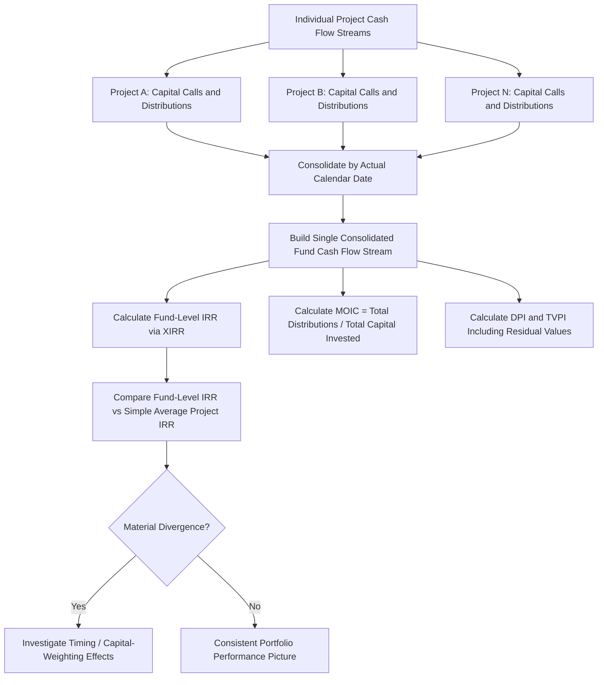

## Blended and Portfolio-Level Returns Analysis


### Definition and Purpose

Blended and portfolio-level returns analysis extends single-project return metrics (Project IRR, Equity IRR, NPV) to evaluate returns across a group of assets held by a common sponsor, fund, or investment vehicle. This is essential for infrastructure funds, utility holding companies, and multi-project sponsors who need to understand how individual project performance aggregates into overall portfolio/fund-level returns, and how diversification, timing, and capital allocation decisions across projects affect the returns actually delivered to fund investors or corporate shareholders.

### Why Portfolio-Level Analysis Differs from Single-Project Analysis

**Key Points**

- A single project's Equity IRR is calculated from that project's own isolated cash flow stream (equity contributions out, distributions in). A **portfolio-level** or **fund-level IRR** aggregates cash flows across multiple projects with different investment dates, holding periods, and risk profiles into a single consolidated cash flow stream from the investor's perspective.
- Portfolio-level returns are affected not just by individual project performance but by the **timing and sequencing** of capital calls and distributions across the portfolio — two portfolios with identical average project-level IRRs can produce different fund-level IRRs depending on when capital was deployed and returned.
- Diversification across projects (different sectors, geographies, revenue structures, or construction timelines) can reduce the portfolio's overall risk profile relative to any single project, even if it does not necessarily change the arithmetic average of individual project returns — a portfolio effect familiar from general investment portfolio theory, applied here to a project finance/infrastructure context.

### Key Portfolio-Level Metrics

**Key Points**

- **Fund/Portfolio IRR**: the IRR calculated on the consolidated cash flow stream of all capital calls (outflows) and distributions (inflows) across all projects in the portfolio/fund, from inception to the current date or exit.
- **Multiple on Invested Capital (MOIC)**: total distributions received divided by total capital invested, a simple multiple (not time-weighted) often used alongside IRR to give a complementary view of absolute value creation.
- **Distributions to Paid-In Capital (DPI)**: the ratio of cash actually distributed to investors relative to capital paid in — a measure of realized (not just projected) returns, particularly relevant for funds with a mix of realized (exited) and unrealized (still-held) investments.
- **Total Value to Paid-In Capital (TVPI)**: DPI plus the residual (unrealized) value of remaining investments divided by paid-in capital — captures both realized and unrealized value.
- **Weighted-average project-level IRR**: a simple (or capital-weighted) average of individual project IRRs, useful for understanding the "typical" project performance but distinct from, and not a substitute for, the actual fund-level IRR, which depends on cash flow timing.

### MOIC, DPI, TVPI Formulas

$$MOIC = \frac{Total\ Distributions}{Total\ Capital\ Invested}$$


$$DPI = \frac{Cumulative\ Distributions\ to\ Date}{Cumulative\ Capital\ Called\ to\ Date}$$


$$TVPI = \frac{Cumulative\ Distributions + Residual\ Value\ of\ Unrealized\ Investments}{Cumulative\ Capital\ Called\ to\ Date}$$

**Key Points**

- MOIC and TVPI are **not time-weighted** — a MOIC of 2.0x tells you total value creation but says nothing about whether that value was created over 3 years or 15 years, which is why MOIC/TVPI are always presented alongside IRR (which does account for timing) rather than as standalone metrics.
- DPI is often emphasized by fund investors (limited partners) as a measure of realized, "money-in-hand" performance, as distinct from TVPI, which includes potentially uncertain unrealized valuations of projects still held in the portfolio.

### Why Fund-Level IRR Can Diverge from Average Project-Level IRR

**Key Points**

- If capital is deployed into a strong-performing project early in the fund's life and a weaker-performing project later, the fund-level IRR is more heavily influenced by the timing of the strong project's cash flows (since IRR is highly sensitive to when cash flows occur, especially early positive cash flows) — this is sometimes referred to informally as a "timing effect" on blended returns.
- The **simple average** of individual project IRRs treats each project equally regardless of its size (capital invested) or the timing of its cash flows, whereas the **fund-level IRR** naturally weights by both the actual capital amounts and their timing — these can diverge meaningfully, and fund-level IRR is the metric that actually reflects what investors experienced.
- [Inference] Because of this sensitivity to timing and capital-weighting, presenting only a simple average of project-level IRRs without also showing the consolidated fund-level IRR can give a materially misleading impression of actual investor returns, particularly in portfolios with projects of significantly different sizes or investment/exit dates.

### Worked Example

A fund has two projects:

- **Project A**: $100 million invested at Year 0, generates a 15% Project-level Equity IRR, exits at Year 5.
- **Project B**: $300 million invested at Year 2, generates a 10% Project-level Equity IRR, exits at Year 8.

**Simple average of project-level IRRs:**

$$\frac{15\% + 10\%}{2} = 12.5\%$$

**Fund-level IRR** would instead be calculated from the actual consolidated cash flow stream:

| Year | Fund Cash Flow |
| --- | --- |
| 0 | -$100 million (Project A investment) |
| 2 | -$300 million (Project B investment) |
| 5 | +Project A exit proceeds (based on 15% IRR over 5 years) |
| 8 | +Project B exit proceeds (based on 10% IRR over 6 years) |

**Example**

Because Project B represents three times the capital of Project A but earns a lower IRR, the fund-level IRR (properly capital-weighted and cash-flow-timed) would be pulled meaningfully below the simple 12.5% average — closer to a capital-weighted blend that gives Project B's larger, lower-return investment proportionally more influence. This illustrates why sponsors and fund managers must calculate and report actual consolidated fund-level IRR rather than relying on a simple average of individual project returns, which would overstate the true blended performance in this example.

### Portfolio Cash Flow Consolidation Flow Diagram



### Fund-Level vs Simple Average IRR Visual

<svg xmlns="http://www.w3.org/2000/svg" viewBox="0 0 700 360" font-family="Arial, sans-serif">
<text x="350" y="25" text-anchor="middle" font-size="16" font-weight="bold">Fund-Level IRR vs Simple Average of Project IRRs (svg_diagram)</text>
<rect x="100" y="80" width="150" height="60" fill="#2980b9" />
<text x="175" y="105" text-anchor="middle" font-size="12" fill="white">Project A</text>
<text x="175" y="122" text-anchor="middle" font-size="11" fill="white">$100m @ 15%</text>
<rect x="100" y="160" width="150" height="60" fill="#e67e22" />
<text x="175" y="185" text-anchor="middle" font-size="12" fill="white">Project B</text>
<text x="175" y="202" text-anchor="middle" font-size="11" fill="white">$300m @ 10%</text>
<line x1="250" y1="110" x2="330" y2="140" stroke="#333" stroke-width="1" />
<line x1="250" y1="190" x2="330" y2="160" stroke="#333" stroke-width="1" />
<rect x="330" y="110" width="140" height="80" fill="#8e44ad" />
<text x="400" y="140" text-anchor="middle" font-size="11" fill="white">Consolidated</text>
<text x="400" y="155" text-anchor="middle" font-size="11" fill="white">Fund Cash Flow</text>
<text x="400" y="170" text-anchor="middle" font-size="11" fill="white">(Capital-Weighted)</text>
<line x1="470" y1="150" x2="530" y2="150" stroke="#333" stroke-width="1" />
<rect x="530" y="120" width="130" height="60" fill="#27ae60" />
<text x="595" y="145" text-anchor="middle" font-size="12" fill="white">Fund-Level IRR</text>
<text x="595" y="163" text-anchor="middle" font-size="11" fill="white">(closer to 10-11%)</text>
<text x="400" y="280" text-anchor="middle" font-size="12" fill="#c0392b">Simple Average (12.5%) ≠ Fund-Level IRR</text>
<text x="400" y="300" text-anchor="middle" font-size="11">Because Project B's larger capital weighs down the blend</text>
</svg>

### Excel/Model Implementation

```excel
' Consolidated fund-level IRR using XIRR
=XIRR(Consolidated_CashFlow_Range, Consolidated_Date_Range)

' MOIC
=SUM(Total_Distributions) / SUM(Total_Capital_Invested)

' DPI
=SUM(Cumulative_Distributions_to_Date) / SUM(Cumulative_Capital_Called_to_Date)

' TVPI
=(SUM(Cumulative_Distributions_to_Date) + Residual_Portfolio_Value) / SUM(Cumulative_Capital_Called_to_Date)

' Simple average of project IRRs (for comparison only - not a substitute for fund-level IRR)
=AVERAGE(Project_IRR_Range)

' Capital-weighted average of project IRRs
=SUMPRODUCT(Project_IRR_Range, Project_Capital_Range) / SUM(Project_Capital_Range)
```

**Key Points**

- Portfolio-level models typically maintain a **master consolidation tab** that pulls capital call and distribution cash flows from each individual project model by actual calendar date, then applies `XIRR()` to the fully consolidated stream — building this consolidation correctly requires careful date alignment across projects with different start dates and reporting periods.
- Presenting both the fund-level IRR **and** the capital-weighted average project IRR (rather than a simple, unweighted average) provides a more complete and less potentially misleading picture of blended performance, since capital-weighting at least partially accounts for the differing scale of each investment even without full cash-flow-timing precision.
- Residual/unrealized value estimates (needed for TVPI) for projects still held in the portfolio typically draw on the same NPV/DCF methodology as single-project valuation (see Net Present Value in Project Finance), applied to each unrealized project's remaining forecast cash flows.

### Considerations for Diversification and Correlation

**Key Points**

- [Inference] A portfolio combining projects with different revenue risk profiles (e.g., some contracted/availability-based, some merchant-exposed) and different geographies or regulatory regimes may exhibit lower overall cash flow volatility than any single project in isolation, to the extent the underlying risk drivers are not perfectly correlated — though the degree of diversification benefit depends on the actual correlation structure across the specific assets held, which should be assessed empirically rather than assumed.
- Sector or geographic concentration within a portfolio (e.g., multiple projects exposed to the same regulatory regime, currency, or offtaker) can reduce or eliminate the diversification benefit that might otherwise be expected from simply holding multiple assets.

### Common Pitfalls

**Key Points**

- Reporting only a simple (unweighted) average of project-level IRRs as if it represented the actual investor experience, when the true fund-level IRR (which accounts for capital-weighting and cash flow timing) may differ materially.
- Confusing MOIC/TVPI (non-time-weighted multiples) with IRR (a time-weighted return measure) — a high MOIC achieved over a very long holding period may correspond to a relatively modest IRR, and the two metrics should always be presented together, not as substitutes for one another.
- Overstating residual/unrealized value in TVPI calculations based on optimistic assumptions, which can inflate apparent fund performance for investments that have not yet been realized/exited.
- Assuming diversification benefits across a portfolio without empirically checking whether the underlying projects are genuinely exposed to different, uncorrelated risk drivers.
- Inconsistent cash flow date alignment when consolidating multiple project models into a single fund-level cash flow stream, which can distort the XIRR calculation if capital call/distribution dates are approximated rather than precisely captured.

**Related Topics**

- Project Internal Rate of Return Versus Equity Internal Rate of Return
- Net Present Value in Project Finance
- Cost of Equity and Required Return Benchmarks
- Gearing and Leverage Ratios
- Sensitivity and scenario analysis in project finance models
- Fund structuring and capital call/distribution mechanics