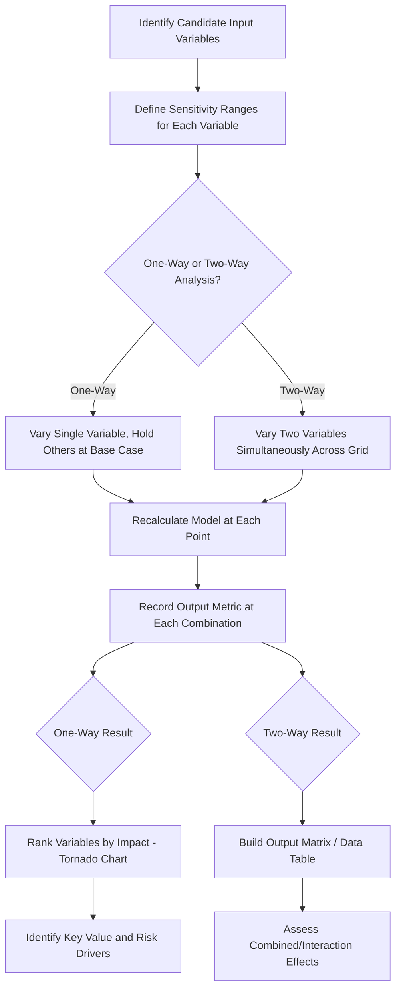

## One-Way and Two-Way Sensitivity Analysis

### Definition and Purpose

Sensitivity analysis measures how a project finance model's key outputs (Equity IRR, Project IRR, NPV, minimum DSCR, LLCR) respond to changes in individual input assumptions. One-way sensitivity analysis varies a single input at a time while holding all others constant, isolating that variable's individual impact. Two-way sensitivity analysis varies two inputs simultaneously, revealing how outputs respond to combinations of assumptions and capturing interaction effects that one-way analysis cannot show. Both are foundational tools for lenders, sponsors, and rating agencies to understand which assumptions matter most and how much cushion exists before a covenant breach or unacceptable return occurs.

### One-Way Sensitivity Analysis

**Definition:** Systematically varies a single input variable (e.g., revenue, operating costs, interest rate, construction cost) across a defined range, holding all other assumptions at their base case, and records the resulting change in one or more output metrics.

**Key Points**

- The purpose is to isolate and rank the individual sensitivity of the model's outputs to each input, identifying which assumptions are the primary value/risk drivers versus which have comparatively immaterial impact.
- Common one-way sensitivities tested in project finance include: revenue/price (±X%), volume/offtake (±X%), operating costs (±X%), construction cost overrun (±X%), construction delay (X months), interest rate movement (±X bps), and inflation rate assumption (±X%).
- Results are typically presented as a **tornado chart** (ranking sensitivities from most to least impactful) or as a simple table showing the output metric at each tested input level.

### Two-Way Sensitivity Analysis

**Definition:** Simultaneously varies two input variables across their respective ranges, producing a matrix (grid) of output results for every combination of the two variables tested.

**Key Points**

- Two-way analysis captures **interaction effects** that one-way analysis misses — for example, the combined impact of a revenue downside *and* a cost overrun occurring together may be worse (or, less commonly, partially offsetting) than the simple sum of their individual one-way impacts, particularly where nonlinearities exist (e.g., covenant breach thresholds, tax bracket effects, or minimum cash balance constraints).
- Two-way sensitivity is especially useful for stress-testing **combined downside scenarios** that are more realistic than isolated single-variable shocks (e.g., "what if revenue is 10% lower AND interest rates are 100bps higher") since real-world downside events are rarely isolated to a single variable.
- Output is typically a grid/matrix (a "data table" in spreadsheet terms) with one variable's range on rows and the other's range on columns, and the output metric populating each cell.

### Standard Output Metrics Tested

| Output Metric | Why It's Tested |
| --- | --- |
| Equity IRR | Assesses investor return sensitivity |
| Project NPV | Assesses overall value creation sensitivity |
| Minimum DSCR | Assesses covenant breach risk |
| Minimum LLCR | Assesses structural debt coverage adequacy |
| Debt sizing / Gearing capacity | Assesses how much debt the project could support under stress |

### Step-by-Step One-Way Sensitivity Methodology

1. **Identify candidate input variables** for testing — typically drawn from the model's key revenue, cost, financing, and macroeconomic assumptions.
2. **Define the sensitivity range** for each variable (e.g., ±5%, ±10%, ±20% relative to base case, or a defined absolute range such as ±100 basis points for interest rates).
3. **Isolate one variable**, holding all others at base case.
4. **Recalculate the model** (or use an automated data table function) at each point in the defined range.
5. **Record the output metric** (Equity IRR, NPV, minimum DSCR, etc.) at each point.
6. **Repeat for each candidate variable**.
7. **Rank results** by magnitude of impact to identify the most material value/risk drivers (commonly visualized as a tornado chart).

### Worked Example — One-Way Sensitivity

Base case Equity IRR = 12.0%. Testing revenue sensitivity at ±10%:

| Revenue Change | Resulting Equity IRR |
| --- | --- |
| -10% | 8.2% |
| -5% | 10.1% |
| Base Case (0%) | 12.0% |
| +5% | 13.8% |
| +10% | 15.5% |

**Example**

A 10% revenue decline reduces Equity IRR from 12.0% to 8.2% (a 380 basis point decline), while a symmetric 10% revenue increase raises Equity IRR to 15.5% (a 350 basis point increase). The slight asymmetry (380bps down vs. 350bps up) reflects the leveraged nature of equity cash flow — fixed debt service does not scale down with revenue, so a revenue decline disproportionately compresses the smaller residual equity cash flow relative to how a revenue increase disproportionately expands it. [Inference] The precise degree of asymmetry depends on the specific gearing level and debt service structure of the project being modeled.

### Worked Example — Two-Way Sensitivity Matrix

Testing Equity IRR sensitivity to combined Revenue Change (rows) and Operating Cost Change (columns):

| Revenue \ OpEx | -10% (Cost Down) | Base Case | +10% (Cost Up) |
| --- | --- | --- | --- |
| -10% (Revenue Down) | 9.5% | 8.2% | 6.8% |
| Base Case | 13.3% | 12.0% | 10.5% |
| +10% (Revenue Up) | 17.1% | 15.5% | 13.9% |

**Example**

The combined downside scenario (Revenue -10% AND OpEx +10%) produces an Equity IRR of 6.8% — meaningfully worse than either one-way sensitivity in isolation (8.2% for revenue alone, or the base case with only cost up). This combined-scenario view is precisely what one-way analysis cannot show, and is why lenders typically require two-way (or multi-variable scenario) analysis specifically for downside/stress case validation of coverage ratios, not just individual one-way tests.

### Sensitivity Analysis Flow Diagram



### Tornado Chart Visual (One-Way Sensitivity Ranking)

<svg xmlns="http://www.w3.org/2000/svg" viewBox="0 0 700 380" font-family="Arial, sans-serif">
<text x="350" y="25" text-anchor="middle" font-size="16" font-weight="bold">Tornado Chart - Equity IRR Sensitivity (svg_diagram)</text>
<line x1="350" y1="60" x2="350" y2="340" stroke="#333" stroke-width="2" />
<text x="350" y="355" text-anchor="middle" font-size="12">Base Case: 12.0%</text>
<rect x="200" y="70" width="150" height="35" fill="#c0392b" />
<rect x="350" y="70" width="140" height="35" fill="#27ae60" />
<text x="140" y="92" font-size="12" text-anchor="end">Revenue ±10%</text>
<rect x="240" y="115" width="110" height="35" fill="#c0392b" />
<rect x="350" y="115" width="100" height="35" fill="#27ae60" />
<text x="180" y="137" font-size="12" text-anchor="end">OpEx ±10%</text>
<rect x="270" y="160" width="80" height="35" fill="#c0392b" />
<rect x="350" y="160" width="75" height="35" fill="#27ae60" />
<text x="210" y="182" font-size="12" text-anchor="end">Construction Cost ±10%</text>
<rect x="300" y="205" width="50" height="35" fill="#c0392b" />
<rect x="350" y="205" width="45" height="35" fill="#27ae60" />
<text x="240" y="227" font-size="12" text-anchor="end">Interest Rate ±100bps</text>
<rect x="320" y="250" width="30" height="35" fill="#c0392b" />
<rect x="350" y="250" width="28" height="35" fill="#27ae60" />
<text x="260" y="272" font-size="12" text-anchor="end">Inflation ±0.5%</text>
<text x="220" y="310" font-size="11" fill="#c0392b">Downside</text>
<text x="440" y="310" font-size="11" fill="#27ae60">Upside</text>
</svg>

### Excel/Model Implementation

```excel
' One-way sensitivity using Data Table (What-If Analysis)
' Set up: Row of input values, column formula referencing the output cell (e.g., Equity IRR)
' Data > What-If Analysis > Data Table > Column Input Cell = Revenue_Growth_Assumption_Cell

' Two-way sensitivity using Data Table
' Set up: Row of Variable 1 values across top, Column of Variable 2 values down side,
' top-left corner cell references the output formula (e.g., =Equity_IRR_Cell)
' Data > What-If Analysis > Data Table > Row Input Cell = Variable1_Cell, Column Input Cell = Variable2_Cell

' Alternative: manual sensitivity via OFFSET/CHOOSE and iteration
=CHOOSE(Scenario_Selector, BaseCase_Revenue, Downside_Revenue, Upside_Revenue)
```

**Key Points**

- Excel's built-in **Data Table** feature (`What-If Analysis > Data Table`) is the standard tool for both one-way (single row or column of inputs) and two-way (full row and column grid) sensitivity analysis, since it automatically recalculates the entire model for each input combination without requiring manual copy-paste iteration.
- Data Tables can be **slow to recalculate** in large, complex project finance models with circularity (see debt sculpting and interest circularity discussions in earlier sections), since each cell in the table triggers a full model recalculation — models with heavy circularity often require iterative calculation settings to be carefully managed, or calculation mode set to manual with targeted recalculation, to keep sensitivity analysis performant.
- Tornado charts are typically built by calculating the one-way sensitivity range for each variable, then sorting variables by the magnitude of their output range (largest range at top) and plotting as horizontal bars extending from the base case value in both directions.

### Selecting Appropriate Sensitivity Ranges

**Key Points**

- Sensitivity ranges should be informed by genuine, defensible sources of uncertainty specific to the project — e.g., historical volatility of a commodity price, contractual escalation caps/floors, or documented forecast error ranges from independent technical/market advisors — rather than arbitrary round numbers applied uniformly across all variables.
- [Inference] A common practical convention is to test ±10% for revenue/cost variables and defined absolute shifts (e.g., ±100bps) for interest rates, but the specific ranges used in any given transaction should reflect the actual risk profile of that project and are often specified or reviewed by lenders' technical and market advisors during due diligence, rather than being a fixed universal standard.

### Common Pitfalls

**Key Points**

- Relying solely on one-way sensitivity analysis for downside case validation, missing interaction effects that only two-way (or multi-variable scenario) analysis reveals — this is a particularly important pitfall for coverage ratio stress testing, where lenders specifically want to see the impact of correlated adverse events.
- Using arbitrary or inconsistent sensitivity ranges across different variables without a defensible basis, making it difficult to compare the relative materiality of different risk drivers on a like-for-like basis.
- Building sensitivity analysis on top of a model with unresolved circularity issues, producing unreliable or slow-to-converge results in the Data Table outputs.
- Presenting only the output metric at extreme sensitivity points without also showing the base case and intermediate points, obscuring whether the relationship between input and output is linear or exhibits threshold/nonlinear effects (e.g., a sudden covenant breach at a specific point).
- Failing to distinguish one-way sensitivity analysis (isolating individual variable impact) from full scenario analysis (applying a coherent, correlated set of assumption changes representing a defined "case," such as a base case, downside case, or P90 case) — these serve related but distinct analytical purposes.

**Related Topics**

- Debt Service Coverage Ratio (DSCR)
- Loan Life Coverage Ratio (LLCR)
- Scenario Analysis and Base/Downside/Upside Case Construction
- Monte Carlo Simulation in Project Finance
- Gearing and Leverage Ratios
- Project Internal Rate of Return Versus Equity Internal Rate of Return
- Circular reference handling in project finance models