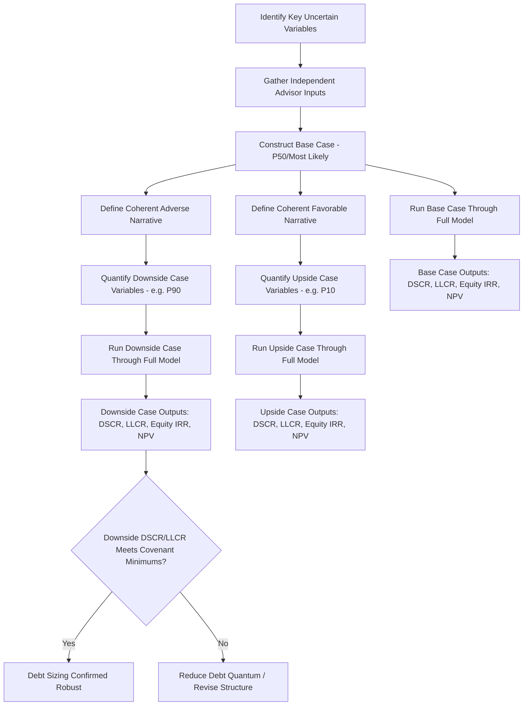

## Building Base, Downside, and Upside Cases

### Definition and Purpose

Scenario construction is the process of building coherent, internally consistent sets of assumptions — Base Case, Downside Case (or "stress case"), and Upside Case — that represent plausible alternative futures for a project, as distinct from the one-way and two-way sensitivity analysis covered previously. While sensitivity analysis isolates the impact of individual variables changing in isolation, scenario analysis applies a **correlated, coherent bundle of assumption changes** simultaneously, reflecting how multiple variables would plausibly move together under a specific set of real-world conditions (e.g., a recession, a favorable market environment, or a specific technical underperformance event).

### The Three Standard Cases

**Key Points**

- **Base Case**: the central, most-likely forecast, built from the project's contracted terms, independent technical/market advisor reports, and management's best estimate of uncontracted variables — this is the primary case used for initial debt sizing, valuation, and investment decision-making.
- **Downside Case**: a coherent, plausible adverse scenario combining multiple simultaneously stressed variables (e.g., lower revenue, higher costs, construction delay, higher interest rates) representing a realistic "things go wrong together" scenario — used to test covenant headroom and debt sizing robustness.
- **Upside Case**: a coherent favorable scenario combining multiple simultaneously improved variables — used less frequently for covenant/credit purposes but relevant for equity return upside assessment and negotiating leverage in structuring discussions.
- Unlike a one-way sensitivity (which asks "what if revenue alone falls 10%?"), a Downside Case asks "what does a genuinely plausible bad year (or bad project life) look like across all the variables that would realistically move together?" — this distinction is central to why scenario analysis and sensitivity analysis are complementary but distinct tools.

### Constructing the Base Case

**Key Points**

- The Base Case should be built from the most reliable available sources for each variable: contracted terms (PPA pricing, concession payment mechanisms, indexation formulas) for contracted revenue; independent technical advisor reports for production/output/yield assumptions; independent market advisor reports for uncontracted/merchant price assumptions; and management/sponsor estimates supported by historical data for operating costs.
- The Base Case is not automatically "conservative" or "optimistic" — it should represent the **most probable single outcome**, which is a distinct concept from a P50 (50th percentile) probabilistic estimate, though in practice many project finance base cases are constructed to approximate a P50 basis for key uncertain variables (particularly resource/yield assumptions in renewable energy, e.g., P50 wind or solar resource estimates).
- Lenders typically require the Base Case to be built on assumptions from independent third-party advisors (technical, market, insurance, legal) rather than solely on sponsor-provided figures, to reduce the risk of overly optimistic bias in the primary decision-making case.

### Constructing the Downside Case

**Key Points**

- Downside Case construction typically combines: (a) resource/production downside (e.g., P90 rather than P50 output assumptions for a renewable project), (b) price/revenue downside for any uncontracted/merchant revenue component, (c) operating cost upside (higher than base case O&M costs), (d) construction cost overrun and/or delay (if still in construction), and (e) interest rate upside for any unhedged debt exposure.
- The combination of stresses should be **internally coherent** — e.g., it would generally not make sense to combine a "recession" price downside with an "inflation spike" cost upside if those two macro conditions are not empirically likely to co-occur, unless the specific downside narrative genuinely supports that combination (such as a stagflation scenario, where both could plausibly occur together).
- Lenders commonly specify minimum coverage ratio thresholds that must be met specifically **under the Downside Case** (in addition to the Base Case), directly linking scenario construction to debt sizing and covenant-setting (see Gearing and Leverage Ratios and Covenant Structuring and Default Triggers).
- [Inference] The precise statistical rigor behind "Downside Case" varies by transaction — some downside cases are built to approximate a specific probabilistic confidence level (e.g., "P90 downside"), while others are constructed more qualitatively as "management's view of a severe but plausible adverse scenario"; the specific basis should always be documented and understood by all parties reviewing the analysis.

### Constructing the Upside Case

**Key Points**

- Upside Case construction mirrors the Downside Case methodology but in the favorable direction — e.g., P10 resource/production assumptions, favorable merchant price assumptions, lower-than-base operating costs, and construction completed on time/under budget.
- Upside cases are used primarily by equity investors and sponsors to understand the potential return ceiling and to support negotiating positions (e.g., in bid processes or refinancing discussions), and are generally given less weight by lenders in credit decisions, since lending decisions are typically anchored to the Base and Downside cases rather than upside potential.

### Comparative Table

| Case | Typical Construction Basis | Primary Audience/Use |
| --- | --- | --- |
| Base Case | P50/most-likely, independent advisor inputs | Central decision-making, initial debt sizing, primary valuation |
| Downside Case | Coherent combination of adverse, correlated assumptions (often approximating P90) | Covenant/debt sizing stress test, lender credit approval |
| Upside Case | Coherent combination of favorable, correlated assumptions (often approximating P10) | Equity return ceiling assessment, negotiation support |

### Step-by-Step Scenario Construction Methodology

1. **Identify the key uncertain variables** relevant to the specific project (revenue/price, volume/resource, operating costs, construction cost/timing, financing costs).
2. **Determine the Base Case value** for each variable from the most reliable available source (contracts, independent advisors, historical data).
3. **Define a coherent adverse narrative** for the Downside Case (e.g., "a below-average resource year combined with a merchant price downturn and a moderate cost overrun") rather than simply flexing every variable to its individually worst plausible value in isolation.
4. **Quantify each variable's Downside Case value** consistent with that narrative, drawing on the same independent advisor sources where available (e.g., P90 resource estimates from the technical advisor).
5. **Repeat the coherent-narrative process for the Upside Case**.
6. **Run each case through the full financial model**, producing Base, Downside, and Upside outputs for all key metrics (Equity IRR, minimum DSCR, minimum LLCR, Project NPV).
7. **Compare Downside Case coverage ratios against covenant minimums** to confirm the proposed debt sizing remains robust under stress.

### Worked Example

A contracted wind project's Base Case uses P50 wind resource, contracted PPA pricing (no merchant exposure), and base-case O&M costs, producing a minimum DSCR of 1.45x and Equity IRR of 12%.

**Downside Case** combines: P90 wind resource (lower energy production), a 5% O&M cost overrun, and a 6-month construction delay (deferring first revenue).

| Metric | Base Case | Downside Case |
| --- | --- | --- |
| Minimum DSCR | 1.45x | 1.18x |
| Minimum LLCR | 1.60x | 1.25x |
| Equity IRR | 12.0% | 7.5% |

**Example**

The Downside Case minimum DSCR of 1.18x would be compared against the lender's minimum covenant threshold (e.g., if the covenant floor is 1.15x, the project passes the downside stress test with modest headroom; if the floor is 1.20x, the proposed debt sizing would need to be reduced). This comparison — Downside Case output versus covenant minimum — is the central mechanism by which scenario analysis directly informs and validates debt sizing decisions (see Gearing and Leverage Ratios), distinct from the Base Case, which is used for the primary sizing exercise itself.

### Scenario Construction Flow Diagram



### Base/Downside/Upside Comparison Visual

<svg xmlns="http://www.w3.org/2000/svg" viewBox="0 0 700 380" font-family="Arial, sans-serif">
<text x="350" y="25" text-anchor="middle" font-size="16" font-weight="bold">Base vs Downside vs Upside Case Comparison (svg_diagram)</text>
<line x1="80" y1="330" x2="640" y2="330" stroke="#333" stroke-width="2" />
<line x1="80" y1="330" x2="80" y2="60" stroke="#333" stroke-width="2" />
<text x="30" y="200" text-anchor="middle" font-size="13" transform="rotate(-90 30 200)">Equity IRR (%)</text>
<rect x="150" y="240" width="80" height="90" fill="#c0392b" />
<text x="190" y="255" text-anchor="middle" font-size="12" fill="white">Downside</text>
<text x="190" y="325" text-anchor="middle" font-size="12">7.5%</text>
<rect x="290" y="150" width="80" height="180" fill="#2980b9" />
<text x="330" y="165" text-anchor="middle" font-size="12" fill="white">Base</text>
<text x="330" y="325" text-anchor="middle" font-size="12">12.0%</text>
<rect x="430" y="90" width="80" height="240" fill="#27ae60" />
<text x="470" y="105" text-anchor="middle" font-size="12" fill="white">Upside</text>
<text x="470" y="325" text-anchor="middle" font-size="12">16.5%</text>
</svg>

### Excel/Model Implementation

```excel
' Scenario switch using CHOOSE
=CHOOSE(Scenario_Selector, BaseCase_Value, DownsideCase_Value, UpsideCase_Value)
' Where Scenario_Selector = 1, 2, or 3 driven by a single input cell

' Alternative: scenario switch using nested IF or INDEX/MATCH against a named scenario
=INDEX(Scenario_Value_Table, MATCH(Selected_Scenario_Name, Scenario_Name_List, 0))

' Coverage ratio covenant check by scenario
=IF(Selected_Scenario = "Downside", 
    IF(Min_DSCR_Downside >= Covenant_Minimum, "Pass", "Fail"), 
    "N/A - Not Downside Scenario")
```

**Key Points**

- Models typically implement a **single scenario selector cell** (often a dropdown or numeric toggle) that drives every uncertain input assumption simultaneously via `CHOOSE()`, `INDEX/MATCH`, or similar lookup logic, ensuring all variables switch coherently together rather than requiring the modeler to manually change each assumption individually (which risks inconsistency and error).
- A dedicated **Scenario/Assumptions tab** listing every variable's Base, Downside, and Upside values side by side (rather than scattered across the model) improves auditability and makes it easy for lenders, sponsors, and reviewers to see exactly what assumptions differ between cases.
- Output summary tabs typically present Base, Downside, and Upside results for all key metrics side by side (as in the worked example table above) rather than requiring the model to be manually re-run and results manually copied for each scenario.

### Distinguishing Scenario Analysis from Sensitivity Analysis

**Key Points**

- Sensitivity analysis (see One-Way and Two-Way Sensitivity Analysis) isolates individual variable impacts and is primarily diagnostic — identifying which variables matter most. Scenario analysis combines multiple variables into a coherent narrative and is primarily used for decision-making and covenant validation — testing whether the project survives a realistic bad (or good) outcome.
- The two tools are complementary and often used together: sensitivity analysis (particularly tornado charts) helps identify which variables are material enough to warrant inclusion in scenario construction, while scenario analysis then combines the material variables into coherent Base/Downside/Upside narratives for final decision-making.

### Common Pitfalls

**Key Points**

- Constructing a Downside Case by simply flexing every variable to its individually worst one-way sensitivity value simultaneously, producing an unrealistically extreme and low-probability combined scenario rather than a coherent, plausible narrative.
- Failing to maintain internal consistency between variables in a given case — e.g., combining a high-inflation cost assumption with a low-interest-rate financing assumption, when these macro conditions would not typically co-occur in a coherent economic narrative.
- Relying solely on sponsor-provided assumptions for the Base Case without independent technical/market advisor validation, introducing potential optimism bias into the primary decision-making case.
- Using a single scenario tab without a clear, auditable link between the scenario selector and every affected input cell, risking incomplete or inconsistent scenario switching where some variables update and others are inadvertently left at Base Case values.
- Treating the Downside Case as a worst-case/extreme scenario rather than a realistic, moderately severe stress test — an appropriately calibrated Downside Case should be severe enough to meaningfully test covenant headroom without being so extreme as to be practically meaningless for decision-making purposes.

**Related Topics**

- One-Way and Two-Way Sensitivity Analysis
- Monte Carlo Simulation in Project Finance
- Debt Service Coverage Ratio (DSCR)
- Loan Life Coverage Ratio (LLCR)
- Gearing and Leverage Ratios
- Covenant Structuring and Default Triggers
- Independent technical and market advisor due diligence