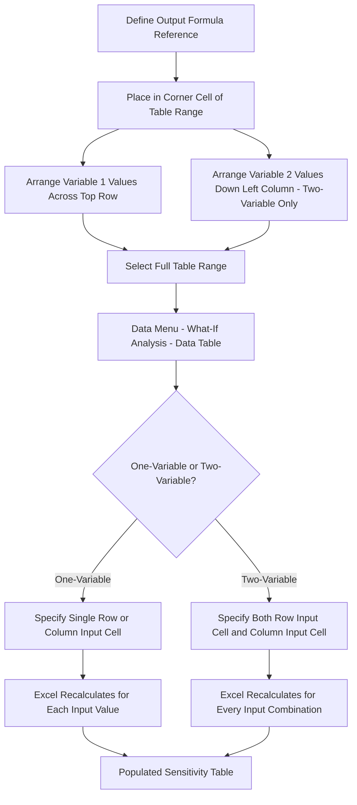

## Data Tables and Scenario Managers in Excel

### Definition and Purpose

Excel provides two distinct built-in tools for implementing sensitivity and scenario analysis directly within a financial model: **Data Tables** (part of the What-If Analysis suite) and **Scenario Manager**. While both fall under Excel's What-If Analysis umbrella, they serve different purposes and are suited to different structural needs — Data Tables excel at systematically varying one or two continuous variables across a range, while Scenario Manager excels at switching between multiple named, discrete sets of assumptions (such as the Base/Downside/Upside cases covered in the previous section). Understanding when to use each tool is a practical modeling skill directly relevant to implementing the sensitivity and scenario analysis techniques covered earlier in this chapter.

### One-Variable Data Tables

**Key Points**

- A One-Variable Data Table varies a single input cell across a range of values (arranged in a column or row) and calculates one or more output formulas for each value, producing a table of results without requiring manual recalculation or copy-paste for each scenario.
- Structurally, the table requires: the range of input values (down a column or across a row), a formula reference to the output metric (placed in the top-left corner cell of the table range, or referencing the output cell directly), and Excel's automatic substitution of each input value into the specified "Column Input Cell" or "Row Input Cell" during calculation.
- This directly implements the one-way sensitivity analysis methodology covered in the prior section (One-Way and Two-Way Sensitivity Analysis) as a live, auto-updating spreadsheet feature rather than a manually rebuilt table.

### Two-Variable Data Tables

**Key Points**

- A Two-Variable Data Table varies two input cells simultaneously — one across a row, one down a column — producing a full grid/matrix of output results for every combination, directly implementing the two-way sensitivity analysis methodology.
- Unlike the One-Variable Data Table (which can calculate multiple output formulas simultaneously), a Two-Variable Data Table can only calculate **one** output formula per table, since the single output formula reference must occupy the single top-left corner cell of the grid.
- To test multiple output metrics (e.g., both Equity IRR and minimum DSCR) against the same two input variables, multiple separate Two-Variable Data Tables must be built, each referencing a different output formula in its corner cell.

### Building a One-Variable Data Table — Step-by-Step

1. Set up a column (or row) of input values to test (e.g., revenue growth rates from -10% to +10%).
2. In the cell immediately to the right of the top input value (if inputs are in a column) or below (if inputs are in a row), enter a formula reference to the output cell (e.g., `=Equity_IRR_Cell`).
3. Select the entire range including the input values and the formula reference cell.
4. Navigate to **Data > What-If Analysis > Data Table**.
5. In the dialog box, specify the **Column Input Cell** (if inputs are arranged in a column) — this tells Excel which single cell in the model the input values should be substituted into.
6. Excel automatically recalculates the model for each input value and populates the table with results.

### Building a Two-Variable Data Table — Step-by-Step

1. Set up one variable's range across a row (top of the table) and the second variable's range down a column (left side of the table).
2. In the single top-left corner cell of the table, enter a formula reference to the output metric (e.g., `=Equity_IRR_Cell`).
3. Select the entire range including both input ranges and the corner formula cell.
4. Navigate to **Data > What-If Analysis > Data Table**.
5. Specify the **Row Input Cell** (the model cell corresponding to the variable arranged across the row) and the **Column Input Cell** (the model cell corresponding to the variable arranged down the column).
6. Excel recalculates the full model for every combination of the two variables and populates the grid.

### Data Table Structure Diagram



### Scenario Manager

**Definition:** Excel's Scenario Manager (**Data > What-If Analysis > Scenario Manager**) allows the modeler to define multiple named sets of input values (e.g., "Base Case," "Downside Case," "Upside Case") for a defined group of input cells, then switch between them and generate a summary report showing the output results under each named scenario.

**Key Points**

- Unlike Data Tables (which vary one or two continuous variables), Scenario Manager can vary **up to 32 different input cells simultaneously** per named scenario, making it structurally suited to the coherent, multi-variable Base/Downside/Upside case construction covered in the prior section, rather than a simple one- or two-variable sweep.
- Scenario Manager generates a **Scenario Summary Report** (a new worksheet) showing all defined scenarios side by side with their input values and specified output results — directly producing the kind of Base/Downside/Upside comparison table shown in the previous section's worked example.
- Scenario Manager is generally less suited to large, complex project finance models with many interlinked assumptions, since managing 32+ input cells manually through the dialog interface becomes cumbersome; many practitioners instead build a custom **scenario switch** using `CHOOSE()` or `INDEX/MATCH()` against a dedicated assumptions tab (as described in the previous section) for greater flexibility, transparency, and ease of auditing.

### Data Tables vs. Scenario Manager — Comparison

| Feature | Data Table (One/Two-Variable) | Scenario Manager |
| --- | --- | --- |
| Number of input variables | 1 (one-variable) or 2 (two-variable) | Up to 32 per scenario |
| Number of output formulas per run | Multiple (one-variable) or 1 (two-variable) | Multiple, shown in summary report |
| Best suited for | Continuous sensitivity sweeps (tornado charts, IRR/NPV sensitivity grids) | Discrete named scenarios (Base/Downside/Upside) |
| Recalculation approach | Recalculates full model for every value/combination | Recalculates model once per named scenario |
| Auditability in complex models | Good for isolated 1-2 variable tests | Can become unwieldy with many variables; custom CHOOSE/INDEX-MATCH often preferred in practice |

### Worked Example — Combining Both Tools

**Example**

A practical project finance model workflow often combines both tools: Scenario Manager (or a custom scenario switch) is used to select the overall case (Base, Downside, or Upside) as covered in the prior section, setting the coherent bundle of assumptions for that case. Then, **within** the selected scenario, a Two-Variable Data Table is used to further stress-test two specific variables (e.g., revenue and interest rate) around that scenario's settings, showing how much additional cushion or risk exists around the chosen case. This layered approach — discrete scenario selection plus continuous sensitivity sweeps within a scenario — provides both the coherent narrative view (scenario analysis) and the granular, variable-specific view (sensitivity analysis) covered in the two preceding sections.

### Performance Considerations for Circular/Complex Models

**Key Points**

- Data Tables recalculate the **entire workbook** for every single cell in the table by default, which can be extremely slow in project finance models containing circular references (e.g., interest expense circularity from debt sculpting, covered in earlier sections) — a Two-Variable Data Table with a 10x10 grid triggers 100 full-model recalculations.
- To manage this, practitioners commonly set Excel's calculation mode to **"Automatic Except for Data Tables"** (Formulas > Calculation Options), which recalculates all normal formulas automatically but only recalculates Data Tables when manually triggered (F9), preventing the model from becoming sluggish during ordinary editing.
- For very large or heavily circular models, some practitioners avoid native Data Tables altogether in favor of a **macro-driven sensitivity routine** that loops through input values, captures outputs, and pastes results as values — offering more control over calculation sequencing and avoiding potential circular reference instability within the Data Table mechanism itself.

### Excel Implementation Notes

```excel
' Typical One-Variable Data Table layout:
'           [Equity_IRR_Formula_Reference]
' -10%      [Excel-calculated result]
' -5%       [Excel-calculated result]
' 0%        [Excel-calculated result]
' +5%       [Excel-calculated result]
' +10%      [Excel-calculated result]

' Typical Two-Variable Data Table layout:
' [Equity_IRR_Ref]   -100bps    Base Rate    +100bps
' -10% Revenue       [result]   [result]     [result]
' Base Revenue       [result]   [result]     [result]
' +10% Revenue       [result]   [result]     [result]

' Custom scenario switch (preferred alternative to Scenario Manager for complex models)
=CHOOSE(Scenario_Selector_Cell, BaseCase_Assumption, DownsideCase_Assumption, UpsideCase_Assumption)
```

**Key Points**

- Data Table formulas are entered by Excel as an array formula (`{=TABLE(row_input,column_input)}`) that cannot be edited or deleted cell-by-cell — the entire table range must be selected to modify or clear it, which is a common source of confusion for users unfamiliar with the feature.
- Because Scenario Manager stores scenario definitions in a way that is not always transparent within the worksheet cells themselves (values are stored in the scenario definition, not visibly listed in a cell range), many project finance practitioners prefer the custom `CHOOSE()`/`INDEX-MATCH()` approach on a dedicated, fully visible Assumptions tab, since it is generally considered more transparent and auditable for lender and third-party model review purposes — a significant consideration given the scrutiny project finance models typically receive.

### Common Pitfalls

**Key Points**

- Leaving Data Tables on automatic calculation in a large or circular model, causing severe recalculation slowdowns during normal model editing — switching to "Automatic Except for Data Tables" mitigates this.
- Attempting to reference more than one output formula in a Two-Variable Data Table's corner cell, which is not supported — separate tables are required for each additional output metric.
- Using Scenario Manager for complex models with many interlinked assumptions, resulting in a difficult-to-audit scenario definition that is opaque to lenders or other model reviewers compared to a visible, cell-based Assumptions tab.
- Forgetting that Data Table results are calculated values embedded in an array formula — attempting to edit, insert, or delete individual cells within a completed Data Table range will trigger an error, since the entire table must be treated as a single unit.
- Building a Data Table that inadvertently references a Row/Column Input Cell that does not actually drive the output formula through any calculation path, resulting in a table that shows the same (unchanged) value in every cell — a common troubleshooting scenario when Data Table results appear obviously wrong.

**Related Topics**

- One-Way and Two-Way Sensitivity Analysis
- Building Base, Downside, and Upside Cases
- Circular reference handling in project finance models
- Monte Carlo Simulation in Project Finance
- Debt Service Coverage Ratio (DSCR)