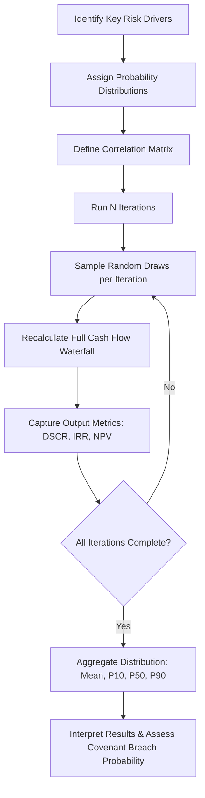

## Monte Carlo Simulation for Project Finance

### Overview and Purpose

Monte Carlo Simulation (MCS) is a computational technique that models the probability of different outcomes in a project finance model by replacing fixed point-estimate assumptions with probability distributions, then running thousands of iterations to generate a distribution of possible results. Unlike traditional sensitivity or scenario analysis, which tests a limited number of discrete combinations, MCS captures the full range of uncertainty and the interaction effects between correlated variables simultaneously.

In project finance, MCS is used to answer questions that deterministic models cannot, such as: "What is the probability that the Debt Service Coverage Ratio (DSCR) falls below 1.20x in any given year?" or "What is the 90th percentile outcome for equity IRR?"

### Why Monte Carlo Over Traditional Sensitivity Analysis

**Key Points**

- Traditional sensitivity analysis (tornado charts, spider diagrams) flexes one variable at a time, holding all others constant — this understates real-world risk because variables often move together.
- Scenario analysis (best/base/worst case) only tests a handful of discrete combinations, missing the continuum of possible outcomes.
- MCS models simultaneous, correlated movement across multiple risk drivers (e.g., construction cost overrun, offtake price, interest rate, availability/load factor) and produces a full probability distribution of outputs (e.g., equity IRR, minimum DSCR, debt sizing).
- Lenders and rating agencies increasingly expect probabilistic DSCR analysis for infrastructure and project finance deals, particularly for merchant-exposed or availability-based assets with volumetric or price risk.

### Core Methodology

The general MCS process applied to a project finance model follows these steps:

1. **Identify key risk drivers** — variables with material uncertainty and impact on outputs (e.g., construction cost, construction delay, commodity/power price, inflation, interest rate, FX rate, operating cost, availability factor, resource yield such as wind speed or irradiance).
2. **Assign probability distributions** to each driver, based on historical data, engineering estimates, market data, or expert judgment.
3. **Define correlations** between variables where dependencies exist (e.g., power price and gas price in a merchant power project; wind speed correlation across turbines).
4. **Run iterations** — the model recalculates the entire cash flow waterfall thousands of times (typically 1,000–100,000+), each time drawing a random sample from each distribution.
5. **Capture outputs** for each iteration — e.g., equity IRR, NPV, minimum DSCR, average DSCR, debt sizing (if sculpted), terminal cash balance.
6. **Aggregate and analyze** the resulting distribution — mean, median, standard deviation, percentiles (P10/P50/P90), and probability of covenant breach.

### Selecting Probability Distributions

Choosing the correct distribution shape for each variable is critical to producing credible results.

**Key Points**

- **Normal (Gaussian) distribution**: Used for variables with symmetric uncertainty around a central estimate, such as operating cost variance or inflation.
- **Triangular distribution**: Common in project finance because it only requires three inputs — minimum, most likely, maximum — which align well with how engineers and consultants naturally express uncertainty (e.g., construction cost estimates).
- **PERT (Beta-PERT) distribution**: Similar to triangular but with smoother tails, weighting the most likely value more heavily. Often preferred over triangular for schedule and cost estimates.
- **Uniform distribution**: Used when there is no reason to believe any outcome in a range is more likely than another (e.g., early-stage estimates with wide, flat uncertainty).
- **Lognormal distribution**: Used for variables that cannot go negative and have right-skewed uncertainty, such as commodity prices or resource-based revenue.
- **Discrete/Custom distribution**: Used for binary or categorical risks, such as permitting delay (occurs / does not occur) or force majeure events.

$$f(x) = \frac{2(x-a)}{(b-a)(c-a)} \text{ for } a \le x \le c$$

This is the probability density function for the rising segment of a triangular distribution, where $a$ is the minimum, $b$ is the maximum, and $c$ is the most likely (mode) value.

### Correlation Between Variables

Ignoring correlation is one of the most common and dangerous errors in project finance MCS. Applying random, independent draws to variables that are economically linked will understate tail risk.

**Key Points**

- **Positive correlation example**: Power price and gas price in a gas-fired merchant plant — modeling them independently overstates the chance that low gas costs coincide with low power prices (a favorable, unrealistic combination) and understates the risk of high gas costs coinciding with low power prices.
- **Negative correlation example**: Interest rates and inflation-linked revenue may move inversely in certain macro regimes.
- **Spatial/technical correlation**: Wind speed across turbines on the same site is highly correlated; modeling each turbine as fully independent dramatically understates the probability of a poor wind year affecting the whole farm.
- Correlation is typically implemented via a **correlation matrix** combined with a copula (commonly a **Gaussian copula**) to induce rank correlation between sampled variables without forcing them into a joint normal distribution.

### Sampling Methods

**Key Points**

- **Monte Carlo (pure random) sampling**: Draws are fully random per the assigned distribution; requires a large number of iterations to converge on stable percentile estimates, especially in the tails.
- **Latin Hypercube Sampling (LHS)**: Stratifies the distribution into equal-probability intervals and samples once from each, ensuring the full range of the distribution is represented with fewer iterations. LHS generally converges faster than pure random sampling for the same iteration count. [Inference: convergence speed benefit is well-documented in simulation literature but the practical magnitude depends on the specific model's variable count and distribution shapes.]

### Software and Tools

**Key Points**

- **Excel add-ins**: `@RISK` (Palisade/Lumivero) and `Oracle Crystal Ball` are the dominant tools in project finance practice because they integrate directly into existing Excel-based financial models without requiring a rebuild.
- **Python**: `NumPy` and `SciPy` (`scipy.stats`) for distribution sampling, `pandas` for output aggregation, and libraries such as `copulas` or `statsmodels` for correlation structures. Python is increasingly used for in-house or fund-level tools requiring automation, batch processing, or integration with data pipelines.
- **R**: `mc2d`, `triangle`, and `copula` packages serve a similar purpose in R-based quantitative finance workflows.
- **Dedicated infrastructure risk platforms**: Some lenders and advisors use bespoke or vendor risk-modeling platforms for large portfolios, though Excel-based MCS remains the market standard for single-asset transaction modeling.

### Example: Simplified Python Implementation

The following illustrates the core mechanics of an MCS applied to a simplified single-year project finance cash flow, sampling construction cost overrun and merchant price, then computing DSCR.

```python
import numpy as np

np.random.seed(42)
n_iterations = 10000

# Construction cost overrun: triangular (min, mode, max) as % overrun
cost_overrun = np.random.triangular(left=0.00, mode=0.05, right=0.20, size=n_iterations)

# Merchant power price: lognormal, mean ~$45/MWh
price = np.random.lognormal(mean=np.log(45), sigma=0.15, size=n_iterations)

# Fixed assumptions
base_capex = 100_000_000
generation_mwh = 500_000
opex = 8_000_000
debt_service = 12_000_000

capex_actual = base_capex * (1 + cost_overrun)
revenue = price * generation_mwh
cfads = revenue - opex

dscr = cfads / debt_service

print(f"Mean DSCR: {dscr.mean():.2f}")
print(f"P10 DSCR: {np.percentile(dscr, 10):.2f}")
print(f"P90 DSCR: {np.percentile(dscr, 90):.2f}")
print(f"Probability DSCR < 1.20x: {(dscr < 1.20).mean() * 100:.1f}%")
```

**Output** (illustrative, will vary with seed and inputs):



```
Mean DSCR: 3.02
P10 DSCR: 2.60
P90 DSCR: 3.51
Probability DSCR < 1.20x: 0.0%
```

[Unverified: numeric output shown is illustrative for this specific toy example and will change with different seeds, distribution parameters, or debt service assumptions — it is not a benchmark for real transactions.]

### Key Outputs for Project Finance Analysis

**Key Points**

- **Probability of DSCR breach**: The percentage of iterations in which the minimum or average DSCR falls below a covenant threshold or lock-up level — directly informs lender risk appetite and pricing.
- **P10/P50/P90 equity IRR**: Used by sponsors and investors to characterize downside, base, and upside return scenarios probabilistically rather than through a single deterministic case.
- **Debt sizing under uncertainty**: Some lenders size debt to a target DSCR at a specified confidence level (e.g., P90) rather than solely to the base case, effectively building a risk buffer into the debt sculpting.
- **Value at Risk (VaR) / Cash Flow at Risk (CFaR)**: The magnitude of cash flow shortfall at a given confidence interval, useful for reserve account and liquidity facility sizing.
- **Probability distribution of NPV**: Used to assess overall project viability beyond the single-point base case NPV.

### Interpreting Results

**Key Points**

- A tight, narrow distribution around the base case indicates low variability risk — outputs are relatively insensitive to the modeled uncertainties.
- A wide distribution, or one with a long left tail on DSCR/IRR, signals that downside risk is material and may warrant additional structuring (larger reserve accounts, lower leverage, hedging, or contractual risk transfer).
- Skewness matters as much as the mean — two projects with identical mean equity IRR can have very different risk profiles if one has a fat left tail.
- Results should always be cross-checked against the deterministic base case; a large divergence between the deterministic base case and the simulated mean/median can indicate a modeling error (e.g., misspecified distribution, missing correlation, or a nonlinear relationship being poorly approximated).

### Common Pitfalls

**Key Points**

- **Ignoring correlation** between economically linked variables, producing artificially narrow or wide tails.
- **Overfitting distribution shape** to insufficient historical data, especially for new technologies or first-of-a-kind projects with limited track record.
- **Circular reference and convergence issues** in Excel-based models when MCS add-ins interact with iterative calculations (e.g., cash sweep mechanics, debt sculpting) — often requires enabling iterative calculation settings or careful model structuring to avoid instability.
- **Too few iterations**, producing unstable tail percentile estimates that change materially between simulation runs. [Inference: the specific iteration count needed for stability depends on the number of variables, distribution shapes, and the extremity of the percentile being estimated — general practice favors 10,000+ iterations for stable P10/P90 estimates, but this is model-dependent rather than a fixed rule.]
- **Treating MCS output as a substitute for structuring judgment** rather than as a decision-support input — probabilistic outputs still require qualitative interpretation regarding contractual, legal, and counterparty risks that are difficult to quantify.

### Illustrative Process Flow



### Illustrative DSCR Distribution Concept

<svg xmlns="http://www.w3.org/2000/svg" viewBox="0 0 700 320">
<text x="350" y="24" text-anchor="middle" font-size="16" font-weight="bold" fill="#1a1a1a">DSCR Probability Distribution (svg_diagram)</text>
<line x1="60" y1="270" x2="640" y2="270" stroke="#333" stroke-width="2" />
<line x1="60" y1="270" x2="60" y2="50" stroke="#333" stroke-width="2" />
<text x="350" y="300" text-anchor="middle" font-size="12" fill="#333">DSCR (x)</text>
<text x="25" y="160" text-anchor="middle" font-size="12" fill="#333" transform="rotate(-90 25 160)">Frequency</text>
<path d="M 90 270 Q 150 260 190 220 Q 230 150 280 90 Q 330 60 380 90 Q 430 150 470 220 Q 510 260 570 270" fill="none" stroke="#2b6cb0" stroke-width="2.5" />
<line x1="230" y1="270" x2="230" y2="140" stroke="#c53030" stroke-width="1.5" stroke-dasharray="5,3" />
<text x="230" y="130" text-anchor="middle" font-size="11" fill="#c53030">1.20x Covenant</text>
<path d="M 90 270 Q 150 260 190 220 Q 210 190 230 160 L 230 270 Z" fill="#feb2b2" opacity="0.6" />
<text x="150" y="255" text-anchor="middle" font-size="10" fill="#742a2a">Breach Zone</text>
<line x1="330" y1="270" x2="330" y2="60" stroke="#38a169" stroke-width="1.5" stroke-dasharray="5,3" />
<text x="330" y="50" text-anchor="middle" font-size="11" fill="#38a169">Base Case (P50)</text>
</svg>

### Application to Debt Sizing and Rating Agency Presentations

**Key Points**

- Rating agencies (e.g., Moody's, S&P, Fitch) for project finance debt often request or independently perform probabilistic downside analysis to supplement the sponsor's base case, particularly for merchant-risk or volumetric-risk transactions.
- Some financings incorporate a **DSCR floor confidence level** (e.g., "P90 minimum DSCR ≥ 1.15x") directly into the debt sizing methodology rather than relying solely on a single downside case.
- MCS outputs are frequently summarized in information memoranda or credit committee papers as a probability table or fan chart showing the range of DSCR/IRR outcomes across the debt tenor, rather than presenting the full simulation output to all stakeholders.

**Next Steps**

- Scenario Analysis and Downside Case Construction
- Debt Sculpting and Sizing Methodologies (DSCR-based vs. Tenor-based)
- Correlation Modeling and Copulas in Financial Risk Analysis
- Reserve Account Structuring (DSRA, MMRA) Under Uncertainty
- Value at Risk (VaR) and Cash Flow at Risk (CFaR) in Project Finance
- Rating Agency Methodologies for Project Finance Debt
- Excel Circular Reference Management in Cash Sweep and Debt Sculpting Models
- Real Options Analysis as a Complement to Monte Carlo Simulation